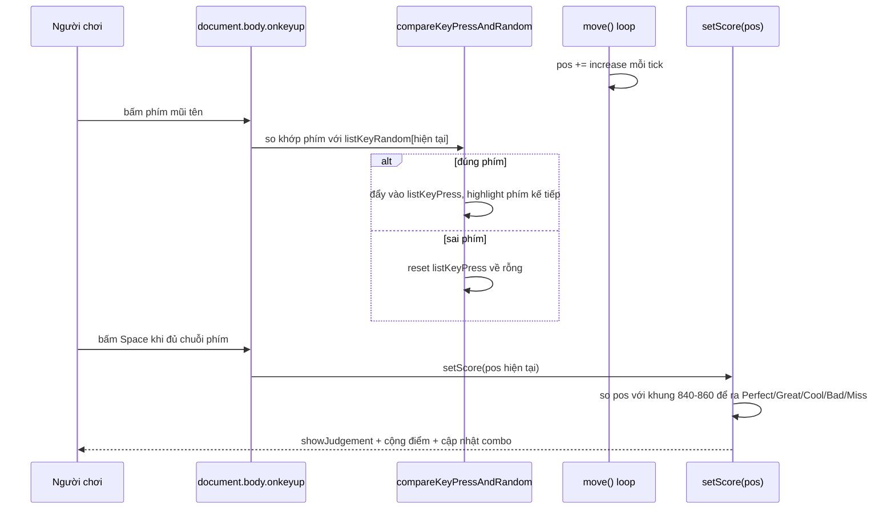

# Viết lại Audition Online bằng JavaScript thuần: khi "chấm điểm đúng nhịp" khó hơn mình tưởng

## 1. Mở đầu

Một buổi tối mình đang test mode Beat-up của game — cái mode có 7 lane chạy song song, mỗi lane một mũi tên trôi tới trôi lui liên tục, tay phải gõ, tay trái thỉnh thoảng lỡ tay bấm nhầm Alt-Tab để xem tin nhắn Discord. Quay lại tab game sau đúng hai mươi giây, mình thấy một cảnh tượng kỳ lạ: nhạc vẫn đang phát, combo vẫn hiển thị số cũ, nhưng cả bảy mũi tên đứng hình y nguyên vị trí lúc mình rời đi, như bị *pause* — trong khi rõ ràng mình chưa bấm phím Esc nào.

Bấm thử một phím mũi tên. Không có phản hồi. Đợi thêm một giây. Mũi tên đột ngột nhảy cái rột một đoạn dài, như tua nhanh video, rồi lại tiếp tục trôi bình thường.

Không có gì bị crash, không lỗi nào hiện trong console. Đấy mới là phần đáng sợ. Cái vừa xảy ra là mình vừa chạm tay vào đúng cái bẫy kinh điển nhất của rhythm game: đo thời gian bằng số lần một cái interval được gọi, thay vì đo bằng đồng hồ thực. Bài này là câu chuyện mình tự viết một game nhảy theo nhịp kiểu Audition Online — 3 mode chơi, chấm điểm theo độ chính xác thời gian, một hệ thống chọn nhạc lằng nhằng hơn mình tưởng, và vài bài học nhớ đời về sự khác biệt giữa "đếm tick" và "đo thời gian".

## 2. Bối cảnh

`game-development` là kho game cá nhân của mình, và phần lớn trong đó là game "phản xạ theo không gian" — click đúng ô, né đúng vật cản, đi đúng đường. Audition khác hẳn: đây là game đầu tiên trong repo mà cái quan trọng nhất không phải bạn bấm phím *nào*, mà bạn bấm nó vào đúng *lúc nào*. Sai một phím trong Caro thì chỉ là nước đi tệ; sai một phím trong Audition lệch quá khung 20 mili giây thì Perfect biến thành Miss.

Mình chọn làm Audition vì hồi xưa (đúng nghĩa hồi xưa) đây là game mình chơi nhiều nhất ở quán net, và cái làm nó cuốn không phải đồ họa hay cốt truyện — là cảm giác *timing* khi combo lên cao, sai một nhịp là mất hết. Muốn tái tạo đúng cảm giác đó bằng code, chứ không phải chỉ vẽ vài mũi tên bay qua màn hình cho có, buộc mình phải đối mặt với bài toán chấm điểm theo thời gian một cách nghiêm túc — thứ mà phần lớn game khác trong repo chưa từng cần tới. Ngoài phần chơi, mình cũng tham lam thêm một khoản không hề nhỏ: màn hình chọn nhạc, với cả tìm kiếm nhạc Creative Commons online lẫn chọn file mp3 ngay trên máy — thứ hoá ra ngốn thời gian debug không kém gì phần chấm điểm timing.

## 3. Mục tiêu sản phẩm

**Sẽ làm:**
- 3 mode chơi: 4K (4 hướng mũi tên), 8K (4 hướng + 4 hướng chéo), Beat-up (7 lane chạy độc lập, bấm liên tục không theo một khối lệnh chung).
- Chấm điểm 5 mức: Perfect / Great / Cool / Bad / Miss, mỗi mức một khung thời gian và một mức điểm khác nhau.
- Combo, Perfect Streak (chuỗi Perfect liên tiếp có thưởng điểm luỹ tiến), xếp hạng cuối bài (S/A/B/C/D) tính từ tỉ lệ các mức chấm.
- Reverse mode — trộn lẫn phím thường và phím đảo ngược trong cùng một chuỗi, bật/tắt giữa chừng bằng phím `.` (NumpadDecimal).
- Chọn nhạc: 3 bài mặc định, tìm nhạc Creative Commons qua Jamendo, hoặc lấy file mp3 ngay từ một folder trên máy mình.
- Nhạc nền ambient trên màn hình chọn bài bằng YouTube IFrame Player ẩn.
- Best score theo từng mode, lưu `localStorage`.
- Pause/resume bằng Esc.

**Sẽ KHÔNG làm:**
- Không hỗ trợ touch/mobile — bàn phím only, đúng tinh thần game quán net gốc.
- Không có leaderboard online, không multiplayer.
- Không có beatmap soạn tay theo từng bài hát cụ thể — nhịp và độ khó sinh ngẫu nhiên, tăng dần theo số vòng đã qua, không đồng bộ với giai điệu thật của bài hát.
- Không tự phân tích audio để bắt beat thật (không có audio-analysis/FFT nào cả) — đây là điểm mình sẽ nói kỹ ở phần thiết kế, vì nó liên quan trực tiếp đến toàn bộ câu chuyện timing của bài này.

MVP: một người chơi một mình, chọn nhạc, chọn mode, nhảy theo mũi tên rơi, được chấm điểm hợp lý, thấy được kỷ lục cũ của mình. Không cần đối thủ, không cần machine learning bắt nhịp nhạc — người chơi tự khớp bằng tai và bằng mắt.

## 4. Thiết kế hệ thống

Kiến trúc chia theo màn hình, không có SPA framework nào can thiệp:

```mermaid
flowchart TD
    A[home.html<br/>chọn nhạc + chọn mode<br/>nhạc ambient YouTube ẩn] --> B[audition.html?music=...&type=...]
    B --> C[constants.js<br/>bảng ánh xạ phím, hằng số tuning]
    B --> D[utils.js<br/>show/hide, best-score, showScoreSummary,<br/>IndexedDB cho nhạc local]
    B -->|type = 4k/8k| E[dance-8k-and-4k.js<br/>vòng lặp setInterval(move, 0)]
    B -->|type = beat-up| F[dance-beat-up.js<br/>7 vòng lặp setInterval độc lập, 15ms]
    E -->|hết bài| G[audio.onended]
    F -->|hết bài| G
    G --> D
```

Điểm đáng nói nhất ở đây không phải kiến trúc file (khá thẳng), mà là *cách thời gian được mô hình hoá*. Có hai lựa chọn kinh điển cho một rhythm game:

1. Đo theo **đồng hồ thực** — mỗi frame tính lại vị trí mũi tên từ công thức `vị_trí = tốc_độ × (thời_điểm_hiện_tại − thời_điểm_bắt_đầu_vòng)`, dùng `performance.now()` hoặc `audio.currentTime` làm mốc.
2. Đo theo **số tick đã trôi qua** — mỗi lần một hàm `move()` được gọi (qua `setInterval`), cộng dồn một bước cố định vào vị trí.

Code thật của game này dùng cách thứ hai, xuyên suốt cả 3 mode:

```javascript
function startMoveLoop() {
  if (intervalID === null) {
    intervalID = setInterval(move, 0);
  }
}

function move() {
  // ...
  pos += increase;
  boxElement.style.left = pos + "px";
}
```

`setInterval(move, 0)` — trình duyệt sẽ tự động ghim khoảng nghỉ tối thiểu lên khoảng 4ms (đây là giới hạn có sẵn của mọi trình duyệt hiện đại, không phải do mình chọn), nên trên thực tế `move()` chạy đều đặn hàng trăm lần mỗi giây, mỗi lần cộng `increase = 1` pixel. Với mode Beat-up, mỗi lane còn có vòng lặp `setInterval` riêng chạy mỗi 15ms.

Cái hay của cách này: cực kỳ dễ viết, dễ đọc, dễ debug bằng mắt — một dòng `pos += increase` là xong, không cần bận tâm delta-time, không cần lo chia cho zero nếu frame đầu tiên có `dt = 0`. Cái dở, và cũng là thứ mình đã đâm đầu vào ở phần mở đầu: **tốc độ di chuyển thực tế của mũi tên phụ thuộc vào tần suất trình duyệt chịu gọi `move()`, không phải vào đồng hồ thực.** Khi trang đang là tab active, trình duyệt gọi đều, cảm giác mượt. Nhưng ngay khi tab bị đưa xuống nền, Chrome (và hầu hết trình duyệt hiện đại) chủ động giảm tần suất gọi `setInterval`/`setTimeout` xuống còn khoảng 1 lần/giây để tiết kiệm pin — trong khi thẻ `<audio>` thì *không* bị giới hạn đó, nó cứ phát tiếp bình thường. Kết quả: nhạc chạy đúng nhịp, mũi tên thì gần như đứng hình rồi giật cục — đúng là hiện tượng mình mô tả ở phần mở đầu.

Về flow chấm một lượt bấm phím ở mode 4K/8K:



Trade-off mình chấp nhận có ý thức: đây không phải một game cần đồng bộ chính xác tuyệt đối với waveform thật của bài hát (không có audio-analysis, không bắt beat thật), nên độ trôi (drift) do đếm tick thay vì đo thời gian thực gần như vô hình *miễn là tab đang ở foreground* — vì trên một máy hiện đại, 4-15ms mỗi tick đủ đều để mắt và ngón tay không phân biệt được với chuyển động mượt thật sự. Bẫy chỉ lộ ra đúng lúc tab mất focus, một tình huống nằm ngoài phạm vi mình từng nghĩ tới khi thiết kế ban đầu.

## 5. Tech Stack

| Công nghệ | Vì sao chọn |
| --- | --- |
| **JavaScript thuần + DOM (không phải Canvas)** | Khác với game cờ vua vẽ bằng Canvas, Audition dùng các thẻ `` và `<div>` di chuyển bằng cách đổi `style.left`. Vì mỗi mũi tên chỉ là một ảnh tĩnh trượt theo một trục, thao tác DOM đơn giản hơn nhiều so với việc tự vẽ và animate sprite trên canvas — không có lý do gì để chọn công cụ nặng hơn nhu cầu. |
| **`setInterval` thay vì `requestAnimationFrame`** | `requestAnimationFrame` tự động tạm dừng khi tab ẩn (đúng ra sẽ *giúp* tránh bug ở trên), nhưng lúc viết bản đầu mình chỉ nghĩ đơn giản "cứ chạy đều đặn là được", nên chọn `setInterval` — quen thuộc, dễ suy luận tuyến tính. Đây là một quyết định mình sẽ nhắc lại ở phần "làm lại từ đầu". |
| **`<audio>` element thuần, không Web Audio API** | Không cần equalizer, không cần trộn nhiều track, không cần phân tích tần số — phát một file mp3 và biết khi nào nó kết thúc (`audio.onended`) là đủ. Web Audio API cho phép làm nhiều hơn thế nhưng cũng phức tạp hơn nhiều lần để làm đúng một việc: phát nhạc. |
| **YouTube IFrame Player ẩn cho nhạc nền ambient** | Tận dụng lại đúng cách tiếp cận đã dùng ở dự án music-player khác trong repo — phát nhạc có bản quyền hợp lệ, ẩn iframe đi, không cần tự host file nhạc nào. |
| **Jamendo API cho tìm kiếm nhạc Creative Commons** | Cần một nguồn nhạc người chơi có thể tìm theo tên bài mà không đụng bản quyền, chạy được hoàn toàn phía client (không cần backend riêng để giấu API key nhạy cảm — client_id của Jamendo cho search công khai không mang quyền hạn OAuth nào, nên để lộ trong JS là chấp nhận được). |
| **IndexedDB cho file mp3 local** | Khi người chơi chọn một file mp3 trên máy ở `home.html`, phải mang nó sang `audition.html` để phát — nhưng `Blob`/object URL chết ngay khi tài liệu tạo ra nó điều hướng đi (không thể nhét vào query string như link nhạc online). IndexedDB lưu được `Blob` trực tiếp và sống sót qua cú chuyển trang, nên là lựa chọn gần như bắt buộc một khi đã chọn hỗ trợ file local. |
| **`localStorage` cho best score** | Chỉ cần một con số bền theo từng mode, không có cấu trúc dữ liệu phức tạp, không cần đồng bộ nhiều tab cùng lúc — `localStorage` là đủ, không cần đến IndexedDB ở đây. |

## 6. Quá trình phát triển

Mình chia việc build thành 6 giai đoạn, mỗi giai đoạn "chơi được" (dù còn thô) trước khi sang giai đoạn kế.

### Giai đoạn 1 — Một lane, một mũi tên, một phím

Mục tiêu tối thiểu: một `<div>` mũi tên trượt từ trái sang phải, bấm đúng phím mũi tên tương ứng thì đổi ảnh sang trạng thái "success". Đây là lúc `MAP_KEY_4K`/`LIST_KEY_4K` trong `constants.js` ra đời — một danh sách 4 hướng cơ bản (`right`, `up`, `down`, `left`) và một `Map` ánh xạ mỗi hướng về chính nó (bản đồ tưởng thừa thãi, nhưng sẽ có lý do tồn tại rõ ràng ở Giai đoạn 3).

### Giai đoạn 2 — Chuỗi nhiều phím, đúng thứ tự

Audition thật không bắt bạn bấm một phím rồi xong — mỗi lượt là một *chuỗi* phím (độ dài tăng dần theo `level`), phải bấm đúng thứ tự rồi bấm Space để "chốt" chuỗi đó. Đây là lúc `listKeyRandom` (chuỗi phím cần bấm) và `listKeyPress` (chuỗi đã bấm đúng) ra đời, cùng hàm so khớp cốt lõi của cả game:

```javascript
function compareKeyPressAndRandom(key) {
  if (isBoxHidden || listKeyPress.length === listKeyRandom.length) {
    return;
  }

  const mapKey = typeDance === "4k" ? MAP_KEY_4K : MAP_KEY_8K;
  if (mapKey.get(listKeyRandom[listKeyPress.length]) === key) {
    const hitElement = document.getElementById(String(listKeyPress.length + 1));
    listKeyPress.push(key + "-success");
    setKey(key + "-success", listKeyPress.length);
    highlightCurrentKey();
    hitElement.classList.remove("key-hit");
    void hitElement.offsetWidth;
    hitElement.classList.add("key-hit");
  } else {
    listKeyPress = [];
    for (let i = 0; i < listKeyRandom.length; i++) {
      setKey(listKeyRandom[i], i + 1);
    }
    highlightCurrentKey();
  }
}
```

Bấm sai một phím giữa chuỗi 8 phím thì *toàn bộ* `listKeyPress` bị reset về rỗng — không có khái niệm "gỡ lại một phím sai rồi tiếp tục", đúng tinh thần combo-breaker của game gốc: một lỗi là mất sạch tiến trình của chuỗi đó, dồn áp lực vào việc bấm chính xác từ đầu tới cuối.

### Giai đoạn 3 — Reverse mode: khi bản đồ phím không còn là ánh xạ đồng nhất

Đây là lúc `MAP_KEY_4K` từ Giai đoạn 1 (tưởng thừa) chứng minh giá trị của nó. Reverse mode trong game này *không* đảo ngược toàn bộ chuỗi phím cùng lúc — nó trộn lẫn phím thường và phím "đảo" ngay trong cùng một chuỗi, mỗi phím độc lập được sinh ngẫu nhiên là thường hay đảo:

```javascript
const LIST_KEY_HAS_REVERSE_4K = [
  "right", "up", "down", "left",
  "right-reverse", "up-reverse", "down-reverse", "left-reverse",
];
const MAP_KEY_4K = new Map([
  ["right", "right"], ["up", "up"], ["down", "down"], ["left", "left"],
  ["right-reverse", "left"], ["up-reverse", "down"],
  ["down-reverse", "up"], ["left-reverse", "right"],
]);
```

Khi `getListKey` rút ngẫu nhiên từ `LIST_KEY_HAS_REVERSE_4K` (8 giá trị khả dĩ thay vì 4), icon hiển thị trên màn hình là icon "reverse" (ví dụ mũi tên phải nhưng có hiệu ứng lật), nhưng phím bàn phím cần bấm lại là phím ngược lại (trái) — tra đúng ngữ nghĩa đó qua `MAP_KEY_4K`. Cái hay của thiết kế này: `compareKeyPressAndRandom` không cần biết gì về khái niệm "reverse" cả — nó chỉ tra cứu qua `Map`, y hệt logic của phím thường. Toàn bộ độ phức tạp của reverse mode nằm gọn trong dữ liệu (bảng ánh xạ), không rò rỉ ra logic điều khiển — một dạng tách biệt dữ liệu/hành vi khá thoả mãn khi tự ngồi ngẫm lại.

### Giai đoạn 4 — Chấm điểm theo timing, 5 mức không chồng lấn

Bài toán khó nhất về mặt tư duy trong cả game: định nghĩa 5 khung thời gian (Perfect/Great/Cool/Bad/Miss) sao cho không chồng lấn (một `pos` không thể vừa là Great vừa là Cool) và không để hở (không có `pos` nào rơi vào khoảng trống giữa hai mức). Bản kết quả cuối cùng, đối xứng quanh mốc `pos = 850`:

```javascript
function setScore(pos) {
  if (listKeyPress.length !== listKeyRandom.length) {
    showJudgement(picElement, "images/Miss.png");
    judgementCounts.miss++;
    updateCombo(false);
    updatePerfectStreak(false);
    return;
  }
  if (840 <= pos && pos <= 860) {
    showJudgement(picElement, "images/Perfect.png");
    score += isReverse ? 1200 : 800;
    // ...
  } else if ((790 <= pos && pos < 840) || (860 < pos && pos <= 910)) {
    // Great
  } else if ((760 <= pos && pos < 790) || (910 < pos && pos <= 940)) {
    // Cool
  } else if ((750 <= pos && pos < 760) || (940 < pos && pos <= 950)) {
    // Bad
  } else {
    // Miss
  }
  scoreElement.textContent = score;
}
```

Nhìn kỹ biên: Perfect đóng cả hai đầu (`<=`), Great mở ở đầu giáp Perfect (`< 840`) nhưng đóng ở đầu xa (không giẫm lên Cool). Việc này tưởng hiển nhiên nhưng viết tay lần đầu rất dễ vô tình dùng `<=` ở cả hai phía của hai mức liền kề, khiến đúng giá trị biên (ví dụ `pos = 840`) được chấm *hai lần* theo hai nhánh `if/else if` khác nhau — may mắn là cấu trúc `else if` trong JavaScript tự loại bỏ khả năng chấm trùng (chỉ nhánh đầu tiên khớp được chạy), nhưng nếu nhánh nào bị viết using range sai lệch, ta vẫn có thể vô tình bỏ sót nguyên một dải `pos` rơi vào "khoảng chết" không nhánh nào bắt được — và với `else` cuối cùng bắt hết phần còn lại thành Miss, một khoảng chết như vậy sẽ âm thầm biến một cú bấm "gần đúng" thành Miss mà không có dấu hiệu gì bất thường trong code. Đây là loại bug im lặng nhất: không throw, không log, chỉ là người chơi cảm thấy "ơ sao mình bấm đúng nhịp mà vẫn Miss" và nghi ngờ chính phản xạ của mình trước khi nghi ngờ code.

Đáng chú ý thêm: điểm số nhân khác nhau tuỳ `isReverse` (Perfect thường 800 điểm, Perfect khi đang bật reverse mode 1200 điểm) — phần thưởng cho việc chơi ở chế độ khó hơn, một chi tiết cân bằng nhỏ nhưng cho thấy reverse mode được thiết kế như một lựa chọn tăng độ khó có đền bù, không phải chỉ để làm khó cho vui.

### Giai đoạn 5 — Beat-up: từ một lane thành bảy lane độc lập

Mode Beat-up không dùng chung vòng lặp với 4K/8K — mỗi trong 7 lane (trái, phải, chéo trái-lên, chéo phải-lên, chéo trái-xuống, chéo phải-xuống, và lane giữa cho Space) có `setInterval` riêng chạy 15ms, và một cơ chế ping-pong thú vị: một số lane tăng dần vị trí tới 450 rồi ẩn đi, đợi một khoảng nghỉ *ngẫu nhiên* trước khi hiện lại từ 0; lane đối xứng thì giảm dần từ 450 về 0 theo cùng logic ngược:

```javascript
function moveLeftUp() {
  if (posLeftUp < 450) {
    posLeftUp += increase;
  }
  leftUpBeatUpElement.style.marginLeft = posLeftUp + "px";
  if (posLeftUp === 450) {
    hide("left-up-beat-up");
    setTimeout(function () {
      posLeftUp = 0;
    }, timeLeftUp);
    show("left-up-beat-up");
  }
}
```

`timeLeftUp` là một khoảng nghỉ ngẫu nhiên tối đa 5 giây (`MAX_TIME_OUT`), sinh riêng cho từng lane lúc khởi tạo — nhờ vậy 7 lane không bao giờ đồng bộ nhịp với nhau, tạo cảm giác hỗn loạn có chủ đích đúng như tên gọi "Beat-up". Quyết định đáng chú ý ở giai đoạn này: mỗi lane có một hàm `setScoreBeatUpXxx` riêng với khung thời gian chấm điểm riêng (ví dụ lane Space chấm ở khoảng `pos` 280-410, lane trái chấm ở khoảng 370-450) — vì các lane di chuyển với biên độ và điểm xuất phát khác nhau, "điểm ngọt" (sweet spot) của mỗi lane nằm ở một dải `pos` tuyệt đối khác nhau, không thể dùng chung một hằng số ngưỡng như mode 4K/8K.

### Giai đoạn 6 — Màn hình chọn nhạc: khi phần "phụ" hoá ra không hề phụ

Phần mình đánh giá thấp nhất lúc lên kế hoạch, nhưng tốn thời gian ngang ngửa phần gameplay: cho người chơi 3 cách chọn nhạc — bài mặc định, tìm trên Jamendo, hoặc lấy file mp3 từ máy. Với Jamendo, `fetchJamendoTracks` gọi REST API bằng `namesearch`, debounce 400ms sau khi người dùng ngừng gõ để tránh gọi API dồn dập theo từng ký tự gõ. Với file local, `buildLocalSongCard` gắn thẳng đối tượng `File` vào `card._localFile` (không qua query string), và lúc "Let's Go", `handleLetGo` phát hiện có `selectedLocalFile` thì lưu nó vào IndexedDB trước khi điều hướng, thay vì gắn thẳng object URL vào link:

```javascript
if (selectedLocalFile) {
  await saveLocalSongBlob(selectedLocalFile);
  window.location.href =
    "/game-development/games/audition/audition.html?music=local&type=" +
    encodeURIComponent(typeDance);
  return;
}
```

Đây cũng là giai đoạn có nhiều "phát hiện giữa đường" nhất — sẽ kể chi tiết ở phần bug tiếp theo, vì phần lớn không phải bug do mình viết sai, mà là do phụ thuộc bên ngoài (Jamendo) cư xử không như tài liệu API hứa hẹn.

## 7. Những bug đáng nhớ

### Bug #1: Tab mất focus khiến mũi tên đứng hình, nhạc vẫn chạy

Như đã kể ở phần mở đầu. **Hiện tượng:** đưa tab xuống nền một lúc rồi quay lại, nhạc đã trôi đúng nhịp nhưng mũi tên đứng yên rồi giật cục một đoạn dài khi tab được focus lại.

**Quá trình debug:** Grep toàn bộ code tìm `visibilitychange`, `requestAnimationFrame`, `performance.now` — không có kết quả nào. Nghĩa là code chưa từng xử lý trường hợp tab bị ẩn theo bất kỳ cách nào; mọi thứ đều dựa hoàn toàn vào giả định "trình duyệt sẽ luôn gọi `setInterval` đều đặn".

**Nguyên nhân:** Trình duyệt hiện đại (Chrome, Firefox, Edge) chủ động throttle `setInterval`/`setTimeout` xuống tối thiểu ~1 lần/giây khi tab không active, để tiết kiệm CPU/pin — đây là hành vi chuẩn hoá trong spec HTML5, không phải bug của trình duyệt. Ngược lại, phần tử `<audio>` đang phát nhạc thì không bị giới hạn này (âm thanh vẫn cần phát liên tục để không bị giật), nên nó tiếp tục trôi đúng tốc độ thực trong khi `move()` gần như đứng hình.

**Cách sửa:** Đây là bug mình biết nhưng **chưa sửa** trong phiên bản hiện tại — sẽ nói kỹ hướng khắc phục ở phần "Nếu làm lại từ đầu" (chuyển sang `requestAnimationFrame` tính theo `performance.now()`, cộng thêm Page Visibility API để tự động tạm dừng/đồng bộ lại khi tab quay lại foreground).

**Điều rút ra:** Một cơ chế timing "đủ tốt cho 95% trường hợp sử dụng bình thường" (người chơi hiếm khi Alt-Tab giữa ván) vẫn có thể có một lỗ hổng hoàn toàn im lặng ở 5% còn lại, và lỗ hổng đó chỉ lộ ra khi đúng hai điều kiện cộng dồn: tab bị ẩn, VÀ có một nguồn thời gian khác (ở đây là audio) không bị ảnh hưởng bởi cùng giới hạn — khiến hai luồng "thời gian" trong ứng dụng lệch pha với nhau.

### Bug #2: Phím bấm trong khoảng "ẩn giữa lượt" bị so khớp nhầm với chuỗi phím cũ

**Hiện tượng:** Sau khi chốt một chuỗi bằng Space (hoặc để chuỗi timeout mà không chốt kịp), box mũi tên ẩn đi 3 giây trước khi hiện chuỗi mới. Nếu người chơi bấm phím mũi tên *trong đúng khoảng 3 giây ẩn đó* (phản xạ tự nhiên khi tay đang gõ nhanh), có lúc phím đó vẫn được so khớp với `listKeyRandom` của chuỗi *vừa kết thúc* — vì chuỗi mới chỉ thực sự được sinh ra ở mốc `setTimeout(..., 1000)` bên trong `move()`, không phải ngay khi box vừa ẩn.

**Nguyên nhân:** `listKeyRandom` không được xoá hay đánh dấu "chưa sẵn sàng" ngay khi round kết thúc — nó chỉ được ghi đè bởi giá trị mới sau một độ trễ nhất định. Trong khoảng hở giữa hai thời điểm đó, `compareKeyPressAndRandom` vẫn đọc được một `listKeyRandom` "cũ nhưng còn hợp lệ về mặt kỹ thuật", nên vẫn chấm điểm nhầm cho một chuỗi mà người chơi còn chưa nhìn thấy.

**Cách sửa:** Thêm cờ `isBoxHidden`, bật lên `true` ngay khi ẩn box và chỉ tắt khi box thực sự hiện lại với chuỗi mới, dùng làm điều kiện chặn sớm nhất trong `compareKeyPressAndRandom`:

```javascript
// True for the entire 3s gap where the box is hidden between rounds
// (whether the round ended via Space or timed out), so arrow-key presses
// during that gap don't get matched against the still-stale listKeyRandom
// (it isn't regenerated until pos next crosses 1150).
let isBoxHidden = false;

function compareKeyPressAndRandom(key) {
  if (isBoxHidden || listKeyPress.length === listKeyRandom.length) {
    return;
  }
  // ...
}
```

Cái mình thích ở lần sửa này: bản thân comment trong code đã tự kể lại chính xác câu chuyện của bug — "so arrow-key presses during that gap don't get matched against the still-stale listKeyRandom". Không cần đoán lại quá khứ, code đã ghi chú sẵn lý do nó tồn tại.

**Điều rút ra:** Bất cứ khi nào có "khoảng hở thời gian" giữa lúc UI đổi trạng thái và lúc dữ liệu đằng sau thực sự đổi theo, khoảng hở đó là nơi race condition trú ngụ. Giải pháp không nhất thiết phải đồng bộ hai mốc thời gian đó lại — chỉ cần một cờ trạng thái minh bạch để logic biết "đừng tin dữ liệu lúc này" là đủ.

### Bug #3: Jamendo trả về rỗng cho một truy vấn hoàn toàn hợp lệ, khoảng 3 trên 10 lần

**Hiện tượng:** Gõ tên một bài hát chắc chắn có trên Jamendo, có lúc kết quả tìm kiếm hiện "Không tìm thấy bài nào" — rồi gõ lại y hệt (không đổi một ký tự) lại ra kết quả bình thường.

**Quá trình debug:** Nghi ngờ đầu tiên luôn là lỗi ở phía mình — debounce sai, encode query sai, gọi API sai tham số. Nhưng log lại chính xác URL đã gọi và dán thẳng vào trình duyệt để test độc lập với code, kết quả vẫn giữ nguyên: cùng một URL, gọi 10 lần liên tiếp, có khoảng 3 lần trả về mảng `results` rỗng dù dữ liệu chắc chắn tồn tại (verify bằng cách đổi cách viết query một chút vẫn ra track đó ở lần gọi kế). Đây không phải lỗi ở phía mình.

**Nguyên nhân:** Jamendo (một dịch vụ miễn phí, không có SLA gì đảm bảo) đôi lúc trả về kết quả rỗng cho chính request giống hệt trước đó — có thể do load balancing giữa các node backend không đồng nhất dữ liệu, có thể do rate-limit âm thầm. Với một API bên thứ ba miễn phí, việc đưa ra giả định "cùng input luôn cho cùng output" là một giả định không được đảm bảo bởi hợp đồng nào cả.

**Cách sửa:** Coi một kết quả rỗng là "chưa chắc đã rỗng thật", thử lại tối đa 2 lần trước khi tin:

```javascript
// Jamendo's API returns an empty result set for a real query surprisingly
// often (~30% of the time in testing, even on identical back-to-back
// requests), so an empty response gets a couple of retries before we
// trust it as "no matches".
let tracks = await fetchJamendoTracks(query);
for (let attempt = 0; attempt < 2 && tracks.length === 0; attempt++) {
  tracks = await fetchJamendoTracks(query);
}
```

**Điều rút ra:** Khi tích hợp một API bên thứ ba miễn phí không có SLA, "rỗng" và "không tồn tại" là hai khái niệm khác nhau, và code không nên tự động đánh đồng chúng chỉ vì response hợp lệ về mặt HTTP status. Đây cũng là một lời nhắc rằng không phải bug nào cũng nằm trong tầm kiểm soát của mình — đôi khi việc "sửa bug" chỉ là thêm một lớp phòng thủ (retry) quanh một phần phụ thuộc mà mình không sửa được tận gốc.

### Bug #4: Kết quả tìm kiếm cũ ghi đè lên kết quả tìm kiếm mới khi gõ nhanh

**Hiện tượng:** Gõ nhanh một từ khoá rồi sửa lại gần như ngay lập tức (ví dụ gõ "Sun" rồi xoá gõ lại "Moon" trong vòng chưa đầy một giây), đôi lúc màn hình hiển thị kết quả của "Sun" dù ô input đang hiện chữ "Moon" — vì request tìm "Sun" phản hồi *chậm hơn* và đến *sau* request tìm "Moon", ghi đè lên UI đã đúng.

**Nguyên nhân:** Cả hai request đều được debounce đúng 400ms sau khi gõ, nhưng thời gian phản hồi mạng của mỗi request là độc lập và không đảm bảo thứ tự — request gửi sau hoàn toàn có thể về sớm hơn request gửi trước, và ngược lại. Nếu code chỉ đơn giản "request nào về thì render request đó", UI sẽ hiển thị sai bất cứ khi nào có hai request đang bay cùng lúc và thứ tự phản hồi không khớp thứ tự gửi.

**Cách sửa:** Một số tăng dần đóng vai trò "vé số" cho mỗi lượt tìm kiếm, chỉ request nào cầm đúng số vé mới nhất tại thời điểm nó hoàn thành mới được phép render:

```javascript
async function runSongSearch(query) {
  const requestId = ++songSearchRequestId;
  // ... gọi API, có thể mất một khoảng thời gian không xác định ...
  if (requestId !== songSearchRequestId) {
    return; // a newer search superseded this one
  }
  // ...render kết quả...
}
```

Ngay khi một tìm kiếm mới bắt đầu (hoặc khi ô input bị xoá trắng), `songSearchRequestId` tăng lên, tự động làm "hết hạn" mọi request đang bay dở trước đó mà không cần huỷ request thật sự (không có `AbortController` ở đây — đơn giản là để request đó tự chạy xong rồi tự nhận ra mình đã lỗi thời và im lặng bỏ qua).

**Điều rút ra:** Bất kỳ lúc nào UI phụ thuộc vào kết quả của một tác vụ bất đồng bộ có thể bị gọi lại nhiều lần chồng lấn (gõ phím, kéo thả, resize), thứ tự *gửi đi* không phải là thứ tự *nhận về* đáng tin cậy. Một bộ đếm đơn giản để nhận diện "tôi có còn là yêu cầu mới nhất không" rẻ hơn nhiều so với việc quản lý huỷ request bằng tay, và đủ dùng cho phần lớn trường hợp.

## 8. Những quyết định sai

**Định nghĩa lại `Array.prototype.random` mỗi lần sinh một chuỗi phím mới.** Hàm `getListKey` — được gọi mỗi khi một round kết thúc và cần sinh chuỗi phím tiếp theo — có dòng này bên trong:

```javascript
function getListKey(level, listRandom) {
  let list = [];
  Array.prototype.random = function () {
    return this[Math.floor(Math.random() * this.length)];
  };
  for (let i = 0; i < level; i++) {
    list.push(listRandom.random());
  }
  return list;
}
```

Nghĩa là cứ mỗi round mới, code lại gán (ghi đè) một hàm lên `Array.prototype` — prototype dùng chung cho *mọi* mảng trong toàn bộ trang, không chỉ mảng cục bộ trong hàm này. May mắn là trong toàn bộ codebase của game này không có vòng lặp `for...in` nào trên một mảng (mình đã grep kiểm tra), nên hàm `random` "vô hình" thêm vào không làm hỏng logic ở đâu khác — nhưng đây vẫn là một quyết định mình sẽ không lặp lại: mở rộng prototype của kiểu dựng sẵn (built-in) là kiểu code chỉ "an toàn cho đến khi nó không an toàn nữa", ví dụ ngày nào đó có thêm một thư viện thứ ba nào đó cũng lỡ tay định nghĩa `Array.prototype.random` theo cách khác, hoặc có đoạn code khác dùng `for...in` để duyệt một mảng. Đặt hàm này ở phạm vi module hoặc truyền vào như một tham số sẽ an toàn ngang mà không đánh đổi gì.

**Mode Beat-up không có độ khó tăng dần, dù giao diện ngầm hứa hẹn điều đó.** Biến `level` (điều khiển độ dài chuỗi phím, tăng dần mỗi `ROUNDS_PER_LEVEL_UP` vòng, chạm trần ở `MAX_LEVEL`) chỉ được đọc và cập nhật trong `dance-8k-and-4k.js` — kiểm tra lại toàn bộ `dance-beat-up.js` không thấy `level` xuất hiện ở đâu cả. Nghĩa là mode Beat-up chạy với đúng một nhịp độ cố định từ giây đầu tiên tới giây cuối cùng của bài hát, trong khi 4K/8K có cảm giác "leo thang" rõ rệt. Đây không hẳn là bug (game vẫn chơi được, không crash, không sai luật), nhưng là một khoảng trống thiết kế mình chấp nhận bỏ qua để kịp hoàn thành 3 mode, thay vì dành thêm thời gian làm cho trải nghiệm đồng nhất giữa các mode.

**Ba hàm chấm điểm gần như sao chép nguyên khối của nhau ở Beat-up.** `setScoreBeatUpSpace`, `setScoreBeatUpLeft`, `setScoreBeatUpRight` có cấu trúc if/else-if giống hệt nhau về logic (5 mức Perfect/Great/Cool/Bad/Miss, cùng công thức cộng điểm), chỉ khác các cặp số biên trên/dưới. Lúc viết, cách nhanh nhất đúng là copy-paste rồi sửa số — nhưng hệ quả là khi cần chỉnh sửa công thức điểm (ví dụ đổi điểm Perfect từ 800 lên 900), phải nhớ sửa đúng cả 3 chỗ giống hệt nhau, một việc dễ quên và không có gì báo lỗi nếu quên. Một hàm dùng chung nhận tham số là cặp khoảng biên sẽ vừa ngắn hơn vừa an toàn hơn — đây là món nợ kỹ thuật mình biết đang mắc.

## 9. Những điều học được

- **"Đếm tick" và "đo thời gian thực" trông giống nhau 99% thời gian, và khác nhau hoàn toàn ở đúng 1% còn lại** — khi có một điều kiện bên ngoài (tab bị ẩn, máy chậm bất thường, GC pause) làm gián đoạn tần suất tick nhưng không làm gián đoạn đồng hồ thực. Với một ứng dụng không yêu cầu độ chính xác tuyệt đối, đây là đánh đổi có thể chấp nhận được có ý thức — miễn là mình biết rõ mình đang đánh đổi gì.
- **Không phải mọi API bên thứ ba đều tuân theo hợp đồng "cùng input, cùng output"** — nhất là dịch vụ miễn phí không SLA. Code gọi API nên coi một số điều kiện "lẽ ra không thể xảy ra" (kết quả rỗng cho một truy vấn chắc chắn có dữ liệu) là có thể xảy ra, và có một lớp phòng thủ nhẹ (retry) thay vì tin tưởng mù quáng.
- **Race condition không chỉ nằm trong đa luồng thực sự — bất kỳ đâu có "gửi đi không đồng nghĩa với nhận về theo đúng thứ tự" đều là mảnh đất cho nó.** Tìm kiếm gõ nhanh, request mạng có độ trễ khác nhau, là một dạng race condition hoàn toàn xảy ra trong một luồng JavaScript đơn, không cần thread nào cả.
- **Comment giải thích "tại sao" (không phải "cái gì") là tài sản, không phải chi phí.** Chính nhờ dòng comment ở cờ `isBoxHidden` mà việc viết lại câu chuyện của bug đó cho bài này không cần đoán mò — code đã tự kể lại đúng những gì đã xảy ra.
- **Mở rộng prototype của kiểu dựng sẵn là một khoản nợ kỹ thuật âm thầm** — nó hoạt động tốt cho đến ngày nó không, và ngày đó thường đến từ một chỗ hoàn toàn không liên quan tới nơi bạn đã viết ra nó.

## 10. Kết quả

Không có số liệu kiểu enterprise ở đây — không API do mình host, không test coverage, không CI/CD, không Docker — đây đúng nghĩa là một trang tĩnh chạy trong trình duyệt, deploy lên GitHub Pages, gọi ra ngoài đúng hai dịch vụ bên thứ ba (Jamendo cho tìm nhạc, YouTube IFrame Player cho nhạc nền ambient).

| Hạng mục | Con số |
| --- | --- |
| Tổng số dòng code (JS + CSS + HTML) | 2.713 dòng |
| `js/audition-home.js` (màn chọn nhạc, mode, Jamendo, local file) | 416 dòng |
| `js/dance-8k-and-4k.js` (gameplay 4K/8K, chấm điểm, pause) | 476 dòng |
| `js/dance-beat-up.js` (gameplay Beat-up, 7 lane độc lập) | 271 dòng |
| `js/utils.js` (helpers, best-score, IndexedDB, modal kết quả) | 213 dòng |
| `js/constants.js` (bảng ánh xạ phím, hằng số tuning) | 82 dòng |
| `css/audition.css` | 994 dòng |
| Số mode chơi | 3 (4K, 8K, Beat-up) |
| Số mức chấm điểm | 5 (Perfect/Great/Cool/Bad/Miss) |
| Số nguồn nhạc hỗ trợ | 3 (mặc định, Jamendo, file local qua IndexedDB) |
| Test tự động | 0 — test bằng cách tự chơi và tự gõ tìm kiếm hàng chục lần để bắt bug Jamendo |
| CI/CD | Không có |

Con số 994 dòng CSS (nhiều hơn cả file JS gameplay chính) không phải ngẫu nhiên — animation cho mỗi trạng thái phím (idle/current/hit/reverse), hiệu ứng judgement pop-in, modal kết quả cuối bài với thanh breakdown Perfect/Great/Cool/Bad/Miss đều là CSS thuần, không dùng thư viện animation nào.

## 11. Nếu làm lại từ đầu

- **Chuyển toàn bộ vòng lặp di chuyển sang `requestAnimationFrame` + `performance.now()`, kết hợp Page Visibility API.** Thay vì cộng dồn `pos += increase` mỗi tick, tính `pos` trực tiếp từ công thức `tốc_độ × (thời_điểm_hiện_tại − thời_điểm_bắt_đầu)`. Khi tab bị ẩn, lắng nghe sự kiện `visibilitychange` để tạm dừng đồng hồ đó (cộng dồn thời gian đã ẩn vào một biến offset) thay vì để nó trôi tự do rồi giật cục khi quay lại — đây là cách sửa tận gốc Bug #1, thay vì sống chung với nó như hiện tại.
- **Gộp 3 hàm `setScoreBeatUpXxx` thành một hàm nhận tham số khoảng biên**, giải quyết trực tiếp khoản nợ kỹ thuật đã nêu ở phần 8.
- **Bỏ việc gán `Array.prototype.random`**, thay bằng một hàm module-scope thuần (`function pickRandom(arr) { return arr[Math.floor(Math.random() * arr.length)]; }`) — không có lý do kỹ thuật nào bắt buộc phải mở rộng prototype ở đây.
- **Thêm difficulty scaling cho Beat-up** — có thể đơn giản là tăng dần tần suất "khoảng nghỉ ngẫu nhiên" giữa các lần một lane xuất hiện lại (giảm `MAX_TIME_OUT` theo thời gian đã chơi), để trải nghiệm "leo thang" nhất quán với 4K/8K.
- **Cân nhắc `AbortController` thay vì chỉ dùng `requestId`** cho tìm kiếm Jamendo — hiện tại request cũ vẫn chạy hết (chỉ bị bỏ qua kết quả), lãng phí một cuộc gọi mạng không cần thiết; huỷ hẳn request sẽ sạch hơn.

## 12. Kết

Trước khi bắt tay vào, mình nghĩ phần khó nhất của việc viết một rhythm game là công thức chấm điểm — làm sao định nghĩa Perfect, Great, Cool cho "đúng cảm giác". Hoá ra phần đó, một khi đã ngồi vẽ ra trục số và các khoảng biên trên giấy, chỉ mất một buổi tối để viết đúng.

Cái tốn thời gian thật sự lại nằm ở hai nơi mình không hề lường trước: đồng bộ hoá thời gian giữa hai luồng độc lập của trình duyệt (nhạc và animation), và xử lý một API bên ngoài cư xử không như tài liệu hứa hẹn. Cả hai đều không phải "lỗi logic" theo nghĩa thông thường — code chạy đúng như nó được viết ra, chỉ là thế giới bên ngoài (trình duyệt tiết kiệm pin, một dịch vụ miễn phí không SLA) không hành xử theo đúng giả định ngầm mà mình đặt ra lúc thiết kế.

Có lẽ đó là điều mình mang theo sau dự án này: phần lớn bug khó nhất không nằm trong logic của bạn, mà nằm ở ranh giới giữa logic của bạn và những giả định về thế giới bên ngoài nó — thứ mà không có unit test nào bắt được, chỉ có thời gian chơi thử đủ lâu, đủ kiên nhẫn, mới lộ ra.
