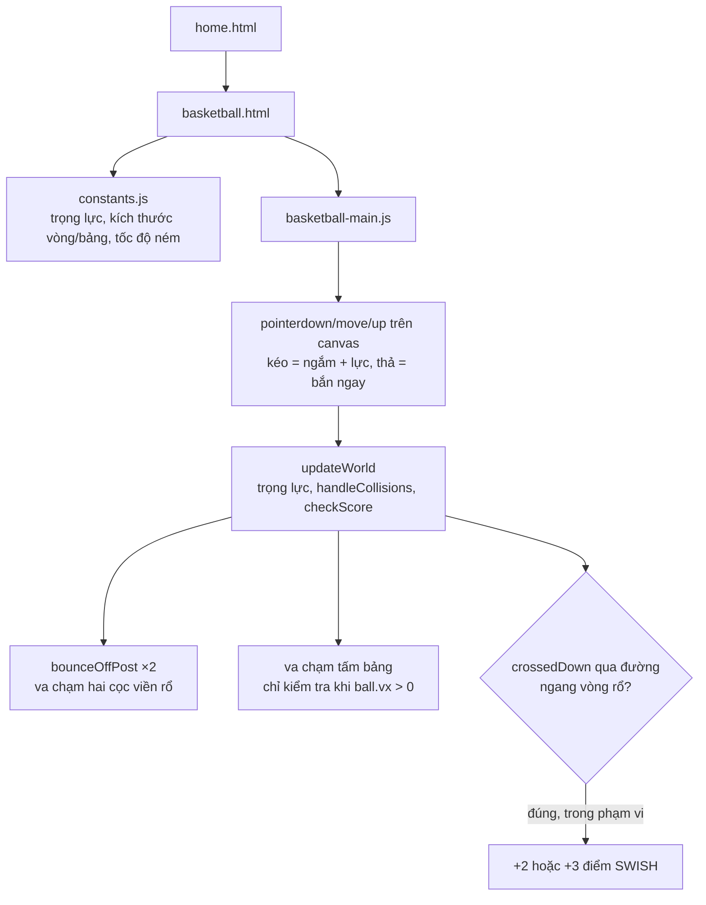

# Bóng Rổ: tấm bảng chỉ đỡ được bóng bay tới từ một phía

## 1. Mở đầu

Tấm bảng rổ (backboard) trong game này là một hình chữ nhật mỏng 4px, dựng đứng ngay sau vòng rổ. Với mọi cú ném bình thường — bóng bay từ góc dưới-trái lên trên-phải, dội bảng, rơi vào rổ — nó hoạt động hoàn hảo. Nhưng nếu lần theo đúng toạ độ đặt tấm bảng trên bàn cờ 360px, hoá ra nó không chiếm trọn khoảng trống từ mép bảng tới tường phải: còn một khoảng hở khá rộng phía sau nó. Và điều kiện code kiểm tra va chạm bảng chỉ được viết cho đúng một hướng bay — hướng bóng đang bay *tới* bảng, không phải hướng bóng bay *ra khỏi* phía sau nó.

## 2. Bối cảnh

Bóng Rổ là game thứ ba trong danh sách "Brick Game", ra đời sau Tetris và Đập Gạch. Về cơ chế điều khiển, nó quay lại dùng đúng kiểu "kéo-ngắm-thả" đã áp dụng cho Pocket Carrom (kéo từ quả bóng ra xa để chọn hướng và lực, thả tay để ném) — nhưng bản Bóng Rổ giữ nguyên bắn-ngay-khi-thả thay vì tách thành hai bước như Pocket Carrom đã làm lại sau này, vì bản chất một cú ném rổ chỉ xảy ra một lần dứt khoát mỗi lượt, không cần "chỉnh lại" giữa chừng như một cú bắn bi-a có thể ảnh hưởng tới nhiều quân cùng lúc.

## 3. Mục tiêu sản phẩm

**Sẽ làm:**
- Ném bóng theo quỹ đạo parabol thật dưới trọng lực (`GRAVITY = 780`), kéo để chọn hướng và lực (giống cơ chế ná thun của Pocket Carrom).
- Va chạm vật lý với hai cọc viền rổ (bật nảy có hệ số đàn hồi) và tấm bảng rổ (dội lại theo trục ngang).
- Phát hiện "vào rổ" bằng cách bắt thời điểm bóng đi *xuyên qua* đường ngang của vòng rổ, đang rơi xuống, trong phạm vi bề rộng vòng.
- Thưởng điểm SWISH (không chạm viền/bảng trước khi vào) cao hơn ném thường có chạm.
- Đấu với thời gian: 40 giây, càng nhiều cú ném càng nhiều điểm tích luỹ.

**Sẽ KHÔNG làm:**
- Không có nhiều vị trí ném khác nhau (không có vạch 3 điểm, khoảng cách ném luôn cố định) — giữ đơn giản, chỉ có một điểm xuất phát duy nhất.
- Không mô phỏng xoáy bóng (spin) ảnh hưởng quỹ đạo — quỹ đạo là parabol thuần trọng lực.

MVP: kéo, ngắm, thả tay ném, bóng bay theo vật lý thật, ghi điểm khi vào rổ, đấu 40 giây tính tổng điểm.

## 4. Thiết kế hệ thống



Kỹ thuật phát hiện "vào rổ" tái sử dụng đúng ý tưởng "quét khoảng đi qua" đã dùng cho va chạm sàn ở Rapid Roll — không so vị trí tức thời, mà so xem bóng có *vượt qua* đường ngang của vòng rổ giữa hai khung hình liên tiếp hay không:

```javascript
const crossedDown = ball.prevY < HOOP_Y && ball.y >= HOOP_Y;
if (crossedDown && ball.vy > 0 && Math.abs(ball.x - HOOP_X) < scoreZoneHalf) {
    ball.scored = true;
    ...
}
```

Cách này tránh được trường hợp bóng "nằm sẵn" đúng tại `y === HOOP_Y` mà không thực sự đi qua nó theo chiều nào (ví dụ nếu chỉ so `ball.y === HOOP_Y`, một khung hình có `dt` lớn bất thường hoàn toàn có thể nhảy cóc qua đúng giá trị đó mà không bao giờ khớp).

## 5. Tech Stack

| Công nghệ | Vì sao chọn |
| --- | --- |
| **Cơ chế kéo-thả-bắn ngay (không tách bước như Pocket Carrom)** | Một cú ném rổ chỉ ảnh hưởng tới đúng một quả bóng, không có nhiều quân khác bị tác động dây chuyền như carrom — chỉnh sửa giữa chừng không mang lại nhiều giá trị so với chi phí thêm một bước UI, nên giữ nguyên cơ chế đơn giản hơn từ đầu. |
| **`bounceOffPost` dùng công thức xung lượng tròn-tròn giống hệt Pocket Carrom** | Cọc viền rổ về bản chất vật lý là một chướng ngại vật tròn tĩnh (khối lượng vô hạn so với bóng) — tái sử dụng đúng công thức phản xạ đã viết cho quân cờ carrom, chỉ đổi hệ số đàn hồi cho phù hợp cảm giác "bật khỏi viền sắt" thay vì "hai quân gỗ va nhau". |
| **`crossedDown` (quét khoảng đi qua) thay vì so sánh trực tiếp** | Đã chứng minh hiệu quả ở Rapid Roll cho va chạm sàn — tái sử dụng nguyên xi cho bài toán tương tự (phát hiện một đối tượng đi qua một ngưỡng Y cụ thể). |

## 6. Quá trình phát triển

### Giai đoạn 1 — Quỹ đạo parabol, tường nảy

Bóng bắt đầu tại vị trí ném cố định, kéo-thả set `vx`/`vy` ban đầu, trọng lực kéo xuống mỗi khung hình. Tường trái/phải phản xạ nhẹ (`* 0.6`, giảm mạnh hơn phản xạ va chạm chính, vì tường chỉ nên đóng vai trò "giữ bóng trong khung hình" chứ không phải yếu tố gameplay chính).

### Giai đoạn 2 — Vòng rổ: hai cọc, một đường ngang tính điểm

Vòng rổ được mô hình hoá không phải như một hình tròn duy nhất, mà là hai cọc tròn nhỏ (`RIM_POST_RADIUS = 4`) đặt cách nhau `RIM_WIDTH = 56`, cộng một "vùng tính điểm" ảo nằm giữa hai cọc, hẹp hơn khoảng cách giữa chúng một chút (`RIM_WIDTH / 2 - BALL_RADIUS * 0.55`) để bóng phải đi lọt qua phần lớn bề rộng vòng mới được tính, không chỉ chạm mép.

### Giai đoạn 3 — Tấm bảng rổ

Thêm một hình chữ nhật mỏng phía sau-trên vòng rổ, dùng kỹ thuật "điểm gần nhất trên hình chữ nhật" giống Đập Gạch để phát hiện va chạm, chỉ phản xạ trục ngang (`vx = -|vx| * BACKBOARD_RESTITUTION`) vì bảng luôn đứng thẳng.

## 7. Những bug đáng nhớ

### Tấm bảng chỉ "tồn tại" đối với bóng bay tới từ bên trái

**Phát hiện khi đọc lại `handleCollisions` để viết bài này:**

```javascript
if (bdx * bdx + bdy * bdy <= BALL_RADIUS * BALL_RADIUS && ball.vx > 0) {
    ball.x = BACKBOARD_X - BALL_RADIUS;
    ball.vx = -Math.abs(ball.vx) * BACKBOARD_RESTITUTION;
    ball.touchedRim = true;
}
```

Điều kiện `ball.vx > 0` (bóng đang bay sang phải, tức đang tiến *về phía* bảng từ hướng ném thông thường) là bắt buộc để kích hoạt va chạm. Điều này đúng cho tình huống thường gặp nhất — ném bóng bay chéo từ dưới-trái lên trên-phải, dội bảng, rơi vào rổ. Nhưng dựng lại toạ độ trên bàn cờ rộng 360px: `BACKBOARD_X = HOOP_X + RIM_WIDTH/2 + 8 = 248 + 28 + 8 = 284`, bảng dày 4px nên kết thúc ở `x = 288`. Tường phải nằm ở `x = 360` — nghĩa là có một khoảng hở **72px** giữa mép bảng và tường phải, đủ rộng để bóng lọt qua sau khi bật khỏi tường phải rồi bay ngược trở lại (`ball.vx < 0`, đang bay sang trái) đúng vào đúng dải toạ độ của tấm bảng từ phía sau.

**Hệ quả:** Trong tình huống đó, `ball.vx > 0` là `false`, toàn bộ khối kiểm tra va chạm bảng bị bỏ qua — bóng xuyên thẳng qua tấm bảng dày 4px như thể nó không tồn tại, tiếp tục bay sang trái vào giữa sân, có thể vẫn vào rổ từ phía "sau lưng" vòng rổ (về mặt hình học vẫn hợp lệ vì vùng tính điểm chỉ kiểm tra toạ độ X nằm giữa hai cọc, không quan tâm bóng đến từ hướng nào).

**Vì sao chưa sửa:** Để bóng bật ra tường phải rồi bay ngược đúng vào dải hẹp phía sau bảng đòi hỏi một góc ném và lực khá đặc thù — trong quá trình test chơi thử thông thường (ném từ góc dưới-trái, quỹ đạo tự nhiên hướng về vòng rổ), tình huống này gần như không bao giờ tự nhiên xảy ra. Đây là kiểu bug "có thật về mặt logic, hiếm gặp về mặt thực tế" — biết nó tồn tại nhưng chưa đủ ưu tiên để sửa ngay.

**Điều rút ra:** Một điều kiện va chạm viết cho *trường hợp phổ biến nhất* (bóng luôn bay tới từ một phía) rất dễ bỏ sót trường hợp hiếm khi hình học của bàn chơi vô tình để hở một đường vòng phía sau vật cản. Cách kiểm tra chắc chắn hơn là không lọc theo hướng vận tốc (`ball.vx > 0`) mà chỉ dựa thuần vào việc bóng có đang chồng lấn hình học với bảng hay không — bảng nào cũng nên chặn bóng từ mọi phía nó tồn tại, trừ khi có lý do thiết kế rõ ràng để chỉ chặn một chiều.

## 8. Những quyết định sai

**Lọc va chạm bảng theo dấu vận tốc (`ball.vx > 0`) thay vì theo hình học chồng lấn thuần tuý** — như đã phân tích ở Bug #1, đây là nguyên nhân trực tiếp của lỗ hổng. Cách viết an toàn hơn là bỏ điều kiện vận tốc, chỉ dựa vào phép kiểm tra khoảng cách, và luôn phản xạ theo đúng trục pháp tuyến của bề mặt bị chạm (ở đây đơn giản là trục X vì bảng luôn thẳng đứng) bất kể bóng đang bay theo chiều nào.

**Không có giới hạn số lần bật nảy giữa cọc rổ trước khi buộc phải rơi ra.** Về lý thuyết (dù chưa quan sát được trong thực tế nhờ ma sát/trọng lực luôn kéo bóng đi), một cú ném với góc và lực đặc biệt có thể khiến bóng dội qua lại giữa hai cọc nhiều lần liên tiếp trước khi thoát ra — không gây lỗi, nhưng có thể tạo cảm giác "kẹt" khó chịu nếu nó thực sự xảy ra.

## 9. Những điều học được

- **Một điều kiện lọc theo hướng vận tốc để "chỉ xử lý va chạm khi đang tiến về phía vật cản" là một tối ưu hoá trực giác, nhưng nó ngầm giả định vật cản chỉ có thể bị tiếp cận từ một phía duy nhất** — giả định đó cần được xác minh lại bằng hình học cụ thể (đo khoảng trống xung quanh vật cản) chứ không thể chỉ dựa vào "trường hợp thường gặp nhất".
- **Tái sử dụng đúng kỹ thuật đã kiểm chứng ở game trước** (quét khoảng đi qua từ Rapid Roll, xung lượng tròn-tròn từ Pocket Carrom) giúp phần lớn vật lý của game mới viết đúng ngay từ lần đầu — bug duy nhất tìm được nằm ở đúng phần logic *mới*, không nằm ở phần logic tái sử dụng.
- **"Hiếm gặp trong thực tế" không đồng nghĩa với "không tồn tại"** — ghi nhận một bug đã biết nhưng chưa sửa (vì tần suất thấp) vẫn có giá trị hơn nhiều so với không biết nó tồn tại.

## 10. Kết quả

| Hạng mục | Con số |
| --- | --- |
| Tổng số dòng code (JS + CSS + HTML) | 718 dòng |
| `js/basketball-main.js` | 324 dòng |
| `css/basketball.css` | 159 dòng |
| `css/home.css` | 125 dòng |
| `js/constants.js` | 32 dòng |
| Khoảng hở phía sau bảng rổ (chưa được che chắn đúng hướng) | 72px |
| Test tự động | 0 |
| CI/CD | Không có |

## 11. Nếu làm lại từ đầu

- **Bỏ điều kiện `ball.vx > 0` khỏi va chạm bảng**, chỉ dựa vào chồng lấn hình học, để bảng chặn bóng từ mọi hướng tiếp cận — sửa tận gốc Bug #1.
- **Thêm một bức tường ảo (không hiển thị) lấp đầy khoảng hở phía sau bảng** như một phương án thay thế/bổ sung, đảm bảo bóng không bao giờ "đi vòng ra sau" vòng rổ dù bảng có được sửa hay chưa.
- **Giới hạn số lần bật nảy liên tiếp giữa hai cọc rổ** (ví dụ sau N lần, tự động giảm hệ số đàn hồi về 0 để bóng rơi thẳng) để loại bỏ khả năng lý thuyết về một cú ném "kẹt" vô hạn.

## 12. Kết

Bóng Rổ tái sử dụng gần như toàn bộ kỹ thuật vật lý đã kiểm chứng ở hai game trước đó trong repo — và đúng như dự đoán, phần code tái sử dụng đó không sinh ra bug mới nào. Bug duy nhất tìm được nằm chính xác ở phần logic mới toanh của game này: một tấm bảng chỉ được thiết kế để nhìn từ một phía, trong khi hình học của bàn chơi lại vô tình để hở một đường vòng ra sau nó. Bài học lặp lại nhưng luôn đúng: rủi ro cao nhất trong bất kỳ codebase nào luôn nằm ở phần mới nhất, chưa được rèn qua nhiều lần va chạm thực tế, chứ không phải ở phần logic đã ổn định từ trước.
