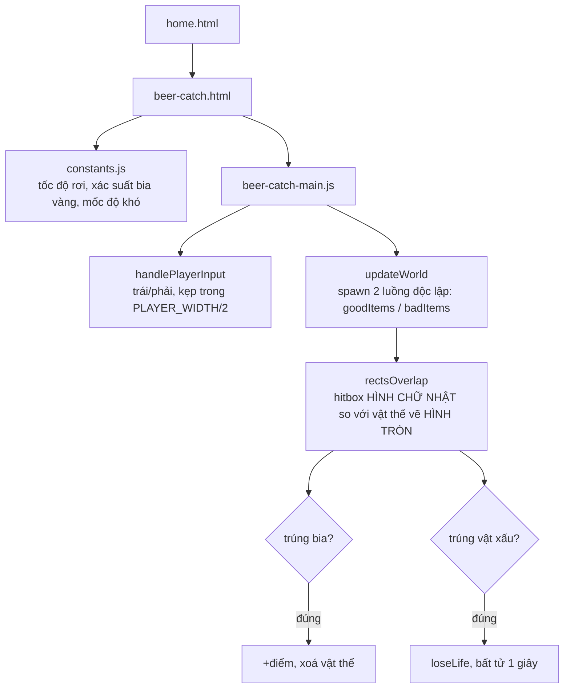

# Hứng Bia: chiếc ly có một dải hộp vô hình không thuộc về nó

## 1. Mở đầu

Ly bia trong game này được vẽ bằng hai phần: một thân ly hình chữ nhật, và một quai cầm hình vòng cung nhô ra bên phải. Nhìn qua tưởng đơn giản — nhưng khi đặt cạnh vùng va chạm (hitbox) thực sự dùng để tính "đã hứng được đồ vật hay chưa", có một khoảng hở khoảng 10px ở rìa phải, nơi không có phần nào của ly được vẽ ra, nhưng vẫn được tính là "trong tầm với" của chiếc ly. Bài này đọc lại Hứng Bia — một game bắt đồ vật rơi kiểu cổ điển đã có sẵn trong repo trước khi được viết bài này — bằng con mắt lần đầu tiên nhìn thấy code của nó, để tìm ra chính xác khoảng hở đó tới từ đâu.

## 2. Bối cảnh

Hứng Bia không nằm trong loạt "Nokia hoài niệm" hay "Brick Game" — nó là một game đứng riêng, dùng đúng bộ khung kỹ thuật đã trở thành chuẩn chung của cả repo (canvas, IIFE, state machine `ready/playing/gameover`, HUD dạng chip, D-pad chạm). Cơ chế: một chiếc ly di chuyển ngang ở đáy màn hình, hứng những cốc bia rơi từ trên xuống để ghi điểm (bia vàng cho điểm cao hơn nhưng hiếm hơn), né những vật thể xấu (đánh dấu bằng hai đường chéo đỏ kiểu "cấm") rơi cùng lúc. Cấu trúc code — từ cách đặt tên hàm `difficultyStep`, `rectsOverlap`, tới công thức nhấp nháy bất tử `Math.floor(performance.now() / 100) % 2 === 0` — giống gần như nguyên xi với Space Impact, cho thấy đây là một game được viết dựa trên đúng khuôn mẫu đã hình thành từ những game trước đó trong repo, chỉ đổi chủ đề (bia thay vì phi thuyền) và đơn giản hoá đối tượng rơi (không có địch bắn trả, không có nhiều loại hành vi bay).

## 3. Mục tiêu sản phẩm

**Đã làm (đọc được từ code hiện có):**
- Ly di chuyển trái/phải ở đáy màn hình, né/hứng vật thể rơi từ trên xuống.
- Hai loại vật thể tốt: bia thường (50 điểm) và bia vàng (150 điểm, xác suất xuất hiện 18%).
- Vật thể xấu (hình tròn xám có dấu X đỏ): chạm vào mất một mạng, có 1 giây bất tử nhấp nháy sau mỗi lần mất mạng.
- 3 mạng, độ khó tăng theo điểm số (tốc độ rơi và tần suất xuất hiện của cả hai loại vật thể đều leo thang, có trần).
- D-pad chạm hai nút trái/phải, không có nút nào khác (không cần bắn hay hành động gì ngoài né/hứng).

**Không làm (suy ra từ những gì không có trong code):**
- Không có combo hay chuỗi điểm thưởng khi hứng liên tiếp không trượt.
- Không có vật thể xấu "giả dạng" vật thể tốt hay ngược lại — hai loại luôn phân biệt rõ ràng bằng hình dạng và màu sắc, không đánh đố thị giác.
- Không giới hạn hay tăng dần kích thước ly theo thời gian — kích thước ly cố định suốt ván.

MVP: ly di chuyển, hứng bia ghi điểm, né vật xấu giữ mạng, thua khi hết 3 mạng, điểm cao nhất lưu lại.

## 4. Thiết kế hệ thống



Điểm thiết kế đáng chú ý nhất là hai luồng sinh vật thể (`goodSpawnTimer`/`badSpawnTimer`) hoàn toàn độc lập với nhau — không có sự phối hợp nào giữa "khi nào bia rơi" và "khi nào vật xấu rơi", chúng chỉ tình cờ chồng lên nhau hay không tuỳ may rủi. Đây là lựa chọn đơn giản hoá hợp lý: một hệ thống điều phối hai luồng để tránh/tạo tình huống rơi cùng lúc phức tạp hơn nhiều so với lợi ích nó mang lại cho một game có cơ chế cốt lõi đơn giản như thế này.

## 5. Tech Stack

| Công nghệ | Vì sao chọn |
| --- | --- |
| **Khuôn mẫu canvas/IIFE/state-machine dùng chung toàn repo** | Không có gì đặc thù cho Hứng Bia — tái sử dụng đúng cấu trúc đã kiểm chứng ở nhiều game khác (Space Impact, Bắn Ruồi) giúp game mới viết nhanh và nhất quán với phần còn lại của dự án. |
| **`rectsOverlap` (AABB) cho mọi va chạm, kể cả với vật thể vẽ hình tròn** | Đơn giản và đủ nhanh cho số lượng vật thể nhỏ mỗi khung hình — đánh đổi lấy độ chính xác hình học tuyệt đối, xem phần 7 để biết cái giá thực tế của đánh đổi này. |
| **Hai bộ timer sinh vật thể độc lập (`goodSpawnTimer`/`badSpawnTimer`)** | Không cần một "nhạc trưởng" điều phối cả hai luồng — mỗi loại tự quản lý nhịp xuất hiện của riêng nó, đơn giản hơn nhiều so với một hệ thống lịch trình chung. |

## 6. Quá trình phát triển

*(Suy luận từ cấu trúc code hiện có, không có lịch sử phát triển bằng lời để tham chiếu trực tiếp.)*

### Giai đoạn 1 — Ly di chuyển, một loại vật thể rơi

Nền tảng chắc chắn là một ly di chuyển ngang, một loại vật thể rơi thẳng, va chạm AABB đơn giản — đúng bộ xương tối thiểu trước khi phân loại vật thể tốt/xấu.

### Giai đoạn 2 — Phân loại vật thể: bia thường, bia vàng, vật xấu

Thêm cờ `golden` xác suất 18% cho vật thể tốt, và một luồng `badItems` hoàn toàn tách biệt. Vẽ vật xấu bằng vòng tròn xám với hai đường chéo đỏ cắt qua tâm — một biểu tượng "cấm/nguy hiểm" phổ quát, không cần chú thích thêm để người chơi hiểu ngay cần né.

### Giai đoạn 3 — Độ khó leo thang, bất tử tạm thời

`difficultyStep` và cơ chế bất tử 1 giây sau mỗi lần mất mạng — sao chép gần như nguyên văn công thức đã dùng ở Space Impact, bao gồm cả cách nhấp nháy bằng phép chia thời gian thực cho 100ms rồi lấy dư 2.

## 7. Những bug đáng nhớ

### Chiếc ly có một dải hộp vô hình rộng khoảng 10px không thuộc về hình vẽ nào

**Phát hiện khi đối chiếu `drawPlayer` với vùng va chạm trong `updateWorld`:**

```javascript
// Vẽ: thân ly chỉ rộng PLAYER_WIDTH - 14, lệch về bên trái
ctx.fillRect(-PLAYER_WIDTH / 2, -PLAYER_HEIGHT / 2, PLAYER_WIDTH - 14, PLAYER_HEIGHT);
// Vẽ: quai cầm là một cung tròn bán kính 10, tâm tại (PLAYER_WIDTH/2 - 20, 0)
ctx.arc(PLAYER_WIDTH / 2 - 20, 0, 10, -Math.PI / 2, Math.PI / 2);
```

```javascript
// Va chạm: dùng TRỌN VẸN PLAYER_WIDTH, không trừ đi phần nào
const playerLeft = playerX - PLAYER_WIDTH / 2;
rectsOverlap(playerLeft, playerTop, PLAYER_WIDTH, PLAYER_HEIGHT, ...);
```

Với `PLAYER_WIDTH = 74`, thân ly được vẽ trải dài từ `x = -37` tới `x = -37 + 60 = 23` (rộng `74 - 14 = 60`, không phải `74`). Quai cầm — cung tròn tâm tại `x = 37 - 20 = 17`, bán kính 10 — vươn xa nhất tới `x = 27`. Cộng thêm độ dày nét vẽ (`lineWidth = 5`, tức khoảng 2.5px mỗi bên), điểm xa nhất mà bất kỳ phần nào của ly *thực sự được vẽ ra màn hình* chỉ tới khoảng `x ≈ 29.5`. Trong khi đó, vùng va chạm dùng nguyên `PLAYER_WIDTH = 74`, trải dài tới tận `x = +37`.

**Hệ quả:** Có một dải rộng khoảng 7-10px ở rìa phải của ly — nằm trong vùng va chạm nhưng hoàn toàn trống về mặt hình ảnh — nơi bia hoặc vật xấu rơi vào đó vẫn được tính là "chạm ly" dù mắt thường nhìn thấy chúng rơi qua khoảng trống bên phải chiếc ly, chưa chạm vào bất kỳ hình khối nào được vẽ ra. Với vật thể tốt, đây là một món quà nhỏ vô tình (dễ hứng hơn ly trông có vẻ), nhưng với vật thể xấu, nó là một hình phạt vô tình (mất mạng dù cảm giác "rõ ràng đã né được").

**Vì sao chưa sửa:** 7-10px trên một chiếc ly rộng 74px là một chênh lệch khá nhỏ (dưới 15% chiều rộng), và vì nó nằm ở CẢ HAI phía — vừa lợi cho vật thể tốt vừa hại với vật thể xấu — tác động ròng lên cảm giác công bằng tổng thể một phần được triệt tiêu lẫn nhau, dù không hoàn toàn.

**Điều rút ra:** Khi một hình vẽ không đối xứng (thân ly lệch trái, quai cầm nhô phải nhưng không đủ xa) được gán một vùng va chạm hình chữ nhật đối xứng hoàn hảo tính theo đúng biến `PLAYER_WIDTH`, sự lệch pha giữa "cái người chơi nhìn thấy" và "cái code thực sự kiểm tra" không tự động bằng 0 chỉ vì cả hai cùng dùng chung một hằng số kích thước. Phải đo đạc cụ thể từng phần được vẽ ra (không chỉ đọc tên biến) mới phát hiện được độ lệch thực tế.

## 8. Những quyết định sai

**Vật thể rơi được vẽ dạng hình tròn (`ctx.arc`) nhưng va chạm kiểm tra dạng hình vuông bao quanh nó (`item.x - SIZE/2, item.y - SIZE/2, SIZE, SIZE`).** Một hình vuông ngoại tiếp một hình tròn có diện tích lớn hơn khoảng 27% (`4/π`), và bốn góc vuông nhô ra xa tâm hơn bán kính hình tròn tới `√2` lần — nghĩa là vật thể "trông tròn" trên màn hình nhưng có thể được hứng/né trúng ngay tại các góc vô hình nằm ngoài rìa tròn nhìn thấy được. Đây là cùng một dạng đơn giản hoá đã xuất hiện ở Space Impact cho đạn và địch, một mẫu hình lặp lại xuyên suốt cả repo hơn là lỗi riêng của game này — nhưng ở Hứng Bia, nơi kỹ năng chính của người chơi là căn chỉnh vị trí ly chính xác theo mắt nhìn, độ lệch hình-học-vs-hitbox này ảnh hưởng trực tiếp hơn tới cảm giác công bằng so với các game khác nơi va chạm chỉ là một phần trong nhiều cơ chế.

## 9. Những điều học được

- **Đọc code của người khác (hay của chính mình từ một phiên làm việc khác) với mục tiêu tìm hiểu, không phải mục tiêu sửa lỗi, vẫn có thể phát hiện ra những vấn đề thật** — miễn là đọc đủ kỹ để đối chiếu con số cụ thể giữa phần vẽ và phần va chạm, thay vì tin tưởng rằng "cùng dùng một biến thì chắc là khớp nhau".
- **Một hình vẽ bất đối xứng (thân lệch, quai nhô một bên) đi cùng một hitbox đối xứng hoàn hảo luôn đáng để kiểm tra bằng số đo cụ thể** — trực giác "trông có vẻ khớp" không đủ tin cậy khi hai phần được viết bằng hai đơn vị đo khác nhau (offset âm/dương, bán kính, độ dày nét vẽ).
- **Một mẫu đơn giản hoá (hình vuông thay hình tròn cho va chạm) lặp lại nhất quán xuyên suốt nhiều game trong cùng một codebase là dấu hiệu của một quy ước thiết kế có chủ đích, không phải sơ suất ngẫu nhiên** — nhưng mức độ ảnh hưởng thực tế của quy ước đó vẫn cần đánh giá riêng cho từng game, tuỳ vào việc độ chính xác va chạm có phải yếu tố cốt lõi của gameplay hay không.

## 10. Kết quả

| Hạng mục | Con số |
| --- | --- |
| Tổng số dòng code (JS + CSS + HTML) | 720 dòng |
| `js/beer-catch-main.js` | 288 dòng |
| `css/beer-catch.css` | 193 dòng |
| `css/home.css` | 125 dòng |
| `js/constants.js` | 31 dòng |
| Chênh lệch hitbox vs hình vẽ (rìa phải chiếc ly) | ~7-10px trên tổng 74px chiều rộng |
| Test tự động | 0 |
| CI/CD | Không có |

## 11. Nếu làm lại từ đầu

- **Thu hẹp vùng va chạm của ly để khớp với phần thực sự được vẽ ra** — ví dụ dùng `PLAYER_WIDTH - 14 + 10` (thân ly cộng một phần quai cầm) thay vì trọn vẹn `PLAYER_WIDTH`, hoặc đơn giản hơn: vẽ ly đối xứng ngay từ đầu để hitbox hình chữ nhật khớp tự nhiên với hình vẽ.
- **Cân nhắc va chạm hình tròn thật (so khoảng cách tâm, không phải AABB) cho vật thể rơi**, nhất quán với hình dạng thực sự hiển thị — chi phí tính toán không đáng kể ở quy mô vài chục vật thể mỗi khung hình.
- **Thêm một bước "đo lại" tự động hoặc bằng mắt sau khi vẽ bất kỳ sprite bất đối xứng nào**, đối chiếu trực tiếp với vùng va chạm đang dùng, thay vì tin tưởng vào tên biến dùng chung.

## 12. Kết

Hứng Bia là một ví dụ rõ ràng cho một loại lỗi không hề ồn ào: không crash, không hiện sai điểm số, không có gì trong console phàn nàn — chỉ có một cảm giác mơ hồ "hình như mình vừa né được mà vẫn mất mạng" mà không ai, kể cả người viết code ban đầu, chắc chắn xác nhận được nếu không ngồi đo lại từng con số. Đọc một game "lạ" (chưa từng viết) với sự tò mò thay vì giả định nó đúng cũng là một cách hữu ích để bắt được đúng loại lỗi này — loại lỗi chỉ lộ ra khi ai đó thực sự dừng lại so sánh cái được vẽ với cái được kiểm tra, hai thứ tưởng chừng luôn đi cùng nhau nhưng không có gì đảm bảo điều đó ngoài kỷ luật của người viết.
