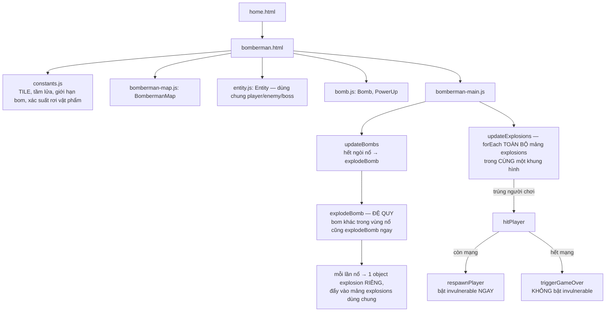

# Bomberman: mạng cuối cùng có thể bị trừ nhiều hơn một lần trong cùng một khung hình

## 1. Mở đầu

Cờ bất tử tạm thời (`player.invulnerable`) trong game này làm đúng hai việc: ngăn một vụ nổ đánh trúng người chơi nhiều lần liên tiếp, và — một cách tình cờ nhưng hiệu quả — ngăn *hai vụ nổ khác nhau* trong cùng một chuỗi phản ứng dây chuyền cùng đánh trúng người chơi trong cùng một khung hình, vì vụ nổ đầu tiên trúng đích sẽ bật cờ bất tử lên ngay lập tức, khiến vụ nổ thứ hai (được xử lý ngay sau đó trong cùng một vòng lặp) tự động bị chặn. Cơ chế tự bảo vệ này hoạt động tốt — trừ đúng một trường hợp: khi cú nổ đó chính là cú khiến người chơi hết sạch mạng. Trên con đường dẫn tới "Game Over", cờ bất tử không bao giờ được bật lên, và lớp bảo vệ ngầm định đó biến mất đúng vào lúc nó cần thiết nhất.

## 2. Bối cảnh

Bomberman là bản clone phức tạp thứ hai trong repo (sau Tank 1990) về mặt số lượng thực thể tương tác, và phức tạp hơn hẳn về mặt logic lan truyền: một quả bom nổ có thể kích nổ dây chuyền các quả bom khác nằm trong tầm lửa của nó, mỗi vụ nổ dây chuyền lại tạo ra một vùng lửa mới, và tất cả các vùng lửa đó — dù bắt nguồn từ bao nhiêu quả bom khác nhau — đều có thể được xử lý trong đúng một khung hình duy nhất nếu ngòi nổ của chúng đủ gần nhau.

## 3. Mục tiêu sản phẩm

**Đã làm (theo README):**
- Bản đồ lưới phá huỷ được, sinh ngẫu nhiên mỗi ván, 4 góc xuất phát luôn được giữ trống.
- Đặt bom (giới hạn theo số bom tối đa hiện có), nổ theo hình chữ thập tới tầm lửa hiện tại, kích nổ dây chuyền các bom khác nằm trong vùng nổ.
- Địch sinh theo đợt, số lượng và giới hạn trên sân tăng dần; AI đi ngẫu nhiên theo hẹn giờ hoặc khi bị chặn đường, không truy đuổi người chơi.
- Boss xuất hiện sau khi dọn sạch địch mỗi đợt, máu tăng theo đợt, có banner cảnh báo.
- Vật phẩm nâng cấp (số bom, tầm lửa, tốc độ) rơi ra từ khối mềm bị phá, có trần tối đa riêng từng loại.
- 3 mạng, hồi sinh với bất tử tạm thời có nhấp nháy.

**Sẽ KHÔNG làm:**
- Không có pathfinding — địch và boss chỉ đi ngẫu nhiên, không "biết" người chơi ở đâu.
- Không giới hạn số lượng vụ nổ đồng thời có thể xử lý trong một khung hình — mọi vụ nổ dây chuyền đều được tính toán và áp dụng ngay trong cùng một lượt cập nhật.

MVP: đặt bom phá khối và tiêu diệt địch, tránh vụ nổ của chính mình và của địch, sống sót qua các đợt, đánh bại boss để lên đợt tiếp theo.

## 4. Thiết kế hệ thống



Phần logic dây chuyền, trái tim của cả game, nằm gọn trong một hàm đệ quy:

```javascript
function explodeBomb(bomb, now) {
    if (bomb.exploded) return;
    bomb.exploded = true;
    bombs = bombs.filter((b) => b !== bomb);

    const cells = [{ col: bomb.col, row: bomb.row }];
    [DIR.UP, DIR.DOWN, DIR.LEFT, DIR.RIGHT].forEach((dir) => {
        for (let i = 1; i <= bomb.flameRange; i++) {
            ...
            if (map.destroySoft(col, row)) { maybeDropPowerup(col, row); break; }
        }
    });

    explosions.push({ cells, expiresAt: now + EXPLOSION_DURATION_MS, hit: new Set() });

    bombs.slice().forEach((other) => {
        if (cells.some((c) => c.col === other.col && c.row === other.row)) {
            explodeBomb(other, now);   // đệ quy — có thể tạo ra nhiều `explosion` object trong cùng 1 khung hình
        }
    });
}
```

Cờ `bomb.exploded` ngăn một quả bom bị nổ hai lần (bảo vệ khỏi đệ quy vô hạn nếu hai bom cùng nằm trong vùng nổ của nhau). Nhưng mỗi lần `explodeBomb` chạy — dù được gọi trực tiếp từ `updateBombs` hay gọi đệ quy từ một `explodeBomb` khác — đều tạo ra một `explosion` object **riêng biệt**, với một `Set` "đã đánh trúng" (`hit`) **riêng biệt**, rồi đẩy vào chung một mảng `explosions`. Đây chính là điểm mấu chốt của bug ở phần 7: `hit` chỉ ngăn được việc *cùng một* vụ nổ đánh trúng một mục tiêu hai lần, không ngăn được *các vụ nổ khác nhau* trong cùng chuỗi phản ứng dây chuyền cùng đánh trúng một mục tiêu trong cùng một khung hình.

## 5. Tech Stack

| Công nghệ | Vì sao chọn |
| --- | --- |
| **Class `Entity` dùng chung cho player/enemy/boss** | Cả ba đều cần vị trí, tốc độ, kích thước, và toạ độ ô lưới hiện tại (`gridCol`/`gridRow`) — gói chung vào một class giống cách Tank 1990 dùng chung class `Tank`, tránh lặp lại logic tính toán vị trí ba lần. |
| **Mỗi vụ nổ là một object độc lập trong mảng `explosions`, không gộp chung** | Cho phép nhiều vụ nổ chồng lấn nhau về mặt hình ảnh và thời gian tồn tại độc lập (một vụ nổ dây chuyền có thể kết thúc sớm hơn/muộn hơn vụ nổ gốc tuỳ thời điểm nó được kích hoạt) — đơn giản hơn việc gộp tất cả các ô lửa của một chuỗi phản ứng vào đúng một object dùng chung. |
| **`bomb.exploded` làm cờ chặn đệ quy vô hạn** | Với khả năng hai quả bom nằm trong tầm nổ của nhau (A kích B, B kích lại A), một cờ đơn giản đánh dấu "đã xử lý" là đủ để đảm bảo đệ quy luôn dừng lại, không cần thuật toán phát hiện chu trình phức tạp hơn. |

## 6. Quá trình phát triển

*(Suy luận từ cấu trúc code và README hiện có.)*

### Giai đoạn 1 — Bản đồ, di chuyển, một quả bom không lan truyền

Nền tảng: đặt một quả bom, chờ hết ngòi nổ, nổ theo hình chữ thập, phá khối mềm — chưa có phản ứng dây chuyền, chưa có địch.

### Giai đoạn 2 — Phản ứng dây chuyền

Thêm đệ quy vào `explodeBomb` — quyết định kỹ thuật quan trọng nhất của game, biến "một quả bom nổ" thành "một hệ thống lan truyền có thể tạo ra bất kỳ số lượng vụ nổ nào trong cùng một khung hình", đúng cảm giác Bomberman kinh điển khi đặt bom thành hàng để kích hoạt dây chuyền.

### Giai đoạn 3 — Địch, boss, và va chạm trực tiếp

`checkEntityContact` — va chạm trực tiếp giữa người chơi và địch/boss (không qua vụ nổ), dùng đúng cờ `invulnerable` như một lớp bảo vệ chung cho cả hai loại nguy hiểm (nổ và va chạm trực tiếp).

### Giai đoạn 4 — Vật phẩm nâng cấp, hồi sinh, và bất tử tạm thời

`respawnPlayer` đặt lại vị trí và bật `invulnerable`, tắt sau 1.3 giây bằng `setTimeout` — chính tại giai đoạn này, một nhánh không đi qua `respawnPlayer` (nhánh hết mạng) đã âm thầm bỏ sót bước bật cờ này, dẫn tới bug ở phần 7.

## 7. Những bug đáng nhớ

### Khi mạng cuối cùng mất đi giữa một chuỗi phản ứng dây chuyền, cờ bất tử không bao giờ được bật lên để chặn các vụ nổ còn lại

**Phát hiện khi lần theo toàn bộ đường đi của `player.invulnerable` để viết bài này:**

```javascript
function hitPlayer() {
    player.lives -= 1;
    if (player.lives <= 0) {
        triggerGameOver("Bạn đã hết mạng!");   // KHÔNG đặt invulnerable
    } else {
        respawnPlayer();                        // đặt invulnerable = true NGAY LẬP TỨC
    }
}
```

Trong tình huống bình thường (còn mạng), `respawnPlayer()` đặt `player.invulnerable = true` *đồng bộ*, ngay trong lượt gọi `hitPlayer()`. Nhờ vậy, nếu `updateExplosions` đang duyệt qua nhiều `explosion` object trong cùng một khung hình (từ một chuỗi phản ứng dây chuyền), vụ nổ đầu tiên đánh trúng người chơi sẽ bật `invulnerable` ngay, khiến điều kiện `!player.invulnerable` ở các vụ nổ tiếp theo trong cùng vòng lặp `forEach` tự động sai — một cơ chế tự bảo vệ hoạt động đúng, dù không ai chủ đích thiết kế nó cho riêng tình huống nhiều vụ nổ cùng lúc.

Nhưng khi `player.lives` vừa giảm xuống `0` (hoặc thấp hơn) ngay tại lần trúng đầu tiên, nhánh `triggerGameOver` chạy thay vì `respawnPlayer` — và `player.invulnerable` **không hề được đặt lại**, vẫn giữ nguyên giá trị `false` từ trước. `triggerGameOver` có cờ tự vệ (`if (state === "gameover") return;`) ngăn hiện overlay hai lần và ghi đè điểm cao nhất nhiều lần, nhưng **`hitPlayer()` không có cờ tự vệ tương tự** — nếu vụ nổ thứ hai trong cùng chuỗi dây chuyền cũng phủ đúng ô lưới người chơi đang đứng, điều kiện `player.alive && !player.invulnerable && !explosion.hit.has(player)` vẫn đúng (vì `player.alive` không bao giờ bị đặt `false` ở bất kỳ đâu — cùng một kiểu trường dữ liệu "vestigial" đã ghi nhận ở Tank 1990), nên `hitPlayer()` bị gọi thêm một lần nữa, trừ tiếp `player.lives` xuống một giá trị âm sâu hơn.

**Hệ quả thực tế:** Về giao diện, người chơi vẫn chỉ thấy đúng một màn hình Game Over (nhờ cờ tự vệ trong `triggerGameOver`), điểm số hiển thị không sai — nhưng `player.lives` trong bộ nhớ có thể kết thúc ở một giá trị âm sâu hơn mức cần thiết, và `hitPlayer()`/`respawnPlayer` (nếu logic có thay đổi sau này, ví dụ thêm hiệu ứng âm thanh mỗi lần mất mạng) sẽ chạy nhiều lần hơn số lần người chơi thực sự "cảm nhận" được là đã mất mạng.

**Vì sao đây là bug thật, không chỉ là dữ liệu thừa vô hại:** Khác với `baseAlive` thừa ở Tank 1990 (một kiểm tra không bao giờ có đường nào khác dẫn tới nó), ở đây **có thật** một con đường thực thi khác dẫn tới việc gọi `hitPlayer()` nhiều lần — chỉ cần hai quả bom kích hoạt dây chuyền mà vùng nổ của cả hai đều phủ đúng ô người chơi đang đứng, đúng lúc mạng cuối cùng bị mất. Đây không phải một nhánh lý thuyết chưa từng xảy ra — nó là một điều kiện đua (race) thực sự giữa "số lượng vụ nổ chồng lấn trong một khung hình" và "việc cờ bất tử có kịp được bật lên hay không", chỉ đơn giản là bị che khuất bởi các lớp bảo vệ khác (cờ tự vệ của `triggerGameOver`) khiến hậu quả không lộ ra rõ ràng trên giao diện.

**Điều rút ra:** Một cờ trạng thái (`invulnerable`) vô tình đảm nhiệm hai vai trò khác nhau — "bất tử tạm thời sau khi hồi sinh" và "chặn trúng đòn nhiều lần trong cùng khung hình" — sẽ chỉ đáng tin cậy ở vai trò thứ hai nếu nó *luôn* được thiết lập ở mọi nhánh có thể dẫn tới việc mất mạng, kể cả nhánh kết thúc game. Bỏ sót đúng một nhánh (nhánh hết mạng, tưởng như "không quan trọng nữa vì game sắp kết thúc rồi") là đủ để phá vỡ giả định ngầm mà các đoạn code khác (`updateExplosions`) đang dựa vào.

## 8. Những quyết định sai

**`hitPlayer()` không có cờ tự vệ chống gọi lại nhiều lần**, trong khi `triggerGameOver()` (được gọi từ bên trong nó) lại có. Sự bất đối xứng này khiến lớp bảo vệ chỉ dừng đúng hiệu ứng phụ (hiện overlay, ghi điểm) chứ không dừng được nguyên nhân gốc (số lần `player.lives` bị trừ) — nếu `hitPlayer()` tự kiểm tra `state === "gameover"` ngay từ đầu và thoát sớm, toàn bộ chuỗi hệ quả (bao gồm cả việc không đặt `invulnerable`) sẽ không còn quan trọng nữa, vì hàm sẽ không bao giờ chạy tới đó lần thứ hai.

## 9. Những điều học được

- **Một cờ trạng thái đảm nhiệm nhiều vai trò cùng lúc chỉ đáng tin cậy ở vai trò "phụ" (ở đây là chặn trúng đòn nhiều lần trong một khung hình) nếu nó được thiết lập nhất quán ở MỌI nhánh có thể dẫn tới cùng một sự kiện, kể cả những nhánh không phải mục tiêu chính khi cờ đó được tạo ra** — `invulnerable` được thiết kế ban đầu cho việc hồi sinh, tác dụng phụ "chặn đa vụ nổ" chỉ là một hệ quả tình cờ, và hệ quả tình cờ đó không được kiểm chứng đầy đủ cho MỌI nhánh.
- **Cờ tự vệ chống gọi lại (`if (state === "gameover") return;`) chỉ bảo vệ được đúng phần thân hàm nó nằm trong, không bảo vệ được các lệnh gọi hàm khác dẫn tới cùng một hàm đó từ nhiều nguồn khác nhau** — nếu muốn chặn toàn bộ chuỗi hệ quả, cờ tự vệ cần đặt ở hàm *đầu tiên* trong chuỗi bị gọi lại nhiều lần (`hitPlayer`), không phải hàm cuối cùng (`triggerGameOver`).
- **Bug liên quan tới số lượng sự kiện chồng lấn trong cùng một khung hình (ở đây là nhiều vụ nổ từ một chuỗi phản ứng dây chuyền) thường ẩn mình rất tốt** — vì chúng chỉ lộ ra khi đúng nhiều điều kiện xảy ra đồng thời (nhiều bom, đúng vị trí, đúng lúc hết mạng), và ngay cả khi xảy ra, hậu quả nhìn thấy được trên giao diện có thể đã bị các lớp bảo vệ khác che bớt đi.

## 10. Kết quả

| Hạng mục | Con số |
| --- | --- |
| Tổng số dòng code (JS + CSS + HTML) | 1.277 dòng |
| `js/bomberman-main.js` | 529 dòng |
| `css/bomberman.css` | 245 dòng |
| `js/bomberman-map.js` | 98 dòng |
| `js/entity.js` | 72 dòng |
| `js/bomb.js` | 58 dòng |
| `js/constants.js` | 55 dòng |
| Số loại vật phẩm nâng cấp | 3 (số bom, tầm lửa, tốc độ) |
| Test tự động | 0 |
| CI/CD | Không có |

## 11. Nếu làm lại từ đầu

- **Thêm cờ tự vệ ngay đầu `hitPlayer()`** (`if (state === "gameover" || !player.alive) return;`), chặn toàn bộ chuỗi hệ quả từ gốc thay vì chỉ chặn ở `triggerGameOver` — sửa tận gốc bug đã ghi nhận, bất kể cờ `invulnerable` có được thiết lập đúng lúc hay không.
- **Đặt `player.alive = false` khi hết mạng**, nhất quán với cách `enemy.alive`/`boss.alive` được quản lý, để điều kiện `player.alive` trong `updateExplosions` thực sự phản ánh đúng trạng thái sống/chết thay vì luôn `true`.
- **Cân nhắc gộp tất cả các ô lửa của một chuỗi phản ứng dây chuyền xảy ra trong cùng một khung hình vào đúng một `explosion` object dùng chung một `hit` Set**, thay vì mỗi quả bom tạo một object riêng — loại bỏ hoàn toàn khả năng "nhiều vụ nổ khác nhau cùng đánh trúng một mục tiêu trong cùng khung hình" ngay từ cấu trúc dữ liệu, không cần dựa vào tác dụng phụ của cờ bất tử để tự sửa chữa.

## 12. Kết

Bomberman có logic lan truyền dây chuyền được viết đúng và mạnh mẽ — phần khó nhất về mặt thuật toán trong cả game hoạt động chính xác. Bug tìm được không nằm ở đó, mà nằm ở một góc khuất tinh vi hơn nhiều: một cờ trạng thái vô tình đảm nhiệm một vai trò bảo vệ nó chưa từng được thiết kế cho, hoạt động tốt trong phần lớn trường hợp nhờ tác dụng phụ, nhưng có đúng một nhánh (mất mạng cuối cùng) nơi tác dụng phụ đó không xảy ra. Đây là lời nhắc rằng những cơ chế bảo vệ "tự nhiên xuất hiện" từ cách các hàm gọi lẫn nhau thường mong manh hơn những cơ chế được thiết kế tường minh — chúng hoạt động cho tới đúng lúc một nhánh nào đó phá vỡ giả định ngầm mà không ai từng viết ra thành lời.
