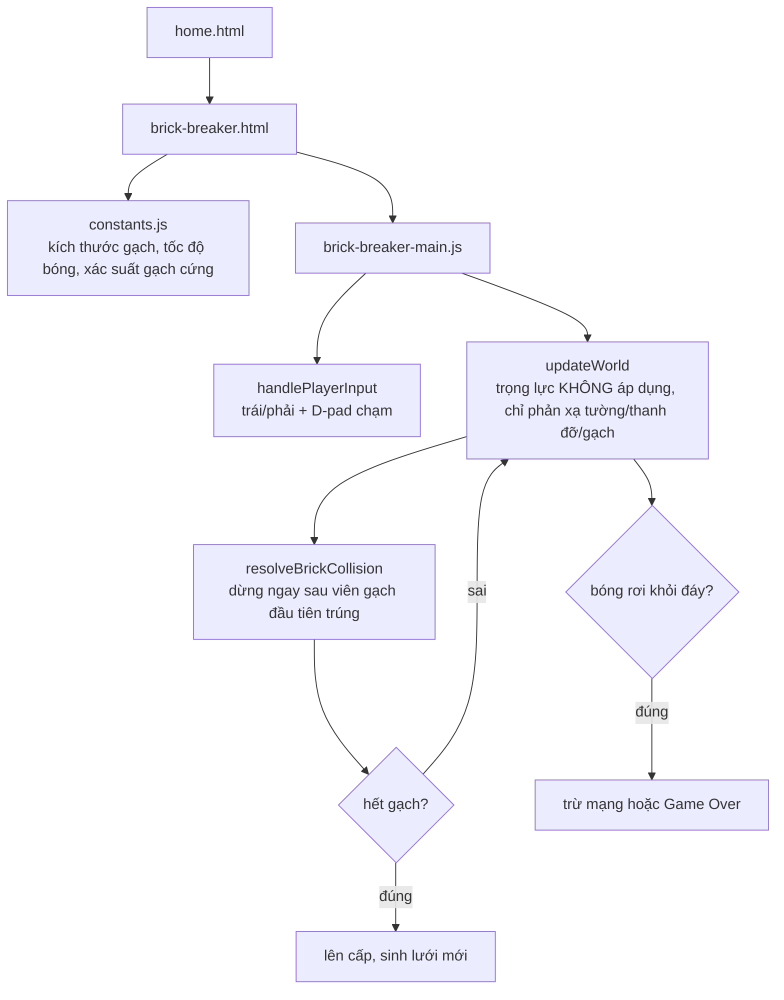

# Đập Gạch: viên gạch hai máu trả công hậu hĩnh hơn dự tính

## 1. Mở đầu

Đập Gạch (Breakout) là game thứ hai trong danh sách "Brick Game cầm tay" được viết, ngay sau Tetris. Về cơ chế, nó là một trong những thể loại lâu đời và đơn giản nhất của lịch sử game: một thanh đỡ, một quả bóng, một lưới gạch. Không có gì để phát minh lại. Nhưng chính vì "không có gì để phát minh lại" mà mọi quyết định nhỏ — gạch cứng nên cho bao nhiêu điểm, một khung hình được phép xử lý bao nhiêu va chạm — lại dễ bị lướt qua nhanh, và một trong những quyết định lướt qua đó hoá ra tạo ra một quy tắc điểm số không hề chủ đích: gạch hai máu trả công nhiều hơn 50% so với hai viên gạch một máu cộng lại.

## 2. Bối cảnh

Đập Gạch kế thừa gần như nguyên vẹn bộ khung vật lý va chạm hình chữ nhật đã dùng ở Rapid Roll (một quả bóng, trọng lực không cần vì bóng ở đây bay ngang dọc thuần phản xạ, nhưng kỹ thuật "quét khoảng đi qua" để không bỏ lọt va chạm ở tốc độ cao thì được tái sử dụng ý tưởng). Điểm khác biệt là ở đây có một lưới đối tượng tĩnh (gạch) thay vì lưới đối tượng động (sàn), và bóng cần phản xạ đúng hướng tuỳ theo va chạm từ cạnh nào của viên gạch — bài toán "MTV" (minimum translation vector) đơn giản hoá, lần đầu xuất hiện trong repo.

## 3. Mục tiêu sản phẩm

**Sẽ làm:**
- Thanh đỡ di chuyển trái/phải, bóng tự động phóng ra theo góc gần thẳng đứng khi bắt đầu mỗi mạng (không cần nút phóng riêng).
- Góc nảy khi chạm thanh đỡ phụ thuộc vị trí chạm (chạm rìa nảy chéo, chạm giữa nảy gần thẳng đứng) — kỹ thuật kinh điển của thể loại, cho người chơi khả năng "điều hướng" quả bóng.
- Lưới gạch 6 hàng × 8 cột, mỗi hàng một màu/mức điểm khác nhau (hàng trên cùng giá trị cao nhất).
- Gạch cứng (2 máu) xuất hiện với xác suất tăng dần theo cấp độ, đổi màu mờ đi sau lần va chạm đầu để báo hiệu "còn một máu nữa".
- Phá hết lưới gạch → lên cấp, sinh lưới mới, bóng nhanh hơn.
- 3 mạng, mất mạng khi bóng rơi khỏi đáy màn hình.

**Sẽ KHÔNG làm:**
- Không có power-up rơi ra từ gạch (mở rộng thanh đỡ, đa bóng, súng bắn...) — chỉ thuần vật lý nảy và phá gạch.
- Không giới hạn số lần va chạm gạch xử lý trong một khung hình — mỗi khung hình bóng chỉ được phép va chạm với đúng một viên gạch (xem phần 7).

MVP: bóng tự phóng, đỡ bằng thanh trượt, phá gạch ghi điểm, lên cấp vô hạn, thua khi hết 3 mạng.

## 4. Thiết kế hệ thống



Phần thú vị nhất về mặt thuật toán là cách xác định bóng nảy theo trục nào khi chạm gạch — dùng đúng kỹ thuật "điểm gần nhất trên hình chữ nhật" đã áp dụng cho va chạm tường-quả bóng ở Rapid Roll, nhưng lần này phải quyết định *trục nảy* thay vì trục đã biết trước (tường luôn thẳng đứng/nằm ngang, còn gạch có thể bị chạm từ bất kỳ cạnh nào trong 4 cạnh):

```javascript
const closestX = clamp(ball.x, brick.x, brick.x + brick.width);
const closestY = clamp(ball.y, brick.y, brick.y + brick.height);
const dx = ball.x - closestX;
const dy = ball.y - closestY;
if (dx * dx + dy * dy <= BALL_RADIUS * BALL_RADIUS) {
    if (Math.abs(dx) > Math.abs(dy)) {
        ball.vx = -ball.vx;   // va chạm cạnh trái/phải
    } else {
        ball.vy = -ball.vy;   // va chạm cạnh trên/dưới
    }
}
```

So sánh độ lớn `|dx|` và `|dy|` cho biết bóng đang "lệch" nhiều hơn theo trục nào so với điểm gần nhất trên viên gạch — trục lệch nhiều hơn chính là trục cần đảo vận tốc. Đây là một xấp xỉ (không phải giải chính xác góc va chạm hình học), nhưng đơn giản, chạy nhanh, và đúng trong tuyệt đại đa số tình huống thực tế của Breakout.

## 5. Tech Stack

| Công nghệ | Vì sao chọn |
| --- | --- |
| **`resolveBrickCollision` chỉ xử lý một viên gạch mỗi khung hình (`return` ngay khi tìm thấy va chạm đầu tiên)** | Nếu bóng lọt vào góc giữa hai viên gạch liền kề (va chạm cả hai cùng lúc), xử lý cả hai trong cùng một khung hình có thể khiến vận tốc bị đảo hai lần liên tiếp cho ra kết quả khó đoán — dừng ở va chạm đầu tiên, để khung hình kế tiếp xử lý phần còn lại nếu vẫn còn chồng lấn, là cách đơn giản hoá phổ biến và đủ tốt cho Breakout tốc độ vừa phải. |
| **Gạch cứng đổi độ mờ (`globalAlpha`) thay vì đổi hẳn màu khác** | Giữ đúng màu gốc theo hàng (để người chơi vẫn nhận biết giá trị điểm qua màu) nhưng làm mờ đi để báo "đã trúng một lần" — không cần thêm state màu thứ hai phải đồng bộ với `ROW_COLORS`. |
| **Tốc độ bóng chỉ đổi khi lên cấp (`launchBall`), không đổi giữa chừng ván** | Bóng nảy bao nhiêu lần trong một ván không làm nó nhanh dần lên như nhiều bản Breakout khác — giữ tốc độ ổn định trong một cấp độ giúp cảm giác chơi dễ đoán hơn, độ khó chỉ tăng ở ranh giới giữa các cấp. |

## 6. Quá trình phát triển

### Giai đoạn 1 — Thanh đỡ, bóng, phản xạ tường

Bóng bắt đầu "dính" trên thanh đỡ (`ball.launched = false`, theo `paddle.x` mỗi khung hình), tự phóng theo góc ngẫu nhiên gần thẳng đứng (`-100°` đến `-80°`) ngay khi bắt đầu ván hoặc sau khi mất mạng và nhấn phím/chạm màn hình — không có nút "phóng bóng" riêng biệt, giảm một bước thao tác không cần thiết.

### Giai đoạn 2 — Góc nảy theo vị trí chạm thanh đỡ

```javascript
const hitPos = clamp((ball.x - (paddle.x + PADDLE_WIDTH / 2)) / (PADDLE_WIDTH / 2), -1, 1);
const angle = hitPos * BALL_MAX_BOUNCE_ANGLE - Math.PI / 2;
```

`hitPos` chuẩn hoá về khoảng [-1, 1] tuỳ vị trí bóng chạm lệch bao xa khỏi tâm thanh đỡ, nhân với góc nảy tối đa cho phép rồi cộng offset `-90°` (thẳng lên) — chạm chính giữa thanh đỡ cho góc nảy gần như thẳng đứng, chạm gần rìa cho góc nảy chéo mạnh. Đây là cơ chế cho phép người chơi "điều khiển" hướng bóng một cách gián tiếp, dù bản thân bóng không có input trực tiếp nào khác ngoài việc di chuyển thanh đỡ.

### Giai đoạn 3 — Lưới gạch nhiều hàng, mỗi hàng một giá trị

`createBricks` sinh lưới theo công thức vị trí tuyến tính từ `BRICK_SIDE_MARGIN`, gán màu/điểm theo `ROW_COLORS`/`ROW_SCORE` — hàng trên cùng (xa thanh đỡ nhất, khó với tới) giá trị cao nhất, hợp lý về mặt thiết kế độ khó/phần thưởng.

### Giai đoạn 4 — Gạch cứng và độ khó tăng theo cấp

```javascript
const toughChance = Math.min(0.35, TOUGH_BRICK_CHANCE_PER_LEVEL * forLevel);
const hp = Math.random() < toughChance ? 2 : 1;
```

Xác suất gạch cứng tăng tuyến tính theo cấp độ, chặn trần ở 35% để không bao giờ toàn bộ lưới đều là gạch cứng (sẽ khiến ván chơi trở nên nhàm chán vì phải đập mọi viên gạch hai lần).

## 7. Những bug đáng nhớ

### "Bug" điểm số: gạch hai máu trả công nhiều hơn 50% so với dự tính

**Phát hiện khi đọc lại `resolveBrickCollision` để viết bài này** — không phải trong lúc chơi thử, vì chênh lệch điểm số không đủ rõ ràng để nhận ra bằng cảm giác trong một ván chơi bình thường:

```javascript
brick.hp -= 1;
if (brick.hp <= 0) {
    brick.alive = false;
    score += brick.score;                      // phá xong: full điểm
} else {
    score += Math.floor(brick.score / 2);       // mới trúng lần 1: nửa điểm
}
```

**Truy theo con số cụ thể:** Với một viên gạch hàng đầu (`brick.score = 60` ở cấp 1), gạch một máu (thường) khi bị phá cho đúng 60 điểm. Gạch cứng (2 máu) cùng hàng, khi bị phá hoàn toàn qua hai lần va chạm, cho: lần 1 — `Math.floor(60 / 2) = 30` điểm (chưa phá, chỉ trúng), lần 2 — phá xong, cộng thêm **toàn bộ** `60` điểm (không phải phần còn lại) — tổng cộng `30 + 60 = 90` điểm, tức gấp 1.5 lần so với một viên gạch thường cùng giá trị, dù chỉ tốn thêm đúng một lần va chạm bóng.

**Đây có phải bug thật sự không?** Về mặt "có làm game vỡ không" — không, game vẫn chạy đúng, điểm số không âm, không tràn số. Nhưng xét ý đồ thiết kế nhiều khả năng ban đầu là "điểm cho lần trúng cuối cùng nên là phần còn lại, không phải toàn bộ" — nếu vậy công thức đúng phải là gạch cứng cho tổng đúng bằng `brick.score` (bằng với gạch thường), chia làm hai lần `Math.ceil(brick.score/2)` + `Math.floor(brick.score/2)`. Cách viết hiện tại vô tình biến "độ bền cao hơn" thành "phần thưởng cao hơn không cân xứng" — gạch cứng vừa khó phá hơn (tốn thêm một lượt va chạm) vừa lời hơn về điểm, một sự trùng hợp có lợi cho người chơi nhưng không rõ có chủ đích hay không.

**Cách sửa:** Chưa sửa trong bản hiện tại — mức chênh lệch (thêm 50% điểm cho một viên gạch trong số 48 viên mỗi lưới) không đủ lớn để phá vỡ cân bằng tổng thể của game, và về trải nghiệm, "gạch cứng đáng giá hơn" không hẳn là điều tệ đối với người chơi.

**Điều rút ra:** Công thức tính điểm theo từng *sự kiện riêng lẻ* (mỗi lần va chạm cộng điểm độc lập) rất dễ vô tình cộng dồn thành một tổng khác với điều đáng lẽ nên là "điểm cho việc phá được viên gạch" nếu không tính tổng lại bằng tay. Đây là lớp bug (hay ít nhất là điều-không-chủ-đích) chỉ lộ ra khi làm phép cộng cụ thể trên giấy, không lộ ra khi đọc code theo từng dòng riêng lẻ — mỗi dòng đều "đúng" theo đúng nghĩa nó làm chính xác điều nó viết ra, chỉ là tổng của chúng không khớp trực giác ban đầu.

## 8. Những quyết định sai

**Không kiểm tra "quét khoảng đi qua" (swept collision) cho va chạm thanh đỡ, chỉ so vị trí tức thời ở cuối khung hình.** Khác với va chạm sàn ở Rapid Roll (so đáy bóng ở khung trước và khung này), va chạm thanh đỡ ở đây chỉ kiểm tra "bóng có đang nằm trong dải toạ độ thanh đỡ ngay bây giờ không". Ở tốc độ bóng hiện tại (tối đa khoảng 260 + 9×18 ≈ 420px/giây tại cấp cao, tương đương ~13px mỗi khung hình ở `dt` tối đa 0.032s), bóng vẫn di chuyển chậm hơn nhiều so với bề dày dải va chạm hiệu dụng (chiều cao thanh đỡ cộng hai lần bán kính bóng, khoảng 26px), nên chưa từng quan sát được hiện tượng bóng "xuyên qua" thanh đỡ trong thực tế — nhưng đây là một biên an toàn đang thu hẹp dần mỗi khi tốc độ bóng tối đa tăng lên qua các lần cân bằng lại độ khó sau này, không phải một đảm bảo tuyệt đối.

## 9. Những điều học được

- **Kỹ thuật "điểm gần nhất trên hình chữ nhật" dùng được cho cả va chạm tường (đã biết trục) lẫn va chạm vật thể tĩnh bất kỳ hướng nào (chưa biết trục)** — chỉ cần thêm bước so sánh `|dx|` và `|dy|` để suy ra trục nảy, không cần một thuật toán khác hẳn cho từng trường hợp.
- **Cộng điểm theo từng sự kiện nhỏ lẻ nên được kiểm tra lại bằng phép cộng tổng cụ thể trên một ví dụ thật**, không chỉ đọc từng dòng riêng lẻ — một dòng code "đúng cú pháp và đúng ý đồ cục bộ" hoàn toàn có thể tạo ra một tổng không khớp ý đồ toàn cục nếu không ai ngồi cộng thử bằng tay.
- **Biên an toàn dựa trên "tốc độ hiện tại còn chậm hơn dải va chạm" là một giả định phụ thuộc vào các hằng số cụ thể** — bất kỳ lần chỉnh cân bằng độ khó nào tăng tốc độ tối đa trong tương lai đều cần tự hỏi lại "biên an toàn đó còn đúng không", chứ không thể coi là một sự thật cố định của thiết kế.

## 10. Kết quả

| Hạng mục | Con số |
| --- | --- |
| Tổng số dòng code (JS + CSS + HTML) | 750 dòng |
| `js/brick-breaker-main.js` | 301 dòng |
| `css/brick-breaker.css` | 210 dòng |
| `css/home.css` | 125 dòng |
| `js/constants.js` | 28 dòng |
| Kích thước lưới gạch | 6 hàng × 8 cột = 48 viên mỗi lưới |
| Xác suất gạch cứng tối đa | 35% (đạt ở cấp độ 7 trở lên) |
| Test tự động | 0 |
| CI/CD | Không có |

## 11. Nếu làm lại từ đầu

- **Sửa công thức điểm gạch cứng** để tổng hai lần cộng dồn đúng bằng `brick.score` (ví dụ `Math.ceil` cho lần đầu, phần còn lại cho lần phá), giải quyết đúng phát hiện ở phần 7 — hoặc, nếu "gạch cứng đáng giá hơn" thực sự là chủ đích, làm rõ điều đó bằng một hằng số riêng (`TOUGH_BRICK_SCORE_MULTIPLIER`) thay vì để nó là hệ quả ngẫu nhiên của cách chia điểm theo hai lần trúng.
- **Thêm swept collision cho va chạm thanh đỡ**, cùng kỹ thuật đã dùng cho sàn ở Rapid Roll, để loại bỏ hoàn toàn rủi ro xuyên thủng dù nhỏ, thay vì dựa vào biên an toàn tốc độ hiện tại.
- **Thêm ít nhất một loại power-up đơn giản** (mở rộng thanh đỡ, hoặc bóng chậm lại tạm thời) — hiện tại độ đa dạng chiến thuật của game chỉ tới từ vị trí chạm thanh đỡ, thêm một biến số nữa sẽ tăng chiều sâu mà không cần đại tu cấu trúc.

## 12. Kết

Đập Gạch là bằng chứng rằng một thể loại "đã giải quyết xong từ thập niên 1970" vẫn có thể giấu một điều thú vị nếu nhìn đủ kỹ — không phải trong vật lý nảy (thứ đã được làm đúng ngay từ đầu), mà trong cách những con số điểm nhỏ cộng dồn qua nhiều sự kiện rời rạc có thể tạo ra một kết quả tổng không ai chủ đích viết ra. Bug (hay "điều không chủ đích") ở đây vô hại và thậm chí có lợi cho người chơi — nhưng nó là lời nhắc rằng "mỗi dòng đúng" không tự động đảm bảo "tổng thể đúng như dự tính", đặc biệt với bất kỳ hệ thống nào cộng dồn giá trị qua nhiều lần gọi khác nhau.
