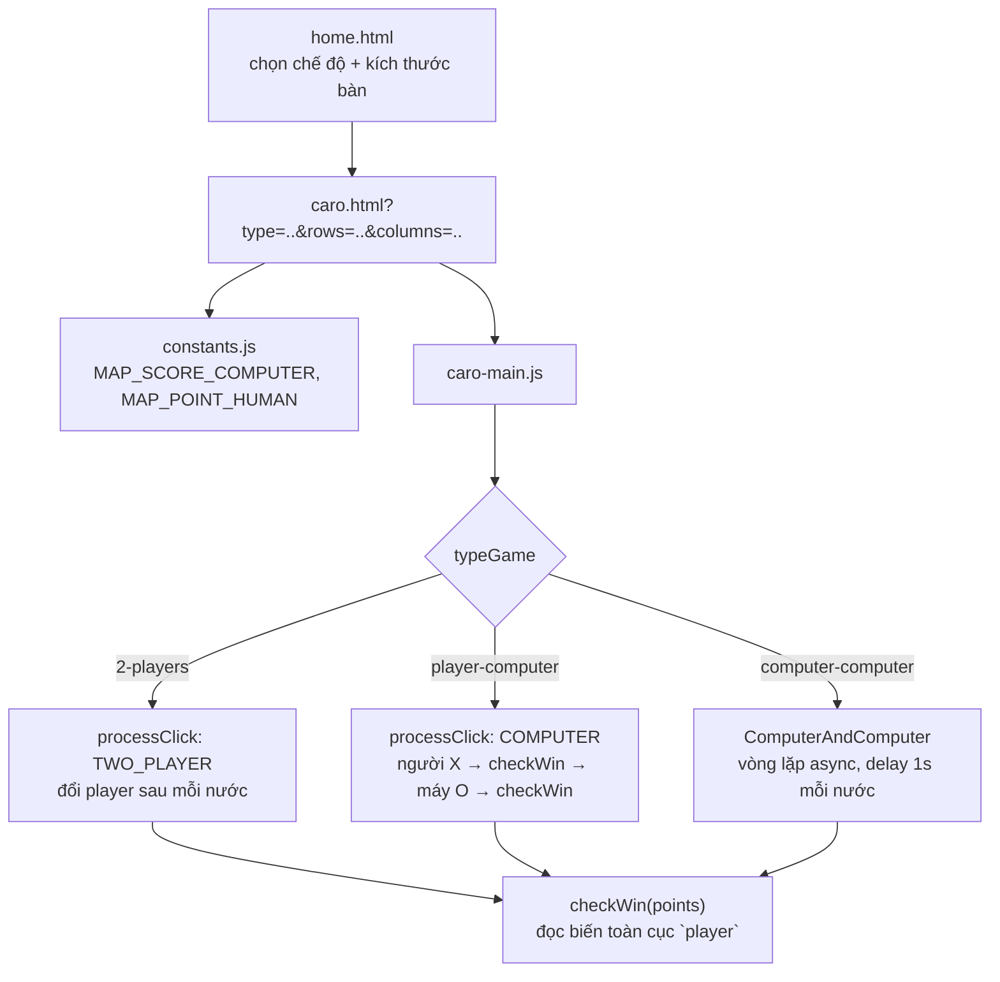

# Caro: một hàm kiểm tra thắng cuộc không hỏi "quân của ai", chỉ tin vào một biến toàn cục

## 1. Mở đầu

`checkWin(points)` nhận vào đúng một tham số: toạ độ nước đi vừa đánh. Nó không nhận thêm tham số nào cho biết "kiểm tra thắng cho quân X hay quân O" — thay vào đó, nó âm thầm đọc một biến toàn cục tên `player` để biết phải tìm chuỗi 5 quân liên tiếp của ai. Điều này chạy đúng, ở cả ba chế độ chơi của game (Người-Người, Người-Máy, Máy-Máy) — nhưng chỉ đúng vì đúng lúc gọi `checkWin`, `player` luôn được sắp xếp thủ công để trỏ về đúng quân vừa đánh, lặp lại chính xác ba lần ở ba đoạn code khác nhau, không có gì ràng buộc hay báo lỗi nếu một trong ba lần đó vô tình bị sắp xếp sai thứ tự.

## 2. Bối cảnh

Caro (Gomoku/cờ ca-rô 5 quân) là game cờ bàn thứ hai trong repo có AI thực sự (sau Oẳn Tù Tì), nhưng theo một hướng tiếp cận hoàn toàn khác: không học hỏi qua thời gian, không có bộ nhớ giữa các ván — một AI heuristic thuần tuý, chấm điểm từng ô trống bằng "chuỗi dài nhất máy tạo được nếu đánh vào đây" cộng "chuỗi dài nhất người chơi đang có mà nước này chặn được", không có tìm kiếm sâu (minimax) hay nhìn trước nhiều nước. Điểm đặc biệt của game này so với phần còn lại của repo: nó có tới ba chế độ chơi hoàn toàn khác nhau dùng chung một bộ hàm cốt lõi (`checkWin`, `checkDraw`, `getPointsComputer`) — và chính việc dùng chung đó là nơi phát sinh sự phụ thuộc ngầm vào biến toàn cục `player`.

## 3. Mục tiêu sản phẩm

**Đã làm (theo README):**
- Ba chế độ: 2 người cùng máy, người chơi (luôn X) đấu máy, hoặc máy tự đấu máy (mỗi nước cách nhau 1 giây, nước đầu tiên luôn ép vào giữa bàn).
- Bàn cờ cấu hình được từ 10×10 tới 60×60, kích thước ô tự co giãn theo kích thước bàn.
- Phát hiện thắng theo 4 hướng (ngang, dọc, hai chéo) từ nước đi vừa đánh, tô sáng toàn bộ chuỗi 5 quân thắng cuộc.
- Phát hiện hoà khi bàn cờ đầy mà không ai thắng.
- AI heuristic: chấm điểm mỗi ô trống bằng tổng của "phần thưởng cho chuỗi máy sẽ tạo" và "phần thưởng cho chuỗi người chơi sẽ bị chặn", tra theo bảng điểm cố định, chọn ngẫu nhiên trong số các ô đồng điểm cao nhất.

**Sẽ KHÔNG làm:**
- Không có minimax hay tìm kiếm nhiều nước — AI chỉ nhìn đúng một nước duy nhất mỗi lượt, không dự đoán phản ứng của đối thủ ở các nước tiếp theo.
- Không giới hạn kích thước bàn theo hiệu năng máy — bàn 60×60 vẫn quét toàn bộ ô trống mỗi lượt AI di chuyển, không có tối ưu vùng tìm kiếm.

MVP: đặt X/O luân phiên trên bàn cờ lớn, ai nối được 5 quân liên tiếp theo bất kỳ hướng nào thắng, có thể chơi với người, với máy, hoặc xem máy tự đấu máy.

## 4. Thiết kế hệ thống



Phần lõi kỹ thuật đáng chú ý nhất là cách AI chấm điểm một ô trống, kết hợp hai bảng tra cứu độc lập:

```javascript
let computerRun = Math.max(getHorizontal(i, j, O), getVertical(i, j, O), getRightDiagonal(i, j, O), getLeftDiagonal(i, j, O));
let humanRun = Math.max(getHorizontal(i, j, X), getVertical(i, j, X), getRightDiagonal(i, j, X), getLeftDiagonal(i, j, X));
let score = MAP_SCORE_COMPUTER.get(Math.min(6, computerRun)) + MAP_POINT_HUMAN.get(Math.min(5, humanRun - 1));
```

Cả `getHorizontal`/`getVertical`/... đều đếm chuỗi bắt đầu từ `count = 1` — tức luôn giả định ô `(i, j)` đang xét *đã* là quân của `player` truyền vào, dù ô đó thực tế đang trống, rồi đếm tiếp ra hai phía. Với `computerRun`, con số này được dùng thẳng (chuỗi máy sẽ có *sau khi* đánh) — còn với `humanRun`, nó bị trừ đi 1 (`humanRun - 1`) trước khi tra bảng, vì mục đích ở đây khác: không phải "chuỗi người chơi sẽ có" (vô nghĩa, vì đây là nước đi của máy) mà là "chuỗi người chơi *đang có sẵn*, không tính ô giả định vừa lấp". Hai công thức trông giống nhau nhưng mang ý nghĩa ngược chiều nhau — tấn công nhìn về tương lai, phòng thủ nhìn về hiện tại — dùng đúng một cặp hàm đếm chuỗi cho cả hai.

## 5. Tech Stack

| Công nghệ | Vì sao chọn |
| --- | --- |
| **AI heuristic một nước, không minimax** | Với bàn cờ có thể lớn tới 60×60 (3600 ô), một minimax dù chỉ vài tầng sâu cũng tốn kém đáng kể — heuristic một nước (quét toàn bộ ô trống, chấm điểm bằng công thức cố định) đủ tạo cảm giác "máy biết tấn công và biết chặn" mà chi phí tính toán chỉ tuyến tính theo số ô trống. |
| **Bảng tra cứu (`Map`) cho điểm số thay vì công thức toán học** | Ánh xạ trực tiếp "độ dài chuỗi → điểm" cho phép tinh chỉnh độ ưu tiên tương đối (ví dụ chuỗi 4 quân nguy hiểm hơn nhiều so với chuỗi 3, không theo tỉ lệ tuyến tính) bằng cách sửa một con số trong bảng, không cần nghĩ lại công thức. |
| **`async`/`await` với `delay()` cho chế độ máy tự đấu máy** | Mỗi nước cách nhau đúng 1 giây để người xem theo dõi được diễn biến ván đấu — một vòng lặp `for` với `await delay(1000)` đơn giản hơn nhiều so với dùng `setInterval` kèm quản lý trạng thái dừng/tiếp tục thủ công. |

## 6. Quá trình phát triển

*(Suy luận từ cấu trúc code và README hiện có.)*

### Giai đoạn 1 — Bàn cờ, đặt quân luân phiên, phát hiện 5 quân liên tiếp

`getHorizontal`/`getVertical`/`getRightDiagonal`/`getLeftDiagonal` — bốn hàm gần như song song nhau, mỗi hàm đếm chuỗi cùng màu theo đúng một trục, quét hai phía từ điểm vừa đánh.

### Giai đoạn 2 — Chế độ Người vs Máy: AI heuristic

Thêm `getPointsComputer` — tái sử dụng nguyên xi bốn hàm đếm chuỗi đã có ở Giai đoạn 1, chỉ đổi cách dùng: thay vì kiểm tra "đã thắng chưa" tại một điểm cụ thể, dùng chúng để "thử" từng ô trống một, xem nếu đặt quân vào đó thì chuỗi dài bao nhiêu.

### Giai đoạn 3 — Chế độ Máy vs Máy

`ComputerAndComputer` — vòng lặp bất đồng bộ gọi lại đúng `getPointsComputer` hai lần mỗi vòng (một lần cho mỗi bên), đổi tham số `player` (X hoặc O) truyền vào các hàm đếm chuỗi ở mỗi lượt — nước đầu tiên bị ép cứng vào giữa bàn (`isFirst`) vì với một bàn cờ hoàn toàn trống, mọi ô đều chấm điểm bằng nhau, để AI "tự chọn" chỉ tốn công tính toán mà không có ý nghĩa gì hơn so với việc bắt đầu ở trung tâm — vị trí chiến lược hợp lý nhất một cách hiển nhiên trên một bàn cờ trống.

## 7. Những bug đáng nhớ

### `checkWin` không hỏi "quân của ai" — nó tin vào đúng thời điểm nó được gọi

**Phát hiện khi lần theo cách biến toàn cục `player` được đọc và ghi ở cả ba chế độ chơi:**

```javascript
function checkWin(points) {
  return (
    getHorizontal(Number(points[0]), Number(points[1]), player) >= 5 ||   // đọc `player` toàn cục
    getVertical(Number(points[0]), Number(points[1]), player) >= 5 ||
    getRightDiagonal(Number(points[0]), Number(points[1]), player) >= 5 ||
    getLeftDiagonal(Number(points[0]), Number(points[1]), player) >= 5
  );
}
```

`checkWin` không nhận tham số nào cho biết đang kiểm tra thắng cuộc cho quân nào — nó dựa hoàn toàn vào giá trị hiện tại của biến toàn cục `player`. Điều này *chạy đúng* trong cả ba chế độ, nhưng chỉ vì mỗi chế độ đều tự tay sắp xếp đúng thứ tự gán `player` trước khi gọi `checkWin`:

- **Chế độ 2 người:** `markCell(..., player)` đặt quân bằng đúng `player` hiện tại, `checkWin(points)` được gọi *trước khi* `player = player === X ? O : X;` đổi lượt — nên `player` vẫn đúng là người vừa đánh.
- **Chế độ Người vs Máy:** người luôn là X, `markCell(..., X)` rồi `checkWin(points)` — đúng vì `player` được đảm bảo quay lại giá trị `X` ở cuối lượt trước đó (`player = X;` cuối khối `case COMPUTER`). Sau đó `player = O;` rồi `markCell(..., O)` rồi `checkWin(pointsComputer)` — đúng vì `player` vừa được gán `O` ngay trước đó.
- **Chế độ Máy vs Máy:** y hệt logic trên, lặp lại trong `ComputerAndComputer` — `markCell(..., X)` rồi `checkWin` (đúng vì `player` khởi đầu vòng lặp/mặc định là `X`), rồi `player = O;` rồi `markCell(..., O)` rồi `checkWin` (đúng vì vừa gán).

**Rủi ro thực sự nằm ở đâu:** Cả ba đoạn code trên đều đúng — nhưng đúng nhờ *kỷ luật thủ công*, không nhờ bất kỳ ràng buộc cấu trúc nào ngăn chặn sai sót. Nếu một người (kể cả chính tác giả, ở một lần sửa code sau này) đảo thứ tự hai dòng bất kỳ trong số này — ví dụ chuyển `player = O;` lên *trước* dòng `if (checkWin(points))` kiểm tra nước đi của người chơi X, với lý do tưởng như vô hại "gộp các bước đổi lượt lại cho gọn" — `checkWin` sẽ âm thầm kiểm tra xem "O" có tạo được chuỗi 5 quân tại toạ độ đó không, trong khi ô đó thực tế vừa được đánh dấu là X. Không có gì trong hệ thống kiểu dữ liệu hay logic khác báo hiệu sai sót này — kết quả chỉ đơn giản là một chiến thắng thực sự bị bỏ lỡ (hoặc một chiến thắng giả bị báo nhầm, tuỳ tình huống cụ thể), không có exception, không có gì bất thường trong console.

**Vì sao đây không phải bug ở bản hiện tại:** Đã kiểm chứng cả ba đường thực thi, thứ tự gán và gọi hàm đều đúng ở thời điểm viết bài này. Đây là một "bug tiềm ẩn về mặt cấu trúc" (structural fragility) chứ không phải một bug đang thực sự xảy ra — nhưng nó đủ thực để đáng được ghi nhận, vì nó không đòi hỏi một logic mới sai để kích hoạt, chỉ cần đảo thứ tự hai dòng đã có sẵn.

**Điều rút ra:** Một hàm kiểm tra phụ thuộc vào trạng thái toàn cục thay vì nhận tham số tường minh luôn mang theo một hợp đồng ngầm ("hãy chắc chắn gọi tôi đúng lúc") không được compiler hay bất kỳ cơ chế nào enforce — hợp đồng đó chỉ được duy trì bằng sự cẩn thận lặp lại thủ công ở mọi nơi gọi tới nó. Với một hàm được gọi từ ba đoạn code độc lập như `checkWin` ở đây, rủi ro không nằm ở việc viết sai từ đầu, mà nằm ở việc *sửa* một trong ba đoạn đó sau này mà không nhớ ra rằng cả ba đều đang âm thầm dựa vào cùng một quy ước thứ tự.

## 8. Những quyết định sai

**`getPointsComputer` được gọi vô điều kiện ngay cả khi nước đi sắp bị ghi đè bởi luật "nước đầu ép vào giữa bàn"** trong `ComputerAndComputer` — trên một bàn cờ hoàn toàn trống (lượt đầu tiên của chế độ Máy vs Máy), hàm này vẫn quét toàn bộ ô trống (có thể tới 3600 ô trên bàn 60×60), gọi 8 hàm đếm chuỗi cho mỗi ô, trước khi kết quả bị vứt bỏ hoàn toàn và thay bằng toạ độ trung tâm cố định. Không gây lỗi, chỉ là một lần tính toán lãng phí hoàn toàn ở đúng nước đi đầu tiên của mỗi ván.

**Ngưỡng "thắng ngay" trong bảng điểm AI không nhất quán giữa tấn công và phòng thủ:** `MAP_SCORE_COMPUTER` chỉ gán `Infinity` cho chuỗi đạt độ dài 6 (`Math.min(6, computerRun)`), trong khi luật thắng thực tế chỉ cần chuỗi 5 (`checkWin` dùng `>= 5`). Một nước đi tạo chuỗi đúng 5 quân (đã là thắng ngay theo luật) chỉ nhận điểm `99999` (rất cao nhưng hữu hạn), không phải `Infinity`. Trên thực tế điều này chưa từng gây hậu quả quan sát được — vì tổng điểm tối đa có thể đạt được từ mọi tổ hợp khác (điểm tấn công không-thắng cộng điểm phòng thủ tối đa) chưa bao giờ vượt qua `99999` với các con số hiện tại trong bảng — nhưng đây vẫn là một sự bất nhất quán ngữ nghĩa giữa "ngưỡng được coi là thắng tuyệt đối" ở luật chơi và ở bảng điểm AI, chỉ tình cờ không gây sai lệch hành vi nhờ khoảng cách đủ lớn giữa các con số.

## 9. Những điều học được

- **Một hàm đọc trạng thái toàn cục thay vì nhận tham số tường minh có thể chạy đúng tuyệt đối trong hiện tại, nhưng gánh theo rủi ro dài hạn tỉ lệ thuận với số nơi gọi tới nó** — càng nhiều đường thực thi độc lập cùng phải "nhớ" sắp xếp đúng thứ tự trước khi gọi, càng dễ có một đường trong số đó bị phá vỡ khi sửa code sau này mà không nhận ra sự phụ thuộc ngầm.
- **"Đã kiểm chứng đúng ở hiện tại" và "được cấu trúc để luôn đúng" là hai mức độ tin cậy khác nhau** — mức đầu chỉ cần đọc kỹ code một lần, mức sau cần thiết kế lại để loại bỏ khả năng sai ngay từ gốc (ví dụ truyền tham số tường minh thay vì đọc biến toàn cục).
- **Một sự bất nhất quán về ngưỡng số (ở đây là "thắng ở độ dài 5" trong luật chơi nhưng "vô cực ở độ dài 6" trong bảng điểm AI) có thể vô hại trong thực tế nhờ khoảng cách giữa các con số cụ thể** — nhưng "vô hại nhờ may mắn về khoảng cách số" khác với "được thiết kế để luôn nhất quán", và chỉ phát hiện được sự khác biệt đó bằng cách đọc kỹ cả hai ngưỡng cạnh nhau.

## 10. Kết quả

| Hạng mục | Con số |
| --- | --- |
| Tổng số dòng code (JS + CSS + HTML) | 1.373 dòng |
| `css/caro.css` | 568 dòng |
| `js/caro-main.js` | 519 dòng |
| `js/caro-home.js` | 99 dòng |
| `js/utils.js` | 40 dòng |
| `js/constants.js` | 24 dòng |
| Số chế độ chơi | 3 (2 người, đấu máy, máy đấu máy) |
| Kích thước bàn cờ hỗ trợ | 10×10 đến 60×60 |
| Độ sâu tìm kiếm của AI | 1 nước (không minimax) |
| Test tự động | 0 |
| CI/CD | Không có |

## 11. Nếu làm lại từ đầu

- **Đổi `checkWin(points)` thành `checkWin(points, mark)`**, nhận tường minh quân cần kiểm tra thay vì đọc biến toàn cục `player` — loại bỏ hoàn toàn sự phụ thuộc ngầm đã phân tích ở Bug, khiến cả ba đường thực thi (2 người, đấu máy, máy đấu máy) không còn cần "nhớ" sắp xếp đúng thứ tự gán `player` trước khi gọi.
- **Đồng bộ ngưỡng `Infinity` trong `MAP_SCORE_COMPUTER` về đúng độ dài 5**, khớp với ngưỡng thắng thật của `checkWin`, thay vì để nó ở độ dài 6 và chỉ "an toàn nhờ khoảng cách số" như hiện tại.
- **Bỏ qua lời gọi `getPointsComputer()` khi biết trước kết quả sẽ bị ghi đè** (nước đầu tiên ép vào giữa bàn) — kiểm tra `isFirst` trước khi gọi hàm, không phải sau, để tránh lãng phí tính toán trên bàn cờ lớn.

## 12. Kết

Caro là game duy nhất trong repo có ba chế độ chơi hoàn toàn khác nhau dùng chung một lõi logic — một thử thách kiến trúc thực sự, và phần lớn được xử lý gọn gàng (bốn hàm đếm chuỗi tái sử dụng triệt để cho cả kiểm tra thắng lẫn chấm điểm AI). Điều đáng nhớ nhất tìm được không phải một phép tính sai, mà là một hợp đồng ngầm giữa ba đoạn code độc lập — mỗi đoạn tự mình sắp xếp đúng thứ tự để một hàm dùng chung đọc đúng biến toàn cục nó cần. Hợp đồng đó chưa từng bị phá vỡ, nhưng cũng chưa từng được ai viết ra thành lời, và đó chính xác là loại rủi ro dễ bị bỏ sót nhất khi quay lại sửa một đoạn code "đã chạy đúng từ trước tới giờ".
