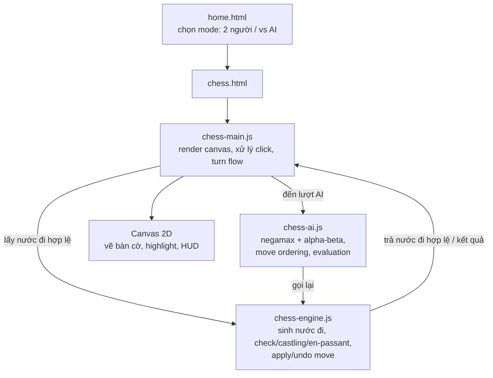
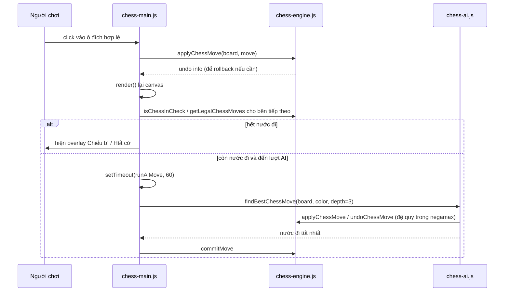

# Hành trình tự viết một AI Cờ Vua bằng JavaScript thuần, không thư viện, không thương tiếc

## 1. Mở đầu

Có một buổi tối mình ngồi test lại con AI cờ vua vừa viết xong, tự tin đến mức đã nghĩ sẵn caption khoe trên Facebook. Ván đầu tiên, mình chơi trắng, đẩy tốt e4 như một quý ông. AI đi e5. Mình phát triển mã, nó phát triển tượng. Đến nước thứ 8, mình nhập thành (castling) bên cánh vua — và con vua của mình lập tức "dịch chuyển" thẳng qua một ô đang bị chiếu, như thể vừa học được phép thuật Nhảy Độn Thổ trong Harry Potter.

Tất nhiên đó là bug. Nhưng khoảnh khắc đứng hình nhìn con vua đi xuyên qua một ô bị tấn công đó lại là lúc mình nhận ra: viết một bàn cờ nhìn cho đẹp thì dễ, còn viết đúng luật chơi cờ vua — thứ mà con người đã mất hàng trăm năm để chuẩn hoá — mới là bài toán thật sự.

Bài này là câu chuyện mình tự tay viết một engine cờ vua đầy đủ luật, có AI chơi được, bằng JavaScript thuần, không dùng `chess.js`, không dùng `stockfish.js`, không framework, không build tool. Chỉ có canvas, một cái `<script>` tag, và rất nhiều lần `console.log(board)` để soi xem tại sao con mã của mình vừa nhảy được vào... chính ô nó đang đứng.

## 2. Bối cảnh

Cái repo `game-development` này của mình vốn là một bộ sưu tập game nhỏ — Caro, Flappy Bird, Rắn săn mồi, Pikachu, Tank 1990... mỗi game một buổi tối rảnh rỗi. Phần lớn trong số đó không có "đối thủ" thông minh: Caro thì AI chấm điểm theo bảng heuristic đơn giản, Tank 1990 thì địch chỉ đi ngẫu nhiên. Vui, nhưng không có gì để mình "khoe" về mặt kỹ thuật.

Mình muốn có ít nhất một game trong bộ sưu tập mà AI thật sự phải *suy nghĩ* — tức là phải duyệt cây nước đi, đánh giá thế cờ, và ra quyết định thay vì random hay lookup bảng. Cờ vua là lựa chọn hiển nhiên: luật chơi rõ ràng, có sẵn hàng núi tài liệu về minimax/alpha-beta, và quan trọng nhất — ai cũng biết chơi cờ vua nên bài toán không cần giải thích thêm.

Có một lựa chọn "dễ" hơn nhiều: nhúng `chess.js` để lo phần luật, rồi chỉ viết AI lên trên. Rất nhiều tutorial làm vậy. Nhưng nếu làm thế thì phần khó nhất — sinh nước đi hợp lệ, lọc nước đi khiến vua bị chiếu, xử lý nhập thành/bắt tốt qua đường/phong hậu — mình sẽ chẳng bao giờ thật sự hiểu. Đây là side-project để học, không phải để ship nhanh cho khách hàng, nên mình chọn đường khó: tự viết hết, từ bàn cờ rỗng.

## 3. Mục tiêu sản phẩm

Mình chốt scope trước khi code, vì kinh nghiệm cho thấy cờ vua là cái hố không đáy nếu không tự giới hạn mình.

**Sẽ làm:**
- Sinh nước đi hợp lệ đầy đủ cho cả 6 loại quân.
- Nhập thành (kingside/queenside), bắt tốt qua đường (en passant), phong hậu (promotion).
- Phát hiện chiếu, chiếu bí (checkmate), hết cờ (stalemate).
- Một AI chơi được — không cần đánh bại Magnus Carlsen, chỉ cần đủ để không nhường bừa quân.
- Giao diện canvas, click-to-move, không cần kéo-thả.
- Chạy hoàn toàn phía client, không server, không build step — giống mọi game khác trong repo.

**Sẽ KHÔNG làm** (và đây là phần quan trọng hơn):
- Không luật hoà theo lặp lại 3 lần (threefold repetition) hay luật 50 nước không ăn quân/không đi tốt.
- Không có nhiều mức độ khó (difficulty level) — AI chỉ có một độ sâu tìm kiếm duy nhất.
- Không lưu lịch sử ván đấu dạng PGN, không undo move.
- Không opening book, không endgame tablebase.
- Không multiplayer online.

MVP của mình đơn giản là: hai người chơi được một ván cờ đúng luật trên cùng một máy, hoặc một người chơi được với máy mà máy không đi bậy. Mọi thứ "hay ho" hơn (độ khó, PGN, online) đều là backlog không bao giờ mình động tới — và thật ra đến giờ vẫn vậy.

## 4. Thiết kế hệ thống

Kiến trúc của game này cố tình rất "boring": không có state management library, không có framework, chỉ có 4 file JS tách theo trách nhiệm rõ ràng.



Điểm mình cân nhắc kỹ nhất là ranh giới giữa `chess-engine.js` và `chess-ai.js`. Ban đầu mình định gộp chung — dù sao AI cũng cần gọi hàm sinh nước đi của engine. Nhưng tách riêng hoá ra đúng: engine là "luật chơi", không quan tâm ai đang chơi hay chơi như thế nào; AI là "chiến thuật", chỉ là một người dùng của engine giống hệt như `chess-main.js` (giao diện cho người) vậy. Nhờ tách bạch này, viết xong Xiangqi (cờ tướng) sau đó mình tái dùng được đúng cái tư duy kiến trúc này, dù luật cờ tướng khác hoàn toàn.

Về flow xử lý một nước đi:



Trade-off lớn nhất ở đây: AI chạy đồng bộ (synchronous), ngay trên main thread của trình duyệt, không dùng Web Worker. Với độ sâu 3 ply trên bàn cờ 8x8, số lượng nước đi cần duyệt đủ nhỏ để không làm treo UI quá lâu, nhưng đây là quyết định có ý thức đánh đổi sự đơn giản lấy hiệu năng — nếu sau này muốn tăng độ sâu lên 4-5 ply, kiến trúc này sẽ phải đổi.

## 5. Tech Stack

Không có gì to tát, nhưng mỗi lựa chọn đều có lý do:

| Công nghệ | Vì sao chọn |
| --- | --- |
| **JavaScript thuần (vanilla)** | Cả repo không có React/Vue nào cả. Một bàn cờ 8x8 không cần virtual DOM diffing — vẽ lại toàn bộ canvas mỗi lần còn rẻ hơn cả việc setup một component framework. |
| **Canvas 2D thay vì lưới `<div>`** | Với 64 ô cộng thêm lớp highlight (nước đi hợp lệ, ô vừa đi, vua đang bị chiếu), dùng DOM nghĩa là quản lý state của 64+ element cùng class toggle liên tục. Canvas cho mình một vòng lặp `render()` duy nhất, vẽ lại từ đầu mỗi frame — đơn giản hơn để suy luận, dù phải tự tính toạ độ pixel bằng tay. |
| **Không dùng `chess.js`** | Lý do đã nói ở phần Bối cảnh — mục tiêu là học, không phải ship nhanh. |
| **Không build tool (không Webpack/Vite)** | Game này chỉ là một trong 13 game tĩnh trong repo, tất cả đều load thẳng file `.js` qua `<script>` tag. Thêm build step cho riêng một game sẽ phá vỡ sự nhất quán của cả repo. |
| **Negamax thay vì Minimax "kinh điển"** | Negamax là một cách viết minimax gọn hơn cho trò chơi zero-sum, đối xứng lượt (mỗi bên tối đa hoá điểm số theo góc nhìn của chính mình, rồi đảo dấu khi truyền qua đối thủ). Ít code hơn, ít nhánh `if (maximizing)` hơn — đổi lại là dễ sai dấu hơn nếu không cẩn thận (mình sẽ kể ở phần bug). |
| **GitHub Pages** | Cả repo deploy tĩnh lên GitHub Pages, miễn phí, không cần server, khớp với việc đây là project cá nhân không có ngân sách hạ tầng. |

Không có PostgreSQL, không có Kafka, không có MinIO trong bài này — đây là một trang tĩnh chạy hoàn toàn trong trình duyệt của bạn. Đôi khi cái hay nhất của một side-project là *không* cần nghĩ đến hạ tầng.

## 6. Quá trình phát triển

Mình chia việc build thành 7 giai đoạn nhỏ, mỗi giai đoạn chỉ chạy được khi giai đoạn trước đã "chơi được" (playable), dù còn thô.

### Giai đoạn 1 — Bàn cờ tĩnh và click detection

Mục tiêu: vẽ 64 ô, đặt quân đúng vị trí ban đầu, click vào một ô thì biết được toạ độ hàng/cột.

Khó khăn duy nhất ở đây thuần tuý là toán: canvas dùng toạ độ pixel, bàn cờ dùng toạ độ hàng/cột, và hướng hiển thị của quân trắng/đen phải lật ngược nhau tuỳ theo ai đang "ở dưới". Bài học: viết một hàm `inChessBoard(r, c)` kiểm tra biên ngay từ đầu, đừng đợi đến khi debug index âm mới thêm — mình đã đợi, và đã phải trả giá ở Giai đoạn 3.

### Giai đoạn 2 — Sinh nước đi "ngây thơ" (pseudo-legal)

Đây là lúc `pseudoMovesForChessPiece` ra đời — sinh nước đi cho từng loại quân mà *chưa* quan tâm nước đi đó có khiến vua mình bị chiếu hay không. Tốt đi thẳng, mã nhảy chữ L, xe/tượng/hậu trượt theo đường thẳng cho đến khi gặp vật cản.

Quyết định đáng nhớ nhất ở giai đoạn này: xe, tượng, hậu dùng chung một vòng lặp trượt theo hướng (`dirs`), chỉ khác nhau tập hợp hướng truyền vào — hậu là hợp của xe và tượng. Nhỏ, nhưng nó khiến code từ "9 hàm gần giống nhau" co lại còn một hàm dùng chung, và về sau khi mình debug bug tượng-đi-xuyên-tường, mình chỉ cần sửa một chỗ cho cả 3 loại quân.

### Giai đoạn 3 — Lọc nước đi hợp lệ (check filtering)

Đây là giai đoạn khó nhất, và cũng là giai đoạn dạy mình nhiều nhất. Ý tưởng nghe đơn giản: một nước đi chỉ hợp lệ nếu sau khi đi xong, vua của chính mình không bị chiếu. Cách cài đặt "thật thà" nhất — và cũng là cách mình chọn — là: với mỗi nước đi giả định, áp dụng nó lên bàn cờ, kiểm tra xem vua mình có bị tấn công không, rồi hoàn tác:

```javascript
function getLegalChessMoves(board, color, enPassantTarget) {
    const pseudo = allChessPseudoMoves(board, color, enPassantTarget);
    const legal = [];
    pseudo.forEach((move) => {
        const undo = applyChessMove(board, move);
        if (!isChessInCheck(board, color)) legal.push(move);
        undoChessMove(board, undo);
    });
    return legal;
}
```

Đơn giản, dễ chứng minh đúng — nhưng chậm về mặt lý thuyết: với mỗi nước đi giả định, mình phải quét lại *toàn bộ* bàn cờ để xem có quân địch nào tấn công ô vua không (`isChessSquareAttacked` lặp qua cả 64 ô). Với một GUI chơi từng nước một, tốc độ này vô hại. Nhưng nó chính là cái sẽ "cắn" mình ở Giai đoạn 6 khi AI cần gọi hàm này hàng nghìn lần trong một lần tìm kiếm.

Bài học ở giai đoạn này, mình note lại nguyên văn trong đầu lúc đó: "đừng tối ưu cái mình chưa đo được là chậm". Lúc viết `getLegalChessMoves` theo kiểu simulate/undo, mình biết thừa nó không phải cách nhanh nhất (dân chuyên nghiệp dùng bitboard và pin-detection để biết ngay quân nào không được nhấc lên mà không cần simulate). Nhưng mình cố tình không tối ưu sớm — viết bản đúng trước, đo xem có chậm thật không, rồi mới quyết định có đáng để phức tạp hoá không.

### Giai đoạn 4 — Nhập thành, bắt tốt qua đường, phong hậu

Ba luật "đặc biệt" của cờ vua, và cũng là ba nguồn bug nhiều nhất (phần 7 sẽ kể chi tiết). Ở giai đoạn thiết kế, quyết định quan trọng là: theo dõi `hasMoved` trên từng quân (vua, xe) thay vì theo dõi "quyền nhập thành" như một biến rời rạc riêng. Cách này tự nhiên hơn về mặt dữ liệu — quyền nhập thành *là hệ quả* của việc quân đã di chuyển hay chưa, không phải một state độc lập cần đồng bộ tay.

En passant thì ngược lại — mình phải thêm một biến rời: `enPassantTarget`, ô mà tốt vừa đi 2 bước có thể bị bắt qua đường ở nước tiếp theo *duy nhất*. Đây là luật duy nhất trong cờ vua có "thời hạn" — chỉ tồn tại đúng 1 nước đi rồi biến mất — nên nó không thể suy ra từ trạng thái bàn cờ hiện tại, phải truyền tường minh qua từng lượt.

### Giai đoạn 5 — Chiếu bí và hết cờ

Về bản chất đơn giản: bên nào đến lượt mà không còn nước đi hợp lệ nào (`getLegalChessMoves(...).length === 0`) thì hết ván. Nếu đang bị chiếu → chiếu bí, đối phương thắng. Nếu không bị chiếu → hết cờ, hoà. Nhờ Giai đoạn 3 đã làm đúng phần lọc nước đi hợp lệ, giai đoạn này gần như miễn phí — chỉ là gọi lại đúng hàm đã có.

### Giai đoạn 6 — AI: Minimax rồi Negamax + Alpha-Beta

Bản đầu tiên mình viết là minimax "sách giáo khoa" — một nhánh `if (maximizingPlayer)`, một nhánh else, đánh giá điểm số theo góc nhìn tuyệt đối (dương là lợi cho trắng, âm là lợi cho đen). Chạy được, nhưng code có cảm giác trùng lặp — hai nhánh gần như soi gương nhau, chỉ khác dấu so sánh.

Chuyển sang negamax giúp gộp hai nhánh đó thành một, với quy ước: điểm số luôn được tính theo góc nhìn của *bên đang đi*, và khi truyền xuống đệ quy cho đối thủ thì đảo dấu:

```javascript
function negamaxChess(board, depth, alpha, beta, color, enPassantTarget) {
    const legalMoves = getLegalChessMoves(board, color, enPassantTarget);
    if (legalMoves.length === 0) {
        if (isChessInCheck(board, color)) return -100000 - depth;
        return 0;
    }
    if (depth === 0) {
        const score = evaluateChessBoard(board);
        return color === WHITE ? score : -score;
    }

    const ordered = orderChessMoves(board, legalMoves);
    let best = -Infinity;
    for (const move of ordered) {
        const undo = applyChessMove(board, move);
        const nextEP = getEnPassantTargetAfterMove(move);
        const score = -negamaxChess(board, depth - 1, -beta, -alpha, opponentColor(color), nextEP);
        undoChessMove(board, undo);
        if (score > best) best = score;
        if (best > alpha) alpha = best;
        if (alpha >= beta) break;
    }
    return best;
}
```

Chú ý dòng `-negamaxChess(...)`: đây chính là "phép màu" của negamax — và cũng chính là nơi mình tự bắn vào chân mình đầu tiên (kể ở phần 7).

Về evaluation, mình cố tình giữ đơn giản: giá trị quân cờ theo thang điểm cổ điển (tốt 100, mã/tượng ~320-330, xe 500, hậu 900, vua 20000 — một con số "vô hạn thực tế" để vua luôn quan trọng nhất), cộng thêm bonus kiểm soát trung tâm (ô càng gần giữa bàn cờ càng được cộng điểm) và bonus tốt càng tiến gần hàng phong cấp càng được thưởng điểm:

```javascript
function evaluateChessBoard(board) {
    let score = 0;
    for (let r = 0; r < CHESS_SIZE; r++) {
        for (let c = 0; c < CHESS_SIZE; c++) {
            const piece = board[r][c];
            if (!piece) continue;
            let value = CHESS_PIECE_VALUES[piece.type];
            if (piece.type !== "king") value += CHESS_CENTER_BONUS[r][c] * 3;
            if (piece.type === "pawn") {
                const advance = piece.color === WHITE ? 6 - r : r - 1;
                value += Math.max(0, advance) * 4;
            }
            score += piece.color === WHITE ? value : -value;
        }
    }
    return score;
}
```

Không có bonus an toàn vua (king safety), không có cấu trúc tốt (pawn structure), không có bảng vị trí riêng cho từng loại quân (piece-square table) như các engine thật. Cố tình đơn giản — mục tiêu là một đối thủ chơi "hợp lý", không phải một engine thi đấu giải.

Cuối cùng là move ordering — sắp xếp nước đi thử trước theo giá trị quân bị ăn, giảm dần:

```javascript
function orderChessMoves(board, moves) {
    return moves.slice().sort((a, b) => {
        const aCap = board[a.toR][a.toC] ? CHESS_PIECE_VALUES[board[a.toR][a.toC].type] : 0;
        const bCap = board[b.toR][b.toC] ? CHESS_PIECE_VALUES[board[b.toR][b.toC].type] : 0;
        return bCap - aCap;
    });
}
```

Đây là chỗ mình học được một điều khá phản trực giác: alpha-beta pruning không tự động nhanh — nó *chỉ* cắt nhánh hiệu quả nếu bạn duyệt nước đi tốt trước. Thử ăn hậu trước khi thử đi tốt vô nghĩa giúp alpha/beta hội tụ nhanh hơn nhiều, tức là cắt được nhiều nhánh hơn ở cùng độ sâu tìm kiếm. Nói cách khác: thuật toán giống nhau, nhưng thứ tự duyệt khác nhau có thể khiến một cái nhanh gấp nhiều lần cái kia.

### Giai đoạn 7 — Polish: HUD, highlight, overlay, restart

Giai đoạn "nhàm" nhất nhưng chiếm thời gian không ít: tô màu ô vừa đi, tô đỏ ô vua đang bị chiếu, hiện chip "AI đang suy nghĩ...", overlay chiếu bí/hết cờ với nút chơi lại. Không có gì đáng kể ngoại trừ một chi tiết nhỏ mà mình cố tình giữ lại: khi AI thắng ngẫu nhiên nhiều nước đi cùng điểm số tốt nhất, AI chọn ngẫu nhiên một trong số đó thay vì luôn chọn nước đầu tiên tìm được — để mỗi ván đấu với AI không lặp lại y hệt nước đi trước đó từ cùng một thế cờ.

## 7. Những bug đáng nhớ

Đây là phần mình thích viết nhất, vì đọc lại vẫn thấy... đau.

### Bug #1: Vua nhập thành xuyên qua ô đang bị chiếu

**Hiện tượng:** Như đã kể ở phần mở đầu — nhập thành thành công dù có quân địch đang chiếu vào ô vua sẽ đi qua.

**Quá trình debug:** Ban đầu hàm `getCastlingMoves` chỉ kiểm tra "vua chưa từng đi, xe chưa từng đi, các ô giữa trống" — quên mất luật: vua không được nhập thành nếu đang bị chiếu, không được đi qua ô bị tấn công, và không được *đáp xuống* ô bị tấn công. Ba điều kiện, mình chỉ nhớ có một.

**Nguyên nhân:** Đọc luật cờ vua thì dễ, nhưng liệt kê đủ *tất cả* điều kiện của một luật tưởng đơn giản lại dễ sót — nhất là khi luật đó có tới 3 mệnh đề "không được" nằm rải rác trong đầu mình từ hồi... học cấp 2.

**Cách sửa:** Thêm `isChessSquareAttacked` cho chính ô vua đang đứng, và cho từng ô vua sẽ đi qua:

```javascript
if (isChessSquareAttacked(board, row, 4, enemy)) return moves; // đang bị chiếu -> không nhập thành

if (
    kingRook && kingRook.type === "rook" && !kingRook.hasMoved &&
    !board[row][5] && !board[row][6] &&
    !isChessSquareAttacked(board, row, 5, enemy) &&
    !isChessSquareAttacked(board, row, 6, enemy)
) {
    moves.push({ fromR: row, fromC: 4, toR: row, toC: 6, castle: "king" });
}
```

**Điều rút ra:** Với một luật có nhiều mệnh đề, đừng code theo trí nhớ — viết checklist ra giấy (hoặc comment) trước khi code. Một dòng `// TODO: check 3 điều kiện nhập thành` viết trước 5 phút có thể tiết kiệm 30 phút debug sau đó.

### Bug #2: Âm dấu trong negamax khiến AI tự nguyện tự sát

**Hiện tượng:** Sau khi chuyển từ minimax sang negamax, AI đột nhiên chơi cực kỳ tệ — sẵn sàng thí hậu để đổi lấy... một con tốt. Nhìn cứ như AI đang cố thua.

**Quá trình debug:** Mình in ra điểm số (`score`) của từng nước đi ứng viên ở độ sâu 1 để soi. Nước đi ăn hậu địch (đáng ra phải là điểm rất cao) lại nhận điểm *âm*. Ăn được hậu mà bị đánh giá là "tệ" — đây chính là dấu hiệu của lỗi sai dấu trong đệ quy negamax.

**Nguyên nhân:** Ở bản đầu, mình quên đảo dấu khi gọi đệ quy — gọi `negamaxChess(...)` bình thường thay vì `-negamaxChess(...)`. Nghe thì nhỏ, một dấu trừ, nhưng nó phá vỡ toàn bộ tiền đề của negamax: mỗi tầng đệ quy phải đánh giá theo góc nhìn của bên đang đi *ở tầng đó*, và khi truyền điểm số lên tầng cha (là góc nhìn của đối thủ), phải đảo dấu. Thiếu dấu trừ, AI vô tình tối ưu hoá điểm số... cho đối thủ.

**Cách sửa:** Thêm đúng dấu `-` ở dòng gọi đệ quy — đúng một ký tự:

```javascript
const score = -negamaxChess(board, depth - 1, -beta, -alpha, opponentColor(color), nextEP);
```

Chú ý là không chỉ điểm số cần đảo dấu, `alpha` và `beta` khi truyền xuống cũng phải hoán đổi vị trí và đảo dấu (`-beta, -alpha`) — nếu chỉ sửa một trong hai chỗ, bug vẫn còn nhưng biểu hiện tinh vi hơn (AI chơi "hơi" tệ chứ không tệ hẳn, khó phát hiện hơn nhiều).

**Điều rút ra:** Negamax gọn hơn minimax về số dòng code, nhưng "gọn" ở đây đổi bằng việc mọi ngữ nghĩa dấu (+/-) đều dồn vào đúng một dòng code duy nhất. Sai một dấu trừ trong minimax "kinh điển" (hai nhánh riêng biệt) thường chỉ ảnh hưởng một nhánh; sai một dấu trừ trong negamax ảnh hưởng *toàn bộ* cây tìm kiếm, ở mọi độ sâu. Muốn debug loại bug này, cách nhanh nhất không phải là đọc code mà là in điểm số ra và tự hỏi: "nước đi hiển nhiên tốt này có đang được chấm điểm dương không?"

### Bug #3: AI làm treo trình duyệt vài giây ở độ sâu 3

**Hiện tượng:** Test AI ở độ sâu 3 ply, có những thế cờ trung cuộc (nhiều quân, nhiều lựa chọn) khiến tab trình duyệt đơ hẳn 2-3 giây, chip "AI đang suy nghĩ..." thậm chí *không kịp hiện ra* trước khi bị đơ.

**Quá trình debug:** Đầu tiên mình nghi ngờ thuật toán negamax sai — duyệt thừa nhánh nào đó. Nhưng thêm counter đếm số lần gọi `negamaxChess` thì thấy con số hoàn toàn hợp lý cho độ sâu 3 (khoảng vài chục nghìn lệnh gọi, không phải triệu). Vấn đề không nằm ở *số lượng* nước đi cần duyệt, mà ở *chi phí mỗi lần duyệt*: mỗi lần gọi `getLegalChessMoves` bên trong negamax lại phải chạy `isChessSquareAttacked` cho từng nước đi giả định — và hàm này quét lại toàn bộ 64 ô bàn cờ mỗi lần gọi (nhắc lại bài học ở Giai đoạn 3: "chưa đo được là chậm"). Giờ thì mình đã đo được — và nó chậm thật, khi nhân với hàng chục nghìn lệnh gọi trong cây tìm kiếm.

Vấn đề thứ hai, độc lập nhưng cộng dồn: chip "AI đang suy nghĩ..." được set `hidden = false` rồi *ngay lập tức* gọi hàm tìm kiếm đồng bộ — trình duyệt chưa kịp repaint để hiện chip thì main thread đã bị block bởi vòng lặp negamax, nên UI đơ mà không có tín hiệu gì báo người chơi biết máy đang tính toán chứ không phải bị treo thật.

**Nguyên nhân gốc:** JavaScript trên trình duyệt chạy đơn luồng — một hàm đồng bộ chạy lâu sẽ chặn luôn việc render, kể cả render cái thông báo "tôi đang chạy lâu đây".

**Cách sửa:** Với vấn đề UI, giải pháp rẻ nhất (không phải Web Worker, chỉ là nhường lại một tick cho trình duyệt vẽ lại):

```javascript
thinkingChip.hidden = false;
setTimeout(runAiMove, 60);
```

`setTimeout` với delay nhỏ đẩy việc gọi `runAiMove` (chứa lệnh tìm kiếm nặng) ra khỏi lệnh đồng bộ hiện tại, cho trình duyệt một khoảng hở để repaint chip trước khi main thread lại bị chiếm dụng. Đây không phải giải pháp "đúng" về mặt kiến trúc (search vẫn chặn UI trong lúc chạy), nhưng đủ để trải nghiệm không còn cảm giác "app bị đơ vô cớ".

**Điều rút ra:** Với độ sâu tìm kiếm nhỏ (3 ply) trên một bàn cờ 8x8, "đủ nhanh" không có nghĩa là mọi thế cờ đều nhanh như nhau — số lượng nước đi hợp lệ trung bình mỗi lượt trong cờ vua dao động khá lớn tuỳ thế cờ (trung cuộc thường nhiều lựa chọn hơn khai cuộc hay tàn cuộc), nên "test một ván rồi thấy mượt" không đảm bảo mọi ván đều mượt. Bài học thứ hai, có lẽ quan trọng hơn: nếu bạn không có ngân sách để làm đúng (Web Worker, iterative deepening có time budget), ít nhất hãy cho UI một cách để "nói dối" người dùng rằng nó không bị treo.

### Bug #4: Phong hậu — quân tốt "chết" ngay khi vừa lên hậu

**Hiện tượng:** Tốt trắng đi đến hàng cuối, đúng theo luật phải phong thành hậu — nhưng bàn cờ sau đó vẫn còn hiện icon tốt, và nước đi tiếp theo bằng quân đó bị tính sai như thể vẫn là tốt (đi ngang, đi chéo như hậu thật, nhưng tính điểm evaluation theo giá trị 100 của tốt, không phải 900 của hậu).

**Quá trình debug:** Log lại object quân cờ sau khi phong hậu, thấy field `type` vẫn là `"pawn"`. Việc gán `promotion: "queen"` có được tạo ra trong `pseudoMovesForChessPiece` (đúng, tốt ở hàng áp chót di chuyển thẳng lên hàng cuối có gắn `{ promotion: "queen" }`), nhưng `applyChessMove` ban đầu chỉ copy nguyên `piece` sang ô đích, không đọc field `promotion` của `move` để đổi `type`.

**Nguyên nhân:** Tách rời hai khái niệm "nước đi có thông tin phong cấp" và "quân cờ sau khi đi phải đổi loại" — mình sinh nước đi đúng nhưng quên nối logic ở bước *thực thi* nước đi.

**Cách sửa:** Thêm đúng một dòng trong `applyChessMove`:

```javascript
const movedPiece = { ...piece, hasMoved: true };
if (move.promotion) movedPiece.type = move.promotion;
board[move.toR][move.toC] = movedPiece;
```

**Điều rút ra:** Khi một hành động có 2 giai đoạn (sinh ra một *đề xuất* nước đi, rồi *thực thi* nó), rất dễ implement đúng giai đoạn đầu và quên giai đoạn sau — vì giai đoạn đầu thường được test kỹ hơn (hiện highlight nước đi hợp lệ ngay), còn giai đoạn thực thi chỉ lộ ra khi bạn thực sự đi nước đó và nhìn kỹ trạng thái sau đó.

## 8. Những quyết định sai

Thành thật thì, không phải quyết định nào của mình cũng đúng ngay từ đầu.

**Bitboard cho một AI depth-3 chơi cho vui.** Trước khi viết dòng code đầu tiên, mình đã đọc gần hết một bài viết dài về biểu diễn bàn cờ bằng bitboard (64-bit integer, mỗi bit một ô) vì "nghe nói dân chuyên nghiệp làm vậy". Ngồi vẽ sơ đồ bitmask được nửa tiếng thì nhận ra: đây là kỹ thuật để tăng tốc engine tìm kiếm hàng triệu node mỗi giây, còn AI của mình chỉ cần đủ nhanh để không làm người chơi sốt ruột ở độ sâu 3. Mảng 2 chiều `board[r][c]` với object `{ type, color, hasMoved }` dễ đọc, dễ debug bằng `console.log` hơn hẳn — và tốc độ vẫn ổn với scope MVP. Đây là một dạng over-engineering kinh điển: chọn công cụ theo độ "ngầu" thay vì theo yêu cầu thực tế.

**Định làm UI chọn độ khó trước khi AI chạy đúng.** Mình từng dành cả một buổi tối vẽ dropdown "Dễ / Trung bình / Khó" trên home screen — trước khi AI thậm chí chưa phát hiện đúng chiếu bí. Kết quả là code UI đó nằm im không dùng được vì logic AI đằng sau chưa có khái niệm "độ khó" nào cả (không có gì để dropdown đó điều khiển). Cuối cùng mình xoá hẳn, quyết định: AI chỉ có một độ sâu cố định, thêm difficulty level là việc để làm *sau*, khi cái lõi đã chạy đúng. Bài học nhỏ nhưng dễ tái phạm: đừng xây UI cho một tính năng chưa tồn tại ở tầng logic.

**Định gộp chung engine cờ vua và cờ tướng thành một "board game engine" tổng quát.** Sau khi Chess chạy ổn, mình có ý định trừu tượng hoá thành một engine dùng chung cho cả Xiangqi (cờ tướng) sau này — cùng là bàn cờ ô vuông, cùng khái niệm "quân", "nước đi", "chiếu tướng". Ngồi thiết kế interface chung được một lúc thì nhận ra: quân tướng trong cờ tướng bị giới hạn trong cung (palace), pháo phải nhảy qua đúng một quân để ăn, hai tướng không được đối mặt trực diện — những luật này không map gọn gàng vào abstraction mình vừa nghĩ ra, ép buộc sẽ chỉ tạo ra một lớp trừu tượng đầy `if (gameType === "xiangqi")` rải khắp nơi. Mình bỏ ý định đó, viết engine Xiangqi riêng, độc lập hoàn toàn với Chess — chỉ giống nhau ở *tư duy tách lớp* (engine/AI/UI), không giống nhau ở code. Trừu tượng hoá sớm khi mới có một use case là một cái bẫy mình vẫn hay sa vào.

## 9. Những điều học được

Vài điều rút ra, không phải lý thuyết sách vở mà từ chính những lần ngồi debug:

- **Negamax không rẻ hơn minimax về mặt tư duy, chỉ rẻ hơn về số dòng code.** Đổi lại, một dấu trừ sai có thể khiến AI tối ưu hoá ngược cho đối thủ mà nhìn qua vẫn "chạy được" — chỉ là chơi dở một cách đáng ngờ.
- **Alpha-beta pruning không phải phép màu tự động.** Nó chỉ hiệu quả khi move ordering tốt. Thuật toán giống hệt nhau, thứ tự duyệt khác nhau có thể chênh nhau nhiều lần về tốc độ thực tế.
- **"Chưa đo được là chậm" là một nguyên tắc tốt để tránh tối ưu sớm — nhưng đến khi đo được, đo ngay, đừng chần chừ.** Mình cố tình không tối ưu `getLegalChessMoves` ở Giai đoạn 3, và điều đó đúng đắn. Nhưng đến Giai đoạn 6, khi số liệu đã rõ ràng (hàng chục nghìn lệnh gọi mỗi nước đi AI), mình vẫn chưa quay lại tối ưu nó, chỉ vá tạm bằng `setTimeout`. Đây là nợ kỹ thuật mình biết mình đang mắc, và ghi thẳng vào phần "Nếu làm lại từ đầu" bên dưới.
- **Luật chơi khó hơn AI.** Người ta hay nghĩ "viết AI cờ vua" là bài toán khó nhất, nhưng với một AI ở tầm chơi giải trí, phần sinh nước đi hợp lệ đúng 100% luật FIDE mới là nơi tốn thời gian và dễ sai nhất — vì luật có nhiều ngoại lệ với "thời hạn" (en passant chỉ tồn tại 1 nước) và nhiều mệnh đề kết hợp (nhập thành có tới 5-6 điều kiện cùng lúc).
- **JavaScript đơn luồng không tha thứ cho code đồng bộ nặng.** `setTimeout(fn, 60)` là một dạng "băng cá nhân" hợp lệ khi bạn chưa sẵn sàng đầu tư Web Worker, nhưng đừng nhầm nó với một giải pháp triệt để.

## 10. Kết quả

Không có số liệu kiểu enterprise ở đây — không API, không test coverage, không CI/CD, không Docker — vì đây đúng nghĩa là một trang tĩnh chạy trong trình duyệt, deploy thẳng lên GitHub Pages. Nhưng những gì đo được thật thì có:

| Hạng mục | Con số |
| --- | --- |
| Tổng số dòng code (JS + CSS + HTML) | 1.047 dòng |
| `chess-engine.js` (luật chơi) | 282 dòng |
| `chess-ai.js` (negamax + eval) | 89 dòng |
| `chess-main.js` (UI, click-to-move, turn flow) | 240 dòng |
| Độ sâu tìm kiếm AI | 3 ply cố định |
| Số màn hình | 2 (chọn mode, bàn cờ) |
| Test tự động | 0 — test bằng cách tự chơi hàng chục ván với chính mình và với AI |
| CI/CD | Không có — commit xong, mở trình duyệt test tay, xong thì đẩy lên |

Thú thật, git log của repo này gọn đến đáng ngờ — vài commit gộp chung nguyên một loạt game ("feat: games") kiểu squash của một người ngại bị soi commit message lặt vặt. Nên nếu hỏi chính xác ngày nào mình fix xong bug âm dấu ở negamax, xin chịu — lịch sử đã bị nén phẳng, chỉ còn lại trong đầu dưới dạng "cái tối mình uống hết một bình trà đá để soi vì sao AI thí hậu".

Cái đáng để tự hào nhất không phải số dòng code, mà là: engine 282 dòng đó xử lý đúng toàn bộ 6 loại quân, cả 3 luật đặc biệt, và chưa từng để lọt một nước đi "hợp lệ" nào khiến vua bị chiếu — sau khi đã fix xong 4 con bug kể trên.

## 11. Nếu làm lại từ đầu

Vài điều mình sẽ làm khác:

- **Tách hàm kiểm tra ô bị tấn công thành phiên bản có thể tái sử dụng kết quả trong cùng một lượt gọi `getLegalChessMoves`**, thay vì quét lại toàn bộ bàn cờ cho mỗi nước đi giả định. Không cần bitboard, chỉ cần cache lại danh sách "quân địch đang tấn công ô nào" một lần cho mỗi lượt, thay vì tính lại từ đầu cho từng ứng viên nước đi.
- **Đưa AI vào Web Worker** thay vì `setTimeout` — giải pháp hiện tại là băng cá nhân, không phải chữa tận gốc việc main thread bị chặn.
- **Iterative deepening với time budget** thay vì độ sâu cố định 3 ply — để AI luôn phản hồi trong một khoảng thời gian nhất định bất kể độ phức tạp của thế cờ, thay vì độ sâu cố định khiến có thế cờ nhanh, có thế cờ giật cục.
- **Viết vài test case cho đúng những luật hay bị bỏ sót** — nhập thành khi đang bị chiếu, nhập thành đi qua ô bị tấn công, bắt tốt qua đường đúng một nước rồi hết hạn, phong hậu đổi đúng loại quân. Đây chính xác là 3/4 con bug mình kể ở trên — những bug lặng lẽ nhất, vì chúng không crash, chỉ *sai luật trong im lặng*.

## 12. Kết

Lúc bắt đầu, mình nghĩ cái khó nhất của việc viết một AI cờ vua là thuật toán tìm kiếm — negamax, alpha-beta, đánh giá thế cờ. Hoá ra phần đó chỉ chiếm 89 dòng code, và sau khi hiểu đúng ý tưởng thì viết lại không mất quá một buổi tối.

Cái tốn thời gian thật sự, cái khiến mình phải soi từng con bug, lại là những luật mà bất kỳ ai từng học chơi cờ đều biết nằm lòng: vua không được nhập thành qua ô bị chiếu, tốt phong hậu, bắt tốt qua đường chỉ có giá trị đúng một nước. Những thứ "ai cũng biết" hoá ra lại là những thứ dễ code sai nhất, vì con người nhớ luật theo trực giác, còn máy tính cần bạn liệt kê tường minh từng điều kiện một, không thiếu, không thừa.

Có lẽ đó là bài học lớn nhất sau dự án này: phần khó của cờ vua chưa bao giờ là "chơi hay", mà luôn là "chơi đúng" trước đã — và đó cũng là bài học đúng cho phần lớn phần mềm mình từng viết, không chỉ riêng một ván cờ.
