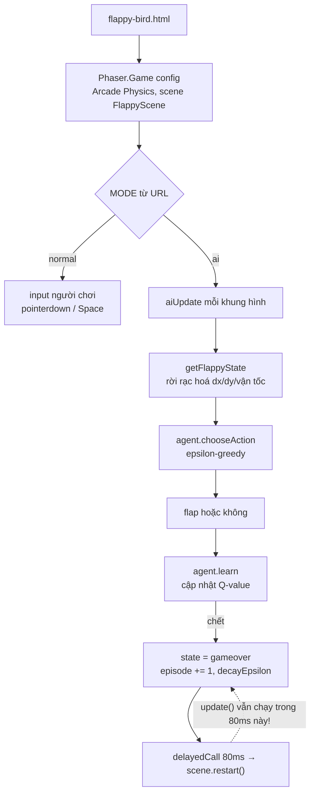

# Flappy Bird: khi AI tự học lại "chết" nhanh hơn một lần mỗi lần nó thực sự chết

## 1. Mở đầu

Chế độ AI của game này huấn luyện một agent Q-learning tự chơi Flappy Bird, lưu bảng học vào `localStorage`, và hiển thị số "episode" đã huấn luyện ngay trên HUD. Con số đó đáng lẽ phải tăng đúng một đơn vị mỗi lần con chim va chạm và chết — một quy tắc tưởng như hiển nhiên. Nhưng đọc kỹ đoạn code xử lý sự kiện "vừa chết", có một khoảng hở 80 mili giây giữa lúc trạng thái game chuyển sang `gameover` và lúc màn chơi thực sự được khởi động lại — và trong khoảng hở đó, vòng lặp cập nhật của Phaser vẫn tiếp tục chạy đều đặn mỗi khung hình, mỗi lần đều nghĩ rằng "một cái chết mới vừa xảy ra".

## 2. Bối cảnh

Flappy Bird là game duy nhất trong repo dùng một framework game đầy đủ (Phaser 3) thay vì tự viết vòng lặp canvas từ đầu — toàn bộ vật lý (trọng lực, va chạm), texture (vẽ runtime bằng Graphics API, không dùng ảnh), và scene management đều do Phaser đảm nhiệm. Nhưng điều bất ngờ hơn cả không nằm trong README: game này còn có một chế độ thứ hai hoàn toàn không được nhắc tới trong tài liệu — một chế độ AI, nơi một agent Q-learning thực sự tự học cách chơi qua hàng nghìn "kiếp sống" thử-sai, với bảng Q-value được lưu bền vào `localStorage` để việc huấn luyện không mất đi giữa các lần tải lại trang.

## 3. Mục tiêu sản phẩm

**Đã làm (theo README, cộng với chế độ AI phát hiện thêm khi đọc code):**
- Chạm/nhấn Space để vỗ cánh, vật lý trọng lực + vận tốc vỗ cánh do Phaser Arcade Physics xử lý, chim nghiêng góc theo vận tốc dọc.
- Ống nước sinh ra theo hẹn giờ, vị trí khe hở ngẫu nhiên, cuộn trái với tốc độ không đổi.
- Điểm số tăng mỗi khi qua một cặp ống, điểm cao nhất lưu riêng theo từng chế độ (thường/AI).
- **(Không có trong README) Chế độ AI:** một agent Q-learning bảng (tabular), trạng thái được rời rạc hoá (khoảng cách ngang/dọc tới ống gần nhất, vận tốc theo bậc thô), hành động nhị phân (vỗ cánh hoặc không), thưởng/phạt theo kết quả mỗi hành động, học liên tục qua nhiều "kiếp" tự động nối tiếp nhau, có nút tăng tốc độ mô phỏng và nút reset việc học.

**Sẽ KHÔNG làm:**
- Không dùng mạng nơ-ron hay bất kỳ thư viện machine learning nào — toàn bộ AI chỉ là một bảng tra cứu (object JavaScript thường) ánh xạ trạng thái rời rạc sang giá trị Q, đúng tinh thần Q-learning cổ điển trước kỷ nguyên deep learning.
- Không đảm bảo episode counter chính xác tuyệt đối trong mọi trường hợp — xem phần 7.

MVP (chế độ thường): vỗ cánh né ống, ghi điểm, điểm cao nhất được nhớ lại. MVP (chế độ AI): xem một agent tự học cách né ống qua thời gian, theo dõi số episode và độ khám phá (epsilon) giảm dần.

## 4. Thiết kế hệ thống



Trạng thái mà agent "nhìn thấy" được rời rạc hoá triệt để để bảng Q có thể hội tụ ngay trong trình duyệt, không cần huấn luyện offline:

```javascript
function getFlappyState(bird, nextPipe) {
    if (!nextPipe) return "no-pipe";
    const dx = nextPipe.x - bird.x;
    const dy = bird.y - nextPipe.gapCenterY;
    const vy = bird.body.velocity.y;

    const dxBucket = clampInt(Math.floor(dx / 40), -1, 9);
    const dyBucket = clampInt(Math.round(dy / 40), -8, 8);
    let velBucket;
    if (vy < -300) velBucket = 0;
    else if (vy < 0) velBucket = 1;
    else if (vy < 200) velBucket = 2;
    else if (vy < 500) velBucket = 3;
    else velBucket = 4;

    return dxBucket + "_" + dyBucket + "_" + velBucket;
}
```

Thay vì dùng toạ độ tuyệt đối (sẽ tạo ra vô số trạng thái khác nhau, không bao giờ hội tụ), trạng thái chỉ gồm ba con số nguyên nhỏ: khoảng cách ngang tới ống kế tiếp (chia bậc 40px), khoảng cách dọc tới tâm khe hở (chia bậc 40px), và vận tốc rơi hiện tại (5 mức thô). Toàn bộ không gian trạng thái có thể chỉ vài trăm tổ hợp — đủ nhỏ để một bảng object JavaScript thường học được sau vài trăm tới vài nghìn episode chạy ngay trên máy người dùng, không cần GPU hay huấn luyện offline.

## 5. Tech Stack

| Công nghệ | Vì sao chọn |
| --- | --- |
| **Phaser 3 (Arcade Physics)** | Duy nhất trong repo dùng framework đầy đủ thay vì tự viết canvas — hợp lý cho Flappy Bird vì bài toán (trọng lực, va chạm hình tròn/hình chữ nhật, tween góc nghiêng) khớp gần như hoàn hảo với những gì Arcade Physics cung cấp sẵn, không cần tự viết lại từ đầu. |
| **Q-learning bảng (tabular), không phải mạng nơ-ron** | Với không gian trạng thái đã được rời rạc hoá xuống còn vài trăm tổ hợp, một bảng tra cứu hội tụ nhanh hơn nhiều và dễ debug hơn (có thể xem trực tiếp giá trị Q của từng trạng thái) so với một mạng nơ-ron cho cùng bài toán — không cần độ phức tạp đó khi bài toán đủ nhỏ. |
| **Biến `sharedAgent` ở phạm vi module, không phải thuộc tính của Scene** | `Scene.restart()` của Phaser huỷ instance Scene cũ và tạo mới hoàn toàn — nếu agent được lưu như một thuộc tính của Scene, nó sẽ mất trắng sau mỗi lần "chết" và tạo lại. Đặt `sharedAgent` ở ngoài class, chỉ gán một lần (`if (!sharedAgent) sharedAgent = new QLearningAgent(...)`), giữ nguyên toàn bộ quá trình học xuyên suốt hàng nghìn lần restart. |
| **Epsilon-greedy với suy giảm dần (`epsilonDecay = 0.9985`)** | Agent khám phá ngẫu nhiên nhiều ở giai đoạn đầu (epsilon gần 1.0), rồi dần chuyển sang khai thác kiến thức đã học (epsilon giảm dần về `epsilonMin = 0.02`) — chiến lược kinh điển cân bằng giữa "thử cái mới" và "dùng cái đã biết là tốt". |

## 6. Quá trình phát triển

*(Suy luận từ cấu trúc code hiện có; README chỉ mô tả chế độ chơi thường.)*

### Giai đoạn 1 — Flappy Bird cổ điển bằng Phaser

Texture vẽ runtime bằng Graphics API (không ảnh), vật lý trọng lực + vỗ cánh, sinh ống theo hẹn giờ, va chạm kết thúc game — một bản Flappy Bird đầy đủ, hoàn chỉnh, chơi được bằng người thật.

### Giai đoạn 2 — Thêm chế độ AI: rời rạc hoá trạng thái

`getFlappyState` và class `QLearningAgent` được thêm vào một file riêng (`q-learning-agent.js`), tách bạch hoàn toàn khỏi logic scene chính — AI có thể học và ra quyết định mà không cần biết gì về Phaser, chỉ cần một chuỗi trạng thái và một danh sách hành động.

### Giai đoạn 3 — Vòng lặp huấn luyện tự động, sống sót qua `scene.restart()`

Đây là phần khó nhất về mặt kỹ thuật tích hợp: làm sao để agent "nhớ" được kiến thức đã học qua hàng nghìn lần Scene bị huỷ và tạo lại. Giải pháp — biến `sharedAgent` ở phạm vi module — đơn giản nhưng đúng đắn, và chính comment đầu file đã tự giải thích rõ lý do: *"Survives Scene.restart() (which throws away the old Scene instance), so training keeps its Q-table/episode count across every AI 'death'."*

### Giai đoạn 4 — Điều khiển tốc độ mô phỏng và huấn luyện

Thêm các nút tăng tốc (`currentTimeScale`, áp dụng vào `this.time.timeScale`/`this.physics.world.timeScale` của Phaser) để người dùng có thể xem quá trình học diễn ra nhanh hơn nhiều lần tốc độ thực — một tính năng chỉ có ý nghĩa vì bản chất bảng Q hội tụ khá nhanh, xem ở tốc độ 1x sẽ rất chậm để thấy được sự tiến bộ rõ rệt.

## 7. Những bug đáng nhớ

### Episode counter tăng nhiều lần cho cùng một cái chết

**Phát hiện khi lần theo toàn bộ vòng đời của `this.state === "gameover"` trong `aiUpdate()` để viết bài này:**

```javascript
if (this.state === "gameover") {
    this.agent.episode += 1;
    this.agent.decayEpsilon();
    if (this.agent.episode % 20 === 0) this.agent.save();
    this.updateAiHud();
    this.time.delayedCall(80, () => {
        if (this.scene) this.scene.restart();
    });
    return;
}
```

Khối này chạy mỗi khi `aiUpdate()` được gọi trong lúc `this.state === "gameover"`. `aiUpdate()` lại được gọi từ `update()` — phương thức chạy **mỗi khung hình** của Phaser, không có gì tạm dừng nó khi trò chơi kết thúc. `gameOver()` (hàm xử lý va chạm) có gọi `this.physics.pause()`, nhưng tạm dừng vật lý không đồng nghĩa tạm dừng vòng lặp `update()` của Scene — hai khái niệm hoàn toàn độc lập trong Phaser. Từ lúc `this.state` chuyển thành `"gameover"` cho tới lúc `this.time.delayedCall(80, ...)` thực sự kích hoạt `scene.restart()` (80 mili giây sau, tức khoảng 5 khung hình ở 60fps), Scene vẫn tiếp tục gọi `update()` → `aiUpdate()` → khối code trên **mỗi khung hình trong toàn bộ 5 khung hình đó** — không có cờ nào đánh dấu "đã xử lý cái chết này rồi, đừng xử lý lại".

**Hệ quả:** Mỗi lần agent thực sự chết một lần, `this.agent.episode` có thể bị cộng thêm khoảng 5 đơn vị thay vì đúng 1, `decayEpsilon()` chạy 5 lần liên tiếp (khiến epsilon giảm nhanh hơn dự kiến, agent chuyển sang "khai thác" kiến thức đã học sớm hơn ý đồ thiết kế), và tệ hơn, **5 lệnh gọi `this.time.delayedCall(80, () => scene.restart())` riêng biệt được lên lịch** — dù `scene.restart()` đầu tiên (khi nó kích hoạt) sẽ huỷ Scene hiện tại, không rõ liệu các `delayedCall` còn lại (đã lên lịch từ Scene *cũ*, giờ đã bị huỷ) có thực sự bị Phaser tự động dọn dẹp hay không, hay chúng vẫn treo lơ lửng và có thể gọi `scene.restart()` thêm một lần nữa lên chính Scene *mới* vừa được tạo ra, vô tình "chết" lại một lần nữa dù ván mới còn chưa kịp bắt đầu.

**Vì sao khó nhận ra:** Với chế độ mô phỏng tăng tốc (`currentTimeScale` có thể lên rất cao), 80 mili giây thực tế có thể tương ứng với một khoảng thời gian mô phỏng rất ngắn — số khung hình rơi vào cửa sổ này có thể ít hơn ở tốc độ 1x, khiến ảnh hưởng của bug khó quan sát nhất quán tuỳ vào tốc độ đang chọn. Số episode hiển thị trên HUD cũng không có gì "trông sai" — nó vẫn tăng đều, chỉ là tăng nhanh hơn số lần con chim thực sự va chạm, một sai lệch không có mốc so sánh rõ ràng nào để người xem tự phát hiện ra.

**Điều rút ra:** Trong bất kỳ framework nào có vòng lặp cập nhật chạy độc lập với luồng sự kiện chính (ở đây là `update()` của Phaser, tách biệt khỏi callback va chạm), một khối xử lý "sự kiện đã xảy ra" cần có cờ chặn tái nhập (giống `bomb.exploded` ở Bomberman hay cờ tự vệ `if (state === "gameover") return;` ở nhiều game khác trong repo) nếu bản thân điều kiện kích hoạt nó (`this.state === "gameover"`) vẫn còn đúng trong nhiều khung hình liên tiếp sau khi đã xử lý lần đầu.

## 8. Những quyết định sai

**Không có cờ chặn tái nhập cho khối xử lý gameover trong `aiUpdate()`**, như đã phân tích ở Bug — trong khi `gameOver()` (hàm xử lý va chạm vật lý) đã có đúng dạng cờ này (`if (this.state === "gameover") return;`), phần xử lý hệ quả huấn luyện AI trong `aiUpdate()` lại thiếu nó, dù cùng nằm trong một class, cùng kiểm tra cùng một biến `this.state`.

**README không đề cập gì tới chế độ AI**, dù đây là phần phức tạp và độc đáo nhất của cả game — một agent Q-learning thực sự học được cách chơi hoàn toàn không được nhắc tới trong tài liệu, khiến bất kỳ ai chỉ đọc README (thay vì đọc code) sẽ hoàn toàn bỏ lỡ tính năng này.

## 9. Những điều học được

- **`physics.pause()` và việc dừng vòng lặp `update()` của Scene là hai khái niệm độc lập trong Phaser** — tạm dừng vật lý không tự động tạm dừng bất kỳ logic JavaScript thuần nào khác vẫn đang chạy mỗi khung hình, một điều dễ ngộ nhận nếu chỉ nghĩ "trò chơi đã dừng lại" một cách chung chung. |
- **Bất kỳ khối code nào phản ứng với một điều kiện trạng thái (`if (state === X)`) đều cần tự hỏi: điều kiện đó có được đảm bảo chỉ đúng trong đúng MỘT khung hình, hay có thể đúng liên tục qua nhiều khung hình?** Nếu là vế sau, khối code đó cần một cờ chặn tái nhập riêng, không thể dựa vào giả định "chắc chỉ chạy một lần thôi".
- **Một tính năng phức tạp và có giá trị (ở đây là AI Q-learning) hoàn toàn có thể tồn tại trong code mà không hề được ghi lại trong tài liệu** — đọc code trực tiếp, không chỉ đọc README, là cách duy nhất để biết chắc phạm vi thật sự của một dự án.

## 10. Kết quả

| Hạng mục | Con số |
| --- | --- |
| Tổng số dòng code (JS + CSS + HTML) | 929 dòng |
| `js/flappy-bird-main.js` | 396 dòng |
| `css/home.css` | 173 dòng |
| `css/flappy-bird.css` | 144 dòng |
| `js/q-learning-agent.js` | 103 dòng |
| `js/flappy-bird-home.js` | 29 dòng |
| Số chế độ chơi | 2 (thường, AI Q-learning — chế độ sau không có trong README) |
| Khoảng trễ giữa gameover và restart (nơi bug xảy ra) | 80ms (~5 khung hình ở 60fps) |
| Test tự động | 0 |
| CI/CD | Không có |

## 11. Nếu làm lại từ đầu

- **Thêm cờ chặn tái nhập cho khối xử lý gameover trong `aiUpdate()`** (ví dụ `this.gameOverHandled`, đặt `true` ngay khi vào khối lần đầu, kiểm tra trước khi vào lần sau) — sửa tận gốc bug episode counter bị thổi phồng đã ghi nhận ở phần 7.
- **Chuyển hẳn logic "chết → tăng episode → lên lịch restart" vào bên trong `gameOver()`** (nơi đã có sẵn cờ tự vệ đúng đắn) thay vì để nó nằm rải rác trong `aiUpdate()`, vốn được gọi lại nhiều lần mỗi khung hình mà không có gì đảm bảo tính "một lần duy nhất" của một sự kiện.
- **Bổ sung mô tả chế độ AI vào README** — một tính năng đáng chú ý như vậy xứng đáng được ghi lại đầy đủ, không chỉ tồn tại ngầm trong code.

## 12. Kết

Flappy Bird là game duy nhất trong repo cho thấy hai thứ tưởng như không liên quan — một framework game 2D full-featured và một thuật toán học tăng cường cổ điển — có thể phối hợp gọn gàng trong cùng một file nhỏ. Phần thuật toán Q-learning, khi đọc kỹ, hoàn toàn đúng đắn: cập nhật Q-value đúng công thức, epsilon-greedy đúng chiến lược, rời rạc hoá trạng thái hợp lý. Bug tìm được không nằm ở "trí tuệ" của AI, mà nằm ở lớp tích hợp giữa vòng lặp học và vòng lặp render — đúng loại ranh giới dễ bị bỏ sót nhất, vì cả hai phía (logic huấn luyện, logic hiển thị khung hình) đều "đúng" khi xét riêng lẻ, chỉ sai khi chạy chồng lên nhau nhiều lần hơn dự tính.
