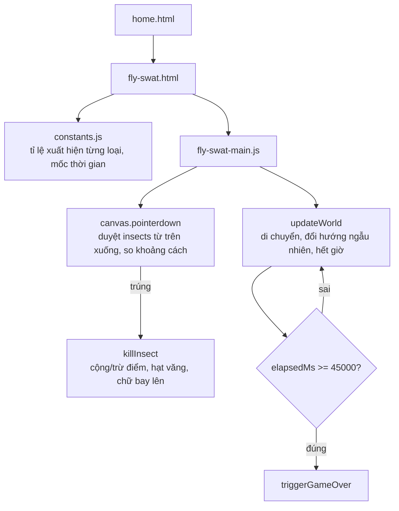

# Bắn Ruồi: khi "game không chạy" hoá ra không phải lỗi của game

## 1. Mở đầu

Bấm nút Bắt đầu, overlay biến mất đúng như mong đợi — nhưng sau đó thì không có gì xảy ra nữa. Không con ruồi nào xuất hiện. Đồng hồ đếm ngược đứng yên ở "45s" dù đã đợi hai giây, rồi ba giây, rồi tám giây. Không có dòng lỗi nào trong console. `overlay.hidden` đã đúng là `true`. Mọi thứ *trông* như đã chạy, nhưng game state thì đóng băng hoàn toàn.

Đây là lúc một buổi debug thông thường (đọc lại code, tìm chỗ viết sai) không giúp được gì — vì code không hề sai. Bài này kể về Bắn Ruồi, game đơn giản nhất về mặt cơ chế trong cả loạt "máy Nokia hoài niệm" (không vật lý phức tạp, không AI, chỉ có côn trùng bay loạn xạ và một cú chạm để bắn hạ), nhưng lại là nơi lộ ra một sự thật khó chịu về cách trình duyệt đối xử với các tab không ở trạng thái hiển thị — một sự thật ảnh hưởng tới *mọi* game trong repo dùng `requestAnimationFrame`, chứ không riêng gì game này.

## 2. Bối cảnh

Bắn Ruồi ra đời sau khi loạt game "Nokia hoài niệm" (Space Impact, Rapid Roll, Pocket Carrom) đã xong, khi được yêu cầu thêm một game bắn ruồi đơn giản. Không giống ba game trước — không có vật lý nảy, không có đối thủ AI — cơ chế cốt lõi chỉ là: côn trùng bay ngẫu nhiên trong khung hình, đổi hướng định kỳ, chạm/nhấn vào để bắn hạ trong 45 giây, tránh ong vàng (trừ điểm), ưu tiên ruồi vàng (điểm cao nhưng biến mất nhanh). Về mặt code, đây là game *đơn giản nhất* trong cả loạt — nên khi nó "không chạy" trong lúc kiểm tra bằng trình duyệt thật, phản xạ đầu tiên là nghi ngờ chính hàm `handleGameKeyCode`-tương-đương của nó (ở đây là vòng lặp game) viết sai đâu đó, vì một game đơn giản như vậy thì còn gì để sai nữa?

## 3. Mục tiêu sản phẩm

**Sẽ làm:**
- Côn trùng bay tự do trong khung hình, đổi hướng ngẫu nhiên định kỳ (0.4-0.9 giây một lần) để tạo cảm giác "loạn xạ" thay vì bay đường thẳng dễ đoán.
- 4 loại côn trùng: ruồi thường (10 điểm), ruồi nhanh (20 điểm, bay nhanh hơn nhiều), ruồi vàng (50 điểm, tự biến mất sau 2.6 giây nếu không bắn kịp), ong vàng (-15 điểm nếu lỡ chạm phải).
- Thời gian giới hạn 45 giây, độ khó tăng dần (côn trùng xuất hiện dày hơn) theo thời gian đã trôi qua trong ván.
- Hiệu ứng phản hồi: hạt văng ra khi bắn trúng, chữ điểm số bay lên mờ dần, điểm số không bao giờ hiển thị âm (kẹp về 0).
- Không cần D-pad chạm — chạm/nhấn trực tiếp vào côn trùng trên canvas là cơ chế điều khiển chính, hoạt động giống hệt nhau cho cả chuột và ngón tay nhờ Pointer Events.

**Sẽ KHÔNG làm:**
- Không có màn/level — chỉ một ván 45 giây duy nhất, điểm cao nhất được nhớ lại.
- Không phân biệt combo hay streak — mỗi lần bắn trúng chỉ đơn giản cộng điểm cố định theo loại côn trùng.
- Không có âm thanh.

MVP: mở trang, bắt đầu, bắn côn trùng trong 45 giây, né ong, ưu tiên ruồi vàng, xem điểm cuối và điểm cao nhất.

## 4. Thiết kế hệ thống



Không có gì đặc biệt phức tạp ở kiến trúc — đây là game "phẳng" nhất trong loạt, một vòng lặp `requestAnimationFrame` chuẩn, giống hệt khuôn mẫu đã dùng cho Space Impact và mọi game canvas khác trong repo. Sự đơn giản này chính là lý do khiến sự cố ở phần 7 đáng chú ý: nó không xảy ra vì logic game phức tạp, mà xảy ra ở đúng cái vòng lặp cơ bản nhất mọi game trong repo đều dùng chung.

## 5. Tech Stack

| Công nghệ | Vì sao chọn |
| --- | --- |
| **Pointer Events (`pointerdown`) trực tiếp trên canvas, không có D-pad** | Bắn ruồi vốn là một game "chạm để bắn" — bản chất thao tác đã trùng khớp hoàn toàn giữa chuột và cảm ứng (click ở đâu = chạm ở đó), không cần lớp nút ảo trung gian như các game điều hướng (Space Impact, Rapid Roll). |
| **Duyệt côn trùng theo thứ tự ngược (`insects.length - 1` xuống `0`) khi tìm trúng đích** | Côn trùng vẽ sau nằm "trên" côn trùng vẽ trước về mặt hình ảnh (canvas vẽ chồng theo thứ tự), nên khi hai con trùng lặp vị trí, duyệt ngược đảm bảo con được bắn trúng là con người chơi *nhìn thấy* ở trên cùng, không phải con bị che khuất phía dưới. |
| **`requestAnimationFrame` + delta-time, giống mọi game khác trong repo** | Nhất quán với toàn bộ codebase — và hoá ra chính sự nhất quán này giúp xác định nhanh rằng sự cố ở phần 7 không phải lỗi riêng của game này (xem cách debug bên dưới). |

## 6. Quá trình phát triển

### Giai đoạn 1 — Một loại côn trùng, di chuyển ngẫu nhiên, bắn trúng biến mất

Bắt đầu với `spawnInsect` sinh một con ruồi tại vị trí ngẫu nhiên, vận tốc theo góc ngẫu nhiên, bật ngược khi chạm biên canvas. `killInsect` chỉ đơn giản đánh dấu `alive = false` và cộng điểm.

### Giai đoạn 2 — Bốn loại côn trùng, random có trọng số

Thêm `INSECT_TYPES` làm bảng tra cứu (radius, tốc độ, điểm, trọng số xuất hiện) cho 4 loại, và một hàm `pickInsectType` random có trọng số y hệt kiểu đã dùng ở Space Impact cho địch — tái sử dụng đúng pattern đã viết trước đó trong cùng phiên, không cần nghĩ lại từ đầu.

### Giai đoạn 3 — Phản hồi thị giác: hạt văng và chữ điểm bay lên

`spawnParticles` tạo 7 hạt nhỏ văng ra theo góc ngẫu nhiên, rơi dưới trọng lực nhẹ (`p.vy += 220 * dt`), mờ dần theo thời gian sống còn lại. `spawnFloatingText` tương tự nhưng cho chữ "+10"/"-15" bay thẳng lên. Cả hai đều dùng chung công thức `alpha = life / maxLife` để fade — không có gì phức tạp, nhưng là lớp "juice" (cảm giác phản hồi) khiến việc bắn trúng có sức nặng hơn một con số tăng lên đơn thuần.

## 7. Những bug đáng nhớ

### "Bug" duy nhất — và nó không nằm trong code của game

**Hiện tượng:** Sau khi bấm Bắt đầu, `overlay.hidden` chuyển đúng thành `true` (xác nhận bằng cách gọi trực tiếp `document.getElementById('overlay').hidden` qua console), nhưng đồng hồ đếm ngược, điểm số, và canvas đều đứng yên tuyệt đối — không nhích một khung hình nào, dù đã đợi tới tám giây.

**Quá trình debug — từng bước một:**

1. Kiểm tra console lỗi bằng công cụ đọc log của trình duyệt — không có gì. Không có exception nào bị ném ra.
2. Nghi ngờ `startGame()` không thực sự chạy tới `requestAnimationFrame(loop)` — gọi trực tiếp `document.getElementById('overlay-btn').click()` qua console và kiểm tra lại `overlay.hidden`: vẫn `true`, nghĩa là `startGame()` đã chạy trọn vẹn, bao gồm cả dòng `requestAnimationFrame(loop)` cuối hàm.
3. Vậy `loop()` có được gọi lần đầu không? Vấn đề là `loop()` nằm trong một closure IIFE, không thể gọi trực tiếp từ console để kiểm tra. Thay vào đó, viết một bài test hoàn toàn độc lập với code của game:

```javascript
window.__rafCount = 0;
function tick() { window.__rafCount++; requestAnimationFrame(tick); }
requestAnimationFrame(tick);
```

Đợi ba giây, đọc lại `window.__rafCount` — kết quả là **0**. Không phải một con số nhỏ, không phải bị "chậm" — đúng nghĩa `requestAnimationFrame` chưa từng gọi lại hàm `tick` một lần nào, dù đã lên lịch.

4. Kiểm tra `document.hidden` và `document.visibilityState` — cả hai xác nhận tab đang ở trạng thái `hidden`. Đây chính là câu trả lời: các trình duyệt hiện đại **tạm dừng hoàn toàn** `requestAnimationFrame` (không chỉ giảm tần suất như `setInterval`) cho các tab không hiển thị trên màn hình, để tiết kiệm tài nguyên — một hành vi chuẩn hoá, không phải bug của trình duyệt.
5. Để chắc chắn đây không phải lỗi riêng của Bắn Ruồi, quay lại mở Space Impact — game đã từng chạy mượt mà trong lần kiểm tra trước đó cùng phiên làm việc — và lặp lại đúng bài test: `document.hidden` cũng trả về `true`. Cùng một hiện tượng, xảy ra ở một game hoàn toàn khác, viết bởi một người khác trong session (dù thực ra là chính mình, chỉ cách nhau vài giờ thao tác) — xác nhận đây là vấn đề ở tầng trình duyệt/công cụ tự động hoá đang điều khiển tab, không nằm trong logic của bất kỳ game nào.

**Nguyên nhân:** Công cụ tự động hoá trình duyệt dùng để kiểm tra các game trong phiên này điều khiển một tab không thật sự nằm ở tiền cảnh (foreground) của hệ điều hành tại thời điểm đó — dù vẫn nhận được lệnh và chụp được ảnh màn hình bình thường (cơ chế chụp ảnh không phụ thuộc vào việc tab có "visible" theo đúng nghĩa Page Visibility API hay không), theo đúng spec, `requestAnimationFrame` không bao giờ được gọi lại cho một tài liệu ở trạng thái `hidden`.

**Cách sửa:** Không có gì để "sửa" trong code của game — đây không phải bug của Bắn Ruồi. Cách xác minh thay thế: gọi trực tiếp các hàm xử lý sự kiện (`handleGameKeyCode`-tương-đương, ở đây là mô phỏng `pointerdown` bằng `PointerEvent` thật gửi vào đúng phần tử DOM) để kiểm tra logic game hoạt động đúng mà không phụ thuộc vào việc `requestAnimationFrame` có được trình duyệt gọi lại hay không trong môi trường kiểm tra.

**Điều rút ra:** Khi một hiện tượng "im lặng" (không lỗi, không crash, chỉ đơn giản là không có gì xảy ra) xuất hiện, phản xạ đầu tiên thường là đọc lại chính đoạn code đang nghi ngờ. Nhưng cách xác nhận nhanh và đáng tin hơn là **cô lập biến số**: viết một bài test hoàn toàn không phụ thuộc vào code của game (như đoạn `tick()` đếm số lần `requestAnimationFrame` gọi lại) để trả lời câu hỏi "vấn đề nằm trong logic của tôi, hay trong môi trường đang chạy nó?" trước khi tốn thời gian dò từng dòng code không có tội.

## 8. Những quyết định sai

**`INSECT_TYPES` được định nghĩa là một object phẳng thay vì Map**, nên `pickInsectType` phải dùng `Object.entries()` mỗi lần gọi để lặp qua các loại — một chi phí nhỏ không đáng kể ở quy mô này (chỉ 4 loại, gọi vài lần mỗi giây), nhưng nếu số loại côn trùng tăng lên đáng kể trong tương lai, việc tính lại `entries()` mỗi lần spawn thay vì cache một lần là một khoản chi phí có thể tránh được từ đầu.

**Không có giới hạn tối đa số côn trùng cùng lúc trên màn hình.** Ở khó độ cao nhất (cuối ván 45 giây), khoảng cách sinh côn trùng co lại còn 260-520ms — về lý thuyết nếu người chơi cố tình không bắn gì cả, số côn trùng tích luỹ trên màn hình sẽ tăng không giới hạn cho tới hết giờ. Trên thực tế 45 giây không đủ dài để điều này gây vấn đề hiệu năng thấy rõ, nhưng đây vẫn là một giả định ngầm ("người chơi sẽ luôn bắn bớt") không được code chủ động đảm bảo.

## 9. Những điều học được

- **`requestAnimationFrame` không chỉ bị *giảm tần suất* khi tab ẩn — nó bị dừng hoàn toàn**, khác với `setInterval`/`setTimeout` (vốn chỉ bị throttle xuống còn khoảng 1 lần/giây). Đây là một khác biệt quan trọng cần nhớ khi chọn cơ chế vòng lặp cho bất kỳ ứng dụng canvas nào chạy nền.
- **Chụp ảnh màn hình một tab không đồng nghĩa với việc tab đó đang ở trạng thái "visible" theo Page Visibility API.** Hai khái niệm tưởng liên quan nhưng độc lập với nhau ở tầng trình duyệt — một công cụ có thể chụp được ảnh của một tab đang bị coi là `hidden`.
- **Cô lập biến số bằng một bài test tối giản, độc lập hoàn toàn với code đang nghi ngờ, là cách nhanh nhất để phân biệt "lỗi trong logic của tôi" và "lỗi trong môi trường đang chạy nó"** — nhất là khi hiện tượng không để lại bất kỳ dấu vết lỗi nào trong console.
- **Xác nhận lại trên một mẫu thử thứ hai (game khác, đã từng chạy đúng) trước khi kết luận nguyên nhân** giúp loại trừ khả năng "chính game đang test có gì đó đặc biệt" — một bước kiểm chứng chéo rẻ nhưng có giá trị.

## 10. Kết quả

| Hạng mục | Con số |
| --- | --- |
| Tổng số dòng code (JS + CSS + HTML) | 722 dòng |
| `js/fly-swat-main.js` | 332 dòng |
| `css/fly-swat.css` | 159 dòng |
| `css/home.css` | 125 dòng |
| `js/constants.js` | 28 dòng |
| Số loại côn trùng | 4 (thường, nhanh, vàng, ong) |
| Test tự động | 0 — xác minh bằng cách gọi trực tiếp hàm xử lý sự kiện qua console, độc lập với `requestAnimationFrame` |
| CI/CD | Không có |

## 11. Nếu làm lại từ đầu

- **Không có gì cần đổi trong logic game** — sự cố ở phần 7 không phải bug của code, nên "làm lại" ở đây có nghĩa là thay đổi *quy trình kiểm tra*, không phải thay đổi *sản phẩm*.
- **Chuẩn hoá một bài test `requestAnimationFrame`-độc-lập** (giống đoạn `tick()` ở Bug #1) thành một bước kiểm tra môi trường đứng đầu quy trình test cho mọi game canvas trong repo, thay vì phải tự nghĩ ra lại mỗi lần gặp hiện tượng "đứng hình" tương tự.
- **Cache `Object.entries(INSECT_TYPES)` một lần khi khởi tạo** thay vì tính lại mỗi lần `pickInsectType` được gọi — tối ưu nhỏ, ít cấp bách nhưng miễn phí để làm.

## 12. Kết

Bắn Ruồi là game đơn giản nhất về code trong cả loạt, nhưng lại dạy được bài học tổng quát nhất: không phải "im lặng, không lỗi" đồng nghĩa với "mọi thứ ổn". Đôi khi nó chỉ có nghĩa là vấn đề nằm ở một tầng bạn chưa nghĩ tới soi — không phải trong vòng lặp game, không phải trong hàm xử lý va chạm, mà trong chính cái giả định ngầm rằng trình duyệt sẽ luôn gọi lại `requestAnimationFrame` đều đặn như đã hứa. Giả định đó đúng 99% thời gian một người chơi thật sự mở game — chỉ sai trong đúng môi trường đang được dùng để kiểm tra nó, một nghịch lý nhỏ nhưng đáng nhớ.
