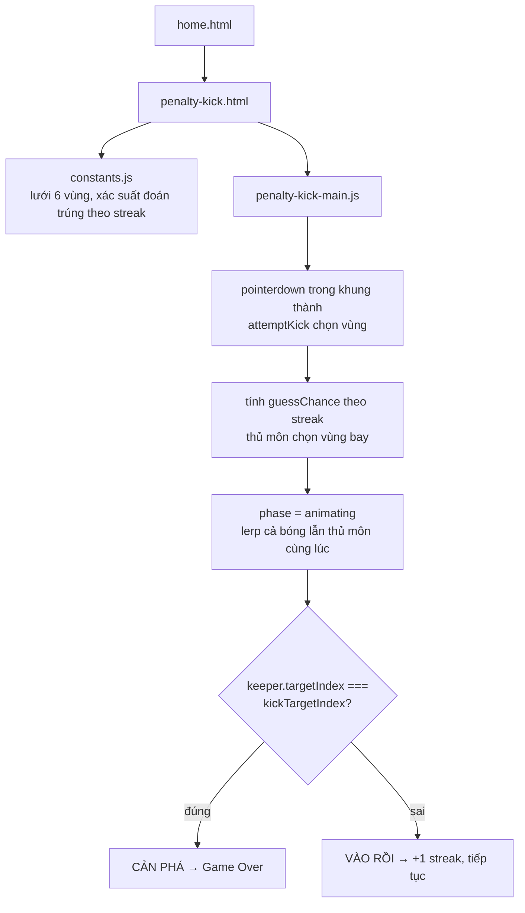

# Đá Bóng: quả bóng bay thẳng như kẻ chỉ, và một trần độ khó không bao giờ chạm tới 100%

## 1. Mở đầu

Trong lúc thiết kế game này, kế hoạch ban đầu có một chi tiết cụ thể: quả bóng khi bay từ chấm phạt đền vào khung thành sẽ được nhấc lên theo một đường vòng cung nhẹ, mô phỏng độ cao thật của một cú sút, và tự thu nhỏ lại một chút để tạo cảm giác phối cảnh (đang bay ra xa). Đọc lại đúng dòng code xử lý chuyển động của bóng ở bản hoàn chỉnh, cả hai chi tiết đó đều không có mặt — bóng bay theo đúng một đường thẳng nội suy tuyến tính từ điểm sút tới điểm ngắm, không cong, không đổi kích thước. Bài này kể về Đá Bóng, game thứ tư trong loạt Brick Game, và về khoảng cách giữa một ý tưởng viết ra trong đầu lúc lên kế hoạch với những gì thật sự nằm trong file JavaScript cuối cùng.

## 2. Bối cảnh

Đá Bóng là biến thể "sút phạt đền" — khác hẳn về luật chơi so với ba game trước trong cùng danh sách (Tetris, Đập Gạch, Bóng Rổ). Không có vật lý trọng lực liên tục, không có va chạm nảy — mỗi lượt chỉ là một quyết định duy nhất (chạm vào đâu trong khung thành) rồi chờ xem thủ môn có đoán trúng hay không. Về bản chất, đây là game "gần với xác suất" nhất trong cả loạt, nơi cảm giác công bằng của trò chơi phụ thuộc hoàn toàn vào một công thức xác suất đơn giản, không phải vào vật lý hay phản xạ.

## 3. Mục tiêu sản phẩm

**Sẽ làm:**
- Khung thành chia thành lưới 3×2 = 6 vùng, chạm vào một vùng để sút vào đó.
- Thủ môn "đoán" một vùng để bay người cản phá, xác suất đoán trúng tăng dần theo số bàn đã ghi liên tiếp (chuỗi càng dài, thủ môn càng khó lừa).
- Định dạng "sudden death": chỉ cần bị cản phá một lần là kết thúc, điểm số = số bàn ghi được liên tiếp trước đó.
- Hoạt ảnh bóng bay và thủ môn bay người đồng bộ trong cùng một khoảng thời gian cố định (550ms), hiện chữ "VÀO RỒI!"/"CẢN PHÁ!" sau khi hoạt ảnh kết thúc.
- Điểm cao nhất (chuỗi bàn dài nhất) lưu lại theo `localStorage`.

**Sẽ KHÔNG làm:**
- Không có nhiều cầu thủ, không có chọn góc chạy đà — chỉ có một quyết định duy nhất mỗi lượt: sút vào vùng nào.
- Không có 5 lượt sút cố định kiểu loạt sút luân lưu thật — chọn mô hình "chuỗi bất tận, thua là hết" thay vì đếm bàn trên tổng số lượt cố định, vì nó tái sử dụng được đúng khuôn mẫu "chơi tới khi thua" đã dùng cho phần lớn game khác trong repo.
- Không mô phỏng quỹ đạo bóng cong theo trọng lực hay hiệu ứng xoáy — dù đây từng là một phần trong ý tưởng ban đầu (xem phần 7).

MVP: chạm vào khung thành để sút, thủ môn đoán và bay người, ghi bàn thì tiếp tục, bị cản thì kết thúc và hiện chuỗi bàn đã ghi.

## 4. Thiết kế hệ thống



Quyết định thiết kế trung tâm của game nằm ở công thức xác suất đoán trúng của thủ môn — không cố định, mà tăng dần theo chuỗi bàn đã ghi:

```javascript
const guessChance = Math.min(MAX_GUESS_CHANCE, BASE_GUESS_CHANCE + streak * GUESS_CHANCE_STEP);
```

Với `BASE_GUESS_CHANCE = 0.26`, `GUESS_CHANCE_STEP = 0.03`, `MAX_GUESS_CHANCE = 0.68` — thủ môn bắt đầu chỉ đoán trúng 26% số lần, tăng 3% mỗi bàn liên tiếp, và đạt trần 68% sau đúng 14 bàn liên tiếp (`(0.68 − 0.26) / 0.03 ≈ 14`). Có một hệ quả toán học đáng chú ý mà thiết kế này cố tình chấp nhận: trần 68% nghĩa là thủ môn *không bao giờ* đoán trúng nhiều hơn 68% số lần, bất kể chuỗi bàn dài tới đâu — về lý thuyết, một chuỗi vô hạn hoàn toàn khả thi, chỉ là xác suất giảm dần theo cấp số nhân. Đây không phải sơ suất mà là lựa chọn có chủ đích: một trần độ khó không chạm 100% giữ cho streak luôn *có thể* tiếp tục, dù ngày càng khó, thay vì đặt ra một mốc "không thể vượt qua" cứng nhắc.

## 5. Tech Stack

| Công nghệ | Vì sao chọn |
| --- | --- |
| **Lưới vùng rời rạc (3×2) thay vì toạ độ liên tục** | Việc thủ môn "đoán đúng hay sai" đơn giản hơn nhiều khi quy về so sánh hai chỉ số nguyên (`keeper.targetIndex === kickTargetIndex`) thay vì phải định nghĩa một bán kính "vùng cứu thua" quanh vị trí liên tục — không cần bài toán hình học nào, chỉ cần bài toán tổ hợp rời rạc. |
| **Nội suy tuyến tính (`lerp`) cho cả bóng lẫn thủ môn, cùng một mốc thời gian** | Cả hai chuyển động đều là "từ điểm A tới điểm B trong đúng 550ms" — không cần một hệ vật lý riêng, chỉ cần một hàm `lerp` dùng chung, tính tại đúng `t` như nhau cho cả hai để đảm bảo chúng luôn đồng bộ về mặt thời gian (không thể xảy ra tình huống thủ môn "xong" trước hay sau khi bóng tới). |
| **Xác suất đoán trúng của thủ môn tăng tuyến tính theo streak, có trần** | Cách rẻ nhất để tạo cảm giác "leo thang độ khó" mà không cần thêm bất kỳ cơ chế gameplay mới nào (không cần thêm loại thủ môn, không cần thêm biến số khác) — chỉ một con số duy nhất thay đổi theo tiến trình chơi. |

## 6. Quá trình phát triển

### Giai đoạn 1 — Lưới 6 vùng, chạm để chọn

`GOAL_LEFT`/`GOAL_RIGHT`/`GOAL_TOP`/`GOAL_BOTTOM` định nghĩa khung thành, chia đều thành `ZONE_COLS × ZONE_ROWS = 3 × 2`. Chạm vào khung thành quy đổi toạ độ pixel về chỉ số hàng/cột bằng phép chia nguyên, kẹp trong giới hạn hợp lệ (`clamp`) để tránh chạm đúng biên bị tính sai vùng.

### Giai đoạn 2 — Thủ môn "điểm ma" ngược: chọn trước, sai số sau

Khác với AI của Pocket Carrom (tính hướng chính xác trước, rồi thêm nhiễu góc), thủ môn ở đây hoạt động theo cách đơn giản hơn: tung xác suất trước (`Math.random() < guessChance`) để quyết định "có đoán đúng hay không", chỉ khi *không* đoán đúng mới chọn ngẫu nhiên trong 5 vùng còn lại. Cách này tách bạch rõ ràng "kỹ năng của thủ môn" (một con số xác suất duy nhất) khỏi "thủ môn chọn vùng nào khi đoán sai" (ngẫu nhiên đều, không thiên vị vùng nào).

### Giai đoạn 3 — Đồng bộ hoạt ảnh bóng và thủ môn

`attemptKick` lưu vị trí bắt đầu của cả bóng lẫn thủ môn (`startX`/`startY`), rồi `updateWorld` cập nhật cả hai bằng cùng một giá trị `t` (`animTimer / KICK_DURATION_MS`) mỗi khung hình — đảm bảo chúng luôn "tới đích" đúng cùng một khung hình, thời điểm quyết định thắng thua (`resolveKick`) mới được tính.

## 7. Những bug đáng nhớ

### Không phải bug — một khoảng cách giữa ý tưởng ban đầu và bản hoàn chỉnh

**Phát hiện khi đọc lại `updateWorld` để viết bài này:**

```javascript
ball.x = lerp(ball.startX, target.x, t);
ball.y = lerp(ball.startY, target.y, t);
```

Bóng di chuyển theo đúng một đường thẳng nội suy tuyến tính giữa điểm xuất phát và điểm ngắm — không có bất kỳ điều chỉnh độ cao nào theo kiểu `- Math.sin(t * Math.PI) * ARC_HEIGHT` (công thức tạo hiệu ứng "nhấc lên rồi hạ xuống" thường thấy ở các game ném/sút bóng khác trong cùng repo, ví dụ quỹ đạo bóng rổ dùng trọng lực thật), và cũng không có phép co kích thước bóng theo tiến trình bay (`ball.scale`) để mô phỏng phối cảnh xa dần — cả hai ý tưởng này từng có mặt trong kế hoạch ban đầu nhưng không xuất hiện trong `drawBall()` của bản cuối cùng, nơi bóng luôn được vẽ với đúng `BALL_RADIUS` cố định.

**Vì sao đây không phải bug:** Game vẫn chạy đúng, hoạt ảnh vẫn mượt, người chơi vẫn hiểu được bóng đang bay từ đâu tới đâu — chỉ là thiếu đi một lớp "gia vị" thị giác. Không có gì bị hỏng, chỉ là một phạm vi công việc bị cắt bớt trong quá trình viết, nhiều khả năng vì độ ưu tiên: một cú sút chỉ kéo dài 550ms, và ở tốc độ đó, khác biệt giữa "bay thẳng" và "bay có vòng cung nhẹ" khó nhận ra bằng mắt hơn nhiều so với, ví dụ, quỹ đạo bóng rổ kéo dài cả giây với độ cao rõ rệt.

**Điều rút ra:** Không phải mọi chi tiết trong kế hoạch (`Mục tiêu sản phẩm`) đều thực sự cần thiết khi bắt tay vào viết — và việc một chi tiết "biến mất" giữa kế hoạch và bản hoàn chỉnh không tự động là dấu hiệu của sự cẩu thả. Nó có thể đơn giản là một đánh giá lại độ ưu tiên diễn ra tự nhiên trong lúc viết code, chỉ là không có gì ghi chép lại quyết định đó — khiến việc đọc lại code sau này (như khi viết bài này) là cách duy nhất để phát hiện ra khoảng cách đó tồn tại.

## 8. Những quyết định sai

**Không có cách nào để người chơi biết trước xác suất đoán trúng hiện tại của thủ môn.** `guessChance` là một con số nội bộ hoàn toàn ẩn — người chơi chỉ cảm nhận được "hình như thủ môn đang bắt được nhiều hơn" một cách mơ hồ qua trải nghiệm, không có chỉ báo trực quan nào (ví dụ một thanh "độ khó" trong HUD) phản ánh con số đó đang tăng dần. Với một cơ chế mà toàn bộ độ khó nằm gọn trong đúng một con số, việc giấu hoàn toàn con số đó khỏi người chơi là một lựa chọn có thể tranh luận — lộ ra một phần có thể khiến game *cảm thấy* công bằng và minh bạch hơn.

**Thủ môn không có "xu hướng" nào cả — chọn vùng sai hoàn toàn ngẫu nhiên đều trong 5 vùng còn lại.** Một thủ môn thật thường có thiên hướng (ví dụ hay bay về một bên nếu người sút thuận chân đó), nhưng ở đây mọi vùng sai đều có xác suất bằng nhau tuyệt đối — đơn giản hơn để viết, nhưng cũng khiến hành vi thủ môn hơi "máy móc" nếu chơi đủ lâu để nhận ra không có bất kỳ khuôn mẫu nào trong cách nó chọn sai.

## 9. Những điều học được

- **Tách "có đoán đúng hay không" (một lần tung xác suất) khỏi "đoán sai thì chọn gì" (ngẫu nhiên đều trong phần còn lại) là một cách viết AI đơn giản, dễ kiểm soát độ khó bằng đúng một con số** — không cần một hệ thống quyết định phức tạp để tạo cảm giác đối thủ đang "khôn" dần lên.
- **Một trần xác suất không chạm 100% (ở đây là 68%) là một lựa chọn thiết kế có chủ đích, không phải giới hạn kỹ thuật** — nó giữ cho mọi chuỗi thành tích luôn về mặt lý thuyết có thể tiếp tục, chỉ ngày càng khó hơn, tạo cảm giác "leo thang không giới hạn" thay vì một trần cứng khiến người chơi giỏi nhất cũng chắc chắn dừng lại ở một điểm cố định.
- **So sánh kế hoạch ban đầu với code thực tế là một cách phát hiện ra những quyết định-ngầm chưa từng được ghi lại** — không phải để "sửa sai", mà để hiểu rõ hơn quá trình thực tế đã diễn ra như thế nào, khác với những gì bản kế hoạch ban đầu hình dung.

## 10. Kết quả

| Hạng mục | Con số |
| --- | --- |
| Tổng số dòng code (JS + CSS + HTML) | 650 dòng |
| `js/penalty-kick-main.js` | 261 dòng |
| `css/penalty-kick.css` | 159 dòng |
| `css/home.css` | 125 dòng |
| `js/constants.js` | 28 dòng |
| Số vùng khung thành | 6 (lưới 3×2) |
| Xác suất đoán trúng: khởi điểm → trần | 26% → 68% |
| Số bàn liên tiếp để chạm trần độ khó | 14 |
| Test tự động | 0 |
| CI/CD | Không có |

## 11. Nếu làm lại từ đầu

- **Thêm hiệu ứng vòng cung nhẹ cho quỹ đạo bóng** (`- Math.sin(t * Math.PI) * ARC_HEIGHT`), khôi phục đúng ý tưởng ban đầu — chi phí implement thấp, chỉ là một dòng cộng thêm vào công thức `ball.y` đã có sẵn.
- **Hiện một chỉ báo trực quan cho "độ khó hiện tại"** (ví dụ một thanh nhỏ trong HUD phản ánh `guessChance`), để người chơi cảm nhận rõ ràng game đang khó dần lên, thay vì chỉ suy luận gián tiếp qua trải nghiệm.
- **Thêm thiên hướng nhẹ cho lựa chọn sai của thủ môn** (ví dụ trọng số cao hơn cho các vùng gần vùng vừa chọn ở lượt trước, mô phỏng "phản xạ tự nhiên hay bay về hướng quen") để hành vi bớt máy móc hơn khi chơi đủ lâu.

## 12. Kết

Đá Bóng là game "mỏng" nhất về code trong cả loạt Brick Game (261 dòng logic chính), và đúng như dự đoán, không có bug thực sự nào lộ ra khi đọc lại — thay vào đó, thứ lộ ra là một khoảng cách nhỏ giữa những gì từng được hình dung lúc lên kế hoạch (bóng bay có vòng cung, thu nhỏ theo phối cảnh) và những gì thực sự tồn tại trong bản hoàn chỉnh (một đường thẳng nội suy đơn giản). Không phải sai sót nào cũng ồn ào như một exception trong console — đôi khi nó chỉ là một câu "mình định làm cái này" lặng lẽ biến mất giữa lúc gõ code, và chỉ lộ ra khi có ai đó quay lại đọc với đúng câu hỏi "cái này có thật sự nằm trong code không, hay chỉ nằm trong kế hoạch?"
