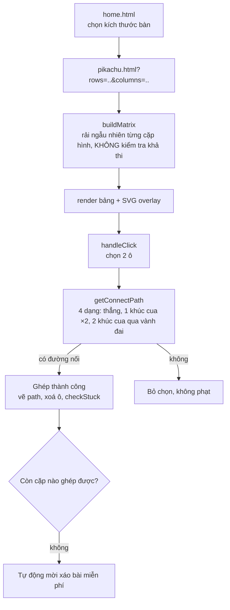

# Pikachu (Onet): một bàn cờ mới xáo có thể "chết" ngay từ nước đi đầu tiên mà không ai biết

## 1. Mở đầu

Game này có một hàm `checkStuck()` khá kỹ lưỡng — sau mỗi lần ghép cặp thành công, nó quét toàn bộ bàn cờ tìm xem còn cặp nào ghép được không, và nếu không còn, tự động mời người chơi xáo bài miễn phí. Cơ chế này chạy đúng, chạy đều đặn, sau *mọi* nước đi thành công trong suốt ván chơi. Có đúng một thời điểm nó không bao giờ được gọi tới: ngay sau khi bàn cờ vừa được sinh ra, trước nước đi đầu tiên của người chơi. Nếu thuật toán xếp ngẫu nhiên (hoàn toàn không quan tâm tới việc bàn cờ có giải được hay không) vô tình tạo ra một bàn cờ đã "chết" — không còn cặp nào nối được — ngay từ đầu, không có gì trong code phát hiện ra điều đó cho tới khi người chơi tự mình nhận ra sau nhiều lần bấm thử.

## 2. Bối cảnh

Pikachu (hay Onet, tuỳ tên gọi theo từng nơi) là game duy nhất trong repo mà toàn bộ giá trị giải trí phụ thuộc vào đúng một thuật toán hình học: kiểm tra xem có thể nối hai ô cùng hình bằng một đường thẳng, một khúc cua, hoặc hai khúc cua hay không. Không có vật lý, không có AI đối thủ, không có phản xạ thời gian thực — chỉ có một bài toán tìm đường trên lưới, được gọi lại hàng trăm lần mỗi ván (mỗi lần click, mỗi lần xin gợi ý, mỗi lần kiểm tra "còn ghép được không").

## 3. Mục tiêu sản phẩm

**Đã làm (theo README):**
- Chọn kích thước bàn cờ (vuông hoặc tuỳ chỉnh số hàng/cột riêng) từ 10 đến 60 trước khi vào ván.
- Luật nối cổ điển: đường thẳng, một khúc cua, hoặc hai khúc cua đi qua ô trống, kể cả một "vành đai" ảo đi được ngay ngoài rìa bàn cờ ở cả bốn phía — đúng luật Pikachu/Onet gốc.
- Hoạt ảnh đường nối SVG khi ghép thành công, popup "Combo x N!" khi ghép liên tiếp trong 3 giây.
- Gợi ý (tốn 5 giây) và xáo bài thủ công (tốn 10 giây); xáo bài miễn phí tự động khi bàn cờ không còn cặp nào ghép được.
- Đồng hồ đếm thời gian và số lượt chọn, lưu thời gian tốt nhất riêng theo từng kích thước bàn cờ.

**Sẽ KHÔNG làm:**
- Không đảm bảo bàn cờ luôn giải được khi vừa sinh ra — thuật toán rải cặp hoàn toàn ngẫu nhiên vị trí, không kiểm tra tính khả thi trước khi hiển thị cho người chơi (xem phần 7).
- Không giới hạn số lần dùng gợi ý/xáo bài thủ công trong một ván — chỉ phạt thời gian, không phạt số lượt.

MVP: chọn kích thước bàn, ghép hết các cặp hình giống nhau bằng đường nối hợp lệ, đua với thời gian, lưu kỷ lục theo từng kích thước bàn.

## 4. Thiết kế hệ thống



Thuật toán `getConnectPath` là trung tâm tuyệt đối của cả game, thử lần lượt 4 dạng đường nối theo đúng độ phức tạp tăng dần:

```javascript
if (isPathClear(r1, c1, r2, c2)) return [[r1, c1], [r2, c2]];                    // đường thẳng

if (isCellEmpty(r1, c2) && ...) return [[r1, c1], [r1, c2], [r2, c2]];           // 1 khúc cua, góc A
if (isCellEmpty(r2, c1) && ...) return [[r1, c1], [r2, c1], [r2, c2]];           // 1 khúc cua, góc B

for (let k = -1; k <= columns; k++) { ... }   // 2 khúc cua, quét mọi CỘT kể cả k=-1 và k=columns (vành đai)
for (let k = -1; k <= rows; k++) { ... }      // 2 khúc cua, quét mọi HÀNG kể cả k=-1 và k=rows (vành đai)
```

Chi tiết tinh tế nhất nằm ở vòng lặp `k` chạy từ `-1` tới `columns` (thay vì `0` tới `columns - 1`) — hai giá trị biên `-1` và `columns` chính là "vành đai ảo" nằm ngoài bàn cờ thật, luôn được `isCellEmpty` coi là trống (xem phần 5). Nhờ vậy, một đường nối hai khúc cua có thể "vòng ra ngoài" bàn cờ hoàn toàn hợp lệ — đúng tinh thần luật gốc, nơi hai quân ở hai góc đối diện của bàn cờ có thể nối được bằng cách vòng qua ngoài rìa, dù nhìn thoáng qua "không có đường nào" nếu chỉ nghĩ trong phạm vi lưới thật.

## 5. Tech Stack

| Công nghệ | Vì sao chọn |
| --- | --- |
| **`isCellEmpty` trả về `true` cho toạ độ ngoài biên lưới** | Chỉ một điều kiện biên (`r < 0 \|\| r >= rows \|\| ...`) là đủ để biến toàn bộ không gian "ngoài bàn cờ" thành vành đai đi được vô hạn — không cần cấp phát thêm bộ nhớ cho một lưới lớn hơn thật, không cần xử lý đặc biệt ở bất kỳ đâu khác. |
| **Bảng DOM thuần (`<table>`) thay vì canvas** | Với một lưới ô cố định, click từng ô, mỗi ô là một hình ảnh tĩnh — dùng bảng HTML tận dụng được layout và sự kiện click có sẵn của trình duyệt, không cần tự tính toạ độ pixel để phát hiện ô nào được click như cách một canvas sẽ cần. |
| **SVG overlay riêng cho đường nối, phủ lên bảng** | Vẽ một đường gấp khúc động (polyline) dễ hơn nhiều bằng SVG so với vẽ trên canvas hay dựng bằng CSS `border` xoay góc — chỉ cần đổi thuộc tính `points` theo toạ độ pixel tính từ hàng/cột. |
| **`findHintPair` dùng chung `getConnectPath` với chính logic kiểm tra ghép cặp** | Không cần một thuật toán "tìm gợi ý" riêng biệt — gợi ý chỉ đơn giản là brute-force mọi cặp cùng hình cho tới khi tìm được cặp đầu tiên mà `getConnectPath` (hàm đã dùng để validate mỗi lượt click) trả về khác `null`. |

## 6. Quá trình phát triển

*(Suy luận từ cấu trúc code và README hiện có.)*

### Giai đoạn 1 — Lưới tĩnh, click chọn ô, chưa có luật nối

Nền tảng: rải ngẫu nhiên các cặp hình lên lưới, chọn hai ô, so sánh hình ảnh giống nhau — chưa có khái niệm "đường nối", chỉ so trùng khớp thuần tuý.

### Giai đoạn 2 — Thuật toán nối đường: thẳng, một khúc cua

`isPathClear` (quét một hàng hoặc một cột xem có ô nào không trống chắn giữa đường) là viên gạch nền cho mọi dạng đường nối phức tạp hơn — cả đường thẳng lẫn từng đoạn của đường một/hai khúc cua đều gọi lại đúng hàm này.

### Giai đoạn 3 — Hai khúc cua qua vành đai ảo

Đây là phần khó nhất về mặt thuật toán: một đường hai khúc cua có 3 đoạn thẳng nối tiếp qua một điểm trung gian `k` — quét toàn bộ cột (rồi toàn bộ hàng) tìm điểm `k` sao cho cả ba đoạn đều "trong" (`isPathClear`). Việc mở rộng phạm vi quét `k` ra `-1` và `columns`/`rows` (thay vì chỉ trong lưới thật) là chi tiết dễ bị bỏ sót nhất nếu không nhớ rõ luật gốc — thiếu nó, nhiều cặp quân ở rìa bàn cờ vốn dĩ nối được theo luật Onet thật sẽ bị coi là không nối được.

### Giai đoạn 4 — Gợi ý, xáo bài, và tự động phát hiện bàn "chết"

`checkStuck` được gọi sau mỗi lượt ghép thành công, tận dụng lại `findHintPair` để phát hiện trạng thái không còn nước đi nào — đúng tại giai đoạn này, một trường hợp biên (bàn cờ chết ngay từ đầu, trước bất kỳ lượt ghép nào) không được tính tới, để lại bug ở phần 7.

## 7. Những bug đáng nhớ

### `checkStuck` không bao giờ chạy trước nước đi đầu tiên

**Phát hiện khi lần theo mọi nơi `checkStuck()` được gọi để viết bài này:**

```javascript
function checkStuck() {
    if (pairsMatched >= pairsTotal) return;
    if (findHintPair()) return;
    showToast("Không còn cặp nào ghép được!", "Xáo bài", () => shuffleBoard(false));
}
```

Toàn bộ codebase chỉ gọi `checkStuck()` từ đúng một nơi: bên trong `handleClick`, ngay sau khi một cặp vừa được ghép thành công (`else { checkStuck(); }`, nhánh chạy khi `pairsMatched !== pairsTotal`). Hàm `init()` — nơi `buildMatrix(rows, columns)` sinh ra bàn cờ hoàn toàn mới — không hề gọi `checkStuck()` sau khi dựng xong bảng. `buildMatrix` tự nó cũng không có bất kỳ bước kiểm tra hay đảm bảo nào rằng bàn cờ vừa sinh ra còn giải được — nó chỉ rải từng cặp hình vào các ô trống theo thứ tự ngẫu nhiên hoàn toàn (`available.splice(idx, 1)`), không quan tâm gì tới vị trí có tạo ra được ít nhất một đường nối hợp lệ hay không.

**Hệ quả:** Về mặt lý thuyết, hoàn toàn có khả năng (dù thống kê cho thấy khá hiếm, nhờ luật nối rất "rộng rãi" qua vành đai ảo — gần như luôn có ít nhất một cặp nối được khi bàn cờ còn đầy) một bàn cờ vừa sinh ra đã không còn cặp nào ghép được, ngay từ trước nước đi đầu tiên. Trong trường hợp đó, người chơi sẽ click thử hết cặp này tới cặp khác, luôn nhận được kết quả "không khớp", mà không có bất kỳ toast thông báo hay lời mời xáo bài nào tự động xuất hiện — vì `checkStuck()` chỉ được kích hoạt *sau một lần ghép thành công*, và nếu chưa từng có lần ghép thành công nào, nó chưa từng có cơ hội chạy.

**Vì sao khó xảy ra nhưng không phải không thể:** Luật nối hai khúc cua qua vành đai ảo cực kỳ rộng rãi — với một bàn cờ còn đầy quân, khả năng *không* tồn tại bất kỳ cặp nào trong số hàng trăm cặp có ít nhất một trong bốn dạng đường nối hợp lệ là rất thấp. Nhưng "rất thấp" không phải "bằng không", và không có gì trong code chứng minh được nó bằng không — đây là một giả định chưa được kiểm chứng, không phải một sự thật đã chứng minh.

**Điều rút ra:** Một cơ chế "tự phát hiện trạng thái bế tắc" chỉ có giá trị đầy đủ nếu nó được kiểm tra ở *mọi* thời điểm trạng thái có thể trở nên bế tắc — không chỉ ở những thời điểm dễ nghĩ tới nhất (sau mỗi nước đi). Trạng thái khởi tạo thường bị bỏ sót trong loại kiểm tra này chính vì nó "chưa xảy ra chuyện gì" — trực giác dễ mặc định trạng thái ban đầu luôn ổn, trong khi trên thực tế nó cũng là một trạng thái cần được xác minh như bất kỳ trạng thái nào khác được sinh ra bởi cùng một hàm ngẫu nhiên.

## 8. Những quyết định sai

**`buildMatrix` không có cơ chế nào đảm bảo bàn cờ sinh ra giải được**, như đã phân tích ở Bug — cách sửa tận gốc (không chỉ vá triệu chứng bằng cách gọi thêm `checkStuck()` ở `init()`) sẽ đòi hỏi hoặc kiểm chứng bàn cờ sau khi sinh và rải lại nếu cần, hoặc đổi hẳn thuật toán sinh bàn để chủ động đảm bảo tính khả thi ngay từ đầu — một bài toán khó hơn đáng kể so với chỉ gọi thêm một hàm kiểm tra.

## 9. Những điều học được

- **Một cơ chế bảo vệ ("tự phát hiện bế tắc") chỉ mạnh bằng đúng những thời điểm nó thực sự được gọi tới** — lần theo *toàn bộ* các lời gọi của một hàm, không chỉ giả định nó "chắc là được gọi đúng lúc cần", là cách duy nhất để xác nhận độ bao phủ thực tế của nó.
- **Trạng thái khởi tạo của bất kỳ hệ thống ngẫu nhiên nào cũng cần được coi là một trạng thái cần kiểm chứng, không phải một điểm xuất phát an toàn mặc định** — nhất là khi trạng thái đó được sinh ra bởi cùng cơ chế ngẫu nhiên có thể (dù hiếm) tạo ra kết quả không mong muốn ở bất kỳ thời điểm nào khác trong vòng đời ứng dụng.
- **Một luật chơi "rộng rãi" (ở đây là luật nối hai khúc cua qua vành đai) làm giảm xác suất xảy ra một trường hợp biên xấu, nhưng không loại bỏ nó về mặt lý thuyết** — độ hiếm gặp là một lý do hợp lý để không ưu tiên sửa ngay, nhưng không phải bằng chứng cho việc trường hợp đó không tồn tại.

## 10. Kết quả

| Hạng mục | Con số |
| --- | --- |
| Tổng số dòng code (JS + CSS + HTML) | 1.314 dòng |
| `css/pikachu.css` | 586 dòng |
| `js/pikachu-main.js` | 479 dòng |
| `js/pikachu-home.js` | 80 dòng |
| `js/utils.js` | 39 dòng |
| Số dạng đường nối hỗ trợ | 4 (thẳng, 1 khúc cua ×2 hướng, 2 khúc cua qua vành đai) |
| Kích thước bàn cờ hỗ trợ | 10 đến 60 (hàng/cột độc lập hoặc vuông) |
| Test tự động | 0 |
| CI/CD | Không có |

## 11. Nếu làm lại từ đầu

- **Gọi `checkStuck()` (hoặc một biến thể tương đương, không phụ thuộc `pairsMatched`) ngay sau khi `buildMatrix` hoàn tất trong `init()`** — vá trực tiếp khoảng trống đã ghi nhận ở Bug, đảm bảo người chơi luôn được thông báo (và mời xáo bài miễn phí) nếu chẳng may bàn cờ khởi tạo đã chết ngay từ đầu.
- **Cân nhắc một vòng lặp "sinh lại nếu chết" trong chính `buildMatrix`**: sau khi rải xong, gọi `findHintPair()`; nếu trả về `null`, xáo lại và thử lại (giới hạn số lần thử để tránh vòng lặp vô hạn trong trường hợp cực đoan) — giải quyết tận gốc thay vì chỉ phát hiện và mời xáo bài sau khi đã hiển thị một bàn cờ chết cho người chơi thấy.
- **Viết một bài kiểm thử xác suất đơn giản** (sinh hàng nghìn bàn cờ ngẫu nhiên ở nhiều kích thước, đếm xem bao nhiêu phần trăm bị "chết" ngay từ đầu) để biến giả định "rất hiếm khi xảy ra" thành một con số thực tế có thể tham chiếu, thay vì chỉ là một linh cảm.

## 12. Kết

Pikachu là game duy nhất trong repo mà toàn bộ trải nghiệm phụ thuộc vào đúng một thuật toán hình học được viết đúng — và thuật toán đó, `getConnectPath`, đọc lại hoàn toàn chính xác, kể cả chi tiết tinh vi nhất (vành đai ảo cho đường hai khúc cua). Bug tìm được không nằm ở thuật toán cốt lõi, mà nằm ở một khoảng trống rất con người: một cơ chế bảo vệ được viết ra với đúng ý định tốt, nhưng chỉ được nối dây tới một trong hai thời điểm nó thực sự cần có mặt. Đôi khi lỗ hổng lớn nhất không nằm ở logic phức tạp nhất trong hệ thống, mà nằm ở đúng cái thời điểm "chưa có gì xảy ra" mà không ai nghĩ tới việc cũng cần kiểm tra.
