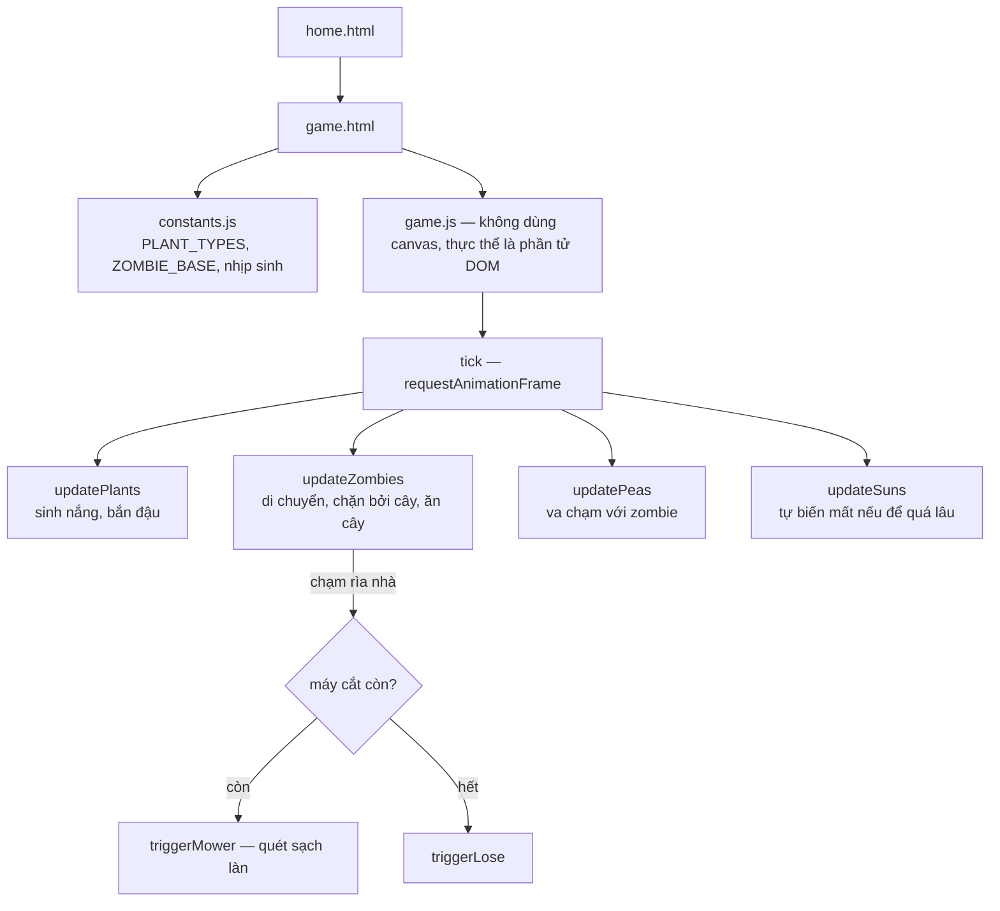

# Plants vs Zombies: quả nắng có một trình xử lý sự kiện tham chiếu tới chính nó trước khi nó tồn tại

## 1. Mở đầu

```javascript
el.addEventListener("click", () => collectSun(sunObj.id));
boardEl.appendChild(el);

const sunObj = { ... };
```

Đọc theo đúng thứ tự từ trên xuống, dòng đầu tiên gán một trình xử lý sự kiện tham chiếu tới biến `sunObj` — trước khi `const sunObj` được khai báo ở dòng thứ ba. Theo trực giác về cách JavaScript đọc code tuần tự, đây trông như một lỗi chắc chắn sẽ ném ra lỗi tham chiếu (`ReferenceError: Cannot access 'sunObj' before initialization`) ngay khi chạy. Nhưng game này đã tồn tại, đã chạy, và quả nắng vẫn nhặt được bình thường. Bài này kể về Plants vs Zombies — game tower-defense phức tạp nhất repo tính theo số lượng cơ chế đồng thời (cây trồng, zombie, đạn, nắng rơi, máy cắt cỏ, âm thanh tổng hợp) — và về đúng một dòng code trông như sai nhưng chạy đúng, nhờ một đặc tính của closure trong JavaScript ít ai để ý tới.

## 2. Bối cảnh

Plants vs Zombies khác hẳn phần lớn game còn lại trong repo ở một điểm cấu trúc quan trọng: nó không dùng `<canvas>`. Toàn bộ cây trồng, zombie, đạn, quả nắng đều là các phần tử DOM thực sự (`<div>`), di chuyển bằng cách đổi thuộc tính `style.left`/`style.top`, tương tự cách tiếp cận của Audition (dance game) chứ không phải cách tiếp cận vẽ pixel của phần lớn game canvas khác. Với một bàn cờ 5 làn, nhiều cây trồng, nhiều zombie, nhiều viên đạn cùng lúc — mỗi thực thể là một phần tử DOM riêng, một trình xử lý sự kiện riêng — độ phức tạp về quản lý vòng đời đối tượng (tạo, cập nhật, xoá đúng lúc) cao hơn hẳn so với vẽ lại toàn bộ khung hình trên một canvas duy nhất mỗi lần.

## 3. Mục tiêu sản phẩm

**Đã làm (theo README):**
- Ngân hàng hạt giống có thời gian hồi riêng từng loại, làm mờ khi không đủ nắng để mua.
- Ba loại cây: Hướng Dương (sinh nắng theo chu kỳ), Đậu Bắn (tự động bắn zombie trong làn), Hạt Dẻ Tường (máu cao, không tấn công, chỉ chặn đường).
- Nắng rơi ngẫu nhiên theo cột, trôi xuống độ cao nghỉ, nhặt được bằng cách nhấp chuột, tự biến mất nếu để quá lâu không nhặt.
- Zombie sinh ra theo thời gian rút ngắn dần, máu và tốc độ tăng dần theo số lượng đã sinh ra; thắng khi đã sinh và tiêu diệt đủ một số lượng cố định.
- Cơ chế "ăn cây": zombie chạm cây thì dừng lại gặm nhấm theo từng nhịp thời gian thay vì đi xuyên qua, cho tới khi cây chết hoặc zombie bị tiêu diệt.
- Máy cắt cỏ mỗi làn: kích hoạt một lần duy nhất, quét sạch mọi zombie trong làn đó nếu có zombie chạm tới rìa nhà; làn đã dùng hết máy cắt mà vẫn bị chạm tới thì thua ngay.
- Âm thanh tổng hợp hoàn toàn bằng Web Audio API, không dùng file âm thanh nào.

**Sẽ KHÔNG làm:**
- Không lưu tiến trình hay điểm cao nhất — mỗi lần tải lại trang là một ván hoàn toàn mới với lượng nắng khởi điểm cố định.
- Không có nhiều loại zombie khác nhau — chỉ một loại zombie cơ bản, chỉ số máu/tốc độ tăng dần theo số lượng đã sinh, không có biến thể hành vi.

MVP: trồng cây phòng thủ 5 làn, thu thập nắng, ngăn zombie chạm tới nhà, thắng khi tiêu diệt đủ số lượng zombie quy định.

## 4. Thiết kế hệ thống



Điểm thiết kế đáng chú ý nhất là cách quả nắng rơi được tách thành hai giai đoạn độc lập — hoạt ảnh CSS (rơi xuống bằng `transition`) và trạng thái logic (`falling` → `idle` → `gone`) chạy song song nhưng không đồng bộ cứng với nhau:

```javascript
requestAnimationFrame(() => {
    el.style.transition = "top 2.4s linear";
    el.style.top = restTop + "px";
});

setTimeout(() => {
    if (sunObj.state === "falling") {
        sunObj.state = "idle";
        sunObj.idleSince = performance.now();
    }
}, 2450);
```

Hoạt ảnh rơi (2.4 giây, do CSS đảm nhiệm) và mốc chuyển trạng thái sang "idle" (2.45 giây, do `setTimeout` đảm nhiệm) là hai con số riêng biệt, chỉ gần bằng nhau chứ không dùng chung một biến — đủ lệch (50ms) để đảm bảo hoạt ảnh CSS chắc chắn đã hoàn tất trước khi logic game coi quả nắng là "đã dừng rơi, có thể bắt đầu đếm giờ để biến mất".

## 5. Tech Stack

| Công nghệ | Vì sao chọn |
| --- | --- |
| **DOM thuần (`<div>` + `style.left`/`style.top`) thay vì `<canvas>`** | Với một bàn cờ dạng lưới cố định, nhiều loại thực thể có hoạt ảnh CSS riêng biệt (nắng rơi, máy cắt cỏ chạy, cây bị ăn), tận dụng CSS transition/animation có sẵn của trình duyệt đơn giản hơn nhiều so với tự vẽ và tự nội suy hoạt ảnh trên canvas. |
| **Web Audio API tổng hợp âm thanh trực tiếp, không dùng file** | `playTone` tạo một `OscillatorNode` + `GainNode` theo yêu cầu, không cần tải, lưu trữ, hay quản lý bất kỳ file âm thanh nào — đánh đổi lấy chất lượng âm thanh đơn giản hơn (chỉ có sóng sine/vuông/tam giác/răng cưa cơ bản) để đổi lấy việc không có asset binary nào trong repo. |
| **`try/catch` bọc quanh toàn bộ logic phát âm thanh** | Trình duyệt có thể chặn `AudioContext` trước khi có tương tác người dùng đầu tiên (chính sách autoplay), hoặc không hỗ trợ Web Audio API — bọc `try/catch` và im lặng bỏ qua lỗi đảm bảo một tính năng phụ (âm thanh) không bao giờ làm gãy luồng chơi chính. |
| **Không có bước dọn dẹp `removeEventListener` khi xoá phần tử DOM** | Khi một zombie/cây/quả nắng bị xoá (`el.remove()`), các trình xử lý sự kiện đã gắn vào nó (như listener click trên quả nắng) không được gỡ bỏ tường minh — chấp nhận được vì gọi `.remove()` trên một phần tử khiến nó không còn nằm trong DOM tree, engine trình duyệt tự giải phóng phần tử đó (kèm listener) qua garbage collection một khi không còn tham chiếu JavaScript nào trỏ tới nó. |

## 6. Quá trình phát triển

*(Suy luận từ cấu trúc code và README hiện có.)*

### Giai đoạn 1 — Bàn cờ 5 làn, một loại cây, di chuyển thủ công

Dựng lưới DOM (`buildBoard`), đặt cây bằng click chuột, chưa có zombie hay nắng — xác nhận cơ chế đặt cây và giới hạn "mỗi ô một cây" hoạt động đúng trước khi thêm bất kỳ đối tượng động nào.

### Giai đoạn 2 — Zombie di chuyển, cây chặn đường, cơ chế ăn cây

`updateZombies` — zombie di chuyển liên tục cho tới khi tìm thấy một cây chắn đường (`blocker`), dừng lại và chuyển sang trạng thái "đang ăn" (`eatingPlantId`), gặm theo từng nhịp cố định thay vì gây sát thương liên tục mỗi khung hình — một quyết định vừa đúng cảm giác gameplay (mỗi lần cắn có "nhịp" riêng biệt, không phải một thanh máu tụt mượt mà vô cảm) vừa dễ kiểm soát cân bằng số hơn (chỉ cần chỉnh `eatInterval`/`eatDamage`, không cần tính sát thương theo `dt`).

### Giai đoạn 3 — Nắng rơi, thu thập, và tự biến mất

`spawnFallingSun`/`collectSun`/`updateSuns` — ba trạng thái vòng đời của một quả nắng (`falling` → `idle` → `gone`), mỗi trạng thái gắn với một mốc thời gian riêng, đúng nơi bug ở phần 7 được sinh ra trong lúc viết.

### Giai đoạn 4 — Máy cắt cỏ và điều kiện thua/thắng

`triggerMower`/`triggerLose`/`triggerWin` — máy cắt cỏ là "mạng cứu hộ" một lần cho mỗi làn, quét sạch toàn bộ zombie hiện có trong làn đó (`zombies.filter((z) => z.row === row).forEach(killZombie)`) rồi tự vô hiệu hoá vĩnh viễn cho làn đó — buộc người chơi phải coi việc để zombie "chạm rìa nhà" là một sự kiện nghiêm trọng chỉ được phép xảy ra đúng một lần mỗi làn trong suốt ván.

## 7. Những bug đáng nhớ

### Một closure tham chiếu tới biến trước khi nó được khai báo — và chạy đúng nhờ đúng lúc nó thực sự được gọi

**Phát hiện khi đọc lại `spawnFallingSun` để viết bài này:**

```javascript
function spawnFallingSun() {
    ...
    const el = document.createElement("div");
    ...
    el.addEventListener("click", () => collectSun(sunObj.id));   // (1) tham chiếu sunObj
    boardEl.appendChild(el);

    const sunObj = {                                              // (2) khai báo sunObj
        id: nextId(),
        el,
        state: "falling",
        idleSince: 0,
    };
    suns.push(sunObj);
    ...
}
```

Dòng `(1)` đọc `sunObj` bên trong một hàm mũi tên (arrow function) — nhưng tại thời điểm dòng `(1)` *được thực thi* (tức là lúc `addEventListener` được gọi để đăng ký trình xử lý), bản thân hàm mũi tên đó *chưa hề chạy* — nó chỉ được lưu lại như một callback, chờ sự kiện `click` thật sự xảy ra. `const sunObj` ở dòng `(2)` chạy ngay sau đó, trong cùng một lượt thực thi đồng bộ của `spawnFallingSun`, hoàn tất trước khi hàm kết thúc. Vì một sự kiện `click` chỉ có thể xảy ra sau khi người dùng thực sự nhấp chuột — nghĩa là muộn hơn *rất nhiều* so với thời điểm `spawnFallingSun` đã chạy xong toàn bộ, bao gồm cả dòng `(2)` — nên tới lúc hàm mũi tên ở dòng `(1)` thực sự được gọi, `sunObj` trong closure của nó đã được khởi tạo đầy đủ từ lâu.

**Vì sao đây không phải một lỗi runtime, dù thứ tự khai báo trông sai:** JavaScript engine không "biên dịch" toàn bộ hàm rồi kiểm tra thứ tự biến trước khi chạy — nó thực thi tuần tự, và một closure chỉ thực sự "đọc" giá trị của biến nó tham chiếu tại đúng thời điểm nó được *gọi*, không phải tại thời điểm nó được *định nghĩa*. Do đó, miễn là không có gì gọi hàm mũi tên đó *trước* khi dòng `(2)` chạy xong (và với một sự kiện click cần tương tác người dùng thật, điều đó gần như không bao giờ xảy ra), code chạy đúng như mong đợi mọi lần.

**Rủi ro thực sự nằm ở đâu:** Đây là kiểu code "đúng nhờ may mắn về thời gian" hơn là "đúng nhờ cấu trúc rõ ràng". Nếu sau này ai đó tái cấu trúc `spawnFallingSun` — ví dụ gọi trực tiếp hàm xử lý click ngay trong quá trình khởi tạo để giả lập "tự động nhặt nắng" cho một chế độ chơi thử — mà không để ý tới thứ tự khai báo hiện tại, họ sẽ gặp ngay `ReferenceError: Cannot access 'sunObj' before initialization`, một lỗi hoàn toàn không liên quan tới logic họ vừa thêm vào, mà tới một quyết định thứ tự dòng lệnh từ trước đó rất lâu.

**Điều rút ra:** JavaScript cho phép một closure "hứa hẹn" đọc một biến chưa tồn tại tại thời điểm nó được định nghĩa, miễn là biến đó tồn tại trước khi closure thực sự được gọi — một sự linh hoạt mạnh mẽ nhưng cũng dễ gây hiểu lầm khi đọc code theo đúng thứ tự dòng từ trên xuống. Thứ tự "khai báo dữ liệu trước, gắn trình xử lý sự kiện tham chiếu tới dữ liệu đó sau" luôn là thói quen an toàn hơn — không thay đổi hành vi runtime trong trường hợp này, nhưng loại bỏ hoàn toàn khả năng một thay đổi không liên quan trong tương lai vô tình biến một đoạn code "chạy đúng nhờ may mắn thời gian" thành một lỗi thật.

## 8. Những quyết định sai

**Hai mốc thời gian riêng biệt (`2.4s` trong CSS transition và `2450`ms trong `setTimeout`) cùng mô tả "quả nắng đã rơi xong", nhưng không dùng chung một hằng số.** Chênh lệch 50ms hiện tại đủ an toàn (transition CSS chắc chắn hoàn tất trước khi `setTimeout` bắn), nhưng nếu ai đó chỉnh thời gian rơi (ví dụ đổi `"top 2.4s linear"` thành một giá trị khác) mà quên đồng bộ con số `2450` tương ứng, quả nắng có thể được coi là "idle" trước khi hoạt ảnh rơi thực sự kết thúc trên màn hình — một sự lệch pha nhỏ giữa cái người chơi nhìn thấy và cái logic game tin là đang xảy ra.

## 9. Những điều học được

- **Một closure không đọc giá trị biến tại thời điểm định nghĩa — nó đọc tại thời điểm được gọi** — hiểu đúng sự khác biệt này giải thích được vì sao code "trông sai thứ tự" vẫn có thể chạy hoàn toàn chính xác, và giúp nhận ra khi nào sự linh hoạt đó đang được tận dụng có chủ đích hay chỉ đơn thuần là một sự trùng hợp may mắn về thời gian.
- **"Chạy đúng" và "viết theo thứ tự an toàn" là hai tiêu chuẩn khác nhau** — một đoạn code có thể đạt tiêu chuẩn đầu mà không đạt tiêu chuẩn sau, và khoảng cách đó chỉ trở thành vấn đề thật khi có ai đó (kể cả chính tác giả, ở một thời điểm khác) thay đổi bối cảnh xung quanh nó mà không biết về sự phụ thuộc thời gian ngầm định đó.
- **Hai hằng số mô tả cùng một khái niệm thời gian nhưng được viết ở hai đơn vị/hai cú pháp khác nhau (chuỗi CSS `"2.4s"` và số `2450`) rất dễ trôi lệch nhau qua các lần chỉnh sửa** — gộp chúng về một nguồn duy nhất (một hằng số mili-giây, chuyển đổi sang chuỗi CSS khi cần) sẽ loại bỏ hoàn toàn rủi ro đó.

## 10. Kết quả

| Hạng mục | Con số |
| --- | --- |
| Tổng số dòng code (JS + CSS + HTML) | 1.346 dòng |
| `js/game.js` | 551 dòng |
| `css/game.css` | 440 dòng |
| `css/plan-and-zombie.css` | 200 dòng |
| `js/constants.js` | 61 dòng |
| Số loại cây | 3 (Hướng Dương, Đậu Bắn, Hạt Dẻ Tường) |
| Số làn | 5, mỗi làn một máy cắt cỏ dùng một lần |
| Test tự động | 0 |
| CI/CD | Không có |

## 11. Nếu làm lại từ đầu

- **Đảo thứ tự trong `spawnFallingSun`: khai báo `const sunObj` trước, gắn `addEventListener` tham chiếu tới nó sau** — không đổi hành vi runtime (vì đã chạy đúng), nhưng loại bỏ hoàn toàn dạng phụ thuộc thời gian ngầm định đã phân tích ở Bug, giúp code an toàn trước mọi thay đổi trong tương lai, không chỉ an toàn trong bối cảnh hiện tại.
- **Gộp thời gian rơi của nắng về một hằng số duy nhất** (ví dụ `SUN_FALL_DURATION_MS = 2400`), dùng nó cho cả `el.style.transition` (chuyển thành chuỗi `"top " + (SUN_FALL_DURATION_MS/1000) + "s linear"`) lẫn `setTimeout`, xoá bỏ khoảng lệch thủ công 50ms hiện tại.
- **Thêm `removeEventListener` tường minh trước khi gọi `el.remove()`** cho các phần tử có gắn listener — không bắt buộc về mặt kỹ thuật (garbage collector đã xử lý đúng), nhưng làm rõ ý đồ dọn dẹp tài nguyên hơn là dựa ngầm vào hành vi tự động của engine.

## 12. Kết

Plants vs Zombies là game "phi-canvas" phức tạp nhất repo, và đúng như kỳ vọng với một codebase quản lý nhiều phần tử DOM động cùng lúc, phần lớn bug tiềm ẩn thường nằm ở vòng đời đối tượng — tạo, cập nhật, xoá đúng lúc. Điều bất ngờ nhất tìm được không phải một lỗi theo nghĩa thông thường, mà là một dòng code hoàn toàn đúng nhưng viết theo thứ tự "sai" so với trực giác đọc tuần tự — một lời nhắc rằng hiểu đúng closure trong JavaScript không chỉ là kiến thức lý thuyết, mà trực tiếp quyết định được liệu một đoạn code "trông đáng ngờ" khi đọc lướt có thực sự là bug hay không.
