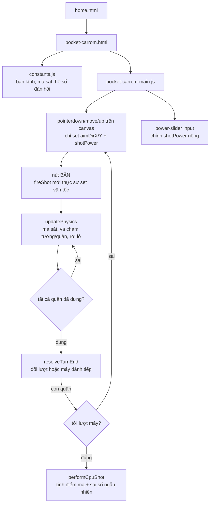

# Pocket Carrom: khi "kéo rồi thả là bắn" hoá ra là một ý tưởng tồi trên điện thoại

## 1. Mở đầu

Bản đầu tiên của Pocket Carrom chỉ có đúng một cách bắn: kéo quân cái ra xa theo hướng ngược với hướng muốn bắn, thả tay ra là viên bi lập tức lao đi — y hệt cơ chế ná thun quen thuộc trong vô số game mobile. Trên chuột máy tính, cách này mượt và trực quan. Nhưng nó có một lỗ hổng chỉ lộ ra khi nghĩ tới ngón tay thật trên màn hình cảm ứng: ngón tay che mất đúng điểm đang kéo, và một khi đã nhấc tay lên là viên bi đã bay mất — không có cơ hội "à khoan, chỉnh lại lực một chút" trước khi bắn thật. Bản mới nhất của game này không còn bắn ngay khi thả tay nữa — kéo giờ chỉ để *ngắm*, một thanh trượt riêng để *chỉnh lực*, và một nút "BẮN" riêng để *xác nhận*. Ba bước tách bạch thay vì một cử chỉ duy nhất. Bài này kể câu chuyện vì sao.

## 2. Bối cảnh

Pocket Carrom là game thứ ba trong loạt "máy Nokia hoài niệm" — sau Space Impact và Rapid Roll — nhưng khác hẳn hai game trước ở một điểm: đây không phải remake trực tiếp một game cầm tay cụ thể, mà là bàn cờ carrom vật lý thật, nơi người chơi đấu với máy qua từng lượt bắn xen kẽ. Nó cũng là game vật lý phức tạp nhất trong cả loạt tính đến thời điểm đó — không chỉ có một quả bóng nảy tường như Rapid Roll, mà là 19 quân cờ (18 quân thường + 1 hậu đỏ) cộng một quân cái, tất cả có thể va chạm chồng chéo lẫn nhau trong cùng một cú bắn.

## 3. Mục tiêu sản phẩm

**Sẽ làm:**
- Vật lý va chạm tròn-tròn thật: ma sát giảm tốc tuyến tính, phản xạ tường có hệ số đàn hồi, va chạm giữa hai quân bảo toàn động lượng theo khối lượng tỉ lệ bán kính bình phương.
- Bàn cờ vuông, 4 lỗ góc, quân xếp vòng tròn đồng tâm quanh hậu đỏ (6 quân vòng trong, 12 quân vòng ngoài, xen kẽ trắng/đen).
- Đấu lượt với máy: quân trắng của người chơi, quân đen của máy, hậu đỏ tính điểm thưởng cho bất kỳ ai đưa được vào lỗ.
- Luật đơn giản hoá: đưa được quân màu mình (hoặc hậu) vào lỗ thì được đánh tiếp; không thì đổi lượt; quân cái vào lỗ là phạm luật, đổi lượt và đặt lại quân cái.
- AI máy: nhắm vào quân đen gần lỗ nhất bằng công thức "điểm ma" (ghost ball), có sai số ngẫu nhiên để không phải lúc nào cũng chính xác tuyệt đối.
- Kéo để ngắm hướng, thanh trượt để tinh chỉnh lực, nút Bắn để xác nhận — tách bạch ba hành động thay vì gộp vào một cử chỉ kéo-thả.

**Sẽ KHÔNG làm:**
- Không áp dụng luật carrom chuẩn quốc tế (không yêu cầu "phủ" hậu bằng một quân thường ngay sau khi ăn hậu, không có due — luật bị đơn giản hoá có chủ đích để dễ chơi ngay không cần đọc luật dài).
- Không có chế độ 2 người chơi cùng máy — chỉ người chơi đấu máy.
- Không có multiplayer online.

MVP: bắt đầu ván, kéo-chỉnh lực-bắn quân cái, va chạm vật lý thật, ăn quân ghi điểm, đấu tới khi hết quân, so điểm ai thắng.

## 4. Thiết kế hệ thống



Điểm khác biệt lớn nhất so với thiết kế ban đầu nằm ở chỗ tách rời hoàn toàn "aim" (ngắm) khỏi "fire" (bắn), thể hiện ngay trong comment đầu file:

```javascript
// Aiming is decoupled from firing: dragging the striker (or the power
// slider) only updates the locked-in aim/power; the shot only actually
// fires when the "Bắn" button is pressed. This gives touch players a
// second, more forgiving chance to fine-tune power before committing,
// instead of having to nail direction+power in one continuous drag.
let aimReady = false;
let aimDirX = 0;
let aimDirY = -1;
let shotPower = 0.5;
```

`pointerup` trên canvas giờ không còn set vận tốc trực tiếp — nó chỉ tính `aimDirX`/`aimDirY`/`shotPower` từ vector kéo rồi bật cờ `aimReady = true`, đồng bộ giá trị lên thanh trượt (`powerSlider.value = ...`). Vận tốc thật sự chỉ được gán vào `striker.vx`/`striker.vy` bên trong `fireShot()` — hàm duy nhất gắn với sự kiện `click` của nút Bắn.

## 5. Tech Stack

| Công nghệ | Vì sao chọn |
| --- | --- |
| **Va chạm tròn-tròn tự viết (không dùng physics engine)** | Chỉ có tối đa 20 thực thể tròn cùng bán kính đồng dạng, không cần vật lý đa giác hay ràng buộc phức tạp — một hàm `resolveCollision` ~30 dòng dựa trên xung lượng (impulse) là đủ, tự viết nhẹ hơn nhiều so với nhúng một thư viện vật lý đầy đủ tính năng như Matter.js. |
| **Khối lượng suy ra từ diện tích (`radius²`)** | Quân cái (`STRIKER_RADIUS = 11`) cần nặng hơn quân thường (`COIN_RADIUS = 9`) để cú bắn thật sự đẩy được các quân khác đi, đúng cảm giác carrom thật — dùng bình phương bán kính là một xấp xỉ vật lý hợp lý (khối lượng tỉ lệ diện tích với mật độ đều) mà không cần một trường `mass` riêng phải đồng bộ tay. |
| **"Điểm ma" (ghost ball) cho AI ngắm** | Kỹ thuật kinh điển của game bi-a/carrom: tính điểm mà quân cái *phải* chạm vào để đẩy quân mục tiêu đúng hướng tới lỗ, rồi nhắm quân cái vào điểm đó — đơn giản hơn nhiều so với việc giải ngược phương trình va chạm, và đủ chính xác cho một AI không cần chơi hoàn hảo. |
| **Tách `aim`/`fire` thành hai bước qua slider + nút riêng** | Xem phần 7 — quyết định đổi hướng lớn nhất của cả game, sinh ra trực tiếp từ việc nghĩ lại trải nghiệm chạm trên điện thoại. |

## 6. Quá trình phát triển

### Giai đoạn 1 — Vật lý cốt lõi: ma sát, tường, va chạm

Bắt đầu từ ba hàm độc lập: `applyFriction` (giảm tốc tuyến tính theo `FRICTION_DECEL`, không phải giảm theo tỉ lệ phần trăm — để mọi quân dừng lại sau cùng một khoảng thời gian xấp xỉ, bất kể tốc độ ban đầu), `handlePocketsAndWalls` (kiểm tra rơi lỗ trước, phản xạ tường sau — thứ tự này quan trọng: một quân gần rơi lỗ không nên bị "bật" ngược lại bởi luật tường), và `resolveCollision` (tách vị trí chồng lấn theo tỉ lệ khối lượng nghịch đảo, rồi cộng xung lượng theo hệ số đàn hồi `PIECE_RESTITUTION`).

### Giai đoạn 2 — Xếp quân theo hai vòng tròn đồng tâm

```javascript
for (let i = 0; i < 6; i++) {
    const angle = (Math.PI / 3) * i - Math.PI / 2;
    combined.push({ x: center.x + Math.cos(angle) * ring1Radius, ... });
}
for (let i = 0; i < 12; i++) {
    const angle = (Math.PI / 6) * i - Math.PI / 2 + Math.PI / 12;
    combined.push({ x: center.x + Math.cos(angle) * ring2Radius, ... });
}
```

6 quân vòng trong cách nhau 60°, 12 quân vòng ngoài cách nhau 30° và lệch pha 15° so với vòng trong (để không quân nào thẳng hàng bán kính với quân vòng trong, giống cách xếp carrom thật) — rồi tô màu xen kẽ trắng/đen theo chỉ số chẵn/lẻ trong mảng đã nối, đảm bảo đúng 9 trắng - 9 đen mà không cần đếm tay.

### Giai đoạn 3 — AI máy: điểm ma và sai số có chủ đích

AI không chơi hoàn hảo — mỗi lần tính hướng bắn xong, nó xoay vector đó đi một góc ngẫu nhiên nhỏ (`CPU_AIM_ERROR`) bằng ma trận xoay 2D thủ công (`rotX = dirX*cos - dirY*sin`), để máy có xác suất bắn hụt hợp lý thay vào việc luôn luôn chính xác tuyệt đối — nếu không, một AI dùng đúng công thức "điểm ma" không sai số sẽ gần như bất bại.

### Giai đoạn 4 — Viết lại cơ chế bắn: từ một cử chỉu thành ba bước

Đây là giai đoạn đáng kể nhất, xảy ra *sau* khi bản đầu tiên đã chạy được hoàn chỉnh. Bản gốc: `pointerup` tính vector kéo, gán thẳng vào `striker.vx`/`vy`, bắn ngay. Vấn đề lộ ra khi nghĩ nghiêm túc về trải nghiệm chạm: ngón tay người dùng đang đè lên đúng khu vực quân cái và đường ngắm trong lúc kéo, họ không nhìn thấy trọn vẹn đường bắn cho tới khi nhấc tay — mà nhấc tay lại đồng nghĩa với bắn luôn, không có đường lùi. Giải pháp là tách `aimReady` (đã ngắm xong, đang chờ) ra khỏi hành động bắn thật sự, thêm một thanh trượt lực riêng (không phụ thuộc độ dài kéo nữa) và một nút Bắn tường minh — người chơi có thể kéo lại nhiều lần, chỉnh slider, nhìn kỹ đường ngắm màu (xanh/vàng/đỏ theo mức lực) trước khi thật sự cam kết.

## 7. Những bug đáng nhớ

### Bug tiềm ẩn: kiểm tra rơi lỗ và phản xạ tường có thể "giằng co" nhau ở rìa bàn

**Hiện tượng (phát hiện khi đọc lại `handlePocketsAndWalls`):** Lỗ nằm đúng tại 4 góc bàn (`{x: BOARD_PADDING, y: BOARD_PADDING}`, ...), tức là *chính giữa* giao điểm của hai cạnh tường. Một quân bay tới gần góc bàn nhưng không đủ gần tâm lỗ để bị "nuốt" (điều kiện `dist(p, pocket) < POCKET_RADIUS - p.radius * 0.35`) sẽ rơi vào vùng vừa gần lỗ vừa chạm cả hai cạnh tường cùng lúc.

**Vì sao không phải bug thật sự:** Hàm return ngay sau khi tìm thấy quân rơi lỗ (`return;` trong vòng lặp `for (const pocket of pockets)`), và toàn bộ khối kiểm tra tường nằm *sau* vòng lặp đó trong cùng một hàm — nên nếu quân đã rơi lỗ, code không bao giờ chạy tới phần phản xạ tường trong cùng một lệnh gọi hàm. Trường hợp duy nhất có thể gây cảm giác "kỳ lạ" là một quân sượt qua rất sát miệng lỗ mà không đủ điều kiện rơi (`>= POCKET_RADIUS - radius*0.35`) — nó sẽ bị bật lại bởi tường như bình thường, đúng ý đồ thiết kế (chưa đủ gần thì chưa được tính là vào lỗ), không phải lỗi.

**Điều rút ra:** Đây là một trường hợp mà việc "đi tìm bug" lại xác nhận code đúng — nhưng quá trình xác nhận đó vẫn có giá trị, vì thứ tự return-sớm trong một hàm xử lý nhiều điều kiện loại trừ lẫn nhau (rơi lỗ HOẶC chạm tường, không thể cả hai) là kiểu logic rất dễ vô tình phá vỡ nếu sau này ai đó thêm một nhánh mới vào giữa mà quên giữ nguyên tắc "return sớm khi đã xử lý xong".

## 8. Những quyết định sai

**Luật carrom bị đơn giản hoá tới mức không còn "phủ hậu" (due) — hậu đỏ vào lỗ chỉ đơn giản cộng điểm ngay, không cần đánh tiếp một quân thường ngay sau đó để "khoá" điểm hậu như luật thật.** Đây là lựa chọn có ý thức để giữ luật dễ hiểu trong vài giây đọc mô tả, nhưng đồng nghĩa hậu đỏ trong game này không mang đúng ý nghĩa chiến thuật "rủi ro cao, thưởng cao" như carrom thật, nơi ăn hậu mà không phủ được sẽ bị trả quân về bàn.

**AI luôn nhắm vào quân gần lỗ bất kỳ nhất, không xét xem đường bắn có bị quân khác chắn hay không.** `performCpuShot` tính điểm ma và hướng bắn thuần hình học, không kiểm tra xem giữa quân cái và điểm ma có quân nào khác cản đường — trên thực tế điều này hiếm khi lộ rõ vì bàn cờ khá thoáng sau vài lượt đầu, nhưng về lý thuyết máy hoàn toàn có thể "bắn xuyên" qua một quân chắn đường mà không nhận ra, dẫn tới cú bắn trông ngớ ngẩn trong một số thế cờ hiếm.

## 9. Những điều học được

- **Cử chỉ kéo-thả trực quan trên chuột không tự động trực quan trên cảm ứng** — sự khác biệt cốt lõi là chuột luôn hiển thị con trỏ tách biệt khỏi điểm click, còn ngón tay che khuất chính xác nơi đang tương tác. Bất kỳ cơ chế nào dựa vào "nhìn thấy trạng thái trong lúc kéo" đều cần nghĩ lại khi target là màn hình cảm ứng.
- **Tách một hành động phức hợp (ngắm + chọn lực + bắn) thành các bước độc lập, có thể huỷ giữa chừng, luôn an toàn hơn cho người dùng** — dù tốn thêm một cú chạm (nút Bắn), đổi lại là khả năng sửa sai trước khi cam kết, một đánh đổi gần như luôn đáng giá cho các thao tác không thể hoàn tác.
- **"Điểm ma" là một kỹ thuật rẻ và đủ tốt cho AI nhắm bắn hình học** — không cần giải phương trình vi phân hay mô phỏng trước cú bắn, chỉ cần một phép cộng vector là ra được hướng bắn hợp lý.
- **Không phải mọi nghi ngờ khi đọc lại code đều dẫn tới một bug thật** — nhưng việc đi tới cùng để xác nhận (thay vì dừng lại ở "chắc không sao đâu") vẫn là bước cần thiết để tự tin vào đoạn code đó.

## 10. Kết quả

| Hạng mục | Con số |
| --- | --- |
| Tổng số dòng code (JS + CSS + HTML) | 1.055 dòng |
| `js/pocket-carrom-main.js` | 570 dòng |
| `css/pocket-carrom.css` | 242 dòng |
| `css/home.css` | 125 dòng |
| `js/constants.js` | 30 dòng |
| Số quân trên bàn | 19 (9 trắng, 9 đen, 1 hậu đỏ) + 1 quân cái |
| Test tự động | 0 — kiểm tra bằng cách kéo-bắn thật qua Chrome automation, quan sát quân văng đúng vật lý |
| CI/CD | Không có |

## 11. Nếu làm lại từ đầu

- **Cho AI kiểm tra đường bắn có bị chắn không** trước khi chọn mục tiêu — loại bỏ trường hợp máy chọn một cú bắn nhìn ngớ ngẩn dù công thức "điểm ma" đúng lý thuyết.
- **Thêm rung nhẹ (haptic feedback qua `navigator.vibrate`) khi nhấn nút Bắn trên điện thoại** — một phản hồi xúc giác nhỏ sẽ củng cố thêm cảm giác "đã cam kết" của bước xác nhận, đúng tinh thần thiết kế lại ở phần 6.
- **Cân nhắc thêm luật phủ hậu tối giản** (ví dụ: ăn hậu chỉ tính điểm nếu lượt đó cũng ăn được ít nhất một quân thường của mình) — giữ đơn giản nhưng gần luật thật hơn một chút.

## 12. Kết

Câu chuyện lớn nhất của Pocket Carrom không nằm ở vật lý va chạm (dù đó là phần code phức tạp nhất) mà nằm ở việc thiết kế input phải được viết lại sau khi đã "xong" — không phải vì nó có bug, mà vì nó chưa đủ tốt cho đúng đối tượng người dùng thật sự sẽ chạm vào nó bằng ngón tay chứ không phải con trỏ chuột. Một cơ chế điều khiển "chạy đúng" và một cơ chế điều khiển "cảm giác đúng" hoá ra là hai tiêu chuẩn khác nhau, và chỉ tiêu chuẩn thứ hai mới thật sự quyết định game có chơi được thoải mái trên điện thoại hay không.
