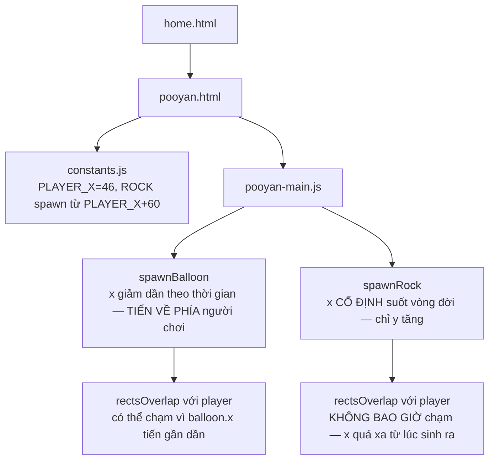

# Pooyan: viên đá không bao giờ có thể chạm tới bạn, dù màn hình nói ngược lại

## 1. Mở đầu

Màn hình bắt đầu của game này ghi rõ: "Bắn nổ bóng bay và đá rơi, đừng để chúng chạm tới bạn!" — hai mối nguy, một lời cảnh báo duy nhất. Nhưng lần theo đúng con số toạ độ nơi đá được sinh ra, và đúng công thức chuyển động của nó mỗi khung hình, có một sự thật không ai để ý: **viên đá không bao giờ, dưới bất kỳ hoàn cảnh nào, có thể chạm tới người chơi.** Không phải vì đá bay quá chậm hay né quá dễ — mà vì khoảng cách ngang giữa nơi đá được phép sinh ra và nơi người chơi đứng luôn lớn hơn khoảng cách hai vật cần chạm nhau để va chạm được tính là xảy ra, và đá không bao giờ di chuyển ngang trong suốt vòng đời của nó.

## 2. Bối cảnh

Pooyan là bản clone của game arcade cùng tên — một cung thủ đứng cố định bên trái màn hình, bắn tên sang phải để tiêu diệt hai loại mục tiêu: bóng bay trôi vào từ bên phải theo đường sin, và đá rơi thẳng từ trên xuống. Đây cũng chính là game được dùng làm khuôn mẫu gốc cho rất nhiều game canvas viết sau nó trong repo (Space Impact, Bắn Ruồi, Hứng Bia đều mượn lại cấu trúc `state machine`, `rectsOverlap`, `difficultyStep` từ đây) — khiến việc phát hiện ra một lỗ hổng va chạm ngay trong chính bản gốc này đặc biệt đáng chú ý, vì cấu trúc đó đã được tin tưởng và tái sử dụng nhiều lần mà không ai đặt lại câu hỏi cho từng con số cụ thể.

## 3. Mục tiêu sản phẩm

**Đã làm (theo README):**
- Cung thủ di chuyển lên/xuống dọc theo một trục cố định bên trái, bắn tên sang phải.
- Bóng bay trôi vào từ phải theo đường sin (dao động lên xuống trong lúc trôi ngang), đá rơi thẳng từ trên xuống — điểm khác nhau (100 cho bóng, 60 cho đá).
- 3 mạng, bất tử tạm thời có nhấp nháy sau khi mất mạng.
- Độ khó tăng theo điểm số: cứ mỗi 800 điểm, tốc độ bóng/đá tăng một bậc, tối đa 6 bậc.
- Bàn phím và điều khiển chạm (D-pad + nút bắn) đều dùng được.

**Sẽ KHÔNG làm:**
- Không có mối đe doạ nào khác ngoài bóng bay và đá rơi — không có địch di chuyển phức tạp, không có đạn bắn trả.
- (Ngoài ý muốn) Không có va chạm thực sự giữa đá và người chơi — xem phần 7.

MVP: bắn hạ bóng bay và đá rơi trước khi chúng "chạm" tới cung thủ, giữ 3 mạng càng lâu càng tốt, điểm cao nhất được lưu lại.

## 4. Thiết kế hệ thống



Sự khác biệt cốt lõi giữa hai loại mối đe doạ nằm ở đúng một chi tiết chuyển động:

```javascript
// Bóng bay: x GIẢM DẦN theo thời gian — thực sự tiến về phía cung thủ
balloons.forEach((b) => {
    b.elapsed += dt;
    b.x -= b.speed * dt;
});

// Đá: chỉ y TĂNG DẦN — x giữ nguyên suốt vòng đời, không bao giờ tiến gần cung thủ hơn
rocks.forEach((r) => {
    r.y += r.speed * dt;
});
```

Bóng bay có một trục chuyển động (`x`) hướng thẳng về phía cung thủ đứng cố định ở bên trái — nó thực sự "tới gần" theo đúng nghĩa đen mỗi khung hình. Đá thì không: toạ độ `x` của nó được chốt cứng ngay tại thời điểm sinh ra và không bao giờ thay đổi, chỉ có `y` (độ cao) thay đổi khi nó rơi xuống. Với một cung thủ chỉ di chuyển theo trục dọc tại một vị trí `x` cố định, hai vật thể chỉ có thể va chạm nếu vùng toạ độ `x` của chúng từng chồng lấn nhau tại một thời điểm nào đó — và với đá, điều đó phải đúng *ngay từ lúc sinh ra*, vì nó không bao giờ thay đổi sau đó.

## 5. Tech Stack

| Công nghệ | Vì sao chọn |
| --- | --- |
| **AABB (`rectsOverlap`) cho mọi va chạm** | Cách kiểm tra va chạm đơn giản và rẻ nhất, được tái sử dụng nguyên xi ở mọi game sau này trong repo bắt nguồn từ đây — bản thân hàm này không có vấn đề gì, vấn đề (xem phần 7) nằm ở dữ liệu toạ độ đưa vào nó, không nằm ở chính hàm kiểm tra. |
| **Bóng bay dùng hàm sin cho dao động dọc, cộng chuyển động ngang tuyến tính** | Kết hợp hai chuyển động độc lập (`b.x -= speed*dt` cho tiến tới, `Math.sin(...)` cho lên xuống) tạo cảm giác bay lượn tự nhiên mà không cần một hệ vật lý phức tạp nào. |
| **Đá chỉ rơi thẳng, không có chuyển động ngang** | Một quyết định đơn giản hoá hợp lý về mặt hình ảnh (đá rơi tự do dưới trọng lực, không có lý do vật lý để nó trôi ngang) — nhưng chính sự đơn giản hoá "không cần trôi ngang" này, kết hợp với vùng sinh ra quá xa cung thủ, là nguồn gốc của bug ở phần 7. |

## 6. Quá trình phát triển

*(Suy luận từ cấu trúc code và README hiện có.)*

### Giai đoạn 1 — Cung thủ, bắn tên, một loại mục tiêu

Nền tảng: cung thủ di chuyển dọc, bắn tên ngang, va chạm AABB đơn giản với một loại mục tiêu duy nhất (nhiều khả năng là bóng bay, vì đây là mối đe doạ "hoạt động đúng" — di chuyển thực sự về phía người chơi).

### Giai đoạn 2 — Thêm đá rơi làm mối đe doạ thứ hai

```javascript
function spawnRock() {
    const bonus = difficultyStep() * DIFFICULTY_SPEED_BONUS;
    rocks.push({
        x: randomBetween(PLAYER_X + 60, GAME_WIDTH - ROCK_SIZE),
        y: -ROCK_SIZE,
        speed: randomBetween(ROCK_SPEED_MIN, ROCK_SPEED_MAX) + bonus,
        alive: true,
    });
}
```

Khoảng sinh `PLAYER_X + 60` nhiều khả năng được chọn với ý định hợp lý: tránh đá sinh ra chồng ngay lên vị trí cung thủ (một sự cố "chết ngay khi vừa xuất hiện" hoàn toàn có thể xảy ra nếu không có khoảng đệm này). Nhưng khoảng đệm 60px đó, cộng với việc đá không bao giờ di chuyển ngang sau khi sinh ra, vô tình đẩy luôn khả năng va chạm ra khỏi tầm với vĩnh viễn — không chỉ tránh được sự cố "chết ngay khi xuất hiện", mà tránh được luôn *mọi* khả năng va chạm trong suốt vòng đời của viên đá.

### Giai đoạn 3 — Độ khó tăng dần, bất tử tạm thời

`difficultyStep`, `loseLife` với khoảng bất tử nhấp nháy — các cơ chế tổng quát, không phân biệt loại mối đe doạ, được viết ra với giả định ngầm rằng cả hai loại (bóng bay và đá) đều có khả năng thực sự gây ra `loseLife`. Giả định đó đúng với bóng bay, nhưng như đã phân tích, chưa từng đúng với đá.

## 7. Những bug đáng nhớ

### Đá rơi: một mối đe doạ chỉ tồn tại trên màn hình, không tồn tại trong luật va chạm

**Phát hiện khi tính toán cụ thể phạm vi toạ độ của cung thủ và đá để viết bài này:**

Cung thủ: `PLAYER_X = 46`, `PLAYER_SIZE = 30` → vùng va chạm trải từ `x = 46 - 15 = 31` tới `x = 46 + 15 = 61`.

Đá: sinh ra tại `x = randomBetween(PLAYER_X + 60, GAME_WIDTH - ROCK_SIZE) = randomBetween(106, 334)`, với `ROCK_SIZE = 26` → ngay cả viên đá sinh ra gần cung thủ nhất có thể (`x = 106`), vùng va chạm của nó trải từ `106 - 13 = 93` tới `106 + 13 = 119`.

So sánh hai khoảng: cạnh phải xa nhất của cung thủ là `61`; cạnh trái gần nhất mà bất kỳ viên đá nào từng có thể đạt được là `93`. Khoảng cách tối thiểu giữa chúng — **32 pixel** — không bao giờ thu hẹp, vì toạ độ `x` của một viên đá không hề thay đổi từ lúc sinh ra (`y = -ROCK_SIZE`) cho tới lúc nó rơi khỏi đáy màn hình và bị xoá khỏi mảng `rocks`. `rectsOverlap` giữa cung thủ và bất kỳ viên đá nào, ở bất kỳ thời điểm nào trong toàn bộ vòng đời của viên đá đó, sẽ luôn trả về `false`.

**Hệ quả:** Đá rơi trong game này là một mối đe doạ hoàn toàn trang trí — nó rơi, nó có thể bị bắn hạ để ghi 60 điểm, nhưng nó không bao giờ có thể khiến người chơi mất mạng, bất kể cung thủ đứng yên hay di chuyển liên tục, bất kể độ khó đã tăng cao tới đâu. Toàn bộ rủi ro thực sự trong ván chơi chỉ tới từ bóng bay — thứ duy nhất thực sự di chuyển về phía cung thủ.

**Vì sao không ai nhận ra khi chơi thử:** Đá rơi vẫn *trông* nguy hiểm — nó rơi nhanh, nó xuất hiện đột ngột, và bản năng tự nhiên của người chơi là tránh đường bay của nó dù không cần thiết. Cảm giác "mình vừa né được một viên đá" hoàn toàn có thể xảy ra dù về mặt toán học, viên đá đó chưa bao giờ có khả năng chạm tới cung thủ ngay từ đầu — một dạng ảo giác về rủi ro, không phải rủi ro thật.

**Điều rút ra:** Va chạm giữa hai vật thể không chỉ phụ thuộc vào việc hàm kiểm tra va chạm (`rectsOverlap`) có đúng hay không — nó phụ thuộc vào việc *dữ liệu toạ độ* đưa vào hàm đó có bao giờ thực sự đạt tới điều kiện chồng lấn hay không. Một hàm kiểm tra hoàn toàn chính xác vẫn có thể không bao giờ trả về `true` nếu không gian giá trị của các đối số truyền vào nó, xét theo thời gian, chưa bao giờ giao nhau — đây là loại lỗi không nằm trong logic kiểm tra, mà nằm trong hình học của toàn bộ hệ thống sinh ra dữ liệu cho nó.

## 8. Những quyết định sai

**Không có bước kiểm chứng bằng số cụ thể rằng vùng sinh ra của một mối đe doạ mới thực sự chồng lấn được với vùng va chạm của người chơi**, dù chỉ ở điều kiện thuận lợi nhất. `PLAYER_X + 60` là một con số hợp lý *nhìn bằng mắt* trên màn hình rộng 360px, nhưng không có phép tính nào xác nhận rằng khoảng đệm đó, kết hợp với việc đá không di chuyển ngang, không vô tình loại bỏ hoàn toàn khả năng va chạm — một phép kiểm tra đơn giản (so `PLAYER_X + PLAYER_SIZE/2` với cận dưới của khoảng sinh đá trừ `ROCK_SIZE/2`) đáng lẽ đã lộ ra vấn đề này ngay từ giai đoạn thiết kế.

## 9. Những điều học được

- **Một mối đe doạ trong game có thể "trông nguy hiểm" (rơi nhanh, xuất hiện bất ngờ) mà không hề nguy hiểm về mặt toán học** — cảm giác của người chơi khi thử nghiệm không phải bằng chứng đáng tin cậy cho việc một cơ chế va chạm hoạt động đúng, vì bản năng né tránh của con người không phân biệt được rủi ro thật với rủi ro chỉ tồn tại trên màn hình.
- **Một khoảng đệm an toàn (tránh spawn chồng lên người chơi) và một khoảng cách loại bỏ hoàn toàn khả năng va chạm là hai điều rất khác nhau về độ lớn, nhưng dễ bị nhầm là "cùng một loại quyết định an toàn"** — cần tính cụ thể bằng số, không chỉ ước lượng bằng mắt trên một bản vẽ màn hình.
- **Khi một thực thể chỉ di chuyển theo MỘT trục (ở đây là đá, chỉ có `y` thay đổi), toàn bộ khả năng va chạm với một đối tượng khác trong tương lai đã được quyết định trọn vẹn ngay tại thời điểm nó được sinh ra** trên trục còn lại (ở đây là `x`) — không có cơ hội "sửa sai" sau đó, vì trục đó không bao giờ thay đổi nữa trong suốt vòng đời của nó.

## 10. Kết quả

| Hạng mục | Con số |
| --- | --- |
| Tổng số dòng code (JS + CSS + HTML) | 847 dòng |
| `js/pooyan-main.js` | 348 dòng |
| `css/pooyan.css` | 253 dòng |
| `css/home.css` | 125 dòng |
| `js/constants.js` | 35 dòng |
| Khoảng cách tối thiểu giữa vùng va chạm cung thủ và vùng sinh đá gần nhất | 32px, không bao giờ thu hẹp |
| Test tự động | 0 |
| CI/CD | Không có |

## 11. Nếu làm lại từ đầu

- **Giảm khoảng đệm sinh đá xuống mức thực sự cần thiết để tránh spawn-chồng** (ví dụ `PLAYER_X + PLAYER_SIZE`, đủ để không sinh ngay trên người chơi nhưng vẫn nằm trong tầm va chạm có thể xảy ra), thay vì `PLAYER_X + 60` — sửa tận gốc Bug đã ghi nhận, biến đá thành một mối đe doạ thật.
- **Hoặc, nếu ý đồ ban đầu thực sự là "đá chỉ ghi điểm, không gây nguy hiểm"** (một lựa chọn thiết kế hoàn toàn hợp lệ), làm rõ điều đó trong mô tả game thay vì để nguyên câu "đừng để chúng chạm tới bạn" áp dụng cho cả hai loại mối đe doạ như hiện tại — tránh gây hiểu lầm về luật chơi thực sự.
- **Thêm một bài kiểm thử đơn giản xác nhận vùng toạ độ của mỗi loại vật thể mới từng chồng lấn được với vùng va chạm người chơi** trước khi coi một cơ chế va chạm là "đã hoàn thiện" — không cần công cụ phức tạp, chỉ cần một phép tính tay như đã làm ở phần 7.

## 12. Kết

Pooyan là bản gốc cho cả một dòng game canvas trong repo, và phần lớn khuôn mẫu nó để lại (state machine, va chạm AABB, độ khó tăng dần) đều vững chắc và được tái sử dụng an toàn nhiều lần sau đó. Nhưng chính trong bản gốc này lại tồn tại một trong những phát hiện rõ ràng nhất của cả loạt bài — không phải một race condition tinh vi hay một closure khó hiểu, mà là một phép tính khoảng cách đơn giản chưa từng được ai thực sự làm: nếu đã tính, hai con số 61 và 93 sẽ tự nói lên tất cả. Đôi khi bug lớn nhất không cần một quá trình debug phức tạp để tìm ra — nó chỉ cần một người ngồi xuống, viết ra hai con số cạnh nhau, và tự hỏi liệu chúng có bao giờ thực sự gặp nhau hay không.
