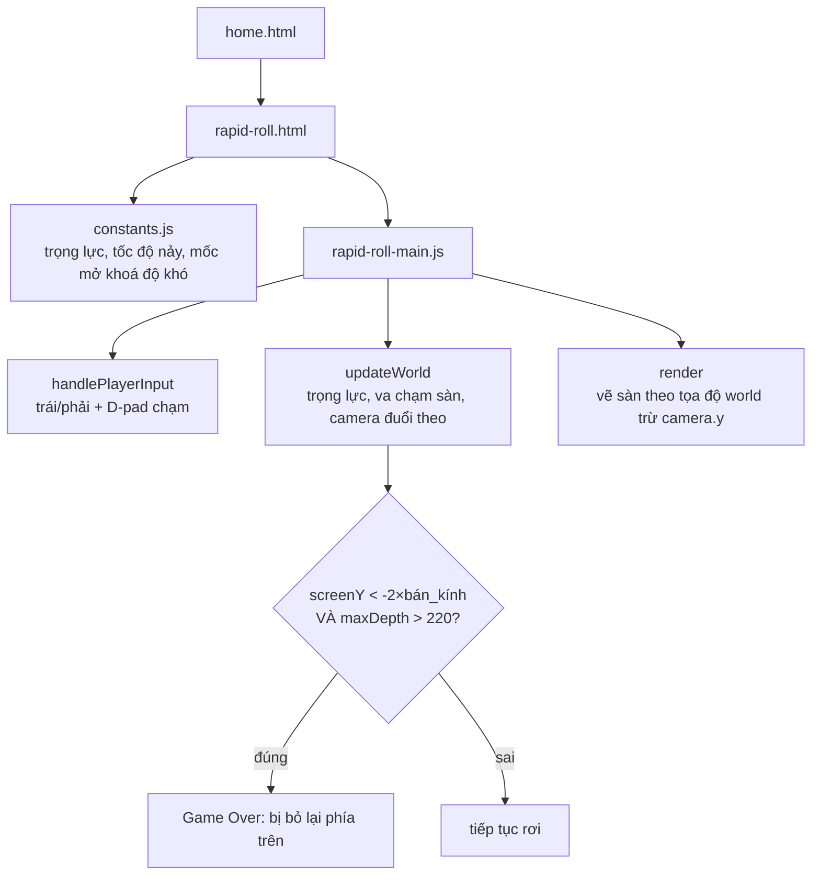

# Rapid Roll: quả bóng thua ngay ở cú nảy đầu tiên, trước khi người chơi kịp chạm phím

## 1. Mở đầu

Bug đáng nhớ nhất của game này không phải thứ mình tự phát hiện trong lúc chơi thử — nó bị bắt lại sau đó, và dấu vết duy nhất còn lại trong code bây giờ là một hằng số tên `DEATH_CHECK_MIN_DEPTH` kèm bốn dòng comment giải thích tỉ mỉ lý do nó tồn tại. Không có commit message kịch tính, không có story kể lại buổi tối debug — chỉ có đúng một dòng `if` được thêm một điều kiện, và toán học đứng sau nó đủ rõ ràng để tự kể lại chuyện gì đã xảy ra.

Bài này kể về Rapid Roll — bản clone của trò chơi "quả bóng rơi né sàn" nổi tiếng trên các máy Nokia đời cũ — và cách một game tưởng đơn giản (chỉ có trái/phải, không bắn, không kẻ địch di chuyển phức tạp) vẫn giấu được một bug khiến người chơi thua ngay tại cú nảy *đầu tiên*, trước khi họ kịp nhấn bất kỳ phím nào.

## 2. Bối cảnh

Rapid Roll ra đời ngay sau Space Impact, trong cùng một loạt yêu cầu dồn dập về các game "máy Nokia đen trắng ngày xưa". Nếu Space Impact là bài toán về không gian (né đạn theo 2 trục), Rapid Roll là bài toán hoàn toàn khác: quả bóng chỉ rơi theo trục Y dưới trọng lực thật, người chơi chỉ điều khiển trục X, và cái quyết định độ khó không phải kẻ địch mà là *camera* — màn hình tự cuộn xuống ngày một nhanh, quả bóng nào nảy tại chỗ quá lâu sẽ bị "bỏ lại phía trên" và thua cuộc. Cơ chế lõi này (camera đuổi theo người chơi thay vì người chơi đuổi theo camera) là phần khó nghĩ nhất trong toàn bộ game, và cũng chính là nơi bug xảy ra.

## 3. Mục tiêu sản phẩm

**Sẽ làm:**
- Quả bóng rơi dưới trọng lực thật (`GRAVITY = 900`), nảy lên với vận tốc cố định (`BOUNCE_VELOCITY = 480`) mỗi khi chạm một sàn còn va chạm được.
- 4 loại sàn: thường (an toàn), di chuyển ngang, rung vỡ sau khi đứng lên (biến mất sau 260ms), và gai (chạm là thua ngay).
- Camera tự cuộn xuống với tốc độ tăng dần theo độ sâu đã đạt được, buộc người chơi phải liên tục rơi tiếp chứ không thể "câu giờ" mãi trên một sàn.
- Sinh sàn vô hạn phía trước camera, xoá sàn đã trôi qua khỏi màn hình để không giữ mảng phình to mãi.
- Độ sâu = điểm số, càng xuống sâu càng khó (mở khoá dần sàn di chuyển ở độ sâu 150, sàn rung ở 250, gai ở 400).
- Điểm cao nhất lưu theo mét, hiển thị lại ở màn hình chọn chơi.

**Sẽ KHÔNG làm:**
- Không có nút nhảy hay bắn — toàn bộ input chỉ là trái/phải, giữ đúng tinh thần tối giản của bản gốc trên Nokia.
- Không có power-up hay vật phẩm nhặt được — độ khó chỉ đến từ tốc độ cuộn camera và loại sàn.
- Không giới hạn độ sâu tối đa — game chơi được vô hạn cho tới khi thua, chỉ có tốc độ cuộn bị chặn trần (`SCROLL_SPEED_MAX = 190`) để không trở nên bất khả thi.

MVP: bóng rơi, trái/phải né sàn gai và bắt kịp tốc độ cuộn màn hình, thua khi bị bỏ lại phía trên hoặc chạm gai, điểm là độ sâu tính bằng mét.

## 4. Thiết kế hệ thống



Phần thiết kế đáng nói nhất là cách camera được mô hình hoá — không phải một biến "theo dõi vị trí bóng" đơn thuần, mà là giá trị lớn nhất giữa hai lực kéo ngược chiều nhau:

```javascript
const scrollSpeed = Math.min(SCROLL_SPEED_MAX, BASE_SCROLL_SPEED + maxDepth * SCROLL_SPEED_PER_DEPTH);
const followTarget = ball.worldY - GAME_HEIGHT * FOLLOW_LINE_RATIO;
camera.y = Math.max(camera.y + scrollSpeed * dt, followTarget);
```

Vế thứ nhất (`camera.y + scrollSpeed * dt`) là áp lực bắt buộc: camera *luôn* trôi xuống với tốc độ tối thiểu, bất kể bóng đang làm gì — đây chính là nguồn tạo áp lực thời gian của cả game. Vế thứ hai (`followTarget`) là một cái trần an toàn: nếu bóng rơi nhanh hơn tốc độ cuộn tối thiểu (ví dụ rơi qua nhiều sàn liên tiếp không nảy), camera sẽ nhảy vọt theo kịp ngay lập tức để bóng không bao giờ rơi khỏi đáy màn hình. `Math.max` của hai vế này là toàn bộ "linh hồn" độ khó của game — không cần thêm bất kỳ logic địch hay va chạm phức tạp nào khác.

## 5. Tech Stack

| Công nghệ | Vì sao chọn |
| --- | --- |
| **Toạ độ "world space" trừ camera khi vẽ** | Vị trí bóng và sàn đều lưu theo `worldY` tuyệt đối (tăng dần vô hạn khi rơi sâu), chỉ trừ `camera.y` tại thời điểm vẽ (`screenY = worldY - camera.y`) — tách biệt hoàn toàn logic vật lý khỏi logic hiển thị, giống hệt cách mọi engine 2D cuộn màn hình đều làm. |
| **Sinh sàn theo "hàng đợi vô hạn" (`generatePlatformsAhead`)** | Thay vì tạo trước một danh sách sàn cố định, game chỉ sinh thêm sàn khi `lowestGeneratedY` còn cách camera chưa đủ xa (`< camera.y + GAME_HEIGHT + 220`), và xoá sàn đã trôi qua khỏi đáy màn hình lâu (`worldY > camera.y - 40`) — bộ nhớ dùng cho mảng `platforms` luôn ổn định dù người chơi rơi bao sâu. |
| **`Math.max` cho công thức camera thay vì hai nhánh `if` riêng** | Gộp "trôi bắt buộc" và "đuổi kịp bóng" vào một biểu thức duy nhất giúp code ngắn và dễ suy luận hơn — không có trạng thái ẩn nào để đồng bộ giữa hai chế độ camera khác nhau. |
| **`ctx.roundRect` cho sàn thường** | API canvas built-in cho góc bo tròn, đủ mới trên mọi trình duyệt hiện đại — không cần tự vẽ path bằng tay cho một chi tiết thẩm mỹ nhỏ. |

## 6. Quá trình phát triển

### Giai đoạn 1 — Vật lý rơi và nảy trên một sàn duy nhất

Bắt đầu với vật lý cốt lõi: `vy += GRAVITY * dt`, `worldY += vy * dt`, và một hàm phát hiện va chạm dùng "quét khoảng đi qua" thay vì so sánh vị trí tức thời — vì bóng có thể rơi nhanh tới mức bỏ qua hẳn một sàn mỏng 12px giữa hai khung hình nếu chỉ so `ball.worldY === platform.worldY`:

```javascript
const ballBottomPrev = prevY + BALL_RADIUS;
const ballBottomNew = ball.worldY + BALL_RADIUS;
if (ballBottomPrev <= p.worldY && ballBottomNew >= p.worldY && ...) {
    ball.worldY = p.worldY - BALL_RADIUS;
    ball.vy = -BOUNCE_VELOCITY;
}
```

So sánh "đáy bóng ở khung trước có nằm trên sàn không, đáy bóng ở khung này có nằm dưới hoặc bằng sàn không" bắt được cả trường hợp bóng đi xuyên qua sàn trong một khung hình dài (ví dụ máy giật lag, `dt` lớn bất thường).

### Giai đoạn 2 — Camera đuổi theo, không phải camera theo dõi

Đây là giai đoạn tốn thời gian suy nghĩ nhất dù code ra chỉ ba dòng (phần 4 đã trích). Thử nghiệm đầu tiên là cho camera bám chặt bóng theo một offset cố định — chơi thử ngay thấy sai: như vậy sẽ không có áp lực gì, người chơi có thể đứng yên nảy tại chỗ vĩnh viễn mà không thua. Phải tách rõ hai khái niệm "camera trôi vì thời gian trôi" và "camera trôi vì bóng đã đi xa" thành hai phép tính riêng rồi lấy giá trị lớn hơn, độ khó mới thực sự đến từ *thời gian*, không phải từ vị trí bóng.

### Giai đoạn 3 — Bốn loại sàn, mở khoá dần theo độ sâu

`pickPlatformType` dùng random có trọng số giống Space Impact, nhưng trọng số ở đây phụ thuộc vào độ sâu hiện tại — sàn di chuyển chỉ xuất hiện sau độ sâu 150, sàn rung sau 250, gai sau 400. Cách này giúp 30 giây đầu của mọi ván chơi đều "dễ" như nhau (chỉ có sàn thường), rồi độ khó tăng tự nhiên mà không cần đếm thời gian hay số lượt nảy.

## 7. Những bug đáng nhớ

### Bug #1: Thua ngay ở cú nảy đầu tiên, trước khi camera kịp "khởi động"

**Hiện tượng:** Ván chơi kết thúc gần như ngay lập tức sau khi bấm Bắt đầu — bóng vừa nảy lên từ sàn đầu tiên đã bị chấm là "bị bỏ lại phía trên", dù người chơi chưa hề có cơ hội di chuyển sai.

**Nguyên nhân — truy ngược lại bằng đúng con số:** Bóng bắt đầu ở `worldY = 40`, camera bắt đầu ở `camera.y = 0`. Sàn đầu tiên đặt tại `worldY = 110`. Ngay khi bóng chạm sàn này và nảy lên với `BOUNCE_VELOCITY = 480` dưới `GRAVITY = 900`, độ cao tối đa đạt được là `v² / (2g) = 480² / 1800 ≈ 128` đơn vị world phía trên điểm nảy — tức bóng có thể lên tới `worldY ≈ 110 − 12 − 128 = −30`. Trong khi đó, ở đúng thời điểm đó `camera.y` gần như vẫn còn bằng 0 (vì `followTarget = ball.worldY − GAME_HEIGHT × 0.42` lúc này rất âm, không kéo camera lên được, và vế "trôi bắt buộc" mới chỉ tích luỹ được vài pixel kể từ lúc bắt đầu). `screenY = ball.worldY − camera.y ≈ −30 − 0 = −30`, trong khi ngưỡng thua là `screenY < −BALL_RADIUS × 2 = −24`. `−30 < −24` — đúng điều kiện thua, dù đây chỉ là cú nảy đầu tiên hoàn toàn bình thường.

**Cách sửa:** Thêm một hằng số `DEATH_CHECK_MIN_DEPTH = 220` và chặn điều kiện thua bằng nó:

```javascript
if (maxDepth > DEATH_CHECK_MIN_DEPTH && screenY < -BALL_RADIUS * 2) {
    triggerGameOver("Bạn đã bị bỏ lại phía sau!");
    return;
}
```

Bỏ qua hoàn toàn việc kiểm tra "bị bỏ lại phía trên" cho tới khi bóng đã đi được ít nhất 220 đơn vị độ sâu — đủ để camera có thời gian rời khỏi trạng thái khởi tạo `y = 0` và bước vào chế độ đuổi theo ổn định, nơi công thức `Math.max` mới thực sự phản ánh đúng ý đồ thiết kế.

**Điều rút ra:** Một công thức đúng về mặt toán học ở trạng thái ổn định (steady state) hoàn toàn có thể sai ở đúng vài khung hình đầu tiên, khi các biến chưa kịp "khởi động" tới giá trị mà công thức đó ngầm giả định. `camera.y = Math.max(...)` không sai ở bất kỳ đâu — nó chỉ đơn giản chưa có đủ thời gian trôi để vế "trôi bắt buộc" bắt kịp thực tế, và bug chỉ lộ ra ở đúng khung hình đầu tiên của mỗi ván, một cửa sổ thời gian cực ngắn mà lần nào test cũng vô tình đi qua chứ không cách nào né được.

## 8. Những quyết định sai

**Không có khoảng đệm bất tử (invulnerability) sau khi bắt đầu ván mới**, khác với Space Impact (bất tử 1.2 giây sau khi mất mạng). Với Rapid Roll một mạng duy nhất, việc thêm một khoảng đệm ngắn ở đầu ván có lẽ sẽ là cách sửa Bug #1 "tự nhiên" hơn — thay vì chặn theo độ sâu, chặn theo thời gian đã trôi kể từ lúc `startGame()`. Cả hai cách đều giải quyết được vấn đề, nhưng chặn theo thời gian có lẽ dễ suy luận hơn chặn theo độ sâu, vì bug gốc vốn dĩ là một vấn đề về *thời gian khởi động*, không phải về không gian.

**`render()` có một nhánh if/else thừa không cần thiết** — `if (state !== "ready") drawBall(); else drawBall();` gọi `drawBall()` ở cả hai nhánh, tức là điều kiện không có tác dụng gì. Vô hại (game vẫn vẽ đúng), nhưng là dấu vết của việc từng định làm gì đó khác nhau giữa hai trạng thái (có thể là ẩn bóng ở màn hình chờ) rồi bỏ dở giữa chừng.

## 9. Những điều học được

- **Bug ở "khung hình đầu tiên" là loại bug dễ bị bỏ sót nhất khi test bằng cách chơi thử nhiều lần** — vì trực giác của người test luôn tập trung vào gameplay ở giữa và cuối ván, hiếm khi nghĩ tới việc chính giây đầu tiên mới là nơi các biến trạng thái chưa "khởi động" xong.
- **Một công thức dạng `Math.max(a, b)` gộp hai ý đồ thiết kế lại làm một biểu thức ngắn gọn, nhưng cũng làm mất đi ranh giới rõ ràng giữa hai trường hợp** — khi có bug, phải tự bóc lại từng vế bằng tay (như cách tính ở Bug #1) mới thấy được vế nào đang "thắng" tại thời điểm gây lỗi.
- **Chặn một điều kiện bằng ngưỡng tối thiểu (`maxDepth > DEATH_CHECK_MIN_DEPTH`) là một miếng vá thực dụng, không phải một lời giải triệt để** — nó có tác dụng, nhưng bản chất là "trì hoãn" vấn đề thay vì loại bỏ nguyên nhân gốc (camera chưa khởi động kịp). Với một số 220 chọn hơi tuỳ ý, ai đó chỉnh `BOUNCE_VELOCITY` hay `GRAVITY` sau này rất có thể cần tính lại con số đó từ đầu.

## 10. Kết quả

| Hạng mục | Con số |
| --- | --- |
| Tổng số dòng code (JS + CSS + HTML) | 797 dòng |
| `js/rapid-roll-main.js` | 306 dòng |
| `css/rapid-roll.css` | 240 dòng |
| `css/home.css` | 125 dòng |
| `js/constants.js` | 38 dòng |
| Số loại sàn | 4 (thường, di chuyển, rung vỡ, gai) |
| Test tự động | 0 |
| CI/CD | Không có |

## 11. Nếu làm lại từ đầu

- **Thay `DEATH_CHECK_MIN_DEPTH` bằng một khoảng đệm bất tử theo thời gian** (`gameStartTime`, bỏ qua kiểm tra thua trong ví dụ nửa giây đầu ván), giải quyết đúng gốc rễ là "camera cần thời gian khởi động" thay vì suy luận gián tiếp qua độ sâu.
- **Khởi tạo `camera.y` bằng giá trị `followTarget` ban đầu thay vì `0`** — nếu camera bắt đầu đã ở đúng vị trí "theo dõi hợp lý" ngay từ khung hình đầu tiên, vế trôi bắt buộc không cần phải "đuổi kịp" từ một điểm xuất phát sai, và có thể Bug #1 sẽ không bao giờ tồn tại.
- **Xoá nhánh `if/else` thừa trong `render()`** — dọn dẹp dấu vết của một ý tưởng bỏ dở.

## 12. Kết

Rapid Roll chứng minh một điều ngược trực giác: game càng ít cơ chế, càng dễ có một góc khuất toán học không ai để ý — vì có ít chỗ để nhìn, người viết code (và người test) đều mặc định "chắc không có gì phức tạp ở đây đâu". Bug thua-ngay-lập-tức này không nằm ở một vòng lặp phức tạp hay một điều kiện va chạm rắc rối, mà nằm ở đúng khoảnh khắc hai biến số (`camera.y` và `ball.worldY`) chưa kịp đồng bộ với giả định ngầm của công thức tính chúng. Một hằng số, bốn dòng comment, và bug biến mất — nhưng cái thú vị hơn cả là việc chính commit thêm cái hằng số đó đã tự để lại đủ dấu vết để, dù không có mặt lúc nó xảy ra, vẫn dựng lại được chính xác toán học đằng sau.
