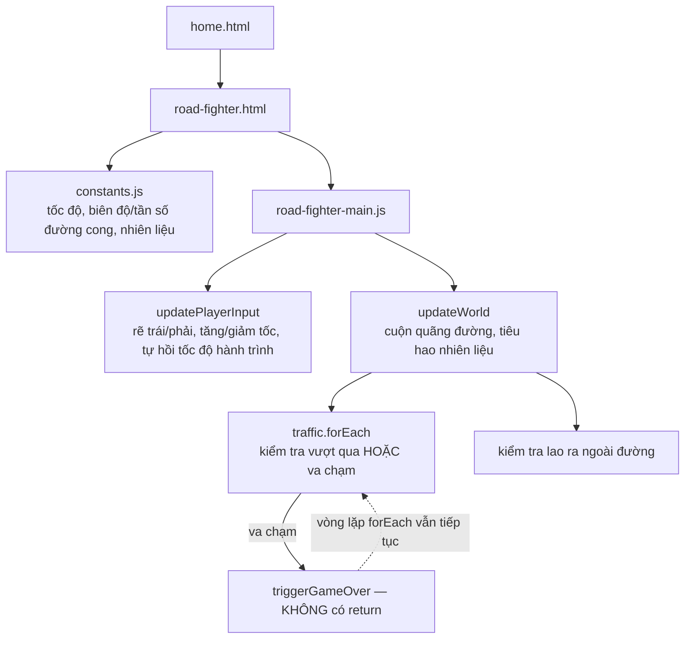

# Road Fighter: khung hình kết thúc ván đua vẫn tiếp tục cộng điểm sau khi đã "thua"

## 1. Mở đầu

`triggerGameOver("Bạn đã đâm xe!");` — dòng này nằm bên trong một vòng lặp `forEach` duyệt qua toàn bộ xe cộ đang trên đường, được gọi ngay khi phát hiện va chạm với một chiếc xe. Nhưng sau dòng đó không có lệnh `return` nào để thoát khỏi vòng lặp. `forEach` trong JavaScript không có cách nào để "break" giữa chừng — nó cứ thế chạy tiếp, kiểm tra từng chiếc xe còn lại, kể cả sau khi ván đua về mặt game-logic đã kết thúc. Nếu đúng lúc đó có một chiếc xe khác vừa vượt qua ngưỡng "đã tránh được" (`carTop > PLAYER_SCREEN_Y + ...`), nó vẫn lặng lẽ cộng thêm 15 điểm — sau khi màn hình Game Over đã hiện ra với một con số điểm số *thấp hơn* con số đang thực sự nằm trong biến `score`.

## 2. Bối cảnh

Road Fighter là game đua xe top-down duy nhất trong repo, phỏng theo tựa game arcade cùng tên. Về mặt kỹ thuật, điểm thú vị nhất không phải là việc lái xe hay né chướng ngại — mà là cách con đường uốn lượn được mô hình hoá: không phải một chuỗi đoạn thẳng nối tiếp, mà là một hàm sin liên tục theo "khoảng cách đã đi", cho phép mọi thứ (đường, xe cộ, bình xăng) tính lại vị trí của mình tại bất kỳ thời điểm nào chỉ từ một con số duy nhất — quãng đường đã cuộn qua.

## 3. Mục tiêu sản phẩm

**Đã làm (theo README):**
- Đường cong theo hàm sin, xe tăng/giảm tốc bằng Lên/Xuống, rẽ trái/phải bằng phím mũi tên hoặc WASD, tự động giảm về tốc độ hành trình khi không có input.
- Nhiên liệu tiêu hao liên tục (nhanh hơn khi chạy tốc độ cao), hết nhiên liệu là thua.
- Xe cộ ngược chiều xuất hiện ngẫu nhiên trên đường; đâm phải hoặc lao ra khỏi rìa đường đều kết thúc ván ngay lập tức.
- Điểm cộng liên tục theo tốc độ/quãng đường, cộng thêm khi vượt qua xe (+15) hoặc nhặt được nhiên liệu (+5).
- HUD hiển thị điểm, điểm cao nhất, tốc độ hiện tại, và thanh nhiên liệu theo thời gian thực.

**Sẽ KHÔNG làm:**
- Không có nhiều làn đường rời rạc — người chơi có thể ở bất kỳ vị trí ngang nào trong phạm vi bề rộng đường, không bị "chia ô".
- Không có nhiều loại địa hình hay thời tiết ảnh hưởng độ bám đường.

MVP: lái xe theo đường cong, né xe/giữ trong làn đường, quản lý nhiên liệu, ghi điểm theo tốc độ và số xe vượt qua được.

## 4. Thiết kế hệ thống



Kỹ thuật trung tâm của toàn bộ game nằm ở hàm tính tâm đường theo một tham số duy nhất — "khoảng cách phía trước":

```javascript
function roadCenterForScreenY(screenY, scrollDist) {
    const aheadDist = scrollDist + (GAME_HEIGHT - screenY);
    return GAME_WIDTH / 2 + Math.sin(aheadDist * ROAD_CURVE_FREQ) * ROAD_CURVE_AMPLITUDE;
}
```

Bất kỳ vị trí Y nào trên màn hình, kết hợp với quãng đường đã cuộn (`scrollDistance`), đều quy đổi được về đúng một điểm trên đường cong sin — không cần lưu trữ hình dạng đường dưới dạng danh sách điểm hay mảng, chỉ cần một phép tính lượng giác. Nhờ vậy, vị trí sinh ra của xe cộ và bình xăng chỉ cần lưu một giá trị `relativeDistance` (giảm dần theo tốc độ xe, giống hệt cách `scrollDistance` tăng dần) — và một tính chất toán học đẹp xảy ra: tổng `scrollDistance + relativeDistance` của một vật thể luôn không đổi trong suốt vòng đời của nó (vì cả hai cùng thay đổi một lượng bằng nhau mỗi khung hình, một tăng một giảm), tức là "điểm trên đường cong" mà vật thể đó đứng trên không bao giờ trôi dạt theo thời gian — nó luôn dính chặt vào đúng khúc cua nơi nó được sinh ra, dù được vẽ lại ở một `screenY` khác mỗi khung hình.

## 5. Tech Stack

| Công nghệ | Vì sao chọn |
| --- | --- |
| **Đường cong hàm sin liên tục, không lưu mảng điểm rời rạc** | Cho phép tính tâm đường tại BẤT KỲ vị trí Y hay khoảng cách nào bằng một phép toán O(1), không cần nội suy giữa các điểm đã lưu — đơn giản hơn nhiều so với việc quản lý một danh sách waypoint đường đi. |
| **Vật thể lưu `relativeDistance` thay vì toạ độ Y tuyệt đối** | Vì tốc độ cuộn đường phụ thuộc trực tiếp vào tốc độ xe người chơi (không cố định), lưu khoảng cách tương đối rồi tính lại `screenY = GAME_HEIGHT - relativeDistance` mỗi khung hình cho phép mọi vật thể tự động "chạy nhanh hơn" khi người chơi tăng tốc, không cần đồng bộ tốc độ riêng cho từng vật thể. |
| **`ctx.roundRect` cho thân xe, giống Bóng Bàn/Rapid Roll** | Nhất quán về mặt hình ảnh với các game khác trong repo dùng chung kỹ thuật vẽ hình chữ nhật bo góc. |

## 6. Quá trình phát triển

*(Suy luận từ cấu trúc code và README hiện có.)*

### Giai đoạn 1 — Đường thẳng, xe di chuyển ngang

Trước khi có đường cong, nền tảng chắc chắn là một dải đường thẳng cố định, xe người chơi di chuyển ngang trong phạm vi bề rộng đường, tốc độ dọc không đổi.

### Giai đoạn 2 — Đường cong hàm sin

Thêm `roadCenterForScreenY` — quyết định kỹ thuật quan trọng nhất của cả game, biến việc "vẽ một con đường uốn lượn" từ bài toán lưu trữ hình học thành bài toán tính toán thuần tuý.

### Giai đoạn 3 — Tăng/giảm tốc, tiêu hao nhiên liệu theo tốc độ

```javascript
fuel -= FUEL_DRAIN_PER_SEC * (playerSpeed / CRUISE_SPEED) * dt;
```

Nhiên liệu tiêu hao tỉ lệ thuận với tốc độ hiện tại so với tốc độ hành trình chuẩn — chạy nhanh hơn tốn nhiên liệu nhanh hơn, tạo ra một đánh đổi rủi ro/phần thưởng tự nhiên: tốc độ cao ghi điểm nhanh hơn (`score += playerSpeed * dt * 0.08`) nhưng cũng buộc phải nhặt nhiên liệu thường xuyên hơn.

### Giai đoạn 4 — Xe cộ, va chạm, và điểm thưởng vượt xe

Thêm luồng sinh xe cộ ngẫu nhiên trên đường, kiểm tra va chạm bằng AABB, và một điều kiện thưởng điểm khi một chiếc xe đã "biến mất" phía sau người chơi mà không va chạm — chính tại giai đoạn này, bug ở phần 7 được sinh ra.

## 7. Những bug đáng nhớ

### Thiếu một `return`, và điểm số tiếp tục thay đổi sau khi ván đua đã kết thúc

**Phát hiện khi đọc lại `updateWorld` để viết bài này:**

```javascript
traffic.forEach((t) => {
    t.relativeDistance -= playerSpeed * dt;
    const screenY = GAME_HEIGHT - t.relativeDistance;
    const carTop = screenY - TRAFFIC_HEIGHT / 2;

    if (!t.scored && carTop > PLAYER_SCREEN_Y + PLAYER_HEIGHT / 2) {
        t.scored = true;
        score += 15;
    }

    if (rectsOverlap(playerLeft, playerTop, PLAYER_WIDTH, PLAYER_HEIGHT, t.x - TRAFFIC_WIDTH / 2, carTop, TRAFFIC_WIDTH, TRAFFIC_HEIGHT)) {
        triggerGameOver("Bạn đã đâm xe!");   // không có return sau dòng này
    }
});
```

`triggerGameOver` có cờ tự vệ ở đầu hàm (`if (state === "gameover") return;`), nên gọi nó nhiều lần không gây lỗi hiển thị chồng chéo overlay. Nhưng bản thân `traffic.forEach` không hề dừng lại — nó tiếp tục kiểm tra *mọi chiếc xe còn lại* trong mảng, ngay trong cùng khung hình đã xảy ra va chạm. Nếu, trong cùng khung hình đó, một chiếc xe khác (đứng sau chiếc vừa gây va chạm trong mảng `traffic`) vừa vượt qua ngưỡng "đã tránh được", điều kiện `!t.scored && carTop > ...` vẫn đúng, và `score += 15` vẫn chạy — **sau khi** `triggerGameOver` đã đọc và đóng băng một con số điểm khác (`Math.floor(score)`, được ghép sẵn vào chuỗi hiển thị overlay tại đúng thời điểm nó được gọi) để lưu vào `localStorage` và hiển thị trên màn hình Game Over.

**Hệ quả:** Có một cửa sổ rất hẹp (đúng trong phạm vi một `forEach` của cùng một khung hình) nơi `score` (biến, dùng để cập nhật HUD ở lệnh gọi `updateHud()` ngay sau đó) và con số đã "đóng băng" hiển thị trên overlay Game Over (`finalScore`, một hằng số cục bộ tính một lần bên trong `triggerGameOver`) lệch nhau — HUD phía sau overlay có thể (thoáng qua, trước khi bị overlay che khuất hoàn toàn) hiển thị một con số cao hơn con số ghi trong thông báo "Game Over". Trên thực tế, vì overlay hiện `display: block`/tương đương che kín toàn bộ canvas ngay sau đó, người chơi gần như không bao giờ nhìn thấy được sự lệch pha này bằng mắt thường — nhưng nó vẫn tồn tại thật trong luồng dữ liệu, và `best` (điểm cao nhất) được lưu vào `localStorage` dùng đúng con số "đóng băng" thấp hơn đó, không phải con số cuối cùng thực sự đạt được.

**Vì sao chưa sửa:** Cửa sổ xảy ra cực hẹp — cần đúng hai sự kiện (một va chạm, một xe khác vừa vượt ngưỡng ghi điểm) xảy ra trong cùng một khung hình ~16ms, với đúng thứ tự trong mảng `traffic` để xe gây va chạm được xử lý trước xe ghi điểm. Ảnh hưởng thực tế (chênh lệch tối đa 15 điểm trên một điểm số thường lên tới hàng trăm) không đáng kể, và không gây crash hay lỗi hiển thị rõ ràng nào.

**Điều rút ra:** Gọi một hàm "kết thúc trạng thái" (như `triggerGameOver`) bên trong một vòng lặp mà không có cách nào thoát sớm (`forEach` không hỗ trợ `break`) để lại một khoảng hở logic: mọi lệnh phía sau lời gọi đó, trong cùng lượt lặp và các lượt lặp tiếp theo, vẫn thực thi như thể trạng thái chưa hề thay đổi — trừ khi bản thân chúng cũng tự kiểm tra lại `state`. Cờ tự vệ bên trong `triggerGameOver` bảo vệ đúng phần việc của riêng nó (không hiện overlay hai lần), nhưng không bảo vệ được phần dữ liệu (`score`) bị thay đổi bởi các đoạn code khác chạy sau nó trong cùng khung hình.

## 8. Những quyết định sai

**`traffic.forEach` không có cách nào để dừng sớm khi phát hiện game over**, như đã phân tích ở Bug — thay `forEach` bằng một vòng `for...of` thông thường (hỗ trợ `break`) sẽ giải quyết được vấn đề bằng đúng một từ khoá, không cần thay đổi cấu trúc gì khác.

**`fuelItems.forEach` (xử lý ngay sau `traffic.forEach`) và bước kiểm tra lao ra ngoài đường đều không kiểm tra `state` trước khi chạy**, nên cùng chịu chung rủi ro tương tự: nếu va chạm xe cộ xảy ra ở đúng khung hình đó, các bước xử lý nhiên liệu và biên đường phía sau vẫn chạy trên một thế giới game về logic đã "kết thúc".

## 9. Những điều học được

- **`Array.prototype.forEach` không hỗ trợ `break` — nếu logic bên trong callback cần khả năng dừng sớm dựa trên một điều kiện xảy ra giữa chừng, một vòng `for` hoặc `for...of` thường phù hợp hơn**, dù `forEach` có cú pháp gọn hơn cho trường hợp không cần dừng sớm.
- **Một hàm "kết thúc trạng thái" có cờ tự vệ chỉ bảo vệ được chính hành vi của nó (không lặp lại tác dụng phụ như hiện UI), không tự động bảo vệ được các đoạn code khác chạy sau nó trong cùng một khung hình** — muốn dừng toàn bộ luồng xử lý còn lại, bản thân vòng lặp gọi nó cũng cần biết dừng lại.
- **Một cửa sổ lỗi cực hẹp (chỉ lộ ra khi hai sự kiện cụ thể trùng đúng một khung hình) vẫn đáng được ghi nhận dù ảnh hưởng thực tế nhỏ** — độ hiếm gặp không đồng nghĩa với việc nó không tồn tại hay không đáng để hiểu rõ nguyên nhân.

## 10. Kết quả

| Hạng mục | Con số |
| --- | --- |
| Tổng số dòng code (JS + CSS + HTML) | 717 dòng |
| `js/road-fighter-main.js` | 280 dòng |
| `css/road-fighter.css` | 193 dòng |
| `css/home.css` | 125 dòng |
| `js/constants.js` | 37 dòng |
| Điểm thưởng mỗi xe vượt qua / mỗi lần nhặt nhiên liệu | +15 / +5 |
| Test tự động | 0 |
| CI/CD | Không có |

## 11. Nếu làm lại từ đầu

- **Đổi `traffic.forEach` thành `for (const t of traffic) { ...; if (va chạm) { triggerGameOver(...); break; } }`**, sửa tận gốc Bug đã ghi nhận — dừng toàn bộ vòng lặp ngay khi phát hiện va chạm, không xử lý thêm bất kỳ xe nào khác trong cùng khung hình.
- **Thêm một điều kiện chặn ở đầu `updateWorld`** (`if (state !== "playing") return;`) như một lớp bảo vệ chung, đảm bảo toàn bộ phần còn lại của hàm — không chỉ phần va chạm xe cộ — đều tự động dừng lại ngay khi trạng thái game đổi sang `gameover` ở bất kỳ đâu bên trong chính lần gọi đó.
- **Tính `finalScore` từ giá trị `score` tại đúng thời điểm `updateHud()` chạy lần cuối**, thay vì đóng băng nó ngay bên trong `triggerGameOver`, để loại bỏ hoàn toàn khả năng hai con số hiển thị lệch nhau dù chỉ trong một khung hình.

## 12. Kết

Road Fighter có phần kỹ thuật đẹp nhất (đường cong hàm sin với tính chất bảo toàn "khoảng cách phía trước" không đổi) đi kèm với một trong những bug tinh vi nhất từng tìm được trong loạt bài này — không phải vì logic sai, mà vì thiếu đúng một từ khoá (`return`, hoặc khả năng `break`) ở đúng một chỗ. Bug này gần như không thể quan sát được bằng cách chơi thử (cửa sổ xảy ra hẹp tới mức tính bằng phần trăm của một khung hình), nhưng hoàn toàn có thể chứng minh bằng cách đọc kỹ đúng thứ tự các câu lệnh — một lời nhắc rằng "chơi thử nhiều lần không phát hiện gì" và "code không có vấn đề gì" là hai kết luận khác nhau, không phải lúc nào cũng trùng khớp.
