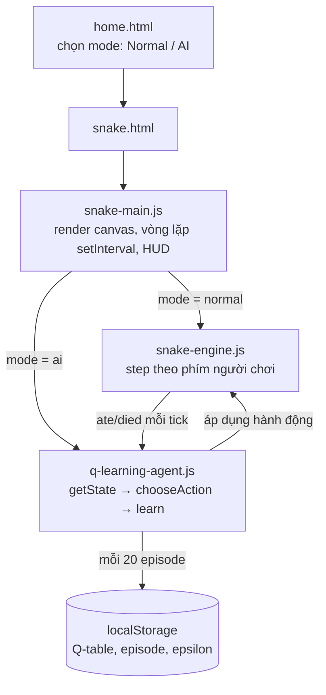
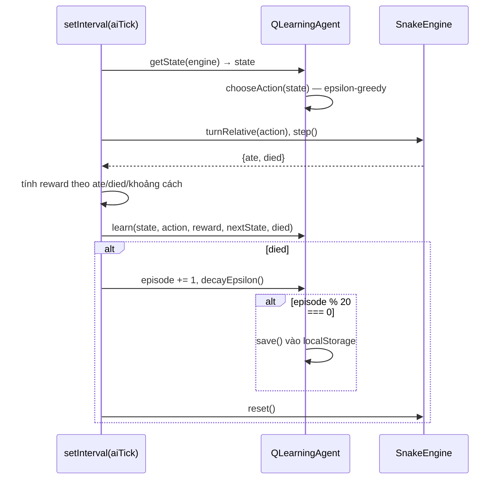

# Dạy một con rắn tự học chơi Snake bằng Q-learning, ngay trong trình duyệt

## 1. Mở đầu

Có một buổi tối mình để chế độ AI của Snake chạy ở tốc độ Turbo qua đêm, tò mò xem sau vài nghìn "kiếp" (episode) con rắn học được tới đâu. Sáng hôm sau mở lại tab, số liệu khá đẹp: epsilon đã tụt xuống gần mức sàn, điểm trung bình mỗi ván cao hơn hẳn đêm qua. Ngồi quan sát thêm vài phút thì nhận ra một điều kỳ lạ: mỗi khi con rắn rơi vào một tình huống nó "chưa từng thấy bao giờ" — một góc bàn cờ hiếm gặp, một thế bị vây khác thường — nó luôn luôn rẽ trái. Không phải "thường rẽ trái", mà là *luôn luôn*, 100% các lần, như một phản xạ có điều kiện tuyệt đối.

Ban đầu mình tưởng đây là một hành vi đã học được có chủ đích — có thể "luôn rẽ trái khi bí" là một chiến thuật sống sót hợp lý mà agent tự khám phá ra. Nhưng khi thử xoá sạch bảng Q-value và luyện lại từ đầu (epsilon = 1.0, một bảng hoàn toàn rỗng), hành vi "luôn rẽ trái ở trạng thái lạ" xuất hiện lại y hệt, ngay từ những episode đầu tiên khi bảng gần như trống trơn. Đây không phải là thứ agent học được — đây là một thiên lệch (bias) nằm sẵn trong chính cách mình viết hàm chọn hành động, từ trước khi agent kịp học bất cứ điều gì.

Bài này là câu chuyện viết một agent Q-learning dạng bảng (tabular) cho Snake, huấn luyện sống ngay trong trình duyệt không cần offline training, cộng vài bài học về việc những chi tiết tưởng nhỏ nhặt trong code RL (cách phá vỡ thế hoà, tần suất lưu, việc tab có đang ở foreground hay không) có thể ảnh hưởng tới toàn bộ quá trình học nhiều hơn cả việc chỉnh siêu tham số.

## 2. Bối cảnh

Phần lớn "AI" trong các game khác của repo `game-development` là AI cổ điển theo nghĩa cứng: minimax/negamax có sẵn tri thức về luật chơi và giá trị quân cờ (Chess, Xiangqi), hoặc một bảng heuristic tính điểm sẵn cho từng thế cờ (Caro). Tất cả đều là "trí tuệ nhân tạo" theo kiểu người viết code đã tự tay mã hoá hết chiến thuật, máy chỉ tìm kiếm trong không gian đó.

Snake là game đầu tiên mình muốn thử một hướng khác hẳn: để máy *tự tìm ra* cách chơi tốt, không cấy sẵn bất kỳ chiến thuật nào ngoài một tín hiệu thưởng/phạt đơn giản. Q-learning dạng bảng (tabular) là lựa chọn tự nhiên cho việc này — không cần mạng nơ-ron, không cần framework machine learning nào cả, chỉ là một object JavaScript ánh xạ từ "trạng thái" sang "giá trị kỳ vọng của từng hành động", cập nhật dần qua mỗi bước đi. Snake phù hợp vì luật chơi đơn giản, không gian hành động chỉ có 3 lựa chọn mỗi bước (rẽ trái/đi thẳng/rẽ phải), và quan trọng nhất: có thể ép không gian trạng thái đủ nhỏ để cả bảng Q-value hội tụ được trong vài phút chạy ngay trên máy người chơi, không cần huấn luyện offline rồi export model.

## 3. Mục tiêu sản phẩm

**Sẽ làm:**
- Chế độ Normal: Snake cổ điển, điều khiển bằng phím mũi tên/WASD, ăn mồi lớn thêm, đâm tường hoặc đâm thân thì thua.
- Chế độ AI: một agent Q-learning tự chơi và tự học liên tục, không cần bước huấn luyện offline riêng biệt — mỗi tick vừa là một bước chơi vừa là một bước cập nhật Q-value.
- HUD hiển thị số episode đã qua và epsilon hiện tại (tỉ lệ khám phá ngẫu nhiên), để người xem thấy được quá trình học đang diễn ra, không phải một hộp đen.
- 4 mức tốc độ (Slow/Medium/Fast/Turbo) để vừa có thể xem từng bước lúc rắn còn "khờ", vừa có thể tua nhanh qua hàng nghìn episode.
- Q-table, số episode, và epsilon được lưu định kỳ vào `localStorage`, để việc học tiếp tục được qua các lần tải lại trang, cộng một nút "xoá & học lại từ đầu".
- Best score lưu riêng cho từng chế độ (Normal/AI).

**Sẽ KHÔNG làm:**
- Không dùng mạng nơ-ron / Deep Q-Network (DQN) — xem phần "quyết định sai" để biết vì sao mình cân nhắc rồi từ bỏ hướng này khá nhanh.
- Không có bước "huấn luyện offline rồi nạp model đã học sẵn" — mọi thứ học ngay trong trình duyệt của người chơi, bắt đầu từ một bảng Q-value hoàn toàn rỗng nếu chưa từng chơi trước đó.
- Không trực quan hoá đường cong học tập (biểu đồ điểm theo thời gian) — chỉ có 2 con số thô (episode, epsilon) trên HUD.
- Không cho phép chỉnh siêu tham số (alpha, gamma, epsilon decay) từ giao diện — cố định trong code.

MVP: mở chế độ AI, bấm Bắt đầu, thấy con rắn chơi ngẫu nhiên và chết liên tục ở vài episode đầu, rồi dần dần chơi khá hơn theo thời gian — quan sát được bằng mắt thường rằng có gì đó đang "học" thật sự, không phải giả vờ.

## 4. Thiết kế hệ thống



Điểm thiết kế quan trọng nhất, và cũng là điểm quyết định toàn bộ việc dự án này có khả thi trong một buổi tối hay không, là *cách mã hoá trạng thái*. Trạng thái thô của Snake là toàn bộ lưới 15×15 cộng vị trí từng khúc thân — với một bảng Q-value dạng object tra cứu bằng key chuỗi, số trạng thái khả dĩ theo cách này lớn tới mức không bao giờ hội tụ nổi trong một phiên chơi ngắn. Giải pháp là mã hoá trạng thái *tương đối*, không phải tuyệt đối — 11 bit, độc lập hoàn toàn với kích thước bàn cờ và độ dài thân rắn:

```javascript
function getState(engine) {
  const head = engine.snake[0];
  const dir = engine.direction;
  const left = { x: dir.y, y: -dir.x };
  const right = { x: -dir.y, y: dir.x };

  const dangerStraight = engine.isDanger({ x: head.x + dir.x, y: head.y + dir.y });
  const dangerRight = engine.isDanger({ x: head.x + right.x, y: head.y + right.y });
  const dangerLeft = engine.isDanger({ x: head.x + left.x, y: head.y + left.y });

  const foodUp = engine.food.y < head.y;
  const foodDown = engine.food.y > head.y;
  const foodLeft = engine.food.x < head.x;
  const foodRight = engine.food.x > head.x;

  const movingUp = dir.y === -1;
  const movingDown = dir.y === 1;
  const movingLeft = dir.x === -1;
  const movingRight = dir.x === 1;

  const bits = [
    dangerStraight, dangerRight, dangerLeft,
    foodUp, foodDown, foodLeft, foodRight,
    movingUp, movingDown, movingLeft, movingRight,
  ];

  return bits.map((b) => (b ? "1" : "0")).join("");
}
```

11 bit nhị phân, ghép thành một chuỗi như `"10001001000"`, dùng thẳng làm key tra cứu vào object `qTable`. Về lý thuyết, không gian trạng thái tối đa là 2^11 = 2048 tổ hợp — nhỏ tới mức toàn bộ bảng Q-value có thể học xong và hội tụ chỉ sau vài trăm tới vài nghìn episode, tất cả nằm gọn trong `localStorage` mà không cần lo về giới hạn dung lượng.

Chi tiết quan trọng thứ hai: **hành động là tương đối (rẽ trái/đi thẳng/rẽ phải), không phải tuyệt đối (lên/xuống/trái/phải)**. Kết hợp với việc "hiểm nguy" và "hướng mồi" trong trạng thái cũng được tính tương đối theo hướng đầu rắn đang nhìn (không phải theo trục X/Y tuyệt đối của lưới), một trạng thái học được khi rắn đang đi lên sẽ *tự động áp dụng được* khi rắn đang đi sang phải hay bất kỳ hướng nào khác, miễn tình huống tương đối giống hệt nhau. Đây là một dạng chia sẻ kinh nghiệm (generalization) hoàn toàn miễn phí — không cần thêm một dòng code xử lý đối xứng nào, chỉ nhờ chọn đúng hệ quy chiếu cho trạng thái và hành động ngay từ đầu.

Về vòng lặp huấn luyện, khác biệt lớn nhất so với "huấn luyện offline" kiểu kinh điển (chạy hàng triệu episode trong một notebook, xong rồi mới export model để dùng): ở đây học và chơi là *cùng một vòng lặp*, không tách rời:



Không có khái niệm "epoch" hay "batch" nào ở đây — mỗi tick game vừa là một hành động thật sự trong ván đang chơi, vừa là một mẫu huấn luyện được đưa thẳng vào công thức cập nhật Q-value ngay lập tức. Cái được: đơn giản, không cần quản lý dữ liệu huấn luyện riêng, người xem thấy quá trình học diễn ra theo thời gian thực. Cái mất: không kiểm soát được việc lấy mẫu đồng đều qua các vùng trạng thái (agent chỉ học từ đúng những gì nó tình cờ trải qua, một dạng thiên lệch tự nhiên của "on-policy learning" mà bất kỳ ai học RL đều sớm gặp phải).

## 5. Tech Stack

| Công nghệ | Vì sao chọn |
| --- | --- |
| **Q-learning dạng bảng (tabular), không phải Deep Q-Network** | Với không gian trạng thái đã ép xuống 2048 tổ hợp tối đa, một object JavaScript thường (`{ "state-string": [q0, q1, q2] }`) là đủ nhanh, đủ nhỏ, và quan trọng nhất — dễ debug bằng mắt (in ra `console.log(agent.qTable)` là đọc được ngay) hơn hẳn việc phải quản lý trọng số một mạng nơ-ron. Không cần TensorFlow.js hay bất kỳ thư viện ML nào. |
| **JavaScript thuần + Canvas 2D** | Nhất quán với toàn bộ repo — một lưới ô vuông không cần gì hơn `fillRect`/`roundRect` mỗi frame. |
| **`localStorage` cho Q-table** | Kích thước tối đa của bảng (2048 state × 3 giá trị số) nhỏ tới mức không đáng lo về giới hạn dung lượng `localStorage` (thường vài MB) — không cần IndexedDB dù đang lưu một cấu trúc dữ liệu "lớn hơn một con số" (khác các game khác trong repo chỉ lưu best score dạng số đơn). |
| **`setInterval` với delay có thể đổi (Slow/Medium/Fast/Turbo)** | Không dùng `requestAnimationFrame` vì tốc độ *chơi* (không phải tốc độ *vẽ*) chính là biến số người dùng cần điều khiển trực tiếp — chọn Turbo nghĩa là chọn một con số ms nhỏ hơn, đơn giản hơn nhiều so với việc tách riêng "tốc độ mô phỏng" khỏi "tốc độ khung hình" như cách làm chuẩn mực hơn trong game engine thật sự. |
| **Epsilon-greedy cho việc chọn hành động** | Chiến lược kinh điển và tối giản nhất để cân bằng giữa khám phá (thử hành động ngẫu nhiên để phát hiện chiến thuật mới) và khai thác (dùng tri thức đã học) — không cần các biến thể phức tạp hơn (softmax/Boltzmann exploration, UCB) cho một không gian hành động chỉ có 3 lựa chọn. |

## 6. Quá trình phát triển

### Giai đoạn 1 — Engine Snake cổ điển trước, AI tính sau

Trước khi nghĩ tới bất kỳ dòng code RL nào, `snake-engine.js` phải chạy đúng ở chế độ người chơi thường trước: di chuyển, ăn mồi, phát hiện va chạm tường/thân. Một chi tiết nhỏ đáng chú ý ở `setDirection`:

```javascript
setDirection(dir) {
    if (dir.x === -this.direction.x && dir.y === -this.direction.y) return;
    this.pendingDirection = dir;
}
```

Chặn ngay từ engine việc quay đầu 180 độ tức thời (đi phải rồi bấm trái ngay lập tức) — nếu không chặn, đầu rắn sẽ "đâm" thẳng vào khúc thân ngay sau nó ở bước tiếp theo, một cái chết vô lý mà người chơi cảm thấy là lỗi điều khiển chứ không phải lỗi của chính họ. Chi tiết này hoá ra quan trọng hơn cả cho AI: nhờ được engine tự chặn ở tầng thấp nhất, agent Q-learning không bao giờ cần *học* rằng "quay đầu 180 độ là tự sát" — nó đơn giản là không thể chọn hành động đó, giảm bớt một chiều học tập không cần thiết.

### Giai đoạn 2 — Baseline "ngu nhất có thể": reward thưa, xem có học được gì không

Bản đầu tiên của reward chỉ có đúng hai giá trị: +10 khi ăn mồi, -10 khi chết, mọi bước đi khác đều 0. Đây là bài kiểm tra "liệu Q-learning có hoạt động chút nào trong bài toán này không" trước khi đầu tư thêm. Kết quả: agent học được, nhưng chậm tới sốt ruột — với reward 0 ở hầu hết các bước, tín hiệu duy nhất giúp nó phân biệt "hành động tốt" và "hành động tệ" chỉ xuất hiện đúng lúc ăn được mồi (hiếm, vì lúc đầu di chuyển ngẫu nhiên) hoặc lúc chết (cũng chỉ dạy được "đừng làm y hệt bước cuối cùng đó", không dạy được gì về hàng chục bước trước đó dẫn tới cái chết).

### Giai đoạn 3 — Reward shaping: thêm tín hiệu khoảng cách

Để tăng tốc học, thêm phần thưởng/phạt nhỏ dựa theo khoảng cách Manhattan tới mồi có thay đổi tốt lên hay xấu đi sau mỗi bước — không chờ tới khi ăn được mồi mới có tín hiệu:

```javascript
function aiTick() {
    const state = getState(engine);
    const actionIndex = agent.chooseAction(state);
    const head = engine.snake[0];
    const prevDist = manhattanDistance(head, engine.food);

    engine.turnRelative(agent.actions[actionIndex]);
    const result = engine.step();

    let reward;
    if (result.died) {
        reward = -10;
    } else if (result.ate) {
        reward = 10;
    } else {
        const newDist = manhattanDistance(engine.snake[0], engine.food);
        reward = newDist < prevDist ? 1 : -1;
    }

    const nextState = getState(engine);
    agent.learn(state, actionIndex, reward, nextState, result.died);
    // ...
}
```

Bốn nhánh, không hơn: chết (-10), ăn (+10), lại gần mồi hơn (+1), hoặc không (-1). Đây là kết quả sau khi thử một phiên bản phức tạp hơn nhiều trước đó — kể ở phần "quyết định sai", vì bản thân việc rút gọn về đúng 4 nhánh này mới là quyết định đúng, chứ không phải phiên bản đầu tiên.

### Giai đoạn 4 — Công thức cập nhật Q-value và epsilon-greedy

Công thức Q-learning kinh điển, gọn trong một dòng:

```javascript
learn(state, actionIndex, reward, nextState, done) {
    const q = this.getQ(state);
    const nextQ = this.getQ(nextState);
    const maxNextQ = done ? 0 : Math.max(...nextQ);
    q[actionIndex] += this.alpha * (reward + this.gamma * maxNextQ - q[actionIndex]);
}
```

`alpha = 0.15` (tốc độ học — mỗi lần cập nhật chỉ dịch chuyển 15% về phía giá trị mục tiêu mới, tránh dao động mạnh), `gamma = 0.9` (hệ số chiết khấu tương lai — coi trọng phần thưởng tương lai gần bằng 90% giá trị của phần thưởng ngay lập tức). Khi `done` (episode kết thúc vì chết), `maxNextQ` bị ép về 0 — không có "tương lai" sau cái chết để cộng dồn vào, một chi tiết nhỏ nhưng bắt buộc phải đúng, nếu không công thức sẽ cộng nhầm giá trị Q của trạng thái ban đầu ván tiếp theo vào phần thưởng của ván vừa kết thúc.

Epsilon giảm dần sau mỗi episode theo cấp số nhân, có sàn để không bao giờ về 0 tuyệt đối:

```javascript
decayEpsilon() {
    this.epsilon = Math.max(this.epsilonMin, this.epsilon * this.epsilonDecay);
}
```

Với `epsilonDecay = 0.9985` và sàn `epsilonMin = 0.02`, epsilon giảm rất chậm mỗi episode nhưng đều đặn — đủ để những episode đầu gần như thuần khám phá ngẫu nhiên (epsilon ≈ 1.0), và sau vài trăm tới vài nghìn episode (tuỳ tốc độ Turbo chạy được bao nhiêu ván), hành vi dần chuyển sang khai thác tri thức đã học, nhưng luôn giữ lại 2% cơ hội thử ngẫu nhiên — để agent không bao giờ hoàn toàn "đóng băng" vào một chiến thuật cứng nhắc, kể cả sau rất nhiều episode.

### Giai đoạn 5 — Persistence: biến "demo chạy cho vui" thành "phiên huấn luyện thật"

Nếu Q-table chỉ sống trong bộ nhớ và biến mất mỗi lần tải lại trang, đây mãi mãi chỉ là một đoạn demo vui mắt, không phải một quá trình học tích luỹ. `save()`/`load()` lưu ba thứ vào `localStorage`: bảng Q-value (dạng JSON), số episode đã qua, và epsilon hiện tại — để lần mở trang sau, agent tiếp tục đúng từ chỗ đã dừng, không phải học lại từ số 0:

```javascript
save() {
    localStorage.setItem(Q_TABLE_KEY, JSON.stringify(this.qTable));
    localStorage.setItem(Q_EPISODE_KEY, String(this.episode));
    localStorage.setItem(Q_EPSILON_KEY, String(this.epsilon));
}
```

Việc gọi `save()` không diễn ra sau *mỗi* episode, mà mỗi 20 episode một lần (`if (agent.episode % 20 === 0) agent.save();`) — một quyết định cân bằng giữa độ an toàn dữ liệu và số lần ghi vào `localStorage` (mỗi lần `JSON.stringify` cả bảng rồi ghi đĩa đều có chi phí, dù nhỏ, và ở tốc độ Turbo có thể hàng chục episode trôi qua mỗi giây). Cái giá của quyết định này sẽ lộ ra rõ ở phần bug tiếp theo.

## 7. Những bug đáng nhớ

### Bug #1: Thiên lệch "luôn rẽ trái" ở trạng thái chưa từng gặp — không phải agent học được, mà là lỗi của người viết `chooseAction`

Như đã kể ở phần mở đầu. **Hiện tượng:** ở bất kỳ trạng thái nào agent chưa từng (hoặc hiếm khi) gặp qua trong quá trình huấn luyện, nó luôn chọn đúng một hành động — rẽ trái — thay vì chọn ngẫu nhiên trong số các lựa chọn có vẻ ngang nhau.

**Quá trình debug:** Xoá sạch `localStorage`, huấn luyện lại từ một bảng Q-value hoàn toàn rỗng, quan sát ngay từ những episode đầu tiên (khi hầu như mọi trạng thái đều "chưa từng gặp", `getQ` trả về `[0, 0, 0]` mặc định) — hành vi "luôn rẽ trái khi Q-value bằng nhau" xuất hiện ngay lập tức, không cần đợi agent học được gì. Kết luận: đây không phải một hành vi *học được*, mà là một tính chất có sẵn của thuật toán chọn hành động, độc lập hoàn toàn với dữ liệu đã huấn luyện.

**Nguyên nhân:** Hàm chọn hành động tốt nhất (khi không rơi vào nhánh khám phá ngẫu nhiên của epsilon-greedy) duyệt qua mảng `[q0, q1, q2]` và chỉ cập nhật `bestIndex` khi tìm thấy giá trị *lớn hơn nghiêm ngặt* (`>`), không phải lớn hơn hoặc bằng:

```javascript
chooseAction(state) {
    if (Math.random() < this.epsilon) {
        return Math.floor(Math.random() * this.actions.length);
    }
    const q = this.getQ(state);
    let bestIndex = 0;
    for (let i = 1; i < q.length; i++) {
        if (q[i] > q[bestIndex]) bestIndex = i;
    }
    return bestIndex;
}
```

Với `bestIndex` khởi tạo bằng 0 và điều kiện so sánh dùng `>` (không phải `>=`), bất cứ khi nào có từ hai giá trị trở lên bằng nhau trong `[q0, q1, q2]` — điều xảy ra thường xuyên với trạng thái mới (`[0, 0, 0]`, tất cả bằng nhau) — chỉ số thấp nhất trong nhóm bằng nhau đó luôn thắng. Vì `this.actions = [-1, 0, 1]` (rẽ trái, đi thẳng, rẽ phải) và index 0 tương ứng với `-1` (rẽ trái), kết quả là một thiên lệch có hệ thống về phía rẽ trái, mạnh nhất ở giai đoạn đầu huấn luyện (khi hầu hết trạng thái đều chưa được học) và vẫn còn tồn tại về sau ở bất kỳ trạng thái hiếm gặp nào chưa từng được cập nhật khác 0.

**Cách sửa (đề xuất, chưa áp dụng):** Đúng chiến lược đã dùng cho AI của Chess và Xiangqi trong hai bài blog trước — thay vì luôn chọn chỉ số đầu tiên trong nhóm bằng nhau, gom tất cả chỉ số đạt giá trị tốt nhất vào một mảng rồi chọn ngẫu nhiên trong số đó:

```javascript
chooseAction(state) {
    if (Math.random() < this.epsilon) {
        return Math.floor(Math.random() * this.actions.length);
    }
    const q = this.getQ(state);
    const bestValue = Math.max(...q);
    const bestIndices = q.reduce((acc, v, i) => (v === bestValue ? [...acc, i] : acc), []);
    return bestIndices[Math.floor(Math.random() * bestIndices.length)];
}
```

**Điều rút ra:** Trong bất kỳ thuật toán nào chọn "phần tử tốt nhất" từ một danh sách có thể có nhiều phần tử đồng hạng, cách phá vỡ thế hoà (tie-breaking) không phải là chi tiết cài đặt vô thưởng vô phạt — nó là một quyết định về hành vi, và nếu không cố ý chọn ngẫu nhiên, thuật toán sẽ luôn thiên vị theo đúng thứ tự duyệt mảng của bạn. Với negamax của Chess/Xiangqi, mình đã cố ý xử lý đúng chuyện này ngay từ đầu; với Q-learning của Snake, mình đã quên — cùng một lớp lỗi, xuất hiện lại ở một thuật toán hoàn toàn khác, chỉ vì không áp dụng nhất quán một bài học đã biết.

### Bug #2: Huấn luyện qua đêm ở tab nền — tưởng chạy nghìn episode, hoá ra chỉ chạy được vài chục

**Hiện tượng:** Để chế độ AI chạy Turbo, chuyển sang tab khác làm việc, quay lại sau vài tiếng kỳ vọng epsilon đã giảm sâu và Q-table đã học được nhiều — nhưng số episode chỉ nhích lên một chút so với lúc để tab chuyển đi, thấp hơn nhiều so với con số lẽ ra phải đạt được nếu tính theo tốc độ tick đã chọn nhân với số giờ đã trôi qua.

**Quá trình debug:** Grep lại toàn bộ `js/` của Snake tìm `visibilitychange`, `requestAnimationFrame`, `performance.now` — không có kết quả nào, giống hệt tình huống đã gặp ở game Audition. Vòng lặp AI hoàn toàn dựa vào `setInterval(aiTick, aiDelay)`.

**Nguyên nhân:** Đây là đúng cơ chế throttle `setInterval` của trình duyệt khi tab không active — nhưng hệ quả ở đây nghiêm trọng hơn hẳn so với một rhythm game. Ở Audition, hậu quả là một *sự cố hiển thị* (mũi tên đứng hình rồi giật cục) chỉ ảnh hưởng đúng khoảnh khắc người chơi quay lại tab — không mất dữ liệu, không mất tiến trình, người chơi chỉ cần đợi vài giây là mọi thứ trở lại bình thường. Ở đây, hậu quả là *mất toàn bộ thông lượng huấn luyện* trong suốt thời gian tab ở nền: nếu `aiDelay` là 15ms (Turbo) nhưng trình duyệt chỉ chịu gọi `aiTick` khoảng 1 lần/giây khi tab bị ẩn, tốc độ huấn luyện thực tế sụt xuống còn chưa tới 1% so với kỳ vọng — im lặng, không có cảnh báo nào, và người dùng (chính là mình đêm hôm đó) hoàn toàn không biết trong lúc nó đang xảy ra.

**Cách xử lý:** Cũng là bug mình biết nhưng chưa sửa trong phiên bản hiện tại, sẽ nêu hướng khắc phục ở phần "Nếu làm lại từ đầu".

**Điều rút ra:** Cùng một giới hạn kỹ thuật của trình duyệt (throttle `setInterval` khi tab ẩn) có thể là một phiền toái nhỏ ở ứng dụng này, nhưng là một lỗ hổng nghiêm trọng ở ứng dụng khác — mức độ nghiêm trọng của một giới hạn nền tảng luôn phụ thuộc vào *bạn đang dùng thời gian để làm gì* với nó. Với một vòng lặp game thông thường, thời gian chỉ là để hiển thị mượt. Với một vòng lặp huấn luyện, thời gian chính là *tài nguyên đang được tiêu thụ để tạo ra giá trị* (mỗi tick là một mẫu học) — throttle nó tức là âm thầm đánh cắp tài nguyên đó mà không ai hay biết.

### Bug #3: Tắt trình duyệt (hoặc crash tab) giữa hai lần lưu có thể mất tới 19 episode đã học

**Hiện tượng:** Không phải lúc nào cũng dễ nhận ra, nhưng nếu đóng tab hoặc trình duyệt crash ở episode thứ 137 (không chia hết cho 20), lần mở lại sau đó agent chỉ tiếp tục từ episode 120 — 17 episode "đã học" trong khoảng đó biến mất, dù mọi trải nghiệm huấn luyện của chúng thực sự đã diễn ra và ảnh hưởng tới Q-table trong bộ nhớ lúc đó.

**Nguyên nhân:** `agent.save()` chỉ được gọi khi `agent.episode % 20 === 0` — một quyết định hợp lý về hiệu năng (không ghi `localStorage` sau từng episode ở tốc độ Turbo), nhưng đồng nghĩa với việc luôn tồn tại một "cửa sổ rủi ro" tối đa 19 episode chưa được lưu tại bất kỳ thời điểm nào giữa hai lần lưu.

**Cách xử lý:** Đây là một đánh đổi có chủ đích, không phải một sai sót — chấp nhận được vì Q-table đã hội tụ tương đối ổn định sau vài trăm episode, và mất 19 episode gần nhất trong hàng nghìn episode đã tích luỹ trước đó gần như không ảnh hưởng gì tới chất lượng tổng thể. Nhưng nó là một chi phí thật, đáng được biết tới thay vì giả vờ như "đã lưu là lưu hết".

**Điều rút ra:** Bất kỳ cơ chế "lưu định kỳ mỗi N đơn vị" nào cũng ngầm định nghĩa một cửa sổ mất mát dữ liệu tối đa N-1 đơn vị — đây không phải lỗi, miễn là người thiết kế *biết rõ* con số đó và chấp nhận nó có ý thức, thay vì vô tình để một hằng số tối ưu hoá hiệu năng (ở đây là `20`) âm thầm trở thành một quyết định về độ bền dữ liệu mà không ai từng cân nhắc kỹ.

### Bug #4 (dạng bẫy chờ sẵn): Dòng code "thừa" mà xoá đi sẽ làm hỏng nút Reset

**Hiện tượng:** Đọc lại handler của nút "xoá & học lại từ đầu", thấy một điều khó hiểu:

```javascript
document.getElementById("btn-reset-ai").addEventListener("click", () => {
    clearInterval(timer);
    agent.resetLearning();
    startAi();
});
```

Và `startAi()` thì lại gán hẳn một agent hoàn toàn mới:

```javascript
function startAi() {
    agent = new QLearningAgent();
    // ...
}
```

Nhìn thoáng qua, dòng `agent.resetLearning()` có vẻ là code thừa — biến `agent` bị `startAi()` ghi đè bằng một đối tượng `QLearningAgent` hoàn toàn mới ngay dòng tiếp theo, vậy thì việc gọi `resetLearning()` lên đối tượng *cũ* trước đó phỏng có ích gì? Đây chính xác là dạng "trông thừa nhưng không thừa" — một cái bẫy đang chờ sẵn cho lần refactor sau này lỡ tay "dọn dẹp code cho gọn".

**Nguyên nhân thật sự nó không thừa:** `resetLearning()` không chỉ reset state trong bộ nhớ của agent (phần này đúng là vô ích, vì đối tượng đó sắp bị vứt bỏ) — nó còn xoá cả ba key khỏi `localStorage`:

```javascript
resetLearning() {
    this.qTable = {};
    this.episode = 0;
    this.epsilon = 1.0;
    localStorage.removeItem(Q_TABLE_KEY);
    localStorage.removeItem(Q_EPISODE_KEY);
    localStorage.removeItem(Q_EPSILON_KEY);
}
```

Và constructor của `QLearningAgent` tự động gọi `this.load()` — đọc lại đúng ba key đó từ `localStorage` nếu chúng còn tồn tại:

```javascript
constructor() {
    // ...
    this.load();
}
```

Nếu bỏ dòng `agent.resetLearning()` đi (vì "thấy thừa"), `new QLearningAgent()` ở dòng sau đó trong `startAi()` sẽ tự động load lại đúng Q-table cũ từ `localStorage` — vì dữ liệu đó chưa hề bị xoá khỏi đĩa, chỉ có tham chiếu trong bộ nhớ là bị thay. Nút "xoá & học lại từ đầu" sẽ trông như đã reset (episode/epsilon hiển thị về 0/1.0 trong đúng một khung hình), nhưng ngay lập tức Q-table cũ ùa về lại — một bug im lặng, không throw lỗi, chỉ khiến tính năng "học lại từ đầu" không bao giờ thực sự hoạt động.

**Điều rút ra:** Một dòng code trông như dư thừa có thể đang gánh một tác dụng phụ (side effect) hoàn toàn không liên quan tới cái tên hàm gợi ý. `resetLearning()` nghe như chỉ reset state cục bộ, nhưng giá trị thật sự của việc gọi nó nằm ở phần `localStorage.removeItem` — thứ không hề thể hiện qua việc theo dõi biến `agent` bị gán lại ở dòng kế tiếp. Trước khi xoá bất kỳ dòng code nào "vì nó có vẻ thừa", đáng để tự hỏi: nó có tác dụng phụ nào không nằm trong luồng dữ liệu mà mắt thường đang theo dõi hay không.

## 8. Những quyết định sai

**Cân nhắc Deep Q-Network trước khi nhận ra tabular đã quá đủ.** Trước khi viết dòng code đầu tiên, mình có nghĩ tới việc dùng một mạng nơ-ron nhỏ (vài chục nút) thay cho bảng tra cứu, phần vì "DQN nghe chuyên nghiệp hơn hẳn Q-table". Ngồi ước lượng lại không gian trạng thái (tối đa 2048 tổ hợp cho 11 bit) mới nhận ra: đây là kiểu bài toán mà bảng tra cứu vét cạn được toàn bộ không gian trạng thái trong một thời gian ngắn — dùng mạng nơ-ron ở quy mô này là dùng dao mổ trâu để cắt chỉ, thêm cả một tầng phức tạp (kiến trúc mạng, hàm mất mát, batch huấn luyện) để giải quyết một bài toán mà một object JavaScript đã giải quyết gọn gàng và minh bạch hơn nhiều — muốn xem agent đang nghĩ gì, chỉ cần `console.log(agent.qTable)`, không cần công cụ trực quan hoá trọng số mạng nào cả.

**Reward shaping quá tay ở bản nháp đầu, trước khi rút gọn về 4 nhánh hiện tại.** Bản trước phiên bản cuối cùng có thêm vài tín hiệu thưởng nữa: phạt nhẹ khi di chuyển vào vùng gần rìa bàn cờ, thưởng nhẹ khi còn nhiều "không gian trống" quanh đầu rắn (ước lượng thô bằng flood-fill một vài bước), phạt khi khoảng cách tới chính thân rắn giảm xuống dưới một ngưỡng. Kết quả: agent học được một thứ hành vi kỳ lạ khó gọi tên — không hẳn tệ, cũng không hẳn tốt, chỉ là *khó đoán* — và không thể nào tách bạch được hành vi kỳ lạ đó tới từ tín hiệu thưởng nào trong số 6-7 tín hiệu đang chồng lên nhau. Rút gọn về đúng 4 nhánh (chết/ăn/gần hơn/xa hơn) không chỉ đơn giản hơn để viết, mà quan trọng hơn — đơn giản hơn để *gỡ lỗi hành vi*: mỗi khi thấy rắn làm gì đó không mong đợi, chỉ có tối đa 4 khả năng để truy vết, không phải 7.

**Không parameterize `GRID_SIZE` cho AI dù bản chất trạng thái không phụ thuộc kích thước bàn cờ.** Vì trạng thái là tương đối (khoảng cách hướng, không phải toạ độ tuyệt đối), lẽ ra Q-table học được trên lưới 15×15 có thể tái sử dụng khá tốt cho một lưới kích thước khác — nhưng mình chưa từng thử nghiệm hay tạo giao diện cho việc đổi kích thước bàn cờ ở chế độ AI, nên đây vẫn chỉ là một giả thuyết chưa kiểm chứng, không phải một tính năng đã tận dụng.

## 9. Những điều học được

- **Thiết kế trạng thái quan trọng hơn thuật toán học.** Toàn bộ việc Q-learning dạng bảng khả thi cho bài toán này phụ thuộc vào một quyết định duy nhất: mã hoá trạng thái tương đối, 11 bit, độc lập kích thước bàn cờ — không phải vào việc chọn `alpha`/`gamma` bao nhiêu là "đúng".
- **Reward quá thưa học chậm; reward quá dày đặc học khó gỡ lỗi.** Điểm cân bằng (ở đây là 4 nhánh: chết/ăn/gần hơn/xa hơn) không phải một con số có công thức tính sẵn — nó là kết quả của việc thử một bản phức tạp hơn trước, thấy khó kiểm soát, rồi rút bớt lại tới mức còn có thể suy luận được bằng tay.
- **Tie-breaking trong một thuật toán chọn "tốt nhất" luôn cần được cố ý thiết kế, không được để mặc định.** Đây là bài học mình đã áp dụng đúng ở Chess và Xiangqi, nhưng lại quên áp dụng ở chính dự án viết sau đó — chứng tỏ một bài học đã "biết" không tự động trở thành một thói quen, nếu không có checklist nào nhắc lại nó ở mỗi dự án mới.
- **Mức độ nghiêm trọng của một giới hạn nền tảng (browser throttle) phụ thuộc vào việc thời gian đang được dùng để làm gì.** Cùng một nguyên nhân kỹ thuật, hậu quả có thể là "khó chịu nhỏ" hay "mất trắng tài nguyên đã đầu tư", tuỳ vào bản chất của vòng lặp đang chạy.
- **Một dòng code "nhìn có vẻ thừa" luôn đáng được kiểm tra tác dụng phụ trước khi xoá** — nhất là khi nó gọi một phương thức có tên gợi ý một việc (reset state cục bộ) nhưng giá trị thật nằm ở một việc khác hoàn toàn không cùng tên (xoá dữ liệu trên đĩa).

## 10. Kết quả

Không test tự động, không CI/CD, không Docker — một trang tĩnh khác trong repo, deploy lên GitHub Pages, "huấn luyện" hoàn toàn diễn ra phía client trong đúng phiên trình duyệt của người chơi.

| Hạng mục | Con số |
| --- | --- |
| Tổng số dòng code (JS + CSS + HTML) | 891 dòng |
| `js/q-learning-agent.js` (trạng thái, agent, học/lưu/nạp) | 104 dòng |
| `js/snake-main.js` (render, input, vòng lặp Normal + AI) | 223 dòng |
| `js/snake-engine.js` (luật di chuyển, va chạm, spawn mồi) | 80 dòng |
| `js/constants.js` | 17 dòng |
| Số bit mã hoá trạng thái | 11 bit (tối đa 2.048 trạng thái khả dĩ) |
| Số hành động khả dĩ mỗi bước | 3 (rẽ trái / đi thẳng / rẽ phải) |
| Tần suất lưu Q-table | mỗi 20 episode |
| Test tự động | 0 — kiểm chứng bằng cách xoá `localStorage`, huấn luyện lại nhiều lần, quan sát hành vi bằng mắt |
| CI/CD | Không có |

Con số 104 dòng cho toàn bộ agent (mã hoá trạng thái + Q-learning + lưu/nạp) là điều mình thấy đáng nói nhất: một thuật toán học tăng cường "thật" — không phải giả lập, không phải heuristic đội lốt — gọn trong chưa đầy 3 trang code, chỉ vì đã đầu tư đúng chỗ vào việc thu nhỏ không gian trạng thái trước khi viết bất kỳ dòng học nào.

## 11. Nếu làm lại từ đầu

- **Sửa ngay `chooseAction` để phá thế hoà ngẫu nhiên**, đúng công thức đã dùng ở Chess/Xiangqi — đây là bug rẻ nhất để sửa trong toàn bộ danh sách, và đáng lẽ không nên tồn tại ngay từ bản đầu nếu áp dụng nhất quán bài học đã có.
- **Thêm Page Visibility API để tạm dừng vòng lặp huấn luyện khi tab bị ẩn**, hoặc chí ít hiển thị một cảnh báo rõ ràng ("Huấn luyện đang tạm chậm vì tab không hoạt động") thay vì để người dùng phát hiện ra sau nhiều giờ đồng hồ mất công.
- **Cân nhắc lưu sau mỗi episode thay vì mỗi 20**, một khi đã đo được rằng chi phí `JSON.stringify` một bảng tối đa 2048 entry là không đáng kể — loại bỏ hẳn cửa sổ rủi ro mất dữ liệu thay vì chỉ thu nhỏ nó.
- **Thêm một chỉ số trực quan hơn epsilon/episode trên HUD** — ví dụ điểm trung bình trong 20 episode gần nhất — để người xem không phải tự suy luận "agent có đang tốt lên không" chỉ từ một con số giảm dần đơn điệu (epsilon luôn giảm, kể cả khi agent học sai điều gì đó).
- **Viết rõ trong code (không chỉ trong đầu) lý do `agent.resetLearning()` cần được gọi trước khi tạo agent mới** — một comment một dòng đủ để cứu bug #4 khỏi tái xuất hiện ở lần refactor tiếp theo, đúng như cách một dòng comment đã cứu mình khỏi phải đoán lại lý do của một race-condition-fix tương tự ở game Audition.

## 12. Kết

Điều làm mình bất ngờ nhất sau dự án này không phải là việc Q-learning "hoạt động" — với một không gian trạng thái nhỏ và reward hợp lý, nó gần như chắc chắn sẽ hội tụ, đó là bản chất toán học của thuật toán. Cái bất ngờ là những chi tiết tưởng như thuộc về "code sạch" thông thường (cách phá thế hoà trong một vòng lặp `for`, một dòng gọi hàm trông có vẻ thừa) lại chính là những nơi quyết định liệu quá trình học có công bằng hay thiên lệch, liệu một tính năng như "học lại từ đầu" có thật sự làm đúng những gì tên gọi của nó hứa hẹn hay không.

Có lẽ đó là điều đáng nhớ nhất: dạy một cái máy học không khó bằng việc đảm bảo rằng chính người dạy nó không vô tình dạy sai một điều gì đó ở một tầng thấp hơn nhiều so với nơi mình đang chú ý tới.
