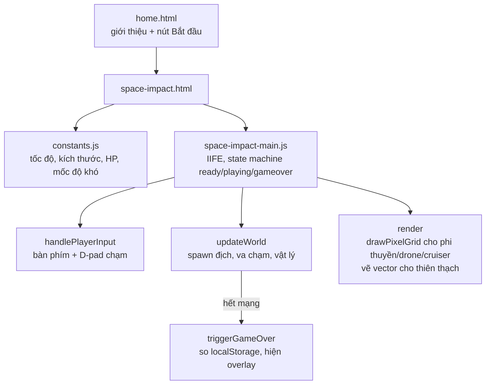

# Space Impact "màu": làm Nokia hoài niệm mà không được phép đen trắng

## 1. Mở đầu

Yêu cầu gốc chỉ có một câu, kèm một cái link ảnh: "thêm game Space Impact trên nokia đen trắng ngày xưa (nhưng có màu nhé)". Đọc lần đầu, câu trong ngoặc mới là phần khó — không phải "làm game bắn máy bay kiểu Space Impact" (cái đó có hàng trăm bản clone làm rồi), mà là "giữ đúng cảm giác màn hình LCD Nokia" trong khi cố tình phá vỡ đúng cái đặc trưng nhất của nó: chỉ có một màu xanh lá đơn sắc.

Mình còn chưa kịp mở file đầu tiên thì tin nhắn tiếp theo đã tới, ngay giữa lượt: "thêm game Rapid Roll". Rồi một tin nữa: "thêm game Pocket Carrom". Ba yêu cầu dồn vào nhau trước khi bất kỳ game nào được viết dòng code đầu tiên. Bài này kể về game đầu tiên trong chuỗi đó — Space Impact — cái đặt nền móng thẩm mỹ (và cả khung code) cho toàn bộ loạt game "Nokia hoài niệm" ra đời ngay sau nó trong cùng một phiên làm việc.

## 2. Bối cảnh

`game-development` lúc này đã có hơn chục game, phần lớn là remake các tựa game bàn phím kinh điển (Tank 1990, Snake, Pooyan...), mỗi game đều dùng chung một bộ khung: một thư mục riêng, `constants.js` tách hằng số, một file `*-main.js` bọc trong IIFE chạy vòng lặp `requestAnimationFrame`, một trạng thái `ready/playing/gameover`, HUD hiển thị bằng các `div.hud-chip` phía trên canvas, và một overlay bắt đầu/thua cuộc dùng chung. Việc đầu tiên mình làm không phải viết code mới, mà là mở `games/pooyan/js/pooyan-main.js` ra đọc lại từ đầu đến cuối để nắm đúng khuôn mẫu đó — vì lý do rất thực dụng: giữ nhất quán giúp mọi game "cắm vào" trang chủ (`home.html`) mà không cần suy nghĩ lại cấu trúc thư mục, cách lưu điểm cao (`localStorage`), hay cách hiện nút bắt đầu.

Cái khác biệt duy nhất Space Impact cần thêm vào khuôn mẫu đó là hai thứ: (1) di chuyển tự do 4 hướng thay vì chỉ trên/dưới như Pooyan, và (2) một hệ thống sprite pixel-art tự vẽ bằng `<canvas>` thay vì dùng ảnh — vì "Nokia nhưng có màu" không có sẵn asset nào để tải về, phải tự dựng.

## 3. Mục tiêu sản phẩm

**Sẽ làm:**
- Phi thuyền bay tự do 4 hướng (không cố định một trục như bản gốc trên Nokia), giới hạn trong 60% bề rộng màn hình bên trái để vẫn giữ cảm giác "hành lang bắn từ trái sang phải".
- 3 loại địch: drone (nhỏ, bay lượn sóng sin), cruiser (to hơn, bắn trả có ngắm), thiên thạch (không bắn, chỉ đâm, xoay tròn khi bay).
- Hệ thống nâng cấp súng 3 cấp — nhặt sao vàng để lên cấp (bắn chùm ba viên toả góc ở cấp 3), bị bắn trúng thì tụt một cấp.
- 3 mạng, bất tử tạm thời 1.2 giây sau khi mất mạng (kèm nhấp nháy).
- Độ khó tăng dần theo điểm số: tốc độ địch và tần suất xuất hiện đều leo thang có giới hạn trần.
- Giao diện "màn hình LCD Nokia nhưng có màu": khung điện thoại giả bằng CSS, lưới pixel phủ lên canvas bằng `mix-blend-mode: multiply`, sprite dựng từ lưới pixel thay vì ảnh bitmap.
- Nút điều khiển chạm (D-pad 4 hướng + nút bắn) hiện tự động trên thiết bị cảm ứng.

**Sẽ KHÔNG làm:**
- Không có boss cuối màn — địch chỉ tăng dần độ khó, không có mốc "màn" rõ ràng như bản Nokia gốc.
- Không có hitbox tròn/pixel-perfect — mọi va chạm dùng AABB hình chữ nhật đơn giản (`rectsOverlap`), đủ dùng cho sprite nhỏ 22-32px.
- Không lưu replay hay leaderboard — chỉ một con số điểm cao nhất theo máy, giống mọi game khác trong repo.
- Không tự động ngắm dự đoán hướng bay của người chơi cho đạn địch — cruiser chỉ nhắm thẳng vào vị trí người chơi *tại đúng thời điểm bắn*, không tính trước độ trễ.

MVP: mở trang, bấm bắt đầu, bay né đạn/thiên thạch, bắn rơi địch, nhặt sao lên cấp súng, thua khi hết 3 mạng, điểm cao nhất được nhớ lại lần sau.

## 4. Thiết kế hệ thống



Quyết định thiết kế đáng nói nhất nằm ở `drawPixelGrid` — một hàm dùng chung để vẽ mọi sprite từ một mảng chuỗi ký tự (`"1"` = màu chính, `"2"` = màu phụ, `"."` = trong suốt):

```javascript
function drawPixelGrid(cx, cy, size, rows, colorFn) {
    const cols = rows[0].length;
    const cell = size / cols;
    for (let r = 0; r < rows.length; r++) {
        for (let c = 0; c < cols; c++) {
            const ch = rows[r][c];
            if (ch === ".") continue;
            ctx.fillStyle = colorFn(ch);
            const px = cx - size / 2 + c * cell;
            const py = cy - (rows.length * cell) / 2 + r * cell;
            ctx.fillRect(Math.round(px), Math.round(py), Math.ceil(cell) + 0.5, Math.ceil(cell) + 0.5);
        }
    }
}
```

Đây là cách rẻ nhất để có được đúng cảm giác "8-bit dot-matrix" của màn Nokia mà không cần một file ảnh nào — phi thuyền, drone, cruiser đều chỉ là một mảng chuỗi 5-9 ký tự đặt cạnh nhau trong code, dễ chỉnh sửa hình dạng bằng mắt ngay trong file JS. Cái giá phải trả là `cols`/`cell` được suy ra từ *độ dài chuỗi của dòng đầu tiên* (`rows[0].length`) — một giả định ngầm sẽ quay lại ở phần 8.

Riêng thiên thạch không dùng `drawPixelGrid` — nó được vẽ bằng path lục giác thật (`ctx.lineTo` nối 6 điểm) rồi xoay bằng `ctx.rotate(e.angle)`, vì hình dạng bất định của đá không hợp với lưới ô vuông đều.

## 5. Tech Stack

| Công nghệ | Vì sao chọn |
| --- | --- |
| **`<canvas>` 2D, không dùng ảnh sprite** | "Nokia nhưng có màu" không có bộ sprite gốc nào để tái sử dụng hợp lý — tự vẽ bằng `fillRect` theo lưới pixel vừa nhanh vừa giữ đúng chất "dot-matrix" hơn là tải ảnh PNG rồi scale. |
| **`ctx.imageSmoothingEnabled = false`** | Bật mặc định (`true`) sẽ làm mờ các cạnh pixel-art khi canvas bị CSS scale lên kích thước hiển thị lớn hơn 360×560 gốc — tắt đi để giữ cạnh sắc nét, đúng cảm giác LCD low-res. |
| **CSS `mix-blend-mode: multiply` cho lưới LCD** | Một `<div>` phủ lên canvas với `repeating-linear-gradient` hai chiều, blend kiểu `multiply` để mô phỏng các đường phân cách ô pixel thật trên màn LCD cũ — thuần CSS, không tốn thêm một phép vẽ nào trong vòng lặp game. |
| **`requestAnimationFrame` + delta-time (`dt`)** | Giống toàn bộ game canvas khác trong repo — di chuyển và cooldown đều nhân với `dt` (giây) thay vì cộng dồn theo số tick, nên tốc độ không phụ thuộc framerate máy người chơi. |
| **AABB (`rectsOverlap`) cho mọi va chạm** | Sprite nhỏ, số lượng thực thể mỗi khung hình chỉ vài chục — không có lý do gì để làm circle-collision hay pixel-perfect collision phức tạp hơn mức cần thiết. |
| **`localStorage` cho điểm cao nhất** | Một con số duy nhất theo key `spaceImpactBestScore`, không cần cấu trúc dữ liệu hay đồng bộ gì hơn. |

## 6. Quá trình phát triển

### Giai đoạn 1 — Đọc lại Pooyan để lấy khung

Trước khi viết một dòng nào của Space Impact, mình đọc lại toàn bộ `pooyan-main.js` — không phải để copy logic gameplay (Pooyan là game bắn cố định một trục X, Space Impact cần bay tự do), mà để lấy đúng bộ khung: cách khai báo `state`, cách gắn `overlayBtn.addEventListener`, cách viết `startGame()`/`triggerGameOver()`/`loop()`. Nhờ vậy phần "hạ tầng" của Space Impact viết xong trong vài phút, dồn hết thời gian còn lại cho phần thật sự mới: di chuyển 4 hướng và hệ thống địch.

### Giai đoạn 2 — Di chuyển tự do, giới hạn một nửa màn hình

```javascript
player.y = Math.max(PLAYER_SIZE / 2, Math.min(GAME_HEIGHT - PLAYER_SIZE / 2, player.y));
player.x = Math.max(PLAYER_SIZE / 2, Math.min(playerMaxX, player.x));
```

`playerMaxX = GAME_WIDTH * PLAYER_MAX_X_RATIO` (0.6, tức 216px trên tổng 360px). Đây là một quyết định có ý thức, không phải giới hạn kỹ thuật: bản Space Impact gốc trên Nokia cho phi thuyền bay gần như tự do khắp màn hình, nhưng để lại cảm giác "hành lang bắn" quen thuộc của thể loại shoot 'em up (địch luôn xuất hiện từ bên phải, người chơi luôn ở bên trái), mình giới hạn phi thuyền không bao giờ vượt quá 60% chiều rộng — đủ chỗ né đạn theo cả 4 hướng, nhưng không bao giờ trôi dạt sang tận rìa phải nơi địch mới xuất hiện.

### Giai đoạn 3 — Ba loại địch, ba cách hành xử

Drone bay thẳng kèm dao động hình sin theo trục Y (`Math.sin(e.elapsed * e.bobFreq) * 18`), thiên thạch trôi tự do và bật ngược vận tốc dọc khi chạm biên trên/dưới, cruiser bắn đạn có ngắm thẳng vào vị trí người chơi mỗi 0.9-1.6 giây. Tỉ lệ xuất hiện chọn bằng random có trọng số (`pickEnemyType`): 55% drone, 25% thiên thạch, 20% cruiser — drone chiếm đa số để tạo nhịp bắn liên tục, cruiser hiếm hơn vì nó nguy hiểm nhất (bắn trả).

### Giai đoạn 4 — Súng lên cấp, mất cấp khi trúng đạn

```javascript
function loseLife() {
    if (invulnerable) return;
    lives -= 1;
    if (lives <= 0) {
        triggerGameOver(...);
    } else {
        invulnerable = true;
        weaponLevel = Math.max(1, weaponLevel - 1);
        setTimeout(() => { invulnerable = false; }, 1200);
    }
}
```

Cấp súng tụt một bậc mỗi lần mất mạng (nhưng không tụt dưới cấp 1) — một dạng "rubber-band" nhẹ: người chơi giỏi tích luỹ được súng mạnh, nhưng mỗi sai lầm đều có giá, buộc phải nhặt sao lại từ đầu thay vì giữ súng cấp 3 xuyên suốt ván.

### Giai đoạn 5 — Vẽ bằng lưới pixel, phủ lớp LCD lên trên

Phần cuối cùng là thẩm mỹ: viết `drawPixelGrid` và ba mảng chuỗi định nghĩa hình dạng phi thuyền/drone/cruiser, rồi thêm `.lcd-grid` — một `<div>` tuyệt đối phủ lên canvas với gradient kẻ ô mờ — để mọi thứ trông như đang hiển thị qua một màn LCD thật, dù màu sắc thì rực rỡ hoàn toàn trái ngược với bản gốc đen trắng.

## 7. Những bug đáng nhớ

### Bug #1: Thiên thạch có thể trồi ra ngoài biên đúng một khung hình trước khi bật ngược lại

**Hiện tượng:** Phát hiện lại khi đọc kỹ code để viết bài này (không phải trong lúc chơi thử, vì chênh lệch quá nhỏ để mắt thường nhận ra ở tốc độ 90-150px/giây) — thiên thạch có thể đi lố qua rìa trên/dưới màn hình một khoảng rất nhỏ trước khi đảo chiều, thay vì bật ngược ngay tại đúng biên.

**Nguyên nhân:** Thứ tự thao tác trong `updateWorld`:

```javascript
e.x -= e.speed * dt;
e.y += e.vy * dt;         // (1) cập nhật vị trí trước
e.angle += e.spin * dt;
if (e.y < e.size / 2 || e.y > GAME_HEIGHT - e.size / 2) e.vy *= -1;  // (2) rồi mới kiểm tra biên
```

Vị trí được cộng dồn *trước*, kiểm tra biên chạy *sau* — nghĩa là ở đúng khung hình chạm biên, thiên thạch đã di chuyển lố ra ngoài giới hạn cho phép trong khoảnh khắc đó, vận tốc chỉ đảo chiều để khung hình *tiếp theo* kéo nó về, nhưng bản thân vị trí ở khung hình chạm biên không hề bị kẹp (clamp) lại vào trong biên.

**Cách sửa:** Chưa sửa trong bản hiện tại — vì độ lệch tối đa mỗi khung hình chỉ khoảng `ASTEROID_SPEED_MAX * dt ≈ 150 × 0.016 ≈ 2.4px`, nhỏ hơn nhiều so với kích thước 28px của thiên thạch, nên gần như không thể nhận ra bằng mắt thường khi chơi bình thường. Cách sửa đúng là thêm một dòng `e.y = Math.max(e.size/2, Math.min(GAME_HEIGHT - e.size/2, e.y));` ngay sau khi đảo vận tốc.

**Điều rút ra:** "Cập nhật vị trí rồi mới kiểm tra biên" là một thứ tự rất dễ viết nhầm tay, vì nó *chạy đúng* trong tuyệt đại đa số trường hợp — chỉ lộ sai số ở đúng khung hình chạm biên, và sai số đó thường nhỏ tới mức không ai để ý trừ khi ngồi đọc lại code với đúng câu hỏi "giá trị này có bao giờ vượt giới hạn không" trong đầu. Class va chạm nào cũng nên tự hỏi: *clamp vị trí* hay chỉ *đảo vận tốc*?

## 8. Những quyết định sai

**`drawPixelGrid` suy ra số cột từ độ dài chuỗi của đúng một dòng (`rows[0].length`).** Nếu sau này có ai (kể cả chính mình) sửa một mảng sprite mà lỡ tay để một dòng ngắn/dài hơn các dòng còn lại — ví dụ gõ thiếu một dấu `.` — không có gì báo lỗi cả, cột chỉ đơn giản bị lệch âm thầm ở những dòng có độ dài khác, sprite vẽ ra méo mó nhưng game vẫn chạy bình thường không văng lỗi console. Ba mảng sprite hiện tại (`PLAYER_SPRITE`, `DRONE_SPRITE`, `CRUISER_SPRITE`) đều đã được kiểm tra đều tay, nhưng bản thân hàm không có gì tự bảo vệ trước sai sót đó.

**Cruiser ngắm thẳng vào vị trí người chơi tại đúng thời điểm bắn, không dự đoán hướng di chuyển.** Nghĩa là chỉ cần liên tục di chuyển (theo bất kỳ hướng nào) ngay sau khi thấy cruiser chuẩn bị bắn là gần như luôn né được — đạn bay tới đúng nơi người chơi *đã từng* đứng, không phải nơi sắp đứng. Đây là lựa chọn có ý thức để giữ độ khó vừa phải (thay vì "bullet hell" ngắm dự đoán khó né), nhưng cũng đồng nghĩa cruiser sẽ mãi mãi dễ hơn nó có thể trở thành nếu được nâng cấp AI sau này.

**Sai số làm tròn cấp pixel trong `drawPixelGrid` khi `size / cols` không phải số nguyên.** `PLAYER_SIZE` là 26, sprite rộng 9 cột, `cell = 26/9 ≈ 2.89px` — mỗi ô được làm tròn vị trí (`Math.round(px)`) nhưng độ rộng ô lại làm tròn lên (`Math.ceil(cell) + 0.5`), nên về lý thuyết có thể tích luỹ sai số nhỏ giữa các cột khiến hàng pixel cuối không thẳng hàng tuyệt đối với hàng đầu. Ở kích thước 22-32px hiển thị trên một canvas 360px rồi phóng to bằng CSS, sai số này chưa từng lộ ra bằng mắt thường qua các lần test — nhưng đây là kiểu đánh đổi "chấp nhận vì chưa thấy hậu quả" hơn là "đã chứng minh là vô hại".

## 9. Những điều học được

- **Đọc lại một game đã có trong cùng repo trước khi viết game mới cùng khuôn mẫu tiết kiệm thời gian hơn nhiều so với tự nhớ lại cấu trúc từ đầu** — đặc biệt khi khuôn mẫu đó (state machine, HUD, overlay) sẽ được tái sử dụng cho nhiều game tiếp theo trong cùng phiên làm việc.
- **"Cập nhật vị trí trước, kiểm tra biên sau" là một pattern rò rỉ sai số rất nhỏ nhưng rất dễ lặp lại** ở bất kỳ đối tượng nào bay tự do trong không gian 2D — đáng để có một hàm `clampToBounds` dùng chung thay vì viết tay từng nơi.
- **Một hàm vẽ dùng chung dựa trên dữ liệu mảng chuỗi (thay vì hard-code từng hình dạng) đổi lại được tốc độ chỉnh sửa hình ảnh rất nhanh** — nhưng cũng âm thầm đặt ra một hợp đồng ngầm (mọi dòng phải cùng độ dài) mà không có gì enforce ngoài kỷ luật của người viết.
- **Giới hạn không gian di chuyển của người chơi là một công cụ cân bằng độ khó rẻ tiền nhưng hiệu quả** — không cần thêm logic AI hay địch mới, chỉ cần thu hẹp vùng né đạn là độ khó đã thay đổi rõ rệt.

## 10. Kết quả

| Hạng mục | Con số |
| --- | --- |
| Tổng số dòng code (JS + CSS + HTML) | 1.034 dòng |
| `js/space-impact-main.js` (toàn bộ gameplay) | 510 dòng |
| `css/space-impact.css` | 257 dòng |
| `css/home.css` | 125 dòng |
| `js/constants.js` | 49 dòng |
| Số loại địch | 3 (drone, cruiser, thiên thạch) |
| Số cấp súng | 3 |
| Test tự động | 0 — kiểm tra bằng Chrome automation (giữ phím, chụp màn hình, đọc console) ngay trong phiên viết code |
| CI/CD | Không có |

## 11. Nếu làm lại từ đầu

- **Thêm hàm `clampToBounds` dùng chung** cho mọi thực thể bay tự do, thay vì để mỗi loại đối tượng tự viết logic biên riêng (giải quyết Bug #1 tận gốc thay vì chấp nhận sai số nhỏ).
- **Thêm một bước validate độ dài dòng khi định nghĩa sprite** (hoặc đơn giản là chuyển từ mảng chuỗi sang mảng số/mảng boolean 2 chiều đã cố định kích thước), để lỗi sai lệch cột báo ngay ở thời điểm định nghĩa thay vì âm thầm vẽ méo.
- **Cho cruiser ngắm dự đoán một phần** (nội suy giữa vị trí hiện tại và vận tốc gần đây của người chơi) thay vì ngắm thẳng vị trí hiện tại, để địch mạnh nhất trong game thật sự cảm thấy nguy hiểm hơn khi độ khó tăng theo điểm số.

## 12. Kết

Space Impact không phải game phức tạp nhất trong đợt này — nó chỉ có một màn chơi, không boss, không nhiều cơ chế. Nhưng nó là game đặt ra bộ "ngôn ngữ hình ảnh" (lưới LCD phủ màu, sprite pixel tự vẽ) mà bốn game tiếp theo trong cùng phiên (Rapid Roll, Pocket Carrom, Bắn Ruồi, rồi cả loạt Brick Game sau đó) đều vay mượn lại ít nhiều. Cái thú vị nhất khi ngồi viết lại câu chuyện này không phải là nhớ lại một sự cố kịch tính nào — mà là nhận ra, khi đọc lại code với con mắt "đi tìm bug" thay vì "đang viết mới", có bao nhiêu chi tiết nhỏ (thứ tự cập nhật vị trí, giả định ngầm về độ dài chuỗi) từng trôi qua êm xuôi lúc code chạy đúng ngay lần đầu, chỉ lộ ra khi đọc lại với đúng câu hỏi.
