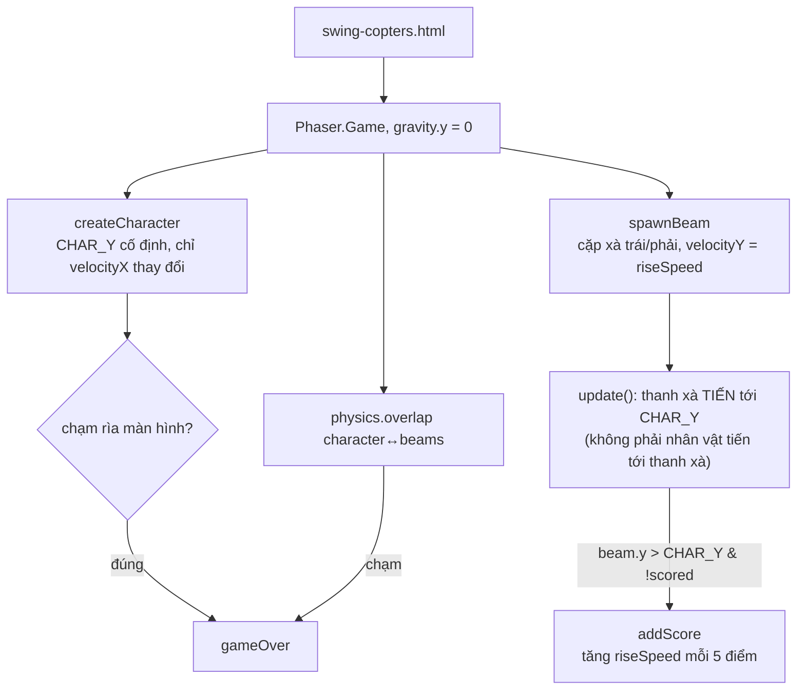

# Swing Copters: game "đứng yên" mượn nguyên một bug từ người anh em Flappy Bird

## 1. Mở đầu

Mở `js/q-learning-agent.js` của Swing Copters cạnh phiên bản cùng tên trong thư mục Flappy Bird, và chạy `diff` giữa hai file — phần lớn giống hệt nhau, chỉ khác đúng một hàm: `getFlappyState` đổi tên và đổi công thức thành `getSwingState`, phần còn lại của class `QLearningAgent` (alpha, gamma, epsilon-greedy, cập nhật Q-value) không đổi một chữ. Đây là bằng chứng rõ ràng nhất trong toàn bộ repo về việc kiến trúc "chế độ AI Q-learning" được xây một lần, rồi tái sử dụng có chủ đích cho game thứ hai — và cùng với phần tái sử dụng đó, một bug đã từng ghi nhận ở Flappy Bird cũng đi theo, nguyên vẹn, sang đúng game này.

## 2. Bối cảnh

Swing Copters là "anh em song sinh" kỹ thuật của Flappy Bird — cùng dùng Phaser 3, cùng cấu trúc scene, cùng có chế độ AI Q-learning không được nhắc tới trong README. Nhưng về gameplay, nó đảo ngược hoàn toàn giả định cốt lõi của Flappy Bird: thay vì nhân vật cố định theo trục ngang và di chuyển theo trục dọc, ở đây nhân vật cố định theo trục *dọc* (`CHAR_Y` không bao giờ đổi) và chỉ di chuyển ngang, trong khi chướng ngại vật (các thanh xà ngang) trôi xuống từ trên. README tự gọi đây là quyết định thiết kế có chủ đích: *"the character's vertical position never moves — instead the beam pairs are the ones that scroll downward, which gives the same visual effect of the character 'flying up' through obstacles while keeping the physics simple."*

## 3. Mục tiêu sản phẩm

**Đã làm (theo README, cộng chế độ AI phát hiện khi đọc code):**
- Một nút bấm duy nhất: chạm/nhấn Space để đảo hướng bay ngang (trái ↔ phải), nhân vật trôi ngang liên tục cho tới lần bấm tiếp theo.
- Cặp thanh xà (trái/phải, chừa một khe hở ngẫu nhiên) sinh ra từ trên, trôi xuống theo hẹn giờ.
- Độ khó tăng dần: cứ mỗi 5 điểm, tốc độ trôi xuống của thanh xà tăng lên (áp dụng lại cho cả các thanh đã có mặt trên màn hình), có trần tối đa.
- Hai cách thua: đâm vào thanh xà, hoặc trôi dạt ra sát rìa trái/phải màn hình.
- **(Không có trong README) Chế độ AI:** kiến trúc Q-learning giống hệt Flappy Bird, chỉ đổi hàm rời rạc hoá trạng thái cho phù hợp với trục chuyển động ngược lại.

**Sẽ KHÔNG làm:**
- Không có trọng lực — nhân vật không rơi, chỉ trôi ngang với tốc độ không đổi, đảo chiều tức thời khi có input.
- Không tránh lặp code giữa `handleInput` (chế độ người chơi) và `aiFlip` (chế độ AI) — cả hai chứa đúng ba dòng giống hệt nhau (xem phần 8).

MVP: đảo hướng bay đúng lúc để lách qua khe hở giữa các thanh xà, tránh chạm xà hoặc rìa màn hình, ghi điểm mỗi lần vượt qua một cặp xà.

## 4. Thiết kế hệ thống



Điểm đảo ngược quan trọng nhất so với Flappy Bird nằm ở chỗ *ai di chuyển thực sự*:

```javascript
// Flappy Bird: chim CÓ trọng lực, ống ĐỨNG YÊN theo trục dọc (chỉ trôi ngang)
// Swing Copters: nhân vật KHÔNG trọng lực, xà CÓ velocityY (trôi dọc xuống)
[leftBeam, rightBeam].forEach((beam) => {
    beam.body.setAllowGravity(false);
    beam.body.setImmovable(true);
    beam.body.setVelocityY(this.riseSpeed);   // xà tự trôi xuống, không phải nhân vật trôi lên
});
```

Về mặt hình ảnh, người chơi vẫn có cảm giác "bay lên xuyên qua các thanh xà" — nhưng về mặt vật lý, chính các thanh xà mới là vật thể chuyển động theo trục đó, nhân vật hoàn toàn đứng yên theo chiều dọc. Cách làm này (đã được README tự giải thích rõ) giữ vật lý đơn giản hơn nhiều so với việc mô phỏng một nhân vật "bay lên" thật (sẽ cần tính lại vị trí camera hoặc cuộn toàn bộ thế giới) — chỉ cần đúng một trục chuyển động cho chướng ngại vật là đủ tạo ra ảo giác mong muốn.

## 5. Tech Stack

| Công nghệ | Vì sao chọn |
| --- | --- |
| **Kiến trúc AI Q-learning tái sử dụng từ Flappy Bird, chỉnh sửa hàm trạng thái** | Không viết lại từ đầu — `QLearningAgent` (thuật toán học) hoàn toàn độc lập với ý nghĩa cụ thể của trạng thái, chỉ cần một hàm rời rạc hoá mới (`getSwingState`) phù hợp với trục chuyển động đảo ngược của game này. |
| **Vật lý một chiều: nhân vật chỉ có `velocityX`, xà chỉ có `velocityY`** | Không trục nào của game thực sự cần cả hai chiều chuyển động cùng lúc cho cùng một thực thể — tách biệt rõ ràng giúp mã nguồn đơn giản hơn so với việc dùng chung một mô hình chuyển động 2 chiều cho cả nhân vật lẫn chướng ngại vật. |
| **Cập nhật lại vận tốc của MỌI thanh xà đang tồn tại khi độ khó tăng** (`this.beams.getChildren().forEach((b) => b.body.setVelocityY(this.riseSpeed));`) | Đảm bảo độ khó tăng lên áp dụng ngay lập tức và đồng đều, không tạo ra tình huống kỳ lạ nơi các thanh xà cũ trôi chậm hơn các thanh mới sinh ra cùng lúc trên màn hình. |

## 6. Quá trình phát triển

*(Suy luận từ cấu trúc code và README hiện có.)*

### Giai đoạn 1 — Nhân vật cố định, một cặp xà trôi xuống

Nền tảng: xác nhận cơ chế "xà di chuyển thay vì nhân vật di chuyển" tạo đúng cảm giác mong muốn trước khi thêm logic sinh nhiều cặp xà liên tục.

### Giai đoạn 2 — Đảo hướng, va chạm, hai cách thua

Thêm `handleInput` (đảo `direction`, đổi `velocityX`) và hai điều kiện kết thúc game độc lập — va chạm vật lý với xà (qua `physics.add.overlap`) và kiểm tra thủ công vị trí biên màn hình (trong `update()`, không qua physics overlap vì rìa màn hình không phải một GameObject thực sự).

### Giai đoạn 3 — Độ khó tăng dần theo mốc điểm

`addScore` với ngưỡng "mỗi 5 điểm" — một quyết định thiết kế giống hệt cấu trúc `DIFFICULTY_SCORE_STEP` đã thấy ở nhiều game canvas khác trong repo (Space Impact, Pooyan), dù ở đây được viết trực tiếp trong Phaser thay vì một vòng lặp canvas tự viết.

### Giai đoạn 4 — Mượn kiến trúc AI từ Flappy Bird

Copy cấu trúc `sharedAgent`, `aiUpdate()`, và toàn bộ vòng lặp huấn luyện từ Flappy Bird, chỉ thay hàm rời rạc hoá trạng thái. Đây cũng chính là giai đoạn khiến bug đã ghi nhận ở Flappy Bird di cư sang game này nguyên vẹn.

## 7. Những bug đáng nhớ

### Bug thừa hưởng: episode counter bị thổi phồng, giống hệt Flappy Bird

`swing-copters-main.js` chứa đúng khối code đã phân tích chi tiết trong bài viết về Flappy Bird:

```javascript
if (this.state === "gameover") {
    this.agent.episode += 1;
    this.agent.decayEpsilon();
    if (this.agent.episode % 20 === 0) this.agent.save();
    this.updateAiHud();
    this.time.delayedCall(80, () => {
        if (this.scene) this.scene.restart();
    });
    return;
}
```

Không có gì khác biệt so với bản ở Flappy Bird — cùng thiếu cờ chặn tái nhập, cùng bị gọi lại nhiều lần trong khoảng 80ms giữa lúc `this.state` chuyển thành `"gameover"` và lúc `scene.restart()` thực sự kích hoạt, vì `physics.pause()` (gọi trong `gameOver()`) không hề ngăn `update()` của Scene tiếp tục chạy mỗi khung hình. Hậu quả giống hệt: `episode` và `epsilon` có thể bị cập nhật nhiều lần cho cùng một cái chết. Chi tiết đầy đủ về nguyên nhân và cách sửa đã có trong bài viết về Flappy Bird — điều đáng nói ở *đây* không phải bản thân bug, mà là cách nó lan truyền.

**Điều thực sự đáng chú ý:** Đây là bằng chứng cụ thể cho một dạng rủi ro riêng của việc tái sử dụng code bằng sao chép (không phải qua một module dùng chung): khi game thứ hai copy một khối logic từ game thứ nhất, nó copy *nguyên vẹn* cả những gì đúng lẫn những gì sai. Nếu kiến trúc AI được tách thành một class hay hàm dùng chung thực sự (import từ một file duy nhất, thay vì copy-paste file `q-learning-agent.js` sang một thư mục khác và chỉnh sửa tay), sửa bug ở Flappy Bird sẽ tự động sửa luôn cho Swing Copters. Với cách tổ chức hiện tại (mỗi game một bản sao độc lập của gần như toàn bộ file), sửa ở một nơi không lan sang nơi còn lại — hai bug giống hệt nhau giờ tồn tại như hai vấn đề *riêng biệt*, cần hai lần sửa riêng biệt.

## 8. Những quyết định sai

**`handleInput()` (nhánh `"playing"`) và `aiFlip()` chứa đúng ba dòng logic giống hệt nhau, không dùng chung một hàm:**

```javascript
// Trong handleInput(), nhánh "playing"
this.direction *= -1;
this.character.body.setVelocityX(this.direction * HORIZONTAL_SPEED);
this.tweens.add({ targets: this.character, angle: this.direction * 15, duration: 150 });

// Trong aiFlip() — giống hệt
this.direction *= -1;
this.character.body.setVelocityX(this.direction * HORIZONTAL_SPEED);
this.tweens.add({ targets: this.character, angle: this.direction * 15, duration: 150 });
```

Vô hại về mặt hành vi (cả hai chạy đúng), nhưng là một vi phạm nguyên tắc "không lặp lại chính mình" (DRY) nhỏ nhưng rõ ràng — nếu sau này cần chỉnh sửa hành vi đảo hướng (ví dụ thêm hiệu ứng âm thanh, hoặc đổi công thức góc nghiêng), phải nhớ sửa đúng cả hai chỗ, một rủi ro tương tự (dù ở quy mô nhỏ hơn nhiều) so với sự phụ thuộc ngầm giữa ba đoạn code đã ghi nhận ở Caro.

## 9. Những điều học được

- **Tái sử dụng code bằng sao chép-dán mang theo cả ưu điểm (triển khai nhanh, đã kiểm chứng) lẫn nhược điểm (bug có sẵn cũng được sao chép nguyên vẹn) của phần được sao chép** — khác với việc chia sẻ qua một module dùng chung thực sự, nơi một lần sửa lan toả tới mọi nơi sử dụng nó.
- **Khi hai phần của một hệ thống (ở đây là hai game) đủ giống nhau về kiến trúc để đáng được sao chép, đó cũng là tín hiệu cho thấy chúng đủ giống nhau để đáng được trừu tượng hoá thành một thành phần dùng chung thực sự** — quyết định không làm điều đó (có thể vì áp lực thời gian, hoặc vì mỗi game được viết độc lập không lường trước game thứ hai) là một đánh đổi có thật, không phải mặc định miễn phí.
- **Đảo ngược một giả định thiết kế cốt lõi (chi ai di chuyển, ai đứng yên) trong khi giữ nguyên phần lớn kiến trúc còn lại là một cách hiệu quả để tạo ra một game "mới" từ một nền tảng đã có** — Swing Copters chứng minh điều đó vừa ở tầng gameplay (đảo trục chuyển động) vừa ở tầng AI (đảo vai trò dx/dy trong hàm trạng thái).

## 10. Kết quả

| Hạng mục | Con số |
| --- | --- |
| Tổng số dòng code (JS + CSS + HTML) | 916 dòng |
| `js/swing-copters-main.js` | 391 dòng |
| `css/home.css` | 173 dòng |
| `css/swing-copters.css` | 144 dòng |
| `js/q-learning-agent.js` | 95 dòng |
| `js/swing-copters-home.js` | 29 dòng |
| Số chế độ chơi | 2 (thường, AI Q-learning — không có trong README) |
| Số dòng khác biệt so với `q-learning-agent.js` của Flappy Bird | Chỉ hàm rời rạc hoá trạng thái (`getSwingState` thay `getFlappyState`) |
| Test tự động | 0 |
| CI/CD | Không có |

## 11. Nếu làm lại từ đầu

- **Áp dụng đúng cách sửa đã đề xuất ở bài Flappy Bird** (thêm cờ chặn tái nhập cho khối xử lý gameover trong `aiUpdate()`) — sao chép cách sửa cũng dễ như sao chép bug đã từng xảy ra.
- **Trích xuất `QLearningAgent` và phần khung "vòng lặp huấn luyện AI" (bao gồm cả khối xử lý gameover) thành một file dùng chung thực sự**, import bởi cả hai game, chỉ mỗi game tự định nghĩa hàm rời rạc hoá trạng thái riêng (`getFlappyState`/`getSwingState`) — biến việc sửa một bug ở một nơi thành việc sửa nó ở mọi nơi cùng lúc.
- **Gộp `handleInput`'s nhánh "playing" và `aiFlip()` thành một hàm `flipDirection()` dùng chung**, gọi từ cả input người chơi lẫn quyết định của AI — giải quyết vi phạm DRY đã ghi nhận ở phần 8.

## 12. Kết

Swing Copters là bài học thú vị nhất trong cả loạt về chi phí ẩn của việc sao chép code thay vì chia sẻ nó — không phải vì bản thân sự sao chép sai, mà vì nó âm thầm nhân đôi cả gánh nặng bảo trì lẫn bug đã biết, mà không có gì báo hiệu điều đó cho tới khi có ai đó đọc cả hai game cạnh nhau và nhận ra chúng đang chia sẻ đúng một vấn đề, ở hai nơi hoàn toàn tách biệt trong cùng một repository.
