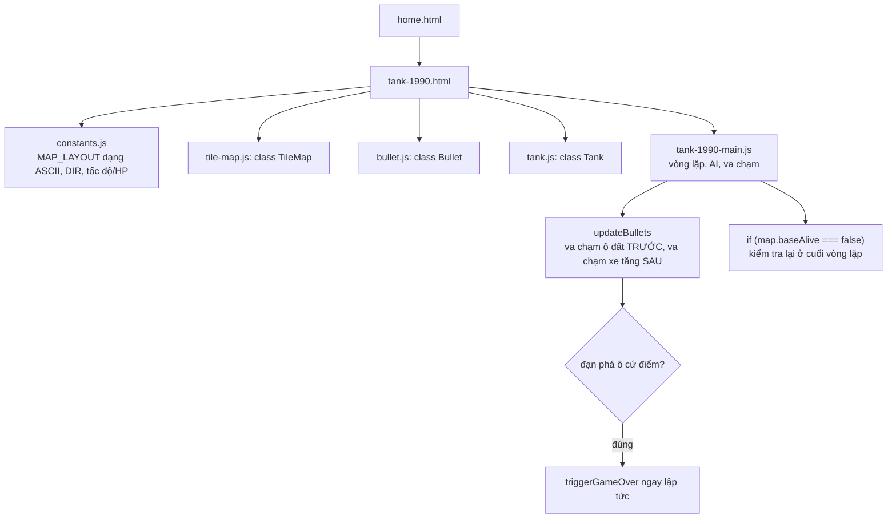

# Tank 1990: một điều kiện thắng thua không bao giờ có cơ hội tự mình quyết định điều gì

## 1. Mở đầu

Có đúng hai nơi trong code kiểm tra "cứ điểm đã bị phá huỷ chưa": một nằm ngay bên trong hàm xử lý va chạm đạn, gọi `triggerGameOver` ngay tại khoảnh khắc viên đạn phá vỡ ô cứ điểm cuối cùng; một nằm ở cuối vòng lặp chính, đọc lại `map.baseAlive` sau khi mọi thứ khác trong khung hình đã cập nhật xong, rồi cũng gọi `triggerGameOver`. Đọc lướt qua, đây trông như một lớp bảo hiểm hợp lý — "phòng khi" nơi thứ nhất bỏ sót. Nhưng lần theo toàn bộ codebase, `baseAlive` chỉ có đúng một chỗ duy nhất từng gán giá trị `false` — và chỗ đó nằm ngay trong đường thực thi dẫn tới lệnh gọi thứ nhất. Lớp bảo hiểm thứ hai không phải "phòng khi" — nó là một con đường không bao giờ được đi qua khác với con đường đã đi qua trước đó.

## 2. Bối cảnh

Tank 1990 là bản clone của Battle City — một trong những game phức tạp nhất trong repo tính tới thời điểm này, xét về số lượng thực thể tương tác cùng lúc: một bản đồ 13×13 ô có thể bị phá huỷ từng phần, tối đa 4 xe tăng địch cùng lúc trên sân cộng một boss, đạn từ cả hai phía, và một cứ điểm cần bảo vệ. Đây cũng là game đầu tiên trong repo có kiến trúc chia thành nhiều file class riêng biệt (`TileMap`, `Bullet`, `Tank`) thay vì gói gọn mọi thứ trong một file `*-main.js` duy nhất — độ phức tạp của bài toán (nhiều loại thực thể, nhiều loại tương tác) đủ lớn để việc tách file trở thành lựa chọn hợp lý thay vì một sự lựa chọn phong cách.

## 3. Mục tiêu sản phẩm

**Đã làm (đọc từ README và code hiện có):**
- Bản đồ ô vuông 13×13 với 4 loại địa hình: gạch (phá được bằng đạn), thép (không phá được), nước (chặn xe tăng nhưng không chặn đạn), và cứ điểm (phá được, thua ngay nếu bị phá).
- Tối đa 4 xe tăng địch cùng lúc trên sân, sinh ra từ 3 điểm cố định, mỗi đợt (wave) cần tiêu diệt nhiều hơn đợt trước 2 chiếc (bắt đầu từ 6) trước khi boss xuất hiện.
- Boss: máu tăng theo đợt, thanh máu riêng, bắn chùm hai viên thay vì một, có banner thông báo khi xuất hiện.
- AI đơn giản: địch và boss chọn hướng ngẫu nhiên theo chu kỳ hoặc khi bị chặn đường, không có pathfinding hướng về người chơi.
- 3 mạng, bất tử tạm thời sau khi hồi sinh, điểm số + điểm cao nhất lưu `localStorage`.

**Sẽ KHÔNG làm (theo đúng README):**
- Không có pathfinding — địch không bao giờ "biết" người chơi ở đâu để truy đuổi có chủ đích.
- Không có nâng cấp vũ khí hay vật phẩm nhặt được như bản Battle City gốc (đạn xuyên giáp, khiên bảo vệ cứ điểm...).
- Steel không bao giờ bị phá — chỉ gạch và cứ điểm mòn dần theo đạn.

MVP: điều khiển xe tăng, bắn địch, bảo vệ cứ điểm, sống sót qua các đợt tăng dần, đánh bại boss để lên đợt tiếp theo.

## 4. Thiết kế hệ thống



Cấu trúc tách lớp (`TileMap` quản lý địa hình, `Bullet`/`Tank` là thực thể, `tank-1990-main.js` điều phối) cho phép mỗi phần chỉ cần biết đúng phần việc của mình: `TileMap` không biết gì về xe tăng, `Tank` không biết gì về bản đồ, mọi phối hợp (ai va chạm với ai) đều nằm gọn trong vòng lặp chính. Đây là điểm khác biệt lớn nhất về kiến trúc so với các game canvas đơn giản hơn trong repo (Space Impact, Bắn Ruồi), nơi mọi thứ — từ dữ liệu tới logic vẽ — đều nằm trong đúng một file.

## 5. Tech Stack

| Công nghệ | Vì sao chọn |
| --- | --- |
| **Bản đồ ASCII parse thành lưới 2D (`MAP_LAYOUT`)** | Một chuỗi ký tự (`.`/`B`/`S`/`W`/`E`) dễ chỉnh sửa layout bằng mắt ngay trong file constants, không cần công cụ thiết kế bản đồ riêng — cùng triết lý với sprite dạng chuỗi ký tự của Space Impact và Tetris. |
| **`getTile` trả về `TILE_STEEL` cho toạ độ ngoài biên** | Biến vùng ngoài bản đồ 13×13 thành một "bức tường thép vô hình" tự nhiên — không cần thêm điều kiện biên riêng ở bất kỳ đâu khác kiểm tra va chạm, mọi thứ tự động bị chặn lại đúng rìa bản đồ. |
| **Tách `isSolidForTank`/`isSolidForBullet` thành hai hàm riêng dù logic gần giống nhau** | Nước chặn xe tăng nhưng không chặn đạn — hai khái niệm "rắn với ai" khác nhau đủ để xứng đáng có hai hàm riêng thay vì một hàm chung kèm tham số boolean khó đọc. |
| **Class ES6 (`TileMap`, `Bullet`, `Tank`) thay vì object literal + hàm rời rạc** | Với số lượng thực thể tăng lên (nhiều xe tăng, nhiều đạn cùng lúc), gói dữ liệu và hành vi vào một class giúp mỗi thực thể tự quản lý trạng thái của mình (`fireCooldown`, `tickCooldown`) mà không cần một mảng trạng thái rời rạc song song với mảng thực thể. |

## 6. Quá trình phát triển

*(Suy luận từ cấu trúc code và README hiện có.)*

### Giai đoạn 1 — Bản đồ tĩnh, một xe tăng di chuyển

`TileMap` và `moveTank` là nền tảng đầu tiên: xe tăng di chuyển trên lưới, bị chặn bởi gạch/thép/nước, không có đạn, không có địch.

### Giai đoạn 2 — Đạn và phá huỷ địa hình

`Bullet` và `damageTile` — đạn bay theo hướng bắn, gạch biến mất khi trúng đạn, thép chặn đạn nhưng không mất gì, cứ điểm bị phá vỡ và kết thúc game ngay khi trúng đạn.

### Giai đoạn 3 — Địch, AI ngẫu nhiên có chủ đích

`updateEnemyAI` — hướng đi ngẫu nhiên, đổi hướng khi hết thời gian ngẫu nhiên HOẶC khi bị chặn đường (`enemy.blocked`) — chi tiết "đổi hướng khi bị chặn" quan trọng hơn tưởng tượng: không có nó, một xe tăng địch hoàn toàn có thể chọn ngẫu nhiên đúng hướng đối diện một bức tường và đứng yên tại chỗ cho tới khi hết `aiTimer` kế tiếp, trông rất "ngu" và phá vỡ ảo giác về một AI đang "cố gắng" di chuyển.

### Giai đoạn 4 — Đợt chơi (wave) và boss

`spawnWave`/`trySpawnBoss` — đếm số địch cần sinh ra mỗi đợt, tăng dần theo cấp số cộng, boss chỉ xuất hiện khi đợt đã sinh hết địch VÀ toàn bộ địch đã bị tiêu diệt — hai điều kiện tách biệt (`enemiesToSpawnInWave <= 0` và `enemies.length === 0`) đảm bảo boss không bao giờ xuất hiện giữa lúc còn địch thường trên sân.

## 7. Những bug đáng nhớ

### Không phải bug — một điều kiện kiểm tra thắng thua không bao giờ có cơ hội tự quyết định điều gì

**Phát hiện khi lần theo toàn bộ nơi `baseAlive` được đọc và ghi để viết bài này:**

Chỉ có đúng một nơi trong toàn bộ codebase gán `baseAlive = false`:

```javascript
// tile-map.js — damageTile()
if (t === TILE_BASE) {
    this.grid[row][col] = TILE_EMPTY;
    this.baseAlive = false;
    return "base";
}
```

Và `damageTile` chỉ được gọi từ đúng một nơi:

```javascript
// tank-1990-main.js — updateBullets()
if (map.isSolidForBullet(col, row)) {
    const result = map.damageTile(col, row);
    b.alive = false;
    if (result === "base") triggerGameOver("Cứ điểm bị phá hủy!");   // (1)
}
```

Nghĩa là ngay tại khoảnh khắc `baseAlive` chuyển thành `false`, `triggerGameOver` đã được gọi trực tiếp ở dòng `(1)`, trong cùng một lệnh gọi hàm. Vậy điều kiện thứ hai, nằm ở cuối vòng lặp chính:

```javascript
// tank-1990-main.js — loop()
if (map.baseAlive === false && state === "playing") {
    triggerGameOver("Cứ điểm bị phá hủy!");    // (2)
}
```

...sẽ luôn chạy *sau* dòng `(1)` trong cùng khung hình đó (vì `updateBullets()` được gọi trước điều kiện này trong thân `loop()`), và tại thời điểm đó `state` đã là `"gameover"` — điều kiện `state === "playing"` ở dòng `(2)` đã sai, nên nhánh này không bao giờ thực sự gọi `triggerGameOver` một cách "có ý nghĩa mới". Ngay cả trong giả thuyết `triggerGameOver` bị gọi hai lần, bản thân hàm đó đã có `if (state === "gameover") return;` tự vệ ở đầu — nên dòng `(2)` không gây hại gì, nhưng nó cũng chưa từng, và sẽ không bao giờ, là con đường *đầu tiên* dẫn tới kết thúc game vì cứ điểm bị phá.

**Vì sao không phải "phòng thủ hợp lý cho tương lai" như trường hợp tương tự ở Tetris:** Ở Tetris, nhánh `br < 0` trong `collides` có thể được kích hoạt nếu một quyết định thiết kế khác (vị trí spawn khối) thay đổi. Ở đây, không có con đường hợp lý nào khác có thể khiến `baseAlive` chuyển thành `false` ngoài đúng lệnh gọi `damageTile` duy nhất đã có — trừ khi ai đó thêm hẳn một cơ chế phá cứ điểm hoàn toàn mới (ví dụ va chạm trực tiếp của xe tăng, không qua đạn). Cho tới khi điều đó xảy ra, dòng `(2)` là mã lặp thực sự, không phải lưới an toàn cho một kịch bản tương lai cụ thể nào.

**Điều rút ra:** Không phải mọi điều kiện kiểm tra trùng lặp đều mang cùng một ý nghĩa. Có loại là "lưới an toàn cho một đường đi khác trong tương lai" (đáng giữ lại), có loại là "kiểm tra lại một điều kiện chỉ có thể đúng thông qua đúng một con đường đã được xử lý trước đó rồi" (không mang thêm giá trị nào). Phân biệt được hai loại này đòi hỏi lần theo *toàn bộ* nơi một biến trạng thái được ghi, không chỉ đọc riêng lẻ từng chỗ nó được kiểm tra.

## 8. Những quyết định sai

**`player.alive` được khởi tạo `true` trong constructor `Tank` và không bao giờ bị đặt lại `false` ở bất kỳ đâu**, khác với `enemy.alive`/`boss.alive` (đều được đặt `false` đúng lúc bị tiêu diệt). Vì `render()` kiểm tra `if (player && player.alive)` trước khi vẽ, và điều kiện này luôn đúng, trường `alive` trên đối tượng `player` trở thành một trường không bao giờ thay đổi giá trị — vô hại (không gây lỗi hiển thị, vì màn hình Game Over che phủ toàn bộ canvas qua overlay) nhưng là một sự bất đối xứng giữa ba loại xe tăng dùng chung một class: hai loại tuân theo đúng vòng đời `alive: true → false`, một loại thì không.

## 9. Những điều học được

- **Lần theo toàn bộ vòng đời của một biến trạng thái (mọi nơi đọc VÀ mọi nơi ghi) là cách duy nhất để phân biệt "kiểm tra trùng lặp có giá trị" và "kiểm tra trùng lặp không còn ý nghĩa"** — chỉ đọc một điều kiện riêng lẻ, dù trông hợp lý tới đâu, không đủ để kết luận nó có tác dụng thực sự.
- **Một trường dữ liệu dùng chung cho nhiều loại thực thể (`alive` trên class `Tank` dùng cho cả player/enemy/boss) không tự động được tuân thủ nhất quán bởi mọi nơi tạo ra thực thể đó** — mỗi loại có thể "quên" cập nhật trường đó theo đúng vòng đời nếu không có gì ép buộc tính nhất quán ngoài kỷ luật của người viết.
- **Chi tiết nhỏ như "đổi hướng khi bị chặn đường" (không chỉ đổi hướng theo hẹn giờ) tạo ra khác biệt lớn về cảm giác AI "thông minh"** — dù bản thân AI vẫn hoàn toàn ngẫu nhiên, không có bất kỳ pathfinding thực sự nào.

## 10. Kết quả

| Hạng mục | Con số |
| --- | --- |
| Tổng số dòng code (JS + CSS + HTML) | 1.171 dòng |
| `js/tank-1990-main.js` | 449 dòng |
| `css/tank-1990.css` | 245 dòng |
| `js/tile-map.js` | 88 dòng |
| `js/tank.js` | 79 dòng |
| `js/constants.js` | 71 dòng |
| `js/bullet.js` | 21 dòng |
| Kích thước bản đồ | 13 × 13 ô |
| Số xe tăng địch tối đa cùng lúc | 4 |
| Test tự động | 0 |
| CI/CD | Không có |

## 11. Nếu làm lại từ đầu

- **Xoá điều kiện kiểm tra `baseAlive` trùng lặp ở cuối `loop()`**, hoặc nếu muốn giữ một lớp an toàn thực sự, đổi `triggerGameOver` khi phá cứ điểm thành việc chỉ set `map.baseAlive = false` (không gọi trực tiếp), để đúng MỘT nơi duy nhất (điều kiện trong `loop()`) chịu trách nhiệm phát hiện và phản ứng với sự kiện đó — khi ấy nó không còn trùng lặp mà trở thành đường đi chính thức.
- **Đặt `player.alive = false`** đúng lúc `hitPlayer()` xác định hết mạng, để trường dữ liệu này nhất quán giữa cả ba loại xe tăng dùng chung class `Tank`.
- **Cân nhắc thêm một dạng "báo hiệu" nhẹ khi địch đổi hướng vì bị chặn** (ví dụ dừng khựng lại nửa giây trước khi đổi hướng) để chi tiết AI "phản ứng với môi trường" càng rõ ràng hơn với người chơi, thay vì đổi hướng tức thời khó nhận ra.

## 12. Kết

Tank 1990 là game phức tạp nhất về kiến trúc trong repo tính tới thời điểm viết bài này, và đúng như dự đoán với độ phức tạp đó, phần lớn logic đọc lại đều đúng và nhất quán — không có bug va chạm hay AI nào lộ ra khi soát lại. Điều thú vị nhất tìm được lại là một dạng "phi-bug" tinh tế: một điều kiện kiểm tra trông như một lớp bảo hiểm hợp lý, nhưng khi lần theo tới tận cùng vòng đời của biến nó kiểm tra, hoá ra chưa từng — và về mặt cấu trúc hiện tại, không thể — có cơ hội tự mình là nguyên nhân dẫn tới bất kỳ kết quả nào khác với con đường đã luôn xảy ra trước nó.
