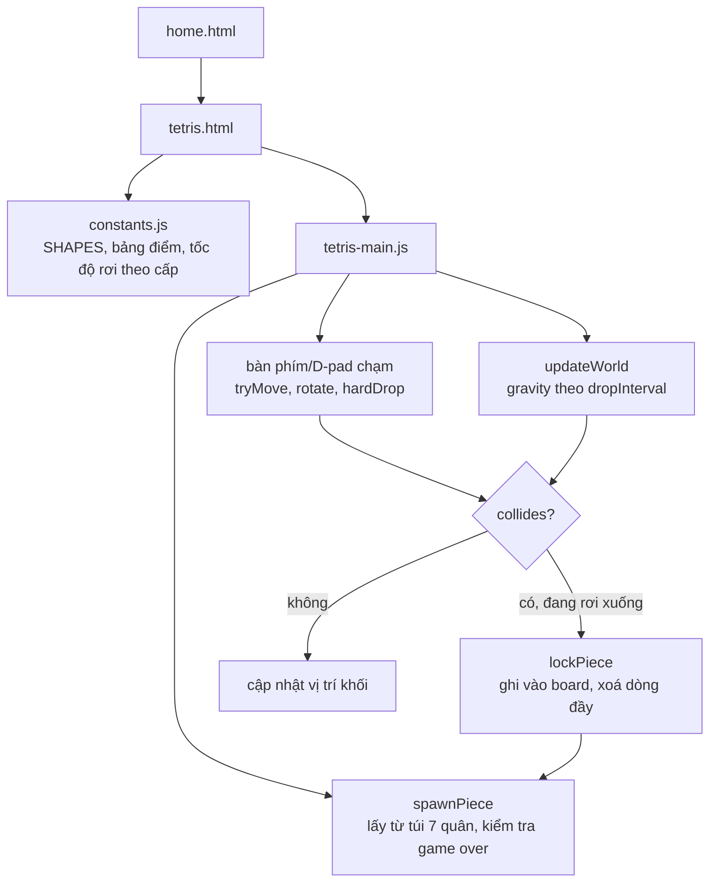

# Tetris tự viết: bảy quân trong một túi, và một nhánh phòng thủ chưa từng được kích hoạt

## 1. Mở đầu

Sau khi hỏi người dùng muốn máy Brick Game cầm tay cũ có những trò gì, câu trả lời rõ ràng nhất chỉ có một cái tên đứng đầu danh sách: Tetris. Không có game nào khác trong thể loại "9999999 in 1" đó thực sự nổi tiếng hơn — phần lớn số game còn lại trên các máy đó chỉ là biến thể của chính Tetris với vài kiểu khối khởi đầu khác nhau, được đếm thành từng "game" riêng để thổi phồng con số quảng cáo. Viết một bản Tetris tự tay, không dùng thư viện, hoá ra là bài tập thú vị hơn tưởng tượng — không phải vì logic xoay khối khó (nó không khó), mà vì có bao nhiêu chi tiết nhỏ của Tetris "chuẩn" (túi 7 quân, hệ thống điểm, ma trận xoay) đã trở thành quy ước ngầm định mà một bản tự viết cần quyết định có tuân theo hay không.

## 2. Bối cảnh

Tetris là game đầu tiên trong đợt "làm theo danh sách Brick Game" — sau khi liệt kê các game điển hình có trên dòng máy cầm tay đó (Tetris, Đập Gạch, Bóng Rổ, Đá Bóng, Bóng Bàn), với yêu cầu thêm lần lượt theo đúng thứ tự. Về mặt kỹ thuật, đây cũng là game đầu tiên trong repo dùng lưới ô vuông rời rạc (grid-based) làm trung tâm logic, khác hẳn mọi game trước đó vốn dùng toạ độ liên tục (pixel thực). Bàn cờ 10×20 ô, mỗi ô 26px, không có gì "trôi" tự do — mọi va chạm chỉ là so sánh chỉ số hàng/cột nguyên, đơn giản hơn nhiều so với AABB hay va chạm tròn của các game trước.

## 3. Mục tiêu sản phẩm

**Sẽ làm:**
- Bàn cờ chuẩn 10 cột × 20 hàng, 7 loại khối chuẩn (I/O/T/S/Z/J/L), mỗi khối một màu riêng.
- Túi ngẫu nhiên 7 quân (7-bag randomizer) — xáo trộn 7 loại rồi phát lần lượt, đảm bảo không bao giờ phải chờ quá 12 khối mới thấy lại một loại cụ thể, công bằng hơn random thuần.
- Xoay khối kiểu ma trận 4×4, có "wall kick" đơn giản (thử dịch ngang vài ô nếu xoay tại chỗ bị chặn).
- Rơi mềm (giữ phím Xuống), rơi cứng (Space, rơi thẳng xuống đáy ngay lập tức), có bóng mờ (ghost piece) báo trước vị trí sẽ rơi tới.
- Tính điểm theo số dòng phá cùng lúc (1/2/3/4 dòng cho điểm khác nhau, nhân theo cấp độ), cấp độ tăng theo tổng số dòng đã phá, tốc độ rơi tăng theo cấp độ.
- Xem trước khối tiếp theo ở góc bàn cờ.

**Sẽ KHÔNG làm:**
- Không có hệ thống xoay chuẩn SRS (Super Rotation System) đầy đủ với bảng kick riêng cho từng khối/từng hướng xoay — chỉ có một bộ offset ngang dùng chung cho mọi tình huống.
- Không có "hold piece" (giữ một khối lại để dùng sau).
- Không có T-spin hay các kỹ thuật ghi điểm nâng cao khác của Tetris hiện đại.
- Không có chế độ nhiều người chơi hay gửi hàng rác (garbage lines) như Tetris đối kháng.

MVP: khối rơi, xoay/di chuyển/rơi nhanh, phá dòng đầy để ghi điểm, tốc độ tăng theo cấp độ, thua khi khối mới sinh ra đã chồng lấn khối cũ.

## 4. Thiết kế hệ thống



Phần lõi của toàn bộ game nằm trong một hàm duy nhất: `collides(matrix, row, col)`, được gọi lại từ mọi nơi khác (di chuyển, xoay, rơi mềm, rơi cứng, kiểm tra game over) — không có phiên bản "kiểm tra va chạm" riêng cho từng loại thao tác:

```javascript
function collides(matrix, row, col) {
    for (let r = 0; r < matrix.length; r++) {
        for (let c = 0; c < matrix[r].length; c++) {
            if (!matrix[r][c]) continue;
            const br = row + r;
            const bc = col + c;
            if (bc < 0 || bc >= COLS || br >= ROWS) return true;
            if (br >= 0 && board[br][bc]) return true;
        }
    }
    return false;
}
```

Việc quy toàn bộ "có được phép ở vị trí này không" về đúng một hàm nghĩa là mọi thao tác trong game — xoay, dịch trái/phải, rơi — đều chỉ là "thử một vị trí/hình dạng mới, hỏi `collides`, được thì nhận không thì bỏ". Không có logic va chạm nào bị viết lặp lại hai lần theo hai cách khác nhau.

## 5. Tech Stack

| Công nghệ | Vì sao chọn |
| --- | --- |
| **Mảng 2 chiều `board[row][col]` lưu màu hoặc `null`** | Cách biểu diễn tự nhiên nhất cho một lưới rời rạc — kiểm tra ô có bị chiếm hay không chỉ là một phép truy cập mảng, không cần cấu trúc dữ liệu phức tạp hơn. |
| **Khối biểu diễn bằng lưới 4×4 chuỗi ký tự (`"X"`/`"."`)** | Giống cách Space Impact định nghĩa sprite — dễ nhìn bằng mắt ngay trong code, dễ chỉnh hình dạng mà không cần công cụ vẽ riêng. |
| **Xoay bằng phép chuyển vị ma trận (transpose + đảo cột)** | `rotateMatrix` xoay bất kỳ lưới vuông N×N nào 90° mà không cần định nghĩa sẵn 4 trạng thái xoay cho từng khối (cách làm của SRS chuẩn) — đổi lại độ chính xác hình học "chuẩn thi đấu", nhưng code ngắn hơn nhiều và dễ hiểu ngay từ lần đọc đầu. |
| **Túi 7 quân (Fisher-Yates shuffle + `pop()`)** | Random thuần (`Math.random()` chọn 1 trong 7 mỗi lần) có thể cho ra chuỗi tệ (ví dụ đợi rất lâu mới thấy khối I) — túi 7 quân là giải pháp chuẩn ngành để đảm bảo phân phối công bằng mà không làm mất đi yếu tố bất ngờ. |
| **Bảng điểm 100/300/500/800 nhân theo cấp, rơi mềm 1 điểm/ô, rơi cứng 2 điểm/ô** | Đây không phải số tự nghĩ ra — nó khớp với bảng điểm của Tetris Guideline hiện đại (chuẩn do The Tetris Company đặt ra, nhiều game Tetris chính thức tuân theo). Dùng lại bộ số quen thuộc này giúp cảm giác điểm số "đúng vị" với người từng chơi Tetris thật, dù phần còn lại của game (xoay, kick) đã được đơn giản hoá. |

## 6. Quá trình phát triển

### Giai đoạn 1 — Bàn cờ trống, một khối rơi thẳng

Khởi tạo `board` bằng mảng 20 hàng × 10 cột toàn `null`, một khối `O` (hình vuông, đơn giản nhất vì không cần lo xoay) rơi thẳng xuống bằng `dropTimer` đếm ngược. Đây là bước xác nhận vòng lặp gravity hoạt động đúng trước khi thêm bất kỳ độ phức tạp nào khác.

### Giai đoạn 2 — Bảy loại khối, xoay bằng ma trận

Thêm đủ 7 `SHAPES`, viết `rotateMatrix` và `matrixFromShape` (chuyển chuỗi `"X"/"."` thành mảng boolean 2 chiều). Thử nghiệm ngay thấy vấn đề kinh điển của Tetris tự viết: xoay tại chỗ gần tường sẽ luôn bị chặn dù không gian bên cạnh còn trống — dẫn tới Giai đoạn 3.

### Giai đoạn 3 — Wall kick đơn giản

```javascript
const WALL_KICK_OFFSETS = [0, -1, 1, -2, 2];

function rotate() {
    const rotated = rotateMatrix(current.matrix);
    for (const offset of WALL_KICK_OFFSETS) {
        if (!collides(rotated, current.row, current.col + offset)) {
            current.matrix = rotated;
            current.col += offset;
            return;
        }
    }
}
```

Thay vì bảng kick chuẩn SRS (khác nhau cho từng cặp trạng thái xoay, từng loại khối), chỉ cần thử dịch ngang lần lượt 0, -1, +1, -2, +2 ô — thử offset gần nhất trước, xa dần nếu vẫn bị chặn. Không "chuẩn thi đấu" nhưng đủ để xoay khối sát tường không bị kẹt vô lý, giải quyết đúng vấn đề thực tế gặp phải mà không cần implement toàn bộ đặc tả SRS.

### Giai đoạn 4 — Bóng mờ và ô xem trước

`computeGhostRow` mô phỏng rơi từ vị trí hiện tại (gọi lại chính `collides` cho tới khi chạm) mà không thay đổi khối thật — chỉ để vẽ viền mờ báo trước điểm rơi. Ô xem trước khối tiếp theo vẽ ngay trong canvas chính (một hộp bán trong suốt góc trên phải), lấy dữ liệu từ `nextKey` — quân đã được rút sẵn từ túi nhưng chưa "vào cuộc".

### Giai đoạn 5 — Phá dòng và tính điểm

```javascript
const remaining = board.filter((row) => !row.every(Boolean));
const clearedCount = ROWS - remaining.length;
const newRows = [];
for (let i = 0; i < clearedCount; i++) newRows.push(new Array(COLS).fill(null));
board = newRows.concat(remaining);
```

Thay vì tự viết vòng lặp `splice`/dịch từng hàng xuống một (cách làm phổ biến nhưng dễ sai chỉ số khi nhiều dòng bị xoá cùng lúc), lọc ra các hàng *chưa* đầy, rồi ghép thêm đúng số hàng trống ở đầu mảng bằng với số hàng đã xoá — không quan trọng những dòng nào bị xoá hay chúng nằm rải rác ra sao, kết quả luôn đúng vì các hàng còn lại tự nhiên giữ nguyên thứ tự tương đối.

## 7. Những bug đáng nhớ

### Không phải bug — một nhánh phòng thủ chưa từng được kích hoạt

**Phát hiện khi đọc lại `collides` để viết bài này:** Điều kiện `if (br >= 0 && board[br][bc]) return true;` ngầm cho phép `br < 0` (khối có phần nằm phía trên bàn cờ) trôi qua mà không bị coi là va chạm — một hành vi hợp lý về nguyên tắc (nhiều bản Tetris cho khối sinh ra một phần còn ở phía trên vùng nhìn thấy). Nhưng truy theo toàn bộ nơi `row` của khối hiện tại có thể thay đổi: `spawnPiece` luôn đặt `row: 0`; di chuyển ngang (`tryMove(0, ±1)`) không đổi `row`; rơi mềm/cứng chỉ tăng `row`; xoay không đổi `row` cơ sở, chỉ đổi hình dạng ma trận tại đúng `row`/`col` hiện tại. Nói cách khác, **`row` không bao giờ giảm xuống dưới 0 trong toàn bộ vòng đời của một khối** — nhánh cho phép `br < 0` trong `collides` được viết ra với đúng ý định phòng thủ, nhưng theo cách bàn cờ được thiết kế (spawn luôn ở `row = 0`), nó chưa từng có cơ hội được kích hoạt.

**Vì sao không sửa:** Đây không phải lỗi — game hoạt động đúng, và nhánh đó vô hại (không gây kết quả sai ở bất kỳ đường đi thực thi nào). Giữ nguyên là lựa chọn hợp lý: nó vẫn đóng vai trò lưới an toàn nếu sau này `spawnPiece` được đổi để sinh khối ở `row < 0` (cách làm phổ biến hơn trong nhiều bản Tetris khác, để I-piece nằm ngang không bị "cắt cụt" lúc vừa xuất hiện).

**Điều rút ra:** Không phải mọi đoạn code "chưa từng chạy tới" đều là dấu hiệu của lỗi hay code thừa cần xoá — đôi khi nó là phòng thủ hợp lý cho một điều kiện *hiện tại* không xảy ra nhưng *có thể* xảy ra nếu một quyết định thiết kế khác (ở đây là vị trí spawn) thay đổi trong tương lai. Phân biệt được "code chết vì thừa" và "code chưa kích hoạt vì phòng thủ đúng chỗ" là một kỹ năng đọc code quan trọng không kém viết code.

## 8. Những quyết định sai

**Không có bảng wall-kick riêng cho từng cặp trạng thái xoay** — bộ offset `[0, -1, 1, -2, 2]` dùng chung cho mọi khối, mọi hướng xoay. Với hầu hết tình huống chơi thường, điều này không thấy rõ; nhưng người từng chơi Tetris hiện đại (quen với hành vi kick chính xác từng khối, đặc biệt là T-spin) sẽ nhận ra ngay bản này "xoay không giống hệt" bản gốc trong các tình huống sát tường phức tạp.

**`SHAPES` định nghĩa dạng chuỗi cố định 4×4, không kiểm tra độ dài dòng đồng nhất** — cùng một dạng rủi ro đã ghi nhận ở Space Impact cho sprite pixel: nếu ai đó sửa một dòng trong `grid` mà quên giữ đúng 4 ký tự, `matrixFromShape` sẽ tạo ra một hàng ngắn/dài hơn các hàng khác trong mảng kết quả, và `collides` (vốn duyệt `matrix[r].length` theo từng hàng riêng) sẽ âm thầm bỏ sót hoặc tính dư một vài ô mà không có gì báo lỗi.

## 9. Những điều học được

- **Quy toàn bộ logic "được phép hay không" của một game grid-based về đúng một hàm duy nhất (`collides`) giúp mọi thao tác — dù khác nhau về ý nghĩa gameplay — đều nhất quán về mặt đúng/sai**, tránh được tình trạng viết hai đường kiểm tra va chạm khác nhau cho hai thao tác tưởng như độc lập (ví dụ: xoay và rơi) rồi một trong hai bị lệch logic.
- **Không phải mọi khác biệt so với "chuẩn ngành" đều là lỗi** — chọn wall-kick đơn giản thay vì SRS đầy đủ là một đánh đổi có ý thức giữa độ chính xác và độ phức tạp code, không phải sai sót.
- **Đọc lại code với câu hỏi "nhánh này có bao giờ thực sự chạy tới không" là một cách tìm ra cả bug tiềm ẩn lẫn code phòng thủ hợp lý** — nhưng phải phân biệt rõ hai kết quả đó trước khi quyết định sửa hay giữ nguyên.
- **Tái sử dụng đúng những con số "chuẩn" của một thể loại quen thuộc (bảng điểm Tetris Guideline) mang lại cảm giác "đúng vị" rẻ hơn nhiều so với mô phỏng lại toàn bộ đặc tả chính thức của thể loại đó.**

## 10. Kết quả

| Hạng mục | Con số |
| --- | --- |
| Tổng số dòng code (JS + CSS + HTML) | 851 dòng |
| `js/tetris-main.js` | 375 dòng |
| `css/tetris.css` | 232 dòng |
| `css/home.css` | 125 dòng |
| `js/constants.js` | 31 dòng |
| Kích thước bàn cờ | 10 × 20 ô, mỗi ô 26px |
| Số loại khối | 7 (I/O/T/S/Z/J/L) |
| Test tự động | 0 |
| CI/CD | Không có |

## 11. Nếu làm lại từ đầu

- **Thêm bảng wall-kick riêng cho từng khối/từng cặp trạng thái xoay** nếu muốn độ chính xác gần với chuẩn thi đấu hơn — đặc biệt quan trọng nếu sau này muốn hỗ trợ T-spin.
- **Thêm kiểm tra độ dài dòng khi định nghĩa `SHAPES`** (hoặc validate một lần khi load game) để bắt lỗi sai lệch cấu trúc ngay lập tức thay vì âm thầm vẽ/va chạm sai.
- **Cân nhắc cho khối sinh ra một phần phía trên bàn cờ nhìn thấy** (`row < 0` ban đầu) cho các khối cao như I, để đúng cảm giác "khối vừa xuất hiện đã hiện diện đầy đủ ngay" như nhiều bản Tetris quen thuộc — lúc đó nhánh phòng thủ `br < 0` trong `collides` mới thực sự được kích hoạt.
- **Thêm "hold piece"** — tính năng phổ biến trong Tetris hiện đại, không khó implement (chỉ cần một biến giữ khối + hoán đổi khi nhấn phím) nhưng bị bỏ qua để ưu tiên hoàn thành 5 game Brick Game còn lại trong cùng danh sách.

## 12. Kết

Viết một bản Tetris tự tay không khó ở phần "làm cho nó chạy" — khó ở việc quyết định, với mỗi chi tiết nhỏ đã trở thành quy ước ngầm của thể loại (túi 7 quân, bảng điểm, hệ thống kick), nên tuân theo nguyên bản tới đâu và đơn giản hoá tới đâu. Bản này chọn giữ đúng những gì người chơi *cảm nhận được rõ nhất* (điểm số quen thuộc, độ công bằng của túi 7 quân) và đơn giản hoá những gì chỉ người chơi kỳ cựu mới để ý (độ chính xác tuyệt đối của wall-kick) — một đánh đổi hợp lý cho một bản clone viết trong một buổi, không phải một triển khai thi đấu chuẩn giải.
