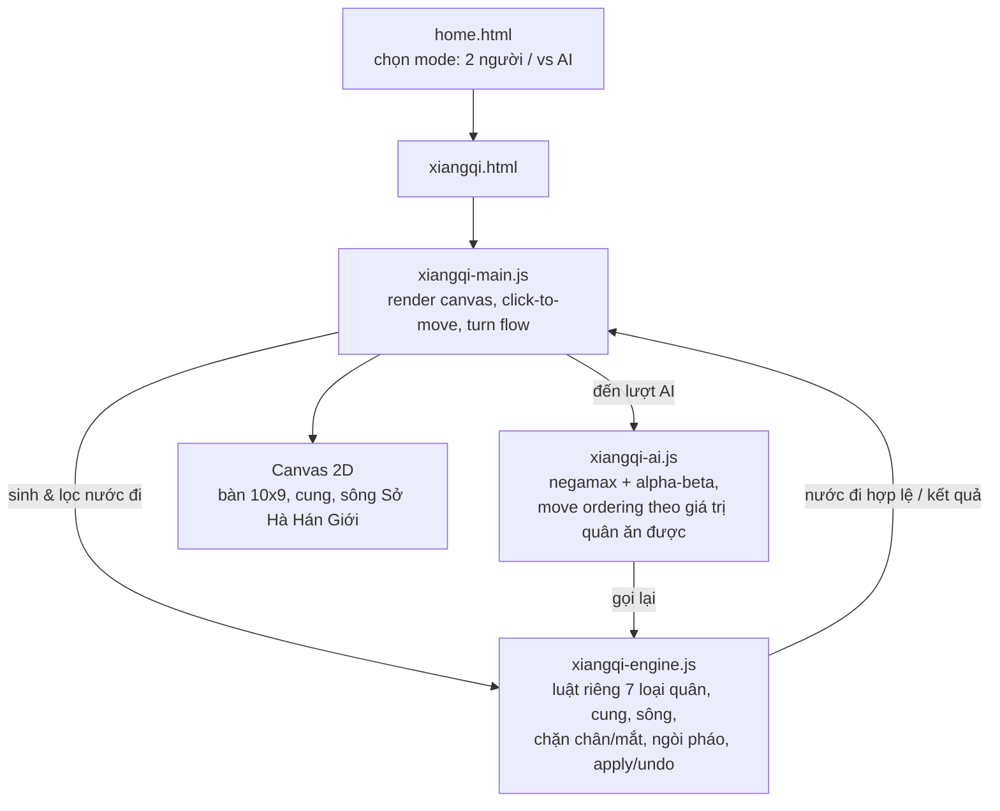
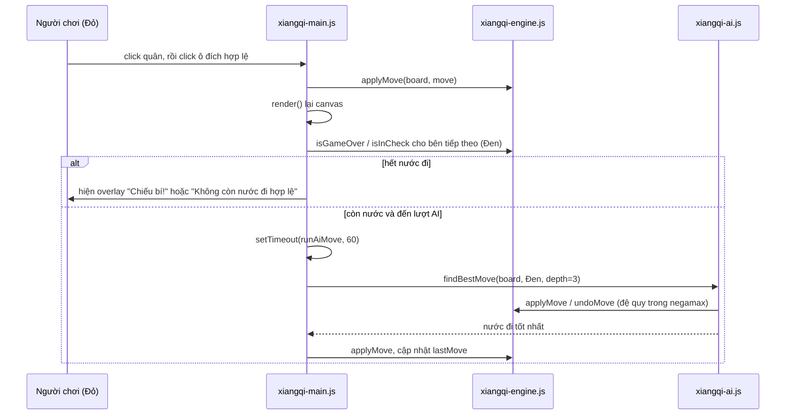

# Tưởng tái dùng được engine Cờ Vua cho Cờ Tướng — hoá ra viết lại gần hết

## 1. Mở đầu

Sau khi engine Cờ Vua chạy ổn (đủ đúng luật, AI đủ để không nhường quân miễn phí), mình bắt tay vào Cờ Tướng với một tâm thế khá tự tin: "cùng là bàn cờ ô vuông, cùng khái niệm nước đi, cùng chiếu tướng — chắc chỉ cần đổi luật di chuyển từng quân là xong, kiến trúc engine/AI/UI giữ nguyên." Ngồi gõ được vài chục dòng đầu thì nhận ra: cái duy nhất tái dùng được thật sự là *cách tổ chức file* (engine tách khỏi AI tách khỏi UI), còn luật chơi thì gần như phải viết lại từ số 0.

Nhưng cú sốc lớn hơn đến muộn hơn, ở một ván đấu người-với-người bình thường: sau khoảng 15 nước, hai tướng (một đỏ một đen) tình cờ đứng thẳng hàng trên cùng một cột dọc, không có quân nào ở giữa chắn đường. Trong luật Cờ Tướng thật, đây là một thế cờ **bất hợp lệ tuyệt đối** — quy tắc "tướng đối mặt" (hay "lộ mặt tướng") cấm hai tướng nhìn thấy nhau trực diện, vì về lý thuyết một tướng có thể "bay" thẳng qua cột trống để ăn tướng kia. Game của mình không báo lỗi gì cả. Ván đấu cứ tiếp tục như chưa có chuyện gì xảy ra.

Bài này là câu chuyện viết một bàn Cờ Tướng đầy đủ luật (trừ đúng một luật, mình sẽ thú nhận ngay ở phần sau) bằng JavaScript thuần, cộng một AI negamax + alpha-beta — và những chỗ mà kinh nghiệm từ Cờ Vua hoá ra không giúp được gì, thậm chí còn khiến mình chủ quan.

## 2. Bối cảnh

Trong bộ sưu tập game của repo `game-development`, Cờ Vua là game đầu tiên có AI "biết suy nghĩ" thật sự (duyệt cây nước đi, đánh giá thế cờ) thay vì random hay heuristic một tầng. Sau khi hoàn thành nó, câu hỏi tự nhiên là: có thể tái dùng gì cho một trò chơi tương tự không? Cờ Tướng là ứng viên rõ ràng nhất — cùng là board game hai người chơi, cùng cơ chế "chiếu tướng", cùng nhu cầu một AI đối kháng được.

Trước khi viết dòng code đầu tiên, mình từng nghiêm túc cân nhắc việc gộp chung một "board game engine" tổng quát dùng được cho cả hai. Ý tưởng sụp đổ rất nhanh khi liệt kê luật riêng của Cờ Tướng: tướng và sĩ bị giới hạn trong cung (palace) 3×3, tượng không bao giờ được qua sông (không giống bishop cờ vua đi xuyên suốt bàn cờ), pháo phải nhảy qua đúng một quân làm "ngòi" mới ăn được quân phía sau nó, mã và tượng có luật chặn chân/chặn mắt (horse leg / elephant eye) hoàn toàn khác cách bishop/knight cờ vua di chuyển. Ép những luật này vào một abstraction dùng chung cho cả hai loại cờ sẽ chỉ tạo ra một đống `if (gameType === "xiangqi")` rải khắp nơi. Mình bỏ ý định đó ngay từ đầu, viết engine Cờ Tướng hoàn toàn độc lập — chỉ giữ lại đúng *tư duy tách lớp* (engine sinh nước đi / AI đánh giá & tìm kiếm / UI vẽ và xử lý input), không giữ lại một dòng code logic nào của Cờ Vua.

## 3. Mục tiêu sản phẩm

**Sẽ làm:**
- Sinh nước đi hợp lệ đầy đủ cho cả 7 loại quân: tướng, sĩ, tượng, mã, xe (chariot), pháo, tốt.
- Giới hạn cung cho tướng/sĩ, luật qua sông cho tượng và tốt, luật chặn chân cho mã, chặn mắt cho tượng, luật "ngòi" cho pháo.
- Lọc nước đi khiến tướng mình bị chiếu (tương tự cách làm ở Cờ Vua: simulate rồi undo).
- Phát hiện chiếu bí / hết nước đi hợp lệ, cả hai đều xử lý như một bên thua.
- Một AI chơi được — negamax + alpha-beta, độ sâu cố định, không cần đạt trình độ chuyên nghiệp.
- Giao diện canvas, click-to-move, hai chế độ (2 người, hoặc người vs AI với người luôn cầm quân Đỏ).

**Sẽ KHÔNG làm** (và đây là danh sách mình cố tình giữ ngắn để không lặp lại việc ôm đồm quá tay như ở Cờ Vua):
- Không có luật "cấm lặp lại nước đi vô hạn" (perpetual check/chase rule) — một luật khá tinh vi của Cờ Tướng chuyên nghiệp mà mình biết mình đang bỏ qua.
- Không có nhiều mức độ khó, không đổi được độ sâu tìm kiếm từ giao diện.
- Không lưu lịch sử ván đấu, không undo, không lưu điểm hay bất kỳ thứ gì vào `localStorage`.
- Không opening book, không endgame knowledge riêng.

MVP: hai người chơi trên cùng một máy, hoặc một người chơi với máy, cả hai đúng luật di chuyển từng quân và đúng luật chiếu/hết cờ — chấp nhận thiếu đúng một luật hiếm khi xảy ra trên thực tế (sẽ nói ở phần bug), thay vì trì hoãn ngày "chơi được" chỉ vì một trường hợp biên.

## 4. Thiết kế hệ thống

Kiến trúc giữ nguyên tinh thần 3 lớp đã dùng ở Cờ Vua, nhưng nội dung từng lớp viết lại hoàn toàn:



Khác biệt lớn nhất so với sơ đồ tương tự ở Cờ Vua không nằm ở luồng dữ liệu (giống hệt), mà ở kích thước bàn cờ: Cờ Tướng chơi trên lưới giao điểm 10×9 (10 hàng ngang, 9 cột dọc — 90 giao điểm), trong khi Cờ Vua là bàn 8×8 (64 ô). Quân cờ Cờ Tướng đứng *trên giao điểm của các đường kẻ*, không nằm giữa các ô vuông như Cờ Vua — điều này buộc `xiangqi-main.js` phải đổi hẳn cách quy đổi toạ độ pixel sang toạ độ bàn cờ: thay vì chia lấy phần nguyên để biết "đang ở ô nào" (kiểu Cờ Vua), phải làm tròn (`Math.round`) để tìm "giao điểm gần nhất":

```javascript
function toPixel(r, c) {
    return { x: MARGIN + c * CELL, y: MARGIN + r * CELL };
}

function toBoardCoord(px, py) {
    const c = Math.round((px - MARGIN) / CELL);
    const r = Math.round((py - MARGIN) / CELL);
    return { r, c };
}
```

Một chi tiết nhỏ nhưng dễ bị bỏ qua nếu chỉ copy nguyên xi cách làm từ Cờ Vua: nếu lỡ dùng `Math.floor` thay vì `Math.round` ở đây (thói quen từ việc chia ô lưới kiểu Cờ Vua), người chơi sẽ phải click hơi lệch về góc trên-trái của mỗi giao điểm mới trúng quân, thay vì click ngay giữa — một bug UX âm thầm, không crash, chỉ khiến game "cảm giác rời tay" mà không rõ lý do.

Về flow một lượt đi có AI, cấu trúc gần như song song với Cờ Vua (điều duy nhất thật sự tái dùng được là *nhịp điệu* điều phối turn, không phải logic):



## 5. Tech Stack

| Công nghệ | Vì sao chọn |
| --- | --- |
| **JavaScript thuần + Canvas 2D** | Giống hệt lý do ở Cờ Vua: 90 giao điểm cộng các lớp highlight (nước đi hợp lệ, nước vừa đi, quân được chọn) quản lý qua DOM sẽ phải toggle class cho hàng chục phần tử liên tục; canvas cho một vòng `render()` vẽ lại toàn bộ mỗi lần, đơn giản hơn để suy luận. |
| **Chữ Hán làm nhãn quân cờ, không dùng sprite ảnh** | Cờ Tướng truyền thống ghi tên quân bằng chữ Hán ngay trên quân cờ (帥/仕/相/馬/俥/炮/兵 cho Đỏ, 將/士/象/馬/車/砲/卒 cho Đen — hai bên dùng chữ khác nhau dù cùng loại quân, đúng quy ước truyền thống). `ctx.fillText` với font Poppins hỗ trợ Unicode CJK là đủ, không cần tải thêm bộ sprite ảnh nào — nhẹ hơn và sắc nét ở mọi độ phân giải màn hình. |
| **Negamax + alpha-beta, tái dùng ý tưởng nhưng viết lại code** | Vẫn là lựa chọn thuật toán như Cờ Vua (gọn hơn minimax cổ điển, một hàm dùng chung cho cả hai bên nhờ đảo dấu điểm số khi đệ quy), nhưng hàm đánh giá thế cờ (`evaluateBoard`) viết lại hoàn toàn theo giá trị quân và đặc điểm riêng của Cờ Tướng (xem Giai đoạn phát triển). |
| **Không có localStorage** | Khác với Cờ Vua (Cờ Vua cũng không lưu điểm, chỉ có state ván hiện tại), Cờ Tướng ở đây cũng hoàn toàn không đọc/ghi `localStorage` — không best score, không lưu ván dở, mọi thứ về lại thế cờ ban đầu khi tải lại trang. Quyết định giữ tối giản này nhất quán với MVP đã chốt: một ván chơi cho vui, không cần theo dõi tiến trình dài hạn. |
| **GitHub Pages** | Cùng hạ tầng deploy tĩnh với toàn bộ repo — không có gì đặc thù cho riêng game này. |

## 6. Quá trình phát triển

### Giai đoạn 1 — Bàn cờ 10×9 và hệ toạ độ giao điểm

Việc đầu tiên không phải luật chơi, mà là vẽ đúng hình dạng bàn cờ Cờ Tướng: 10 đường ngang, 9 đường dọc, hai cung 3×3 có đường chéo chữ X, và dòng chữ "楚河 / 漢界" (Sở Hà / Hán Giới — "dòng sông" ngăn cách hai bên) nằm đúng giữa hàng 4 và hàng 5. Khác với Cờ Vua (bàn cờ là các *ô vuông tô màu xen kẽ*), bàn Cờ Tướng chỉ là các *đường kẻ giao nhau*, quân cờ đứng ngay trên giao điểm — một khác biệt hình học buộc phải vẽ lại hoàn toàn phần render, không tái dùng được gì từ `chess-main.js`.

### Giai đoạn 2 — Bảy loại quân, bảy bộ luật di chuyển riêng

Đây là phần tốn thời gian nhất, và cũng là phần chứng minh rõ nhất rằng "cùng là cờ" không có nghĩa là "cùng luật". Từng loại quân một:

- **Tướng & Sĩ** — chỉ được đi trong cung 3×3, tướng đi ngang/dọc 1 bước, sĩ đi chéo 1 bước. Hàm `inPalace` kiểm tra cột 3-5 và hàng 0-2 (Đen) hoặc 7-9 (Đỏ) — một điều kiện đơn giản nhưng phải đúng ngay từ đầu vì mọi nước đi của hai quân này đều phải lọc qua nó.
- **Tượng** — đi chéo đúng 2 ô, không bao giờ được qua sông, và bị chặn nếu "mắt tượng" (ô giữa đường chéo) có quân:

```javascript
} else if (type === "elephant") {
    [[2, 2], [2, -2], [-2, 2], [-2, -2]].forEach(([dr, dc]) => {
        const nr = r + dr;
        const nc = c + dc;
        const midR = r + dr / 2;
        const midC = c + dc / 2;
        if (!inBounds(nr, nc)) return;
        if (board[midR][midC]) return;
        if (color === BLACK && nr > 4) return;
        if (color === RED && nr < 5) return;
        tryAdd(nr, nc);
    });
}
```

  Ba điều kiện chặn liên tiếp (ra khỏi bàn cờ, mắt tượng bị chặn, cố qua sông) phải đúng thứ tự và đủ cả ba — thiếu một trong ba là tượng lập tức "học được" một khả năng nó không nên có trong luật thật.

- **Mã** — đi hình chữ L, bị chặn nếu "chân mã" (ô liền kề theo hướng bước dài của chữ L) có quân. Khác bishop/knight cờ vua (không bao giờ bị chặn bởi quân đứng giữa đường), đây là luật hoàn toàn không có tương đương trong Cờ Vua, phải tính đúng ô chân dựa vào việc delta hàng hay delta cột là ±2:

```javascript
const legR = Math.abs(dr) === 2 ? r + dr / 2 : r;
const legC = Math.abs(dc) === 2 ? c + dc / 2 : c;
if (board[legR][legC]) return;
```

- **Xe** — trượt thẳng theo 4 hướng cho tới khi gặp vật cản, ăn được quân địch ngay tại đó — logic giống hệt rook cờ vua, tái dùng được nguyên vòng lặp `while (inBounds(...))`.
- **Pháo** — quân phức tạp nhất về logic: di chuyển như xe khi *không* ăn quân (trượt tới ô trống), nhưng để *ăn* một quân địch, phải có đúng một quân bất kỳ (của bên nào cũng được) nằm giữa làm "ngòi" (screen), rồi mới ăn được quân tiếp theo sau ngòi đó:

```javascript
} else if (type === "cannon") {
    [[1, 0], [-1, 0], [0, 1], [0, -1]].forEach(([dr, dc]) => {
        let nr = r + dr;
        let nc = c + dc;
        let screenFound = false;
        while (inBounds(nr, nc)) {
            const target = board[nr][nc];
            if (!screenFound) {
                if (!target) {
                    moves.push({ fromR: r, fromC: c, toR: nr, toC: nc });
                } else {
                    screenFound = true;
                }
            } else if (target) {
                if (target.color !== color) moves.push({ fromR: r, fromC: c, toR: nr, toC: nc });
                break;
            }
            nr += dr;
            nc += dc;
        }
    });
}
```

  Đây là quân duy nhất trong toàn bộ Cờ Tướng lẫn Cờ Vua có hai "chế độ di chuyển" khác nhau tuỳ vào việc có ăn quân hay không — không có quân nào trong Cờ Vua hành xử tương tự, nên đây là đoạn code 100% viết mới, không có gì để "mượn ý tưởng" từ engine cũ.

- **Tốt** — chỉ tiến thẳng trước khi qua sông; sau khi qua sông thì được thêm quyền đi ngang, nhưng không bao giờ được lùi (giống tốt cờ vua ở điểm không lùi, nhưng khác ở chỗ được đi ngang sau khi qua sông — cờ vua không có khái niệm này).

### Giai đoạn 3 — Lọc nước đi hợp lệ: tái dùng được đúng một ý tưởng

Phần lọc nước đi khiến tướng mình bị chiếu dùng lại đúng chiến lược simulate/undo đã chứng minh đơn giản-mà-đúng ở Cờ Vua:

```javascript
function getLegalMoves(board, color) {
    const pseudo = allPseudoMoves(board, color);
    const legal = [];
    pseudo.forEach((move) => {
        const captured = applyMove(board, move);
        if (!isInCheck(board, color)) legal.push(move);
        undoMove(board, move, captured);
    });
    return legal;
}
```

Đây là điểm mình cố tình *không* đổi cách tiếp cận dù biết nó có chi phí (quét lại toàn bộ 90 ô cho `isSquareAttacked` ở mỗi nước đi giả định) — bài học "đừng tối ưu cái chưa đo được là chậm" từ Cờ Vua vẫn áp dụng nguyên vẹn ở đây. Nhưng lần này, cái giá của việc không tối ưu hoá ra đắt hơn mình tưởng — sẽ kể ở phần bug.

### Giai đoạn 4 — AI: đánh giá thế cờ riêng cho Cờ Tướng

Cấu trúc negamax + alpha-beta + move ordering theo giá trị quân ăn được gần như sao chép nguyên khung từ Cờ Vua (đây là phần thật sự tái dùng được, vì bản chất thuật toán tìm kiếm minimax không phụ thuộc luật chơi cụ thể). Nhưng hàm đánh giá (`evaluateBoard`) phải viết lại theo đặc điểm riêng của Cờ Tướng:

```javascript
function evaluateBoard(board) {
    let score = 0;
    for (let r = 0; r < ROWS; r++) {
        for (let c = 0; c < COLS; c++) {
            const piece = board[r][c];
            if (!piece) continue;
            let value = PIECE_VALUES[piece.type];
            if (piece.type === "soldier" && hasCrossedRiver(r, piece.color)) value += 20;
            if (piece.type === "cannon" || piece.type === "horse") {
                const centerDist = Math.abs(c - 4);
                value += (4 - centerDist) * 3;
            }
            score += piece.color === RED ? value : -value;
        }
    }
    return score;
}
```

Hai điểm khác biệt so với đánh giá của Cờ Vua: (1) tốt được cộng điểm thưởng sau khi qua sông — hợp lý vì tốt qua sông có thêm quyền đi ngang, mạnh hơn hẳn tốt còn kẹt ở nhà; (2) pháo và mã được thưởng điểm theo khoảng cách tới cột trung tâm thay vì một bảng bonus trung tâm 2 chiều như quân cờ vua — vì pháo/mã càng gần cột giữa càng khống chế được nhiều đường ngang lẫn dọc trên một bàn cờ *rộng hơn cao* (9 cột, 10 hàng), khác hẳn tư duy "kiểm soát trung tâm hình vuông" của Cờ Vua.

Một điểm suýt trở thành bug mà mình bắt được khi đang viết đoạn xử lý kết thúc ván trong `negamax`: ở Cờ Vua, hết nước đi hợp lệ phải phân biệt hai trường hợp — đang bị chiếu (chiếu bí, thua) hay không bị chiếu (hết cờ, hoà — stalemate). Ngồi gõ nhánh `if (legalMoves.length === 0)` theo phản xạ từ code Cờ Vua, mình suýt copy nguyên cụm `isInCheck(...) ? -100000-depth : 0` — cho tới khi dừng lại tra luật: trong Cờ Tướng, **không có khái niệm hoà do hết nước đi** — bên nào hết nước đi hợp lệ, dù có đang bị chiếu hay không, đều xử thua ngay. Bản cuối cùng gọn hơn hẳn bản Cờ Vua ở đúng điểm này:

```javascript
function negamax(board, depth, alpha, beta, color) {
    const legalMoves = getLegalMoves(board, color);
    if (legalMoves.length === 0) {
        return -100000 - depth;
    }
    // ...
}
```

Không có nhánh rẽ theo `isInCheck` nào ở đây cả — và đúng ra là không nên có. Đây là một trong số ít lần "bê nguyên" code cũ suýt gây hại thay vì có ích: bản năng tái dùng mạnh đến mức khiến mình gần như chép một nhánh logic đúng-cho-Cờ-Vua nhưng sai-cho-Cờ-Tướng, chỉ vì hai trò chơi trông giống nhau bề ngoài.

## 7. Những bug đáng nhớ

### Bug #1: Thiếu hẳn luật "tướng đối mặt" — bug mở, chưa sửa

**Hiện tượng:** như kể ở phần mở đầu — di chuyển quân sao cho hai tướng đứng thẳng cột với nhau, không quân nào chắn ở giữa, là một thế cờ hoàn toàn hợp lệ theo góc nhìn của engine, dù luật Cờ Tướng thật cấm tuyệt đối điều này.

**Quá trình debug:** Grep toàn bộ `js/` tìm các từ khoá liên quan (`face`, `flying`, tổ hợp "general...general") — không có kết quả nào ngoài hai dòng gọi `findGeneral`/`isInCheck` thông thường. Đối chiếu với `pseudoMovesForPiece` cho loại `"general"`: chỉ sinh 4 nước đi 1-bước trong cung, không có bất kỳ nước đi "bay" dọc cột nào được mô hình hoá. Điều đó có nghĩa `isSquareAttacked` — vốn chỉ kiểm tra bằng cách duyệt *pseudo-move thật* của từng quân — không bao giờ có thể phát hiện "tướng đang bị tướng kia đe doạ", vì bản thân tướng không có nước đi giả lập nào đại diện cho khả năng "bay" đó.

**Nguyên nhân:** Luật "tướng đối mặt" trong Cờ Tướng không phải một *nước đi* quân tướng có thể thực hiện trong ván đấu thực tế — nó là một *ràng buộc bổ sung* lên các nước đi của những quân *khác*, được kiểm tra tách biệt: sau mỗi nước đi giả định, ngoài việc kiểm tra "tướng mình có bị quân thường nào chiếu không", còn cần kiểm tra thêm "hai tướng có nhìn thấy nhau trên cùng một cột, không có quân chắn ở giữa hay không" — như một điều kiện chiếu đặc biệt, độc lập với cơ chế sinh pseudo-move thông thường. Cơ chế lọc nước đi hiện tại (`getLegalMoves` chỉ gọi `isInCheck`, và `isInCheck` chỉ dựa vào `isSquareAttacked` quét pseudo-move của quân địch) không có chỗ nào gọi thêm kiểm tra này.

**Cách sửa (đề xuất, chưa áp dụng):** Thêm một hàm `generalsFacing(board)` quét từ vị trí tướng Đỏ theo cột lên trên tới vị trí tướng Đen, nếu không gặp quân cản nào ở giữa thì trả về `true`; gọi hàm này thêm vào điều kiện trong `isInCheck` (hoặc một hàm `isPositionLegal` bao trùm cả hai kiểm tra) trước khi coi một nước đi là hợp lệ.

**Điều rút ra:** Có những luật trong một trò chơi không biểu diễn được dưới dạng "quân X có thể đi tới ô Y" — chúng là ràng buộc toàn cục lên *trạng thái bàn cờ*, không phải lên *hành vi của một quân cụ thể*. Nếu kiến trúc "kiểm tra hợp lệ" của bạn được xây dựng hoàn toàn xoay quanh khái niệm nước đi từng quân (như engine này), một luật thuộc dạng khác sẽ không có "chỗ cắm" tự nhiên nào để gắn vào — nó dễ bị quên không phải vì khó, mà vì nó không nằm trong danh sách "7 loại quân, 7 bộ luật" mà mình đã liệt kê ngay từ đầu ở Giai đoạn 2.

### Bug #2: Bấm "Chơi lại" đúng lúc AI vừa được lên lịch đi — một nước đi ma xuất hiện

**Hiện tượng:** Trong một lần mash phím thử game (bấm Chơi lại liên tục để test nhanh nhiều ván), có một lần bấm "Chơi lại" ngay sau khi vừa đi một nước (đúng lúc chip "AI đang suy nghĩ" vừa xuất hiện) — bàn cờ về lại vị trí ban đầu như mong đợi, nhưng chưa đầy một giây sau, một quân Đỏ (quân của chính người chơi) tự động di chuyển mà không ai bấm gì cả.

**Quá trình debug:** Đọc lại `afterMove()` và `runAiMove()`:

```javascript
function afterMove() {
    turn = opponent(turn);
    // ...
    if (mode === "ai" && turn !== humanColor) {
        aiThinking = true;
        thinkingChip.hidden = false;
        setTimeout(runAiMove, 60);
    }
}

function runAiMove() {
    const move = findBestMove(board, turn, AI_DEPTH);
    // ...
    applyMove(board, move);
    lastMove = move;
    afterMove();
}
```

Và `restart()`:

```javascript
function restart() {
    board = createInitialBoard();
    turn = RED;
    // ...
    aiThinking = false;
    thinkingChip.hidden = true;
    overlay.hidden = true;
    updateHud();
    render();
}
```

Không có bất kỳ nơi nào trong `restart()` huỷ bỏ `setTimeout(runAiMove, 60)` đã được lên lịch trước đó. Cũng không có bất kỳ kiểm tra "relevance" nào trong `runAiMove` — nó cứ đọc biến `board` và `turn` ở đúng thời điểm nó *thực thi*, không phải thời điểm nó được *lên lịch*.

**Nguyên nhân:** Nếu người chơi bấm "Chơi lại" (nút này không hề bị khoá bởi `aiThinking`, khác với việc click quân cờ trên canvas vốn có guard `if (!gameActive || aiThinking) return;`) trong đúng khung 60ms giữa lúc `setTimeout(runAiMove, 60)` được đặt lịch và lúc nó thật sự chạy, `restart()` sẽ reset `board` về thế cờ ban đầu và `turn` về `RED` (màu của người chơi) — nhưng timeout cũ vẫn tồn tại độc lập, và khi nó fire, `runAiMove` gọi `findBestMove(board, turn, AI_DEPTH)` với `board` và `turn` *đã bị reset*, tức là tính nước đi tốt nhất **cho quân Đỏ** (quân người chơi) rồi tự động thực hiện nó — một "nước đi ma" mà người chơi không hề yêu cầu, xảy ra ngay khi họ vừa mới bắt đầu lại ván mới.

**Cách sửa (đề xuất, chưa áp dụng):** Thêm một bộ đếm thế hệ (generation counter), tăng lên mỗi lần `restart()` được gọi, chụp lại giá trị đó tại thời điểm `setTimeout` được đặt, và kiểm tra lại giá trị đó có còn khớp không ngay đầu `runAiMove` trước khi làm bất cứ điều gì — cùng một mẫu hình mình từng dùng để giải quyết đúng loại vấn đề này ở màn hình tìm kiếm nhạc của game Audition (`songSearchRequestId`), chỉ là áp dụng cho một ngữ cảnh khác.

**Điều rút ra:** `setTimeout` đã lên lịch không tự động biết rằng thế giới đã thay đổi kể từ lúc nó được đặt hẹn. Bất kỳ hành động nào có thể "làm mới lại trạng thái" (restart, chuyển màn hình, đổi chế độ chơi) trong khi có một tác vụ bất đồng bộ đang chờ tới lượt chạy, đều cần một cách để tác vụ đó tự nhận ra "tôi đã lỗi thời" trước khi thực thi — nếu không, nó cứ hồn nhiên chạy trên một thế giới đã khác.

### Bug #3: AI "nặng tay" hơn hẳn Cờ Vua dù cùng độ sâu tìm kiếm

**Hiện tượng:** Cùng để `AI_DEPTH = 3`, cùng cấu trúc negamax + alpha-beta + move ordering, nhưng AI của Cờ Tướng có cảm giác khựng lâu hơn rõ rệt so với AI Cờ Vua ở những thế cờ nhiều quân (đầu và giữa ván), dù cả hai đều dùng đúng một mẫu `setTimeout(runAiMove, 60)` để nhường một nhịp cho UI trước khi bắt đầu tính.

**Nguyên nhân:** Hai yếu tố cộng dồn. Thứ nhất, bàn Cờ Tướng có 90 giao điểm so với 64 ô của Cờ Vua — mọi lệnh gọi `isSquareAttacked` (chạy bên trong `isInCheck`, bên trong `getLegalMoves`, được gọi lặp lại ở mọi nút của cây tìm kiếm negamax) đều phải quét nhiều hơn khoảng 40% số ô. Thứ hai, quân pháo có tập nước đi giả định (pseudo-move) nhiều và tốn công tính hơn xe hay hậu cờ vua ở cùng vị trí — nó phải quét dọc theo cả đường đi lẫn đường ăn quân qua ngòi, nghĩa là vòng lặp bên trong `pseudoMovesForPiece` cho loại `"cannon"` chạy dài hơn (không dừng lại ngay khi gặp quân cản như xe, mà tiếp tục quét thêm sau ngòi). Cộng dồn qua hàng chục nghìn lệnh gọi trong một cây tìm kiếm độ sâu 3, chênh lệch nhỏ ở mỗi lệnh gọi nhân lên thành khác biệt cảm nhận được rõ ràng.

**Cách xử lý:** Mình không tối ưu hoá gì thêm ở đây — chấp nhận đánh đổi này với đúng một dòng lý do: độ sâu 3 vẫn hoàn thành trong một khoảng thời gian người chơi thông cảm được (dưới một giây ở hầu hết thế cờ, có thể tới một hai giây ở thế cờ nhiều lựa chọn), và mẫu `setTimeout(60ms)` trước khi tính đã đủ để chip "AI đang suy nghĩ" kịp hiện ra trước khi main thread bị chiếm dụng — đúng bài học đã rút ra từ Cờ Vua, chỉ là áp dụng cho một bài toán có chi phí nền tảng cao hơn.

**Điều rút ra:** Một kiến trúc "đủ nhanh" ở bài toán A không tự động "đủ nhanh" ở bài toán B chỉ vì cùng thuật toán — kích thước không gian trạng thái (ở đây là kích thước bàn cờ và độ phức tạp trung bình của một nước đi) là một biến độc lập, và việc tái dùng nguyên xi một con số cấu hình (độ sâu tìm kiếm) từ dự án trước mà không đo lại là một giả định đáng ngờ, dù trong trường hợp này may mắn vẫn nằm trong ngưỡng chấp nhận được.

## 8. Những quyết định sai

**Định gộp chung engine Cờ Vua và Cờ Tướng thành một "board game engine" tổng quát.** Đã kể ở phần Bối cảnh — ý tưởng này chết ngay khi liệt kê luật riêng của từng loại quân Cờ Tướng. Bài học không mới (đã từng mắc kiểu lỗi tương tự trước đây với những abstraction ra đời quá sớm), nhưng đáng nhắc lại vì lần này cám dỗ tái dùng mạnh hơn hẳn — hai trò chơi *trông* giống nhau tới mức việc không gộp chung cảm giác như đang bỏ lỡ một cơ hội tối ưu hoá code rõ ràng. Cảm giác đó sai: giống nhau ở bề mặt (bàn cờ ô vuông, hai người chơi, khái niệm chiếu tướng) không đảm bảo giống nhau ở luật, và ép hai bộ luật khác nhau vào một khuôn dùng chung luôn tốn công sửa `if/else` nhiều hơn công viết hai bản riêng biệt ngay từ đầu.

**Copy gần nguyên khung negamax từ Cờ Vua mà không soát lại từng nhánh logic.** Suýt mắc bug ở đoạn xử lý "hết nước đi hợp lệ" (kể ở Giai đoạn 4) chỉ vì bản năng tái dùng thắng thế trước khi kịp tra luật. Đây không hẳn là một quyết định "sai" đã thực sự xảy ra (mình bắt được trước khi commit), nhưng đủ gần một sai lầm thật để đáng ghi lại như một lời nhắc: thuật toán tìm kiếm (negamax, alpha-beta) là phần trung lập với luật chơi và tái dùng được thật, nhưng *ngữ nghĩa của các giá trị trả về ở nút lá và nút kết thúc* luôn gắn chặt với luật cụ thể của trò chơi đó — không thể tái dùng mù quáng phần này.

**Không xử lý ngay bug "nước đi ma" khi restart, dù đã biết cách sửa.** Mình phát hiện bug #2 trong lúc mash phím test cho vui, hiểu rõ nguyên nhân và cách sửa (bộ đếm thế hệ, đã áp dụng chính xác mẫu hình này ở game Audition), nhưng chọn không vá ngay vì xác suất người chơi thật sự bấm trúng cửa sổ 60ms đó là cực thấp trong sử dụng bình thường. Đây là một đánh đổi có ý thức giữa "đúng tuyệt đối" và "đủ tốt cho MVP" — chấp nhận được, nhưng khác về bản chất với việc không biết bug tồn tại; ở đây mình biết, và chọn ghi nợ kỹ thuật một cách công khai thay vì lờ đi.

## 9. Những điều học được

- **"Trông giống nhau" là cái bẫy tinh vi nhất khi tái dùng code giữa hai bài toán liền kề nhau về mặt thời gian.** Vừa viết xong Cờ Vua, não vẫn còn "nóng" với các pattern vừa dùng, nên xu hướng áp dụng lại chúng cho Cờ Tướng mạnh hơn hẳn bình thường — kể cả khi lẽ ra cần dừng lại tra luật trước.
- **Không phải mọi luật chơi đều biểu diễn được dưới dạng "nước đi của một quân".** Luật tướng đối mặt là một ràng buộc toàn cục lên trạng thái bàn cờ, không gắn được vào bất kỳ quân cụ thể nào — và một kiến trúc được thiết kế hoàn toàn xoay quanh "nước đi từng quân" sẽ có một điểm mù tự nhiên với loại luật này, trừ khi chủ động thiết kế thêm một lớp kiểm tra riêng cho nó.
- **Thuật toán tìm kiếm tái dùng được; ngữ nghĩa kết thúc ván thì không.** Negamax + alpha-beta là công cụ trung lập với luật chơi. Nhưng "thế nào là thua, thế nào là hoà" là câu hỏi luật lệ, phải tra lại cho từng trò chơi cụ thể — Cờ Tướng không có khái niệm hoà do hết nước đi, Cờ Vua thì có, và nhầm lẫn giữa hai điều này sẽ cho ra một AI đánh giá sai lệch những thế cờ then chốt nhất (thế cờ tàn cuộc, khi số nước đi khả dĩ ít lại).
- **Một bug được ghi nhận công khai (biết, hiểu nguyên nhân, chọn tạm không sửa) khác hẳn một bug bị bỏ sót.** Cả hai đều để lại một lỗ hổng trong sản phẩm, nhưng chỉ cái đầu tiên là một quyết định kỹ thuật có chủ đích, có thể giải thích được khi cần.

## 10. Kết quả

Không có test tự động, không CI/CD, không Docker — vẫn là một trang tĩnh deploy lên GitHub Pages, không khác gì phần còn lại của repo.

| Hạng mục | Con số |
| --- | --- |
| Tổng số dòng code (JS + CSS + HTML) | 1.034 dòng |
| `js/xiangqi-engine.js` (luật 7 loại quân, cung, sông, chặn chân/mắt, ngòi pháo) | 225 dòng |
| `js/xiangqi-ai.js` (đánh giá thế cờ, negamax + alpha-beta) | 75 dòng |
| `js/xiangqi-main.js` (canvas, click-to-move, turn flow, AI trigger) | 298 dòng |
| `js/xiangqi-home.js` (chọn mode) | 17 dòng |
| Kích thước bàn cờ | 10×9 = 90 giao điểm (so với 64 ô của Cờ Vua) |
| Độ sâu tìm kiếm AI | 3 ply cố định, không đổi được từ giao diện |
| Luật đã cài đặt | 6/7 loại quân đúng đầy đủ; thiếu đúng 1 luật toàn cục (tướng đối mặt) |
| Test tự động | 0 — test bằng tự chơi, kể cả vài ván cố tình mash phím Chơi lại để soi race condition |
| CI/CD | Không có |

Con số đáng chú ý nhất ở đây không phải tổng dòng code (ít hơn hẳn Cờ Vua, dù luật phức tạp không kém — phần lớn nhờ việc không phải xử lý nhập thành, bắt tốt qua đường, hay phong cấp, những luật "có thời hạn" đặc thù của Cờ Vua không tồn tại trong Cờ Tướng), mà là dòng "6/7 loại quân đúng đầy đủ": đây là một con số trung thực hơn "engine đã hoàn thiện", và mình nghĩ đáng giữ nguyên trong bài này thay vì làm tròn thành "hoàn chỉnh" cho đẹp.

## 11. Nếu làm lại từ đầu

- **Thêm kiểm tra "tướng đối mặt" ngay từ Giai đoạn 3**, khi đang viết `getLegalMoves` — không phải như một tính năng bổ sung sau này, mà như một phần bắt buộc của định nghĩa "nước đi hợp lệ" ngay từ đầu, đúng vị trí về mặt khái niệm của nó.
- **Thêm bộ đếm thế hệ (generation counter) cho mọi cặp `setTimeout` + hành động có thể reset trạng thái**, áp dụng ngay từ đầu thay vì để đến khi mash phím test mới phát hiện ra — nhất là khi mình đã có sẵn đúng mẫu hình này từ dự án Audition trước đó, lẽ ra nên thành một thói quen mặc định chứ không phải một bản vá được cân nhắc rồi bỏ qua.
- **Viết một danh sách "luật thuộc dạng ràng buộc toàn cục" riêng biệt với danh sách "luật thuộc dạng nước đi từng quân" ngay từ khi lên kế hoạch** — nếu làm vậy từ Giai đoạn 1, luật tướng đối mặt hẳn đã nằm trong đúng danh mục của nó thay vì rơi vào khoảng trống giữa hai cách nghĩ.
- **Đo thời gian tìm kiếm thực tế của AI trước khi copy nguyên giá trị `AI_DEPTH = 3` từ Cờ Vua**, thay vì tin rằng "cùng độ sâu thì cùng tốc độ" — dù may mắn lần này con số đó vẫn nằm trong ngưỡng chấp nhận được.

## 12. Kết

Bài học lớn nhất sau dự án này không phải về Cờ Tướng hay Cờ Vua cụ thể, mà về chính cảm giác tự tin sau khi vừa hoàn thành một việc tương tự. Cái giá rẻ nhất của việc "đã làm cái này một lần rồi" là nó khiến người ta bỏ qua bước dừng lại hỏi "luật ở đây có thật sự giống không, hay chỉ trông giống thôi?" — và câu hỏi đó, với hai trò chơi tưởng chừng là anh em ruột như Cờ Vua và Cờ Tướng, hoá ra luôn cần được hỏi lại từ đầu, không có ngoại lệ.

Con tướng vẫn đứng thẳng hàng với tướng địch trên bàn cờ của mình lúc này, không ai buồn cấm cản. Có lẽ để một bug như vậy tồn tại công khai, được ghi lại rõ ràng thay vì giấu đi, cũng là một cách trung thực để nhắc bản thân: sản phẩm nào cũng có phần chưa xong, và biết rõ phần nào còn thiếu quan trọng không kém gì phần đã làm đúng.
